# 核心概念

MoAI-ADK 基于五个核心概念构建，这些概念相互配合，创建了一个完整的 AI 驱动开发生态系统。

---

## 1. SPEC-First（规格说明优先）

### 什么是 SPEC-First？

SPEC-First 是一种开发方法论，强调**在编写任何代码之前，必须先明确要构建什么**。这不仅是一个文档，而是一个可执行的、可测试的规格说明。

### 为什么重要？

**传统开发的问题**：
- 需求模糊导致实现偏差
- 缺乏明确的验收标准
- 团队成员理解不一致
- 变更时影响评估困难

**SPEC-First 的解决方案**：
- 明确的需求定义
- 可测试的验收标准
- 统一的理解基础
- 可追踪的变更影响

### EARS 语法

MoAI-ADK 使用 EARS（Easy Approach to Requirements Syntax）语法编写 SPEC，它提供了 5 种清晰的模式：

#### 1. Ubiquitous Requirements（普遍需求）
描述系统必须具备的基本功能。

**语法**：`系统必须 [动词] [对象]`

**示例**：
```yaml
- 系统必须提供用户认证功能
- 系统必须支持多语言界面
- 系统必须记录所有操作日志
```

#### 2. Event-driven Requirements（事件驱动需求）
描述当特定事件发生时系统应该如何响应。

**语法**：`当 [条件] 时，系统必须 [动作]`

**示例**：
```yaml
- 当用户提供有效凭证时，系统必须发放 JWT 令牌
- 当检测到异常访问时，系统必须发送安全警报
- 当系统负载超过阈值时，系统必须自动扩容
```

#### 3. State-driven Requirements（状态驱动需求）
描述系统在特定状态下应该保持的行为。

**语法**：`当系统处于 [状态] 时，系统必须 [行为]`

**示例**：
```yaml
- 当用户处于登录状态时，系统必须允许访问受保护资源
- 当系统处于维护模式时，系统必须拒绝所有写操作
- 当订单处于待支付状态时，系统必须定期发送提醒
```

#### 4. Optional Requirements（可选需求）
描述在特定条件下可选执行的功能。

**语法**：`如果 [条件]，系统可以 [可选动作]`

**示例**：
```yaml
- 如果用户有头像文件，系统可以显示用户头像
- 如果支持缓存，系统可以使用 Redis 缓存会话
- 如果配置了邮件服务，系统可以发送通知邮件
```

#### 5. Constraints（约束）
描述系统必须遵守的限制条件。

**语法**：`[约束对象] 必须/不应该 [约束条件]`

**示例**：
```yaml
- 用户密码长度必须在 8-128 字符之间
- API 响应时间不应该超过 2 秒
- 数据库连接池大小不应该超过 100
```

### SPEC 文件结构

每个 SPEC 文件都遵循统一的结构：

```yaml
---
id: SPEC-ID          # 唯一标识符
version: 0.1.0       # 语义版本
status: draft        # 状态：draft/in-review/in-progress/completed/deprecated
priority: high       # 优先级：critical/high/medium/low
created: 2025-01-01  # 创建日期
updated: 2025-01-01  # 更新日期
author: @username    # 作者
reviewer: @reviewer  # 审查者
tags: [tag1, tag2]   # 标签
---

# `@SPEC:DOMAIN-ID: SPEC 标题

## 概述
简要描述功能的背景和目标。

## Ubiquitous Requirements
- 系统必须 [基本功能]

## Event-driven Requirements
- 当 [触发条件] 时，系统必须 [响应动作]

## State-driven Requirements
- 当 [状态条件] 时，系统必须 [持续行为]

## Optional Requirements
- 如果 [可选条件]，系统可以 [可选功能]

## Constraints
- [约束对象] 必须 [约束条件]

## 验收标准
### 功能验收
- [ ] 功能需求 1 通过测试
- [ ] 功能需求 2 通过测试

### 非功能验收
- [ ] 性能要求达标
- [ ] 安全要求达标

## 依赖关系
- 前置条件：[其他 SPEC 或系统]
- 后置影响：[影响的组件或 SPEC]

## 风险评估
- 技术风险：[描述]
- 业务风险：[描述]
- 缓解措施：[描述]
```

### SPEC 生命周期

```mermaid
%%{init: {'theme':'neutral'}}%%
stateDiagram-v2
    [*] --> planning: /alfred:1-plan
    planning --> draft: SPEC 编写完成
    draft --> in_review: 提交审查
    in_review --> approved: 审查通过
    in_review --> draft: 需要修改
    approved --> in_progress: /alfred:2-run
    in_progress --> testing: 实现完成
    testing --> completed: /alfred:3-sync
    completed --> deprecated: 功能废弃
    deprecated --> [*]: 完全移除

    note right of planning
        📋 规划阶段
        - 需求收集
        - 技术评估
        - 资源分配
    end note

    note right of draft
        📝 起草阶段
        - EARS 格式编写
        - 验收标准定义
        - 风险评估
    end note

    note right of in_progress
        🚀 开发阶段
        - TDD 实现
        - 代码审查
        - 单元测试
    end note

    note right of completed
        ✅ 完成阶段
        - 文档同步
        - 集成测试
        - 部署就绪
    end note
```



---

## 2. TDD（测试驱动开发）

### 什么是 TDD？

TDD（Test-Driven Development）是一种开发方法，要求**在编写功能代码之前先编写测试**。它遵循红-绿-重构（Red-Green-Refactor）的循环模式。

### TDD 的三个阶段

#### 🔴 RED 阶段：编写失败的测试

**目标**：编写一个描述预期行为的测试，但这个测试会失败（因为功能还未实现）。

**原则**：
- 只编写足够失败的代码
- 测试应该明确表达需求
- 失败的原因是功能不存在，而不是语法错误

**示例**：
```python
# `@TEST:EX-AUTH-001 | SPEC: SPEC-AUTH-001.md

def test_user_login_with_valid_credentials_should_return_token():
    """当提供有效凭证时，系统必须返回 JWT 令牌"""
    # Arrange
    login_data = {"email": "user@example.com", "password": "valid_password"}

    # Act
    response = client.post("/auth/login", json=login_data)

    # Assert
    assert response.status_code == 200
    assert "access_token" in response.json()
    assert response.json()["token_type"] == "bearer"
```

#### 🟢 GREEN 阶段：最小实现

**目标**：编写最简单的代码让测试通过。

**原则**：
- 只编写足够通过的代码
- 不要追求完美，先让测试通过
- 可以使用硬编码、临时解决方案

**示例**：
```python
# `@CODE:EX-AUTH-001:API | SPEC: SPEC-AUTH-001.md | TEST: tests/test_auth.py

from fastapi import FastAPI

app = FastAPI()

@app.post("/auth/login")
def login(credentials: dict):
    """@CODE:EX-AUTH-001:API - 登录端点（最小实现）"""
    # 硬编码实现，仅用于通过测试
    if credentials.get("email") == "user@example.com":
        return {
            "access_token": "fake_token_for_testing",
            "token_type": "bearer"
        }
    return {"error": "Invalid credentials"}
```

#### ♻️ REFACTOR 阶段：重构改进

**目标**：改进代码质量，同时保持测试通过。

**原则**：
- 测试必须继续通过
- 消除代码重复
- 提高可读性和可维护性
- 应用设计模式

**示例**：
```python
# `@CODE:EX-AUTH-001:API | SPEC: SPEC-AUTH-001.md | TEST: tests/test_auth.py

from fastapi import FastAPI, HTTPException, Depends
from fastapi.security import HTTPBearer
from jose import JWTError, jwt
from datetime import datetime, timedelta

app = FastAPI()
security = HTTPBearer()

SECRET_KEY = "your-secret-key"
ALGORITHM = "HS256"
ACCESS_TOKEN_EXPIRE_MINUTES = 30

class AuthService:
    """@CODE:EX-AUTH-001:SERVICE - 认证服务"""

    def authenticate_user(self, email: str, password: str) -> bool:
        """验证用户凭证"""
        # 实际项目中这里会查询数据库
        return email == "user@example.com" and password == "valid_password"

    def create_access_token(self, data: dict) -> str:
        """创建 JWT 令牌"""
        to_encode = data.copy()
        expire = datetime.utcnow() + timedelta(minutes=ACCESS_TOKEN_EXPIRE_MINUTES)
        to_encode.update({"exp": expire})
        return jwt.encode(to_encode, SECRET_KEY, algorithm=ALGORITHM)

@app.post("/auth/login")
def login(credentials: dict):
    """@CODE:EX-AUTH-001:API - 完整的登录实现"""
    auth_service = AuthService()

    if not auth_service.authenticate_user(credentials["email"], credentials["password"]):
        raise HTTPException(status_code=401, detail="Invalid credentials")

    access_token = auth_service.create_access_token({"sub": credentials["email"]})
    return {"access_token": access_token, "token_type": "bearer"}
```

### TDD 的优势

#### 1. 设计驱动
- 迫使思考接口和使用方式
- 产生更简洁、更专注的 API
- 自然形成模块化设计

#### 2. 质量保证
- 100% 测试覆盖率
- 回归测试保护
- 代码质量持续改进

#### 3. 开发效率
- 快速反馈循环
- 减少调试时间
- 明确的完成标准

#### 4. 文档价值
- 测试即文档
- 使用示例清晰
- API 行为明确

### MoAI-ADK 中的 TDD

在 MoAI-ADK 中，TDD 由 Alfred 的 `tdd-implementer` 子代理自动化执行：

```bash
# 启动 TDD 流程
/alfred:2-run SPEC-ID
```

Alfred 会：
1. **分析 SPEC**：提取验收标准
2. **设计测试**：创建测试用例
3. **执行 RED**：编写失败测试
4. **实现 GREEN**：最小实现
5. **执行 REFACTOR**：代码改进
6. **质量验证**：TRUST 5 原则检查

---

## 3. @TAG 系统

### 什么是 @TAG 系统？

@TAG 系统是一种**代码追踪机制**，通过在所有开发产物（SPEC、测试、代码、文档）中添加统一标识符，建立完整的可追溯链。

### TAG 格式规范

#### 基本格式
```
@TYPE:DOMAIN-ID[:SUBTYPE]
```

#### 组件说明
- **TYPE**：产物类型
  - `@SPEC`：规格说明
  - `@TEST`：测试用例
  - `@CODE`：代码实现
  - `@DOC`：文档
- **DOMAIN**：业务领域
  - `AUTH`：认证授权
  - `USER`：用户管理
  - `ORDER`：订单处理
  - `PAYMENT`：支付系统
- **ID**：3位数字序号（001-999）
- **SUBTYPE**：可选子类型
  - `API`：API 端点
  - `MODEL`：数据模型
  - `SERVICE`：业务服务
  - `REPO`：数据仓库

### TAG 链示例

```
@SPEC:AUTH-001                    # 用户认证需求
    ↓
@TEST:AUTH-001                   # 认证测试
    ↓
@CODE:AUTH-001:API               # 认证 API 实现
@CODE:AUTH-001:MODEL             # 用户模型
@CODE:AUTH-001:SERVICE           # 认证服务
    ↓
@DOC:AUTH-001                    # API 文档
```

### TAG 使用规范

#### 1. 分配原则
- **一次分配，永不更改**：TAG ID 一旦分配，不能更改
- **按领域分组**：同一业务领域的功能使用相同的 DOMAIN
- **顺序递增**：ID 按创建顺序递增（001, 002, 003...）

#### 2. 放置位置
- **文件头部**：在文件的第一行注释中
- **函数/类注释**：在重要函数或类的文档字符串中
- **提交信息**：在 Git 提交信息中引用相关 TAG

#### 3. 引用格式
```python
# `@CODE:AUTH-001:API | SPEC: SPEC-AUTH-001.md | TEST: tests/test_auth.py

def login_user(credentials: LoginRequest):
    """用户登录接口

    实现 @SPEC:AUTH-001 中定义的认证功能
    测试覆盖 @TEST:AUTH-001
    """
    pass
```

### TAG 追踪能力

#### 查找相关代码
```bash
# 查找 AUTH-001 相关的所有内容
rg '@(SPEC|TEST|CODE|DOC):AUTH-001' -n

# 查找特定类型
rg '@CODE:AUTH-001' -n
rg '@TEST:AUTH-001' -n
```

#### 影响分析
当需求变更时：
```bash
# 1. 找到相关 SPEC
rg '@SPEC:AUTH-001' .moai/specs/

# 2. 找到影响测试
rg '@TEST:AUTH-001' tests/

# 3. 找到需要修改的代码
rg '@CODE:AUTH-001' src/

# 4. 找到需要更新的文档
rg '@DOC:AUTH-001' docs/
```

#### 统计和报告
```bash
# 统计 TAG 分布
rg '@(SPEC|TEST|CODE|DOC):' -n | cut -d: -f1 | sort | uniq -c

# 检查孤立 TAG（无对应关系的 TAG）
./scripts/check-orphan-tags.py
```

### TAG Guard 机制

MoAI-ADK 包含自动的 TAG Guard 系统，在 PreToolUse Hook 中运行：

#### 检测规则
1. **新增文件必须有 TAG**：创建的新文件必须包含适当的 @TAG
2. **TAG 必须成对出现**：@CODE 必须有对应的 @TEST
3. **TAG 格式必须正确**：遵循 @TYPE:DOMAIN-ID 格式
4. **TAG 不能重复**：相同 ID 不能用于不同功能

#### 警告示例
```
⚠️ TAG 检测警告：
发现以下文件缺少 @TAG：
 - src/user/service.py → 期望标签：@CODE:
 - tests/test_user.py → 期望标签：@TEST:

建议操作：
 1. 为文件添加适当的 @TAG
 2. 运行 /alfred:3-sync 验证 TAG 链
```

---

## 4. TRUST 5 原则

### 什么是 TRUST 5 原则？

TRUST 5 原则是 MoAI-ADK 的代码质量标准，确保所有代码都达到生产级别的要求。每个字母代表一个质量维度：

- **T**est First（测试优先）
- **R**eadable（可读性）
- **U**nified（一致性）
- **S**ecured（安全性）
- **T**rackable（可追踪性）

### 1️⃣ Test First（测试优先）

#### 要求
- **测试覆盖率 ≥ 85%**：所有代码必须有对应的测试
- **先写测试**：遵循 TDD 红绿重构循环
- **测试分层**：单元测试、集成测试、端到端测试

#### 验证标准
```bash
# 检查测试覆盖率
pytest --cov=src --cov-report=term-missing

# 目标：85% 以上
# 输出示例：
# TOTAL                                            100     93      87%
```

#### 实践指导
```python
# ✅ 好的实践：每个功能都有测试
def calculate_discount(price: float, customer_level: str) -> float:
    """计算客户折扣"""
    # 测试会覆盖这个逻辑
    pass

# ❌ 避免：无测试的复杂逻辑
def complex_calculation(params: dict) -> float:
    """复杂的业务逻辑，但没有测试"""
    # 这会在 TRUST 验证中失败
    pass
```

### 2️⃣ Readable（可读性）

#### 要求
- **函数长度 ≤ 50 行**：单个函数不超过 50 行
- **文件长度 ≤ 300 行**：单个文件不超过 300 行
- **命名清晰**：变量、函数、类名要体现意图
- **注释充分**：复杂逻辑要有清晰注释

#### 验证标准
```python
# ✅ 好的实践：清晰命名和适当长度
def calculate_user_age(birth_date: datetime) -> int:
    """根据出生日期计算用户年龄

    Args:
        birth_date: 用户出生日期

    Returns:
        用户年龄（岁）
    """
    today = datetime.now()
    age = today.year - birth_date.year
    if today.month < birth_date.month:
        age -= 1
    return age

# ❌ 避免：过长函数和模糊命名
def process(data):
    """处理数据（函数过长，命名不清晰）"""
    # 超过 50 行的复杂逻辑
    pass
```

#### 工具支持
```bash
# Python 代码风格检查
ruff check src/
mypy src/

# JavaScript/TypeScript
eslint src/
prettier --check src/
```

### 3️⃣ Unified（一致性）

#### 要求
- **架构一致**：遵循 SPEC 定义的架构
- **模式统一**：相同功能使用相同实现模式
- **风格统一**：代码风格保持一致
- **接口统一**：API 设计遵循统一规范

#### 验证标准
```python
# ✅ 好的实践：统一的 API 模式
class UserService:
    """用户服务 - 统一的 CRUD 模式"""

    def create(self, user_data: dict) -> User:
        """创建用户"""
        pass

    def get_by_id(self, user_id: int) -> User:
        """根据 ID 获取用户"""
        pass

    def update(self, user_id: int, user_data: dict) -> User:
        """更新用户"""
        pass

    def delete(self, user_id: int) -> bool:
        """删除用户"""
        pass

# 其他服务也应该遵循相同的 CRUD 模式
class ProductService:
    """产品服务 - 遵循相同模式"""
    # 相同的方法签名和实现模式
    pass
```

### 4️⃣ Secured（安全性）

#### 要求
- **输入验证**：所有用户输入必须验证
- **权限控制**：实现适当的访问控制
- **数据保护**：敏感数据加密存储
- **错误处理**：不暴露系统内部信息

#### 验证标准
```python
# ✅ 好的实践：安全输入验证
from pydantic import BaseModel, validator
import bcrypt

class UserCreateRequest(BaseModel):
    """用户创建请求"""
    email: str
    password: str

    @validator('email')
    def validate_email(cls, v):
        """验证邮箱格式"""
        if '@' not in v:
            raise ValueError('Invalid email format')
        return v.lower()

    @validator('password')
    def validate_password(cls, v):
        """验证密码强度"""
        if len(v) < 8:
            raise ValueError('Password must be at least 8 characters')
        return v

def hash_password(password: str) -> str:
    """安全密码哈希"""
    salt = bcrypt.gensalt()
    return bcrypt.hashpw(password.encode('utf-8'), salt).decode('utf-8')

# ❌ 避免：不安全的直接处理
def insecure_login(email: str, password: str):
    """不安全的登录实现"""
    # 直接查询数据库，没有输入验证
    # 密码明文比较
    pass
```

### 5️⃣ Trackable（可追踪性）

#### 要求
- **@TAG 标记**：所有代码必须有 @TAG
- **提交信息**：Git 提交包含相关 TAG
- **文档更新**：代码变更同步更新文档
- **决策记录**：重要设计决策要有记录

#### 验证标准
```python
# `@CODE:USER-001:SERVICE | SPEC: SPEC-USER-001.md | TEST: tests/test_user.py

class UserService:
    """@CODE:USER-001:SERVICE - 用户管理服务

    实现 @SPEC:USER-001 中定义的用户管理功能
    测试覆盖：@TEST:USER-001

    设计决策：
    - 使用 Repository 模式隔离数据访问
    - 采用领域驱动设计原则
    - 实现缓存策略提升性能
    """

    def __init__(self, user_repo: UserRepository):
        self.user_repo = user_repo

    def create_user(self, user_data: dict) -> User:
        """创建新用户

        Args:
            user_data: 用户数据字典

        Returns:
            创建的用户对象

        Raises:
            ValidationError: 当输入数据无效时
            DuplicateError: 当用户已存在时
        """
        # 实现逻辑
        pass
```

### TRUST 验证流程

MoAI-ADK 在 `/alfred:3-sync` 时自动执行 TRUST 验证：

```bash
# 手动运行 TRUST 验证
/alfred:3-sync --trust-only

# 输出示例：
🔍 TRUST 5 原则验证
✅ Test First: 测试覆盖率 87%
✅ Readable: 代码风格检查通过
✅ Unified: 架构一致性验证通过
✅ Secured: 安全检查通过
✅ Trackable: @TAG 完整性验证通过

📊 TRUST 评分: 92/100
```

---

## 5. Alfred 超级代理

### 什么是 Alfred 超级代理？

Alfred 是 MoAI-ADK 的核心 orchestrator（编排器），它不是单个 AI，而是一个由多个专业代理组成的协作系统。Alfred 负责协调整个开发流程，从需求分析到代码实现再到文档同步。

### Alfred 的架构


### 核心子代理

#### 1. project-manager（项目管理者）
**职责**：项目初始化和配置管理

```bash
# 触发命令
/alfred:0-project
```

**功能**：
- 收集项目元数据
- 配置开发环境
- 推荐技能包
- 初始化项目结构

#### 2. spec-builder（规格构建者）
**职责**：需求分析和 SPEC 编写

```bash
# 触发命令
/alfred:1-plan "功能描述"
```

**功能**：
- 分析用户需求
- 使用 EARS 语法编写 SPEC
- 设计验收标准
- 评估技术风险

#### 3. code-builder（代码构建者）
**职责**：TDD 实现和质量保证

```bash
# 触发命令
/alfred:2-run SPEC-ID
```

**功能**：
- 制定实现计划
- 执行 TDD 循环
- 应用 TRUST 原则
- 代码质量验证

#### 4. doc-syncer（文档同步者）
**职责**：文档生成和同步

```bash
# 触发命令
/alfred:3-sync
```

**功能**：
- 生成 API 文档
- 同步 README
- 更新 CHANGELOG
- 验证文档完整性

### 专家代理

专家代理在特定领域触发时自动激活：

#### backend-expert（后端专家）
**触发关键字**：`backend`, `api`, `server`, `database`, `deployment`

**专业领域**：
- API 设计和架构
- 数据库设计和优化
- 微服务架构
- 性能优化

#### frontend-expert（前端专家）
**触发关键字**：`frontend`, `ui`, `component`, `web`

**专业领域**：
- 组件设计
- 状态管理
- 性能优化
- 用户体验

#### devops-expert（运维专家）
**触发关键字**：`deployment`, `docker`, `kubernetes`, `ci/cd`

**专业领域**：
- 容器化部署
- CI/CD 流水线
- 监控和日志
- 基础设施即代码

#### ui-ux-expert（UI/UX 专家）
**触发关键字**：`design`, `ux`, `accessibility`, `figma`

**专业领域**：
- 用户界面设计
- 用户体验优化
- 可访问性设计
- 设计系统

### Claude Skills

Skills 是 Alfred 的知识库，提供特定领域的最佳实践和指导：

#### Foundation Skills（基础技能）
- `moai-foundation-trust`：TRUST 5 原则
- `moai-foundation-tags`：@TAG 系统使用
- `moai-foundation-specs`：SPEC 编写规范
- `moai-foundation-ears`：EARS 语法指南

#### Essential Skills（核心技能）
- `moai-essentials-debug`：调试技巧
- `moai-essentials-perf`：性能优化
- `moai-essentials-refactor`：重构策略
- `moai-essentials-review`：代码审查

#### Domain Skills（领域技能）
- `moai-domain-backend`：后端开发指南
- `moai-domain-frontend`：前端开发指南
- `moai-domain-security`：安全最佳实践
- `moai-domain-database`：数据库设计

#### Language Skills（语言技能）
- `moai-lang-python`：Python 开发
- `moai-lang-typescript`：TypeScript 开发
- `moai-lang-go`：Go 开发
- `moai-lang-rust`：Rust 开发

### Alfred 的工作流程

#### 1. 上下文理解
Alfred 首先理解用户的请求和项目上下文：
- 分析历史对话
- 读取项目配置
- 理解当前状态

#### 2. 任务分解
将复杂任务分解为可执行的步骤：
- 识别子任务
- 确定依赖关系
- 估算工作量

#### 3. 团队组建
根据任务需求组建合适的团队：
- 激活核心子代理
- 调用专家代理
- 加载相关 Skills

#### 4. 执行协调
协调整个执行过程：
- 分配任务给合适的代理
- 监控执行进度
- 处理异常情况

#### 5. 质量保证
确保输出质量：
- 应用 TRUST 原则
- 验证 @TAG 完整性
- 检查文档一致性

### 与 Alfred 交互的最佳实践

#### 1. 明确的指令
使用清晰的指令告诉 Alfred 您想要什么：

```bash
# ✅ 好的指令
/alfred:1-plan "创建用户认证系统，支持邮箱登录和密码重置"

# ❌ 模糊的指令
/alfred:1-plan "做一个登录功能"
```

#### 2. 适当的上下文
提供足够的上下文信息：

```bash
# ✅ 提供上下文
/alfred:2-run AUTH-001
# Alfred 会自动读取 SPEC-AUTH-001.md 了解详细需求

# ❌ 缺少上下文
/alfred:2-run
# Alfred 不知道要实现什么
```

#### 3. 渐进式开发
将大功能分解为小步骤：

```bash
# ✅ 渐进式
/alfred:1-plan "用户基础信息管理"
/alfred:2-run USER-001
/alfred:1-plan "用户权限管理"
/alfred:2-run USER-002

# ❌ 一次性太多
/alfred:1-plan "完整的用户管理系统包括权限、角色、审批流程等"
```

#### 4. 及时反馈
在执行过程中提供反馈：

```bash
# 当 Alfred 生成的代码不符合预期时
"这个 API 设计太复杂了，请简化为 RESTful 风格"
"测试覆盖率不够，请增加边界条件测试"
```

---

## 概念之间的协作

### 完整的开发流程

```mermaid
%%{init: {'theme':'neutral'}}%%
graph LR
    SPEC[SPEC-First] --> TDD[TDD]
    TDD --> TAG[@TAG 系统]
    TAG --> TRUST[TRUST 5 原则]
    TRUST --> Alfred[Alfred 超级代理]
    Alfred --> SPEC

    subgraph "Alfred 协调"
        SB[spec-builder] --> CB[code-builder]
        CB --> DS[doc-syncer]
        DS --> TA[tag-agent]
    end
```

### 实际工作示例

让我们通过一个完整的例子看这些概念如何协作：

#### 1. SPEC-First：明确需求
```yaml
# .moai/specs/SPEC-ORDER-001/spec.md
---
id: ORDER-001
version: 0.1.0
status: draft
---

# `@SPEC:ORDER-001: 订单管理系统

## Event-driven Requirements
- 当用户提交订单时，系统必须创建订单记录并返回订单号
- 当支付成功时，系统必须更新订单状态为已支付
```

#### 2. TDD：测试驱动开发
```python
# `@TEST:ORDER-001 | SPEC: SPEC-ORDER-001.md

def test_create_order_should_return_order_number():
    """当用户提交订单时，系统必须创建订单记录并返回订单号"""
    order_data = {"user_id": 1, "items": [{"product_id": 1, "quantity": 2}]}
    response = client.post("/orders", json=order_data)
    assert response.status_code == 201
    assert "order_number" in response.json()
```

#### 3. @TAG：追踪关系
```python
# `@CODE:ORDER-001:SERVICE | SPEC: SPEC-ORDER-001.md | TEST: tests/test_orders.py

class OrderService:
    """@CODE:ORDER-001:SERVICE - 订单服务

    实现 @SPEC:ORDER-001 中的订单管理功能
    测试覆盖 @TEST:ORDER-001
    """

    def create_order(self, order_data: dict) -> dict:
        """创建订单"""
        # 实现逻辑
        pass
```

#### 4. TRUST：质量保证
```python
# 代码满足 TRUST 原则：
# - Test First: 有对应测试
# - Readable: 函数清晰，命名明确
# - Unified: 遵循统一的服务模式
# - Secured: 输入验证，错误处理
# - Trackable: 包含 @TAG 标记
```

#### 5. Alfred：自动化协调
```bash
# Alfred 自动协调整个流程
/alfred:1-plan "订单管理系统"      # spec-builder 创建 SPEC
/alfred:2-run ORDER-001           # code-builder 执行 TDD
/alfred:3-sync                    # doc-syncer 同步文档
```

### 总结

这五个核心概念构成了 MoAI-ADK 的基础：

- **SPEC-First** 确保我们构建正确的东西
- **TDD** 确保我们正确地构建东西
- **@TAG 系统** 确保所有东西都可以追踪
- **TRUST 5 原则** 确保代码质量
- **Alfred 超级代理** 确保整个流程自动化

当这些概念协同工作时，创建了一个强大、可靠、可维护的 AI 驱动开发生态系统。