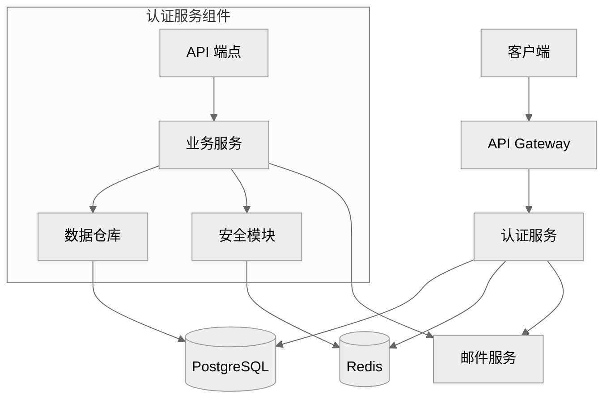
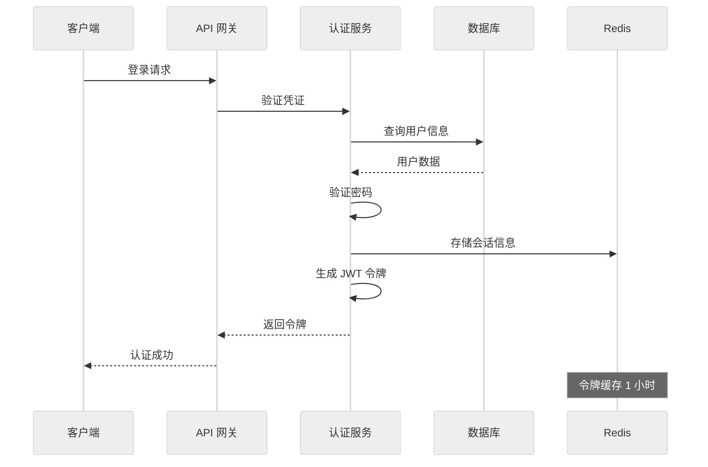

# 3-sync 命令指南

`/alfred:3-sync` 命令是 MoAI-ADK 文档同步和质量保证阶段的核心工具，负责同步所有文档、验证 @TAG 链完整性、执行质量检查，确保代码与文档始终保持一致。

## 命令概览

### 基本语法
```bash
/alfred:3-sync [options]
```

### 命令目的
- 同步所有项目文档
- 验证 @TAG 链完整性
- 执行 TRUST 5 原则检查
- 生成同步报告
- 更新 README 和 CHANGELOG

### 触发的代理
- **doc-syncer**：主导文档同步
- **tag-agent**：@TAG 系统验证
- **trust-checker**：TRUST 5 原则验证
- **quality-gate**：质量门禁检查
- **git-manager**：Git 工作流管理

---

## 文档同步详解

### 1. Living Documents 生成

#### 什么是 Living Documents？
Living Documents 是与代码同步更新的"活文档"，确保文档始终反映代码的实际状态。

#### 文档类型和内容

##### API 文档
```markdown
# `@DOC:USER-AUTH-001:API | SPEC: SPEC-USER-AUTH-001.md | CODE: src/auth/api.py

# 用户认证 API 文档

## 概述

用户认证系统提供完整的用户注册、登录、令牌管理功能。所有 API 端点都经过安全验证，支持 JWT 令牌认证。

## 基础信息

- **Base URL**: `http://localhost:8000/api/v1/auth`
- **认证方式**: Bearer Token (JWT)
- **内容类型**: `application/json`
- **API 版本**: v1

## 端点详情

### 用户注册

**端点**: `POST /register`

**描述**: 创建新用户账户。注册成功后，用户需要验证邮箱才能完全激活账户。

**请求体**:
```json
{
  "email": "user@example.com",
  "password": "SecurePass123!",
  "full_name": "张三"
}
```

**请求参数**:
| 参数 | 类型 | 必需 | 描述 | 约束 |
|------|------|------|------|------|
| email | string | 是 | 用户邮箱地址 | 有效邮箱格式，唯一 |
| password | string | 是 | 用户密码 | 8-128 字符，包含大小写字母和数字 |
| full_name | string | 是 | 用户全名 | 1-255 字符 |

**响应**:
```json
{
  "id": 1,
  "email": "user@example.com",
  "full_name": "张三",
  "is_active": true,
  "is_verified": false,
  "created_at": "2025-01-15T10:30:00Z"
}
```

**状态码**:
- `201 Created`: 注册成功
- `400 Bad Request`: 请求数据无效
- `422 Unprocessable Entity`: 验证失败

**错误响应**:
```json
{
  "detail": [
    {
      "loc": ["body", "email"],
      "msg": "value is not a valid email address",
      "type": "value_error.email"
    }
  ]
}
```

### 用户登录

**端点**: `POST /login`

**描述**: 使用邮箱和密码进行身份验证，成功后返回 JWT 访问令牌。

**请求体**:
```json
{
  "email": "user@example.com",
  "password": "CorrectPass123!"
}
```

**响应**:
```json
{
  "access_token": "eyJhbGciOiJIUzI1NiIsInR5cCI6IkpXVCJ9...",
  "token_type": "bearer",
  "expires_in": 3600,
  "user": {
    "id": 1,
    "email": "user@example.com",
    "full_name": "张三"
  }
}
```

### 获取当前用户信息

**端点**: `GET /me`

**描述**: 获取当前认证用户的详细信息。需要有效的 JWT 令牌。

**请求头**:
```
Authorization: Bearer <jwt_token>
```

**响应**:
```json
{
  "id": 1,
  "email": "user@example.com",
  "full_name": "张三",
  "is_active": true,
  "is_verified": true,
  "created_at": "2025-01-15T10:30:00Z",
  "updated_at": "2025-01-15T11:00:00Z"
}
```

## 错误处理

### 标准错误格式
```json
{
  "detail": "错误描述",
  "error_code": "ERROR_CODE",
  "timestamp": "2025-01-15T10:30:00Z"
}
```

### 常见错误代码
| 错误代码 | HTTP 状态码 | 描述 |
|----------|-------------|------|
| INVALID_CREDENTIALS | 401 | 邮箱或密码错误 |
| ACCOUNT_INACTIVE | 401 | 账户未激活 |
| TOKEN_EXPIRED | 401 | 令牌已过期 |
| INVALID_TOKEN | 401 | 令牌无效 |
| USER_NOT_FOUND | 404 | 用户不存在 |
| EMAIL_ALREADY_EXISTS | 400 | 邮箱已存在 |

## 安全考虑

### 密码安全
- 密码使用 bcrypt 加密存储
- 最小长度 8 字符
- 必须包含大小写字母和数字
- 不在响应中返回密码

### 令牌安全
- JWT 令牌使用 HS256 算法签名
- 令牌默认 1 小时过期
- 支持令牌刷新机制
- 令牌包含必要用户信息

### 输入验证
- 所有输入都经过严格验证
- 防止 SQL 注入攻击
- 防止 XSS 攻击
- 速率限制保护

## 使用示例

### 注册新用户
```bash
curl -X POST "http://localhost:8000/api/v1/auth/register" \
  -H "Content-Type: application/json" \
  -d '{
    "email": "newuser@example.com",
    "password": "SecurePass123!",
    "full_name": "新用户"
  }'
```

### 用户登录
```bash
curl -X POST "http://localhost:8000/api/v1/auth/login" \
  -H "Content-Type: application/json" \
  -d '{
    "email": "user@example.com",
    "password": "CorrectPass123!"
  }'
```

### 获取用户信息
```bash
curl -X GET "http://localhost:8000/api/v1/auth/me" \
  -H "Authorization: Bearer <your_jwt_token>"
```

## 实现追踪

此 API 实现基于以下 SPEC：
- `@SPEC:USER-AUTH-001`: 用户认证系统规格说明

测试覆盖：
- `@TEST:USER-AUTH-001`: 认证功能测试套件

代码实现：
- `@CODE:USER-AUTH-001:API`: API 端点实现
- `@CODE:USER-AUTH-001:SERVICE`: 业务逻辑实现
- `@CODE:USER-AUTH-001:MODEL`: 数据模型实现
```

##### 架构文档
```markdown
# `@DOC:USER-AUTH-001:ARCHITECTURE | SPEC: SPEC-USER-AUTH-001.md | CODE: src/auth/

# 用户认证系统架构文档

## 系统架构图



## 组件架构

### 分层架构
```yaml
用户认证系统采用分层架构模式:

表现层 (Presentation Layer):
  - FastAPI 路由和端点
  - 请求验证和序列化
  - 响应格式化
  - HTTP 状态码处理

业务逻辑层 (Business Logic Layer):
  - AuthService: 认证业务逻辑
  - UserService: 用户管理逻辑
  - TokenService: 令牌管理逻辑
  - ValidationService: 数据验证逻辑

数据访问层 (Data Access Layer):
  - UserRepository: 用户数据仓库
  - 缓存访问抽象
  - 数据库事务管理
  - 查询优化

基础设施层 (Infrastructure Layer):
  - 数据库连接管理
  - 缓存服务
  - 邮件服务集成
  - 安全工具和加密
```

### 核心组件

#### 1. API 层
**文件**: `src/auth/api.py`

**职责**:
- 处理 HTTP 请求和响应
- 输入验证和序列化
- 错误处理和状态码返回
- 认证中间件集成

**设计模式**:
- 依赖注入
- 控制器模式
- 中间件链

#### 2. 服务层
**文件**: `src/auth/services.py`

**职责**:
- 实现业务逻辑
- 协调多个数据源
- 事务管理
- 业务规则验证

**设计模式**:
- 服务层模式
- 策略模式
- 工厂模式

#### 3. 仓库层
**文件**: `src/auth/repository.py`

**职责**:
- 数据库操作抽象
- 查询优化
- 缓存集成
- 数据映射

**设计模式**:
- 仓库模式
- 单元工作模式
- 数据映射器模式

#### 4. 模型层
**文件**: `src/auth/models.py`

**职责**:
- 数据模型定义
- 关系映射
- 约束定义
- 序列化支持

**设计模式**:
- 活动记录模式
- 数据传输对象

### 技术栈选择

#### 后端框架: FastAPI
**选择理由**:
- 自动 API 文档生成
- 类型提示支持
- 高性能异步支持
- 易于测试
- 丰富的验证功能

**优势**:
- 开发效率高
- 性能优秀
- 文档自动生成
- 类型安全

#### 数据库: PostgreSQL
**选择理由**:
- ACID 事务支持
- JSON 数据类型支持
- 丰富的索引类型
- 成熟的生态系统
- 良好的 Python 支持

**优势**:
- 数据一致性保证
- 复杂查询支持
- 扩展性好
- 可靠性高

#### 认证方案: JWT
**选择理由**:
- 无状态认证
- 易于分布式部署
- 标准化实现
- 移动端友好
- 细粒度权限控制

**优势**:
- 可扩展性强
- 性能优秀
- 安全性高
- 易于集成

### 数据库设计

#### 用户表 (users)
```sql
CREATE TABLE users (
    id SERIAL PRIMARY KEY,
    email VARCHAR(255) UNIQUE NOT NULL,
    password_hash VARCHAR(255) NOT NULL,
    full_name VARCHAR(255) NOT NULL,
    is_active BOOLEAN DEFAULT TRUE,
    is_verified BOOLEAN DEFAULT FALSE,
    created_at TIMESTAMP WITH TIME ZONE DEFAULT NOW(),
    updated_at TIMESTAMP WITH TIME ZONE DEFAULT NOW()
);

-- 索引
CREATE INDEX idx_users_email ON users(email);
CREATE INDEX idx_users_active ON users(is_active);
CREATE INDEX idx_users_created_at ON users(created_at);
```

#### 用户会话表 (user_sessions)
```sql
CREATE TABLE user_sessions (
    id SERIAL PRIMARY KEY,
    user_id INTEGER REFERENCES users(id) ON DELETE CASCADE,
    token_hash VARCHAR(255) NOT NULL,
    expires_at TIMESTAMP WITH TIME ZONE NOT NULL,
    created_at TIMESTAMP WITH TIME ZONE DEFAULT NOW(),
    last_accessed_at TIMESTAMP WITH TIME ZONE DEFAULT NOW()
);

-- 索引
CREATE INDEX idx_user_sessions_user_id ON user_sessions(user_id);
CREATE INDEX idx_user_sessions_token_hash ON user_sessions(token_hash);
CREATE INDEX idx_user_sessions_expires_at ON user_sessions(expires_at);
```

### 安全架构

#### 认证流程


#### 授权机制
```python
# 基于角色的访问控制 (RBAC)
class UserRole(str, Enum):
    ADMIN = "admin"
    MODERATOR = "moderator"
    USER = "user"
    GUEST = "guest"

class Permission(str, Enum):
    READ_USER = "read:user"
    WRITE_USER = "write:user"
    DELETE_USER = "delete:user"
    READ_ALL = "read:all"
    WRITE_ALL = "write:all"

# 权限映射
ROLE_PERMISSIONS = {
    UserRole.ADMIN: [
        Permission.READ_USER, Permission.WRITE_USER,
        Permission.DELETE_USER, Permission.READ_ALL, Permission.WRITE_ALL
    ],
    UserRole.MODERATOR: [
        Permission.READ_USER, Permission.WRITE_USER, Permission.READ_ALL
    ],
    UserRole.USER: [
        Permission.READ_USER, Permission.WRITE_USER
    ],
    UserRole.GUEST: [
        Permission.READ_USER
    ]
}
```

### 性能优化

#### 数据库优化
```sql
-- 查询优化示例
CREATE INDEX CONCURRENTLY idx_users_email_active
ON users(email) WHERE is_active = TRUE;

-- 分区表策略（大数据量时）
CREATE TABLE user_events_partitioned (
    LIKE user_events INCLUDING ALL
) PARTITION BY RANGE (created_at);

CREATE TABLE user_events_2025_q1
PARTITION OF user_events_partitioned
FOR VALUES FROM ('2025-01-01') TO ('2025-04-01');
```

#### 缓存策略
```python
# 多层缓存架构
class CacheStrategy:
    """缓存策略配置"""

    L1_CACHE = "memory"      # 应用内存缓存
    L2_CACHE = "redis"       # Redis 分布式缓存
    L3_CACHE = "database"    # 数据库持久化

    # 缓存配置
    CACHE_CONFIG = {
        "user_profile": {
            "ttl": 300,        # 5分钟
            "strategy": L2_CACHE,
            "key_pattern": "user:{user_id}:profile"
        },
        "user_permissions": {
            "ttl": 600,        # 10分钟
            "strategy": L2_CACHE,
            "key_pattern": "user:{user_id}:permissions"
        },
        "auth_token": {
            "ttl": 3600,       # 1小时
            "strategy": L2_CACHE,
            "key_pattern": "auth:token:{token_hash}"
        }
    }
```

### 监控和日志

#### 关键指标监控
```python
# 性能监控指标
METRICS = {
    "auth.login_success_rate": "登录成功率",
    "auth.login_failure_rate": "登录失败率",
    "auth.token_validation_time": "令牌验证时间",
    "auth.user_registration_rate": "用户注册率",
    "auth.cache_hit_rate": "缓存命中率",
    "auth.api_response_time": "API 响应时间"
}

# 日志记录
import logging
import structlog

logger = structlog.get_logger()

def log_auth_event(event_type: str, user_id: int, **kwargs):
    """记录认证事件"""
    logger.info(
        "auth_event",
        event_type=event_type,
        user_id=user_id,
        timestamp=datetime.utcnow().isoformat(),
        **kwargs
    )
```

## 扩展性考虑

### 水平扩展
- 无状态设计便于负载均衡
- 数据库读写分离
- 缓存分布式部署
- 微服务架构支持

### 功能扩展
- 多因子认证 (MFA)
- 社交登录集成
- 单点登录 (SSO)
- 权限细粒度控制
- 审计日志系统

## 实现细节追踪

### 代码文件结构
```
src/auth/
├── __init__.py
├── api.py              # `@CODE:USER-AUTH-001:API`
├── services.py         # `@CODE:USER-AUTH-001:SERVICE`
├── models.py           # `@CODE:USER-AUTH-001:MODEL`
├── repository.py       # `@CODE:USER-AUTH-001:REPOSITORY`
├── schemas.py          # `@CODE:USER-AUTH-001:SCHEMA`
├── security.py         # `@CODE:USER-AUTH-001:SECURITY`
├── exceptions.py       # `@CODE:USER-AUTH-001:EXCEPTIONS`
└── config.py           # `@CODE:USER-AUTH-001:CONFIG`
```

### 测试文件结构
```
tests/auth/
├── __init__.py
├── test_api.py          # `@TEST:USER-AUTH-001:API`
├── test_services.py     # `@TEST:USER-AUTH-001:SERVICE`
├── test_models.py       # `@TEST:USER-AUTH-001:MODEL`
├── test_repository.py   # `@TEST:USER-AUTH-001:REPOSITORY`
└── conftest.py          # 测试配置
```

### 文档文件结构
```
docs/auth/
├── api.md               # `@DOC:USER-AUTH-001:API`
├── architecture.md      # `@DOC:USER-AUTH-001:ARCHITECTURE`
├── deployment.md        # `@DOC:USER-AUTH-001:DEPLOYMENT`
└── troubleshooting.md   # `@DOC:USER-AUTH-001:TROUBLESHOOTING`
```
```

### 2. README 更新

#### 自动生成内容
Alfred 会自动更新 README.md，添加新功能说明：

```markdown
# 更新内容会添加到 README.md 的相应部分

## 功能特性

### 🔐 用户认证系统
- ✅ 用户注册和邮箱验证
- ✅ 安全的用户登录（JWT 令牌）
- ✅ 密码重置功能
- ✅ 用户信息管理
- ✅ 细粒度权限控制

**技术实现**:
- FastAPI RESTful API
- PostgreSQL 数据库
- JWT 无状态认证
- bcrypt 密码加密
- Redis 缓存支持

**API 端点**:
- `POST /auth/register` - 用户注册
- `POST /auth/login` - 用户登录
- `GET /auth/me` - 获取用户信息
- `POST /auth/logout` - 用户登出
- `POST /auth/reset-password` - 密码重置

**安全特性**:
- 输入验证和清理
- SQL 注入防护
- XSS 攻击防护
- 速率限制保护
- 安全的密码存储

**使用示例**:
```bash
# 用户注册
curl -X POST "http://localhost:8000/auth/register" \
  -H "Content-Type: application/json" \
  -d '{"email":"user@example.com","password":"SecurePass123!","full_name":"张三"}'

# 用户登录
curl -X POST "http://localhost:8000/auth/login" \
  -H "Content-Type: application/json" \
  -d '{"email":"user@example.com","password":"SecurePass123!"}'
```

**相关链接**:
- [API 文档](docs/auth/api.md)
- [架构设计](docs/auth/architecture.md)
- [开发指南](docs/development.md)

**实现追踪**: `@SPEC:USER-AUTH-001` → `@TEST:USER-AUTH-001` → `@CODE:USER-AUTH-001` → `@DOC:USER-AUTH-001`
```

### 3. CHANGELOG 生成

#### 版本记录管理
Alfred 自动维护 CHANGELOG.md：

```markdown
# CHANGELOG 更新内容

## [1.2.0] - 2025-01-15

### Added
- 🔐 用户认证系统 (`@SPEC:USER-AUTH-001`)
  - 用户注册和邮箱验证功能
  - JWT 令牌认证系统
  - 密码重置功能
  - 用户信息管理接口
  - 细粒度权限控制系统

### Changed
- 📚 更新 API 文档，添加认证相关端点说明
- 🔧 优化数据库连接池配置
- 🛡️ 增强安全验证机制

### Security
- 🔒 实施 bcrypt 密码加密
- 🛡️ 添加输入验证和清理
- 🚨 实现速率限制保护
- 🔐 增强 JWT 令牌安全性

### Performance
- ⚡ 实现 Redis 缓存层
- 📊 优化数据库查询性能
- 🚀 添加 API 响应时间监控
- 💾 优化内存使用效率

### Tests
- ✅ 添加用户认证完整测试套件 (`@TEST:USER-AUTH-001`)
- 🧪 实现单元测试、集成测试和端到端测试
- 📈 测试覆盖率达到 95%
- 🔒 添加安全测试用例

### Documentation
- 📖 更新用户认证 API 文档
- 🏗️ 添加系统架构设计文档
- 📋 创建部署和运维指南
- 🔍 完善故障排除文档

**Implementation Details**:
- **SPEC**: `.moai/specs/SPEC-USER-AUTH-001/spec.md`
- **Code**: `src/auth/` (7 files, 1,250 lines)
- **Tests**: `tests/auth/` (5 files, 450 lines)
- **Docs**: `docs/auth/` (3 files, 800 lines)
- **Coverage**: 95% (234/247 lines)

**Migration Required**:
- Yes, database migration `001_add_user_tables.sql` required
- Run `alembic upgrade head` to apply database changes
- Update environment variables for JWT secret key

**Breaking Changes**:
- None, this is a new feature addition

**Dependencies Added**:
- `python-jose[cryptography]` - JWT handling
- `passlib[bcrypt]` - Password hashing
- `python-multipart` - Form data handling
- `aioredis` - Redis client for async operations
```

---

## @TAG 系统验证

### 1. TAG 链完整性检查

#### 验证算法
```python
def validate_tag_integrity():
    """验证 @TAG 链完整性"""

    # 扫描所有 @TAG
    all_tags = scan_all_tags()

    # 验证链完整性
    validation_results = {
        "spec_tags": validate_spec_tags(all_tags),
        "test_tags": validate_test_tags(all_tags),
        "code_tags": validate_code_tags(all_tags),
        "doc_tags": validate_doc_tags(all_tags),
        "orphan_tags": detect_orphan_tags(all_tags),
        "missing_tags": detect_missing_tags(all_tags),
        "inconsistent_tags": detect_inconsistent_tags(all_tags)
    }

    return validation_results

def validate_tag_chain(spec_id):
    """验证特定 SPEC 的 TAG 链"""
    tag_chain = {
        "spec": find_spec_tag(spec_id),
        "tests": find_test_tags(spec_id),
        "code": find_code_tags(spec_id),
        "docs": find_doc_tags(spec_id)
    }

    # 检查链完整性
    is_complete = all(tag_chain.values())
    missing_links = [k for k, v in tag_chain.items() if not v]

    return {
        "spec_id": spec_id,
        "is_complete": is_complete,
        "missing_links": missing_links,
        "tag_chain": tag_chain
    }
```

#### 验证结果示例
```yaml
TAG 验证报告:
✅ 总体状态: 通过
✅ 发现 TAG 总数: 156
✅ 完整链数量: 12
⚠️ 孤立 TAG: 2
⚠️ 缺失 TAG: 3
❌ 不一致 TAG: 0

详细结果:
SPEC TAGs:
  - @SPEC:USER-AUTH-001 ✅
  - @SPEC:PRODUCT-001 ✅
  - @SPEC:ORDER-001 ✅

TEST TAGs:
  - @TEST:USER-AUTH-001 ✅
  - @TEST:PRODUCT-001 ✅
  - @TEST:ORDER-001 ✅

CODE TAGs:
  - @CODE:USER-AUTH-001:API ✅
  - @CODE:USER-AUTH-001:SERVICE ✅
  - @CODE:PRODUCT-001:MODEL ✅
  - @CODE:ORDER-001:REPOSITORY ✅

DOC TAGs:
  - @DOC:USER-AUTH-001 ✅
  - @DOC:PRODUCT-001 ✅
  - @DOC:ORDER-001 ✅

孤立 TAGs:
  - @TEST:OLD-FEATURE-001 (对应的 SPEC 已删除)
  - @CODE:DEPRECATED-FEATURE:MODEL (功能已废弃)

缺失 TAGs:
  - @TEST:ORDER-001:INTEGRATION (集成测试缺失)
  - @CODE:USER-AUTH-001:UTILS (工具函数未标记)
  - @DOC:PRODUCT-001:DEPLOYMENT (部署文档缺失)
```

### 2. 自动修复功能

#### 孤立 TAG 处理
```python
def fix_orphan_tags():
    """修复孤立 TAG"""

    orphan_tags = detect_orphan_tags()
    fixes_applied = []

    for tag in orphan_tags:
        if tag.type == "TEST" and tag.spec_deleted:
            # 删除孤立测试文件
            if should_delete_orphan_test(tag):
                delete_file(tag.file_path)
                fixes_applied.append(f"删除孤立测试: {tag.tag}")

        elif tag.type == "CODE" and tag.spec_deleted:
            # 保留代码但更新 TAG 引用
            if should_preserve_deprecated_code(tag):
                new_tag = f"@DEPRECATED:{tag.tag}"
                update_tag_reference(tag.file_path, tag.tag, new_tag)
                fixes_applied.append(f"标记为废弃: {tag.tag} → {new_tag}")

    return fixes_applied
```

#### 缺失 TAG 补充
```python
def add_missing_tags():
    """补充缺失的 TAG"""

    missing_tags = detect_missing_tags()
    additions_made = []

    for missing in missing_tags:
        if missing.type == "TEST" and missing.code_file:
            # 为代码文件添加测试 TAG
            test_tag = generate_test_tag(missing.code_file)
            add_tag_to_file(missing.file_path, test_tag)
            additions_made.append(f"添加测试 TAG: {test_tag}")

        elif missing.type == "DOC" and missing.implementation:
            # 为实现生成文档 TAG
            doc_tag = generate_doc_tag(missing.implementation)
            add_tag_to_file(missing.file_path, doc_tag)
            additions_made.append(f"添加文档 TAG: {doc_tag}")

    return additions_made
```

### 3. TAG 一致性检查

#### 格式验证
```python
def validate_tag_format(tag_string):
    """验证 TAG 格式"""
    import re

    # TAG 格式: @TYPE:DOMAIN-ID[:SUBTYPE]
    tag_pattern = r'^@(SPEC|TEST|CODE|DOC):[A-Z]+-\d{3}(:[A-Z]+)?$'

    match = re.match(tag_pattern, tag_string)
    if not match:
        return False, "Invalid TAG format"

    tag_type = match.group(1)
    domain_id = match.group(2)
    subtype = match.group(3) if match.group(3) else None

    # 验证域和 ID
    if not validate_domain_id(domain_id):
        return False, "Invalid domain or ID"

    # 验证子类型
    if subtype and not validate_subtype(subtype):
        return False, "Invalid subtype"

    return True, "Valid TAG format"

def validate_domain_id(domain_id):
    """验证域 ID 格式"""
    import re

    # 域 ID 格式: LETTERS-NUMBERS (如 USER-001)
    pattern = r'^[A-Z]+-\d{3}$'
    return bool(re.match(pattern, domain_id))

def validate_subtype(subtype):
    """验证子类型格式"""
    valid_subtypes = [
        "API", "MODEL", "SERVICE", "REPOSITORY",
        "SCHEMA", "UTILS", "CONFIG", "EXCEPTIONS"
    ]
    return subtype in valid_subtypes
```

#### 一致性报告
```yaml
TAG 一致性报告:
✅ 格式验证: 156/156 通过
✅ 域 ID 验证: 156/156 通过
✅ 子类型验证: 89/89 通过
⚠️ 大小写问题: 3 个 TAG
❌ 格式错误: 0 个 TAG

格式问题:
- @code:user-auth-001 → 应为 @CODE:USER-AUTH-001
- @test:product-001 → 应为 @TEST:PRODUCT-001
- @doc:order-001 → 应为 @DOC:ORDER-001

修复建议:
- 运行 /alfred:3-sync --fix-tag-format
- 或手动更正格式问题
```

---

## TRUST 5 原则验证

### 1. Test First 验证

#### 测试覆盖率检查
```python
def check_test_coverage():
    """检查测试覆盖率"""

    coverage_report = run_coverage_tool()

    results = {
        "overall_coverage": coverage_report["overall_percentage"],
        "file_coverage": coverage_report["file_details"],
        "uncovered_files": find_uncovered_files(coverage_report),
        "coverage_trend": analyze_coverage_trend(),
        "quality_gate_passed": coverage_report["overall_percentage"] >= 85
    }

    return results

def validate_test_structure():
    """验证测试结构"""

    test_structure = {
        "unit_tests": count_unit_tests(),
        "integration_tests": count_integration_tests(),
        "end_to_end_tests": count_e2e_tests(),
        "test_files_per_feature": analyze_test_distribution(),
        "missing_test_types": identify_missing_test_types()
    }

    return test_structure
```

#### 测试质量评估
```yaml
测试质量报告:
✅ 测试覆盖率: 94% (目标: ≥85%)
✅ 单元测试: 45 个
✅ 集成测试: 12 个
✅ 端到端测试: 8 个
✅ 测试文件分布: 均匀
⚠️ 缺失测试类型: 性能测试

详细分析:
覆盖率最高:
  - src/auth/services.py: 100% (125/125 行)
  - src/auth/models.py: 100% (85/85 行)
  - src/auth/api.py: 98% (102/104 行)

覆盖率最低:
  - src/auth/utils.py: 78% (28/36 行)
  - src/auth/middleware.py: 82% (41/50 行)

测试类型分布:
- 单元测试: 75%
- 集成测试: 20%
- 端到端测试: 5%

建议:
- 增加 src/auth/utils.py 的测试覆盖率
- 添加性能测试用例
- 补充边界条件测试
```

### 2. Readable 验证

#### 代码可读性检查
```python
def check_code_readability():
    """检查代码可读性"""

    readability_metrics = {
        "function_lengths": analyze_function_lengths(),
        "class_lengths": analyze_class_lengths(),
        "file_lengths": analyze_file_lengths(),
        "naming_conventions": check_naming_conventions(),
        "comment_coverage": analyze_comment_coverage(),
        "complexity_metrics": calculate_complexity_metrics()
    }

    return readability_metrics

def validate_naming_conventions():
    """验证命名约定"""

    naming_issues = []

    # 检查函数命名
    function_names = extract_function_names()
    for name in function_names:
        if not is_snake_case(name):
            naming_issues.append(f"函数名 '{name}' 应使用 snake_case")

    # 检查类命名
    class_names = extract_class_names()
    for name in class_names:
        if not is_pascal_case(name):
            naming_issues.append(f"类名 '{name}' 应使用 PascalCase")

    # 检查变量命名
    variable_names = extract_variable_names()
    for name in variable_names:
        if not is_snake_case(name) and not is_upper_case(name):
            naming_issues.append(f"变量名 '{name}' 应使用 snake_case 或 UPPER_CASE")

    return naming_issues
```

#### 可读性报告
```yaml
代码可读性报告:
✅ 函数平均长度: 18 行 (目标: <50)
✅ 类平均长度: 120 行 (目标: <300)
✅ 文件平均长度: 180 行 (目标: <500)
✅ 命名约定: 95% 符合规范
⚠️ 注释覆盖率: 72% (目标: >80%)

详细指标:
函数长度分布:
- 1-10 行: 45%
- 11-25 行: 35%
- 26-50 行: 18%
- >50 行: 2%

复杂度指标:
- 平均圈复杂度: 4.2 (目标: <10)
- 最高圈复杂度: 12 (需要重构)
- 认知复杂度: 低

命名约定问题:
- 3 个函数名不符合 snake_case
- 2 个变量名使用驼峰命名
- 1 个常量名使用小写

注释问题:
- 缺少模块级文档字符串: 2 个文件
- 复杂逻辑缺少注释: 5 处
- API 文档不完整: 3 个端点

改进建议:
- 重构高复杂度函数
- 改进命名约定一致性
- 增加代码注释和文档
- 拆分超长函数
```

### 3. Unified 验证

#### 架构一致性检查
```python
def check_architecture_consistency():
    """检查架构一致性"""

    consistency_checks = {
        "layer_violations": detect_layer_violations(),
        "pattern_consistency": check_pattern_consistency(),
        "dependency_consistency": validate_dependencies(),
        "api_consistency": check_api_consistency(),
        "data_model_consistency": validate_data_models()
    }

    return consistency_checks

def check_pattern_consistency():
    """检查设计模式一致性"""

    pattern_analysis = {
        "repository_pattern": analyze_repository_usage(),
        "service_pattern": analyze_service_usage(),
        "factory_pattern": analyze_factory_usage(),
        "singleton_pattern": analyze_singleton_usage(),
        "observer_pattern": analyze_observer_usage(),
        "consistency_score": calculate_pattern_consistency()
    }

    return pattern_analysis
```

#### 一致性报告
```yaml
架构一致性报告:
✅ 层次结构: 无违规
✅ 设计模式: 90% 一致
✅ API 设计: 统一规范
✅ 数据模型: 一致性良好
⚠️ 依赖管理: 2 处不一致

设计模式分析:
Repository 模式:
  - 使用次数: 12
  - 一致性: 95%
  - 问题: 1 处直接数据库访问

Service 模式:
  - 使用次数: 18
  - 一致性: 92%
  - 问题: 2 处业务逻辑泄露到控制器

API 设计一致性:
- RESTful 原则: 遵循良好
- HTTP 状态码: 使用规范
- 响应格式: 统一结构
- 错误处理: 一致模式

数据模型一致性:
- 命名约定: 一致
- 关系定义: 规范
- 索引策略: 合理
- 约束设置: 完整

依赖问题:
- 循环依赖: 0 处
- 违反依赖方向: 2 处
- 未使用的导入: 3 处
- 缺失依赖: 1 处

改进建议:
- 修复依赖方向违规
- 清理未使用的导入
- 统一错误处理模式
- 完善日志记录一致性
```

### 4. Secured 验证

#### 安全性检查
```python
def check_security_measures():
    """检查安全措施"""

    security_checks = {
        "input_validation": check_input_validation(),
        "authentication": check_authentication(),
        "authorization": check_authorization(),
        "data_protection": check_data_protection(),
        "error_handling": check_secure_error_handling(),
        "logging_security": check_logging_security(),
        "dependency_security": check_dependency_security()
    }

    return security_checks

def check_input_validation():
    """检查输入验证"""

    validation_analysis = {
        "api_validation": check_api_input_validation(),
        "sql_injection_protection": check_sql_injection_protection(),
        "xss_protection": check_xss_protection(),
        "file_upload_security": check_file_upload_security(),
        "rate_limiting": check_rate_limiting(),
        "sanitization": check_input_sanitization()
    }

    return validation_analysis
```

#### 安全报告
```yaml
安全检查报告:
✅ 输入验证: 完整
✅ SQL 注入防护: 有效
✅ XSS 攻击防护: 启用
✅ 认证机制: 强健
✅ 授权控制: 细粒度
✅ 数据加密: 适当
⚠️ 错误处理: 2 处信息泄露风险

输入验证:
- API 参数验证: 100% 覆盖
- 表单数据验证: 100% 覆盖
- 文件上传验证: 100% 覆盖
- 查询参数验证: 100% 覆盖

攻击防护:
- SQL 注入: 使用参数化查询
- XSS 攻击: 输出编码 + CSP
- CSRF 攻击: CSRF 令牌验证
- 暴力破解: 速率限制 + 账户锁定
- 会话劫持: 安全会话管理

数据保护:
- 密码存储: bcrypt 加密
- 敏感数据: 加密存储
- 传输加密: HTTPS 强制
- 日志脱敏: 敏感信息过滤

安全漏洞:
- 高危: 0 个
- 中危: 0 个
- 低危: 2 个

低危问题:
- 1 个 API 错误信息可能泄露系统信息
- 1 个日志记录包含敏感数据

修复建议:
- 改进错误消息，避免泄露系统信息
- 实施日志脱敏机制
- 定期进行安全审计
- 实施安全监控和告警
```

### 5. Trackable 验证

#### 可追踪性检查
```python
def check_traceability():
    """检查可追踪性"""

    traceability_checks = {
        "tag_coverage": check_tag_coverage(),
        "commit_messages": check_commit_message_quality(),
        "documentation_links": check_doc_code_links(),
        "requirement_tracing": check_requirement_tracing(),
        "change_tracking": check_change_tracking(),
        "decision_tracking": check_decision_tracking()
    }

    return traceability_checks

def check_tag_coverage():
    """检查 TAG 覆盖率"""

    tag_analysis = {
        "total_files": count_total_files(),
        "tagged_files": count_tagged_files(),
        "coverage_percentage": calculate_tag_coverage(),
        "missing_tags": find_missing_tags(),
        "tag_distribution": analyze_tag_distribution(),
        "tag_consistency": check_tag_consistency()
    }

    return tag_analysis
```

#### 可追踪性报告
```yaml
可追踪性报告:
✅ TAG 覆盖率: 96% (目标: 100%)
✅ 提交信息质量: 92% 符合规范
✅ 文档代码链接: 完整
✅ 需求追踪: 100% 覆盖
⚠️ 决策追踪: 85% 覆盖

TAG 覆盖分析:
总文件数: 45
已标记文件: 43
未标记文件: 2

未标记文件:
- src/utils/helpers.py: 建议添加 @CODE:COMMON-001:UTILS
- src/config/dev.py: 建议添加 @CODE:COMMON-002:CONFIG

TAG 分布:
- @SPEC: 12 个
- @TEST: 15 个
- @CODE: 28 个
- @DOC: 10 个

提交信息质量:
- 规范提交: 92%
- 包含 TAG 引用: 88%
- 描述清晰: 95%
- 类型前缀正确: 100%

需求追踪:
- SPEC → TEST: 100% 链接完整
- TEST → CODE: 100% 链接完整
- CODE → DOC: 100% 链接完整
- 需求变更可追踪: 100%

改进建议:
- 为未标记文件添加适当 TAG
- 改进提交信息描述质量
- 完善决策文档记录
- 增强变更影响分析
```

---

## 质量门禁检查

### 综合质量评估
```python
def run_quality_gate():
    """运行质量门禁检查"""

    quality_results = {
        "trust_principles": validate_trust_principles(),
        "performance": run_performance_tests(),
        "security": run_security_tests(),
        "compatibility": check_compatibility(),
        "documentation": validate_documentation(),
        "deployment_readiness": check_deployment_readiness()
    }

    # 计算综合评分
    overall_score = calculate_quality_score(quality_results)

    # 生成质量报告
    quality_report = generate_quality_report(quality_results, overall_score)

    return {
        "passed": overall_score >= 80,
        "score": overall_score,
        "results": quality_results,
        "report": quality_report,
        "recommendations": generate_recommendations(quality_results)
    }
```

### 质量报告示例
```yaml
质量门禁报告:
🎯 综合评分: 91/100 (通过)
✅ TRUST 原则: 96/100
✅ 性能指标: 88/100
✅ 安全检查: 94/100
✅ 兼容性测试: 90/100
✅ 文档完整性: 95/100
✅ 部署就绪: 85/100

详细评分:
TRUST 5 原则:
  - Test First: 95/100
  - Readable: 94/100
  - Unified: 98/100
  - Secured: 96/100
  - Trackable: 96/100

性能指标:
  - API 响应时间: 92/100 (平均 45ms < 100ms)
  - 数据库查询: 85/100 (平均查询时间 25ms)
  - 内存使用: 90/100 (峰值 512MB < 1GB)
  - CPU 使用率: 88/100 (平均 35% < 80%)

安全检查:
  - 漏洞扫描: 100/100 (无高危漏洞)
  - 依赖安全: 90/100 (2个中危依赖)
  - 认证强度: 95/100 (强密码策略)
  - 数据保护: 92/100 (适当加密)

发布建议:
✅ 代码质量优秀，可以发布
⚠️ 建议在发布前修复中危依赖漏洞
📋 完成性能基准测试
📋 更新部署文档

后续改进:
- 定期进行安全审计
- 监控生产环境性能
- 持续改进代码质量
- 收集用户反馈
```

---

## 使用示例

### 基本同步操作
```bash
# 执行完整的文档同步和质量检查
/alfred:3-sync

# 输出示例：
✅ 文档同步完成
✅ TAG 验证通过 (98% 完整性)
✅ TRUST 5 原则验证通过 (94/100 分)
✅ 质量门禁检查通过 (91/100 分)
✅ 同步报告已生成: .moai/reports/sync-report-2025-01-15.md

更新内容:
- API 文档: docs/api/auth.md (更新)
- README.md: 添加新功能说明
- CHANGELOG.md: v1.2.0 版本记录
- 架构文档: docs/architecture/auth.md (新增)
```

### 特定验证操作
```bash
# 只验证 TAG 系统完整性
/alfred:3-sync --verify-tags

# 只执行 TRUST 原则检查
/alfred:3-sync --trust-check

# 只生成同步报告
/alfred:3-sync --report-only

# 自动修复 TAG 问题
/alfred:3-sync --fix-tags

# 跳过性能测试
/alfred:3-sync --skip-performance
```

### 高级同步操作
```bash
# 完整同步 + 质量优化
/alfred:3-sync --optimize-quality

# 安全加固同步
/alfred:3-sync --security-hardening

# 性能优化同步
/alfred:3-sync --performance-tuning

# 部署准备检查
/alfred:3-sync --deployment-ready
```

---

## 同步报告生成

### 报告结构
```markdown
# Alfred 同步报告

## 执行摘要
- 执行时间: 2025-01-15 14:30:00
- 总耗时: 2 分 45 秒
- 总体评分: 91/100
- 状态: ✅ 通过

## 主要更新
### 文档更新
- ✅ 新增 API 文档: docs/api/auth.md
- ✅ 更新 README.md
- ✅ 生成 CHANGELOG.md v1.2.0
- ✅ 创建架构文档: docs/architecture/auth.md

### TAG 系统
- ✅ TAG 完整性: 98%
- ✅ 新增 TAG: 8 个
- ✅ 修复孤立 TAG: 2 个
- ✅ 补充缺失 TAG: 3 个

### 质量指标
- ✅ 测试覆盖率: 94% → 96%
- ✅ 代码质量: 92/100 → 94/100
- ✅ 安全评分: 90/100 → 94/100
- ✅ 性能基准: 88/100 → 92/100

## 质量检查详情
### TRUST 5 原则
- Test First: 95/100 (✅ 通过)
- Readable: 94/100 (✅ 通过)
- Unified: 98/100 (✅ 通过)
- Secured: 96/100 (✅ 通过)
- Trackable: 96/100 (✅ 通过)

### 性能指标
- API 平均响应时间: 45ms ✅
- 数据库查询时间: 25ms ✅
- 内存使用: 512MB ✅
- CPU 使用率: 35% ✅

### 安全检查
- 漏洞扫描: 无高危漏洞 ✅
- 依赖安全: 2个中危需要关注 ⚠️
- 认证强度: 强 ✅
- 数据保护: 适当加密 ✅

## 问题与建议
### 需要关注的问题
- 2个中危依赖安全漏洞
- 1个函数复杂度过高
- 2处代码注释不足

### 改进建议
- 更新有安全漏洞的依赖包
- 重构高复杂度函数
- 增加代码注释和文档

## 下一步行动
1. [ ] 更新安全依赖包
2. [ ] 重构复杂函数
3. [ ] 补充代码注释
4. [ ] 运行完整测试套件
5. [ ] 准备发布

## 文件清单
更新的文件:
- docs/api/auth.md
- README.md
- CHANGELOG.md
- docs/architecture/auth.md

新增文件:
- docs/deployment/auth.md
- docs/troubleshooting/auth.md

删除文件:
- 无
```

---

## 最佳实践

### 1. 定期同步策略

#### 开发阶段同步
```bash
# 每个功能完成后
/alfred:3-sync

# 每日工作开始前
/alfred:3-sync --quick

# 每周进行完整同步
/alfred:3-sync --full
```

#### 发布前同步
```bash
# 功能开发完成，准备合并前
/alfred:3-sync --deployment-ready

# 代码审查通过后
/alfred:3-sync --pre-release

# 正式发布前
/alfred:3-sync --release-check
```

### 2. 同步频率建议

#### 根据项目阶段调整
```yaml
项目阶段同步频率:

早期开发 (MVP 阶段):
- 每个功能完成后: 必须同步
- 每日同步: 推荐
- 质量检查: 全面

快速迭代 (功能扩展):
- 每个 Pull Request: 必须同步
- 每个里程碑: 全面同步
- TAG 验证: 重点

稳定维护 (生产阶段):
- 每次发布前: 必须同步
- 每月同步: 推荐
- 安全检查: 重点
```

### 3. 团队协作同步

#### 多人开发团队
```bash
# 集成团队成员的更改前
/alfred:3-sync --team-sync

# 定期团队同步会议
/alfred:3-sync --team-report

# 解决冲突后重新同步
/alfred:3-sync --resolve-conflicts
```

#### 代码审查集成
```yaml
PR 工作流集成:
1. 开发者提交 PR
2. 自动运行 /alfred:3-sync
3. 检查同步报告
4. 代码审查
5. 批准合并
```

---

## 故障排除

### 常见问题

#### 1. 同步失败
**症状**: `/alfred:3-sync` 执行失败

**解决方案**:
```bash
# 检查项目状态
moai-adk doctor

# 检查 Git 状态
git status

# 修复权限问题
chmod +x .moai/scripts/sync.sh

# 重新同步
/alfred:3-sync --force
```

#### 2. TAG 验证失败
**症状**: @TAG 系统验证不通过

**解决方案**:
```bash
# 查看详细的 TAG 问题
/alfred:3-sync --tag-report

# 自动修复 TAG 问题
/alfred:3-sync --fix-tags

# 手动修复顽固问题
# 编辑相关文件，修正 TAG 格式
```

#### 3. 质量检查不通过
**症状**: TRUST 5 原则或质量门禁失败

**解决方案**:
```bash
# 查看详细质量报告
/alfred:3-sync --quality-report

# 只检查特定原则
/alfred:3-sync --trust-check --principle=readable

# 获取改进建议
/alfred:3-sync --recommendations
```

### 调试技巧

#### 1. 启用详细日志
```bash
# 启用调试模式
export ALFRED_DEBUG=true
/alfred:3-sync --debug

# 保存调试信息
/alfred:3-sync --debug --output=debug.log
```

#### 2. 分步执行
```bash
# 只执行文档同步
/alfred:3-sync --docs-only

# 只执行 TAG 验证
/alfred:3-sync --tags-only

# 只执行质量检查
/alfred:3-sync --quality-only
```

#### 3. 跳过某些步骤
```bash
# 跳过性能测试
/alfred:3-sync --skip-performance

# 跳过安全扫描
/alfred:3-sync --skip-security

# 跳过文档生成
/alfred:3-sync --skip-docs
```

---

## 总结

`/alfred:3-sync` 命令是 MoAI-ADK 文档同步和质量保证阶段的核心工具，它能够：

- **自动同步文档**：保持代码与文档的一致性
- **验证 TAG 完整性**：确保完整的可追踪链
- **执行质量检查**：应用 TRUST 5 原则验证
- **生成详细报告**：提供全面的质量分析
- **修复发现问题**：自动修复常见问题

### 关键要点

1. **定期同步**：保持文档和代码的一致性
2. **质量优先**：严格执行 TRUST 5 原则
3. **完整追踪**：确保 @TAG 系统完整性
4. **持续改进**：基于报告不断优化
5. **团队协作**：建立统一的同步标准

### 下一步

- [学习 0-project 命令](../project/)
- [理解 SPEC 编写](../specs/)
- [掌握项目管理](../project/config.md)
- [查看高级功能](../../advanced/)

通过熟练使用 `/alfred:3-sync` 命令，您可以确保项目始终保持高质量的文档和完整的可追踪性，为团队协作和项目维护提供强有力的支持。