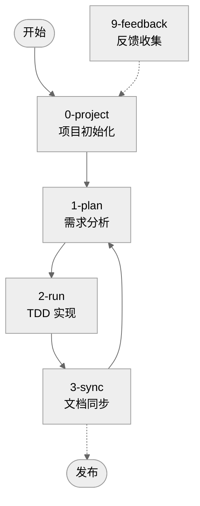
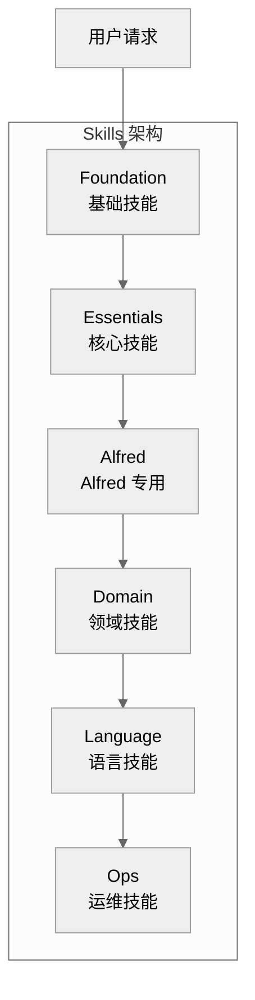
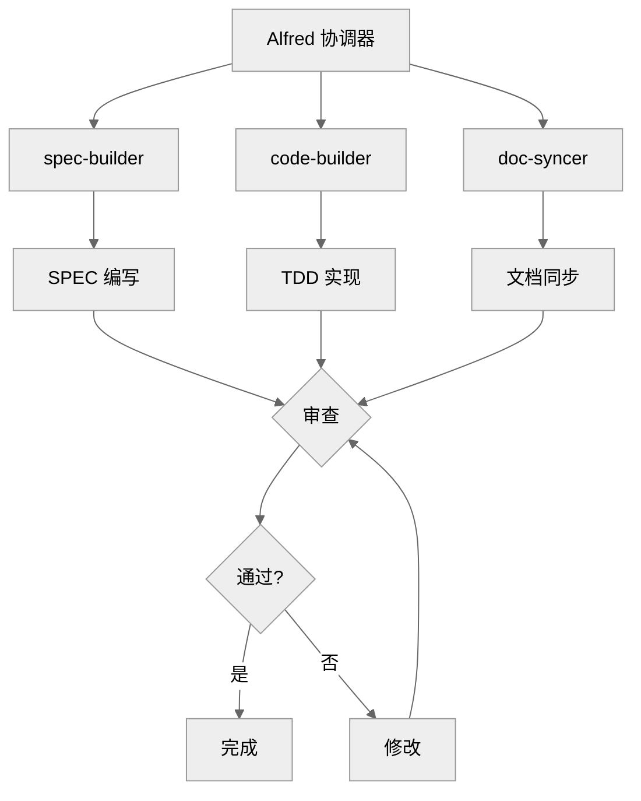

# Alfred 超级代理指南

Alfred 是 MoAI-ADK 的核心，一个由多个专业 AI 代理组成的协作系统，负责协调整个开发流程。

## Alfred 概览

### 什么是 Alfred？

Alfred 不是单个 AI，而是一个**超级代理系统**，由以下组件构成：

- **19 个专业子代理**：负责不同领域的专业任务
- **74 个 Claude Skills**：提供特定领域的知识和最佳实践
- **5 个自动化 Hooks**：在关键节点自动执行任务
- **统一的协调机制**：确保所有组件协同工作

### Alfred 的设计理念

#### 1. 协作优于单体
Alfred 采用多代理协作模式，而不是试图用一个 AI 做所有事情。每个代理都有明确的专业领域和职责。

#### 2. 自动化优先
Alfred 尽可能自动化重复性任务，让开发者专注于创造性工作。

#### 3. 透明可追踪
Alfred 的所有决策和操作都有记录，通过 @TAG 系统保持完全可追踪。

#### 4. 渐进式披露
Alfred 只在需要时加载相关知识和技能，避免上下文过载。

### Alfred 的核心优势

| 优势 | 说明 | 实际价值 |
|------|------|----------|
| **专业知识** | 每个代理都是领域专家 | 高质量的解决方案 |
| **协作效率** | 多代理并行工作 | 更快的开发速度 |
| **质量保证** | 自动应用 TRUST 原则 | 可靠的代码质量 |
| **学习适应** | 从项目中学习 | 个性化体验 |
| **完整追踪** | @TAG 系统覆盖全程 | 完全的可追溯性 |

---

## Alfred 命令系统

Alfred 通过 4 个核心命令提供完整的开发工作流程：

### 命令概览



### 命令详细说明

#### `/alfred:0-project` - 项目初始化
**用途**：新项目设置或现有项目配置更新

**三种模式**：
1. **默认模式**：智能自动检测
2. **Setting 模式**：修改现有设置
3. **Update 模式**：模板优化

#### `/alfred:1-plan` - 需求分析
**用途**：将用户需求转换为结构化 SPEC

**输出**：
- EARS 格式的 SPEC 文档
- 验收标准
- 风险评估
- 实现计划

#### `/alfred:2-run` - TDD 实现
**用途**：执行完整的测试驱动开发流程

**阶段**：
1. **Implementation Planning**：设计实现方案
2. **TDD Cycle**：RED → GREEN → REFACTOR
3. **Quality Gate**：TRUST 5 原则验证

#### `/alfred:3-sync` - 文档同步
**用途**：同步所有文档和验证完整性

**任务**：
- 生成 API 文档
- 更新 README 和 CHANGELOG
- 验证 @TAG 链完整性
- 生成同步报告

#### `/alfred:9-feedback` - 反馈收集
**用途**：快速创建 GitHub Issues 收集反馈

**类型**：
- Bug 报告
- 功能请求
- 改进建议
- 问题讨论

---

## Alfred 的代理团队

### 核心子代理（10个）

#### 1. project-manager（项目管理者）
**专业领域**：项目初始化和配置管理

**主要职责**：
- 收集项目元数据
- 配置开发环境
- 推荐合适的技能包
- 初始化项目结构

**触发时机**：
```bash
/alfred:0-project
```

**输出示例**：
```
✅ 项目初始化完成
✅ 配置保存到 .moai/config.json
✅ 开发环境配置完成
✅ 推荐技能包：Python + FastAPI + Testing
```

#### 2. spec-builder（规格构建者）
**专业领域**：需求分析和 SPEC 编写

**主要职责**：
- 分析用户需求
- 使用 EARS 语法编写 SPEC
- 设计验收标准
- 评估技术风险

**核心技能**：
- EARS 语法掌握
- 需求分析方法
- 风险评估技术
- 技术可行性分析

**触发时机**：
```bash
/alfred:1-plan "功能描述"
```

#### 3. code-builder（代码构建者）
**专业领域**：TDD 实现和质量保证

**主要职责**：
- 制定实现计划
- 执行 TDD 循环
- 应用 TRUST 原则
- 代码质量验证

**子组件**：
- **implementation-planner**：实现策略设计
- **tdd-implementer**：TDD 执行引擎

#### 4. doc-syncer（文档同步者）
**专业领域**：文档生成和同步

**主要职责**：
- 生成 API 文档
- 同步 README
- 更新 CHANGELOG
- 验证文档完整性

**文档类型**：
- Living Documents
- API 文档
- 用户指南
- 开发者文档

#### 5. tag-agent（标签代理）
**专业领域**：@TAG 系统管理

**主要职责**：
- @TAG 分配和验证
- 孤立 TAG 检测
- TAG 链完整性验证
- TAG 规则执行

**验证规则**：
- TAG 格式正确性
- TAG 链完整性
- TAG 分配一致性
- 孤立 TAG 检测

#### 6. git-manager（Git 管理者）
**专业领域**：版本控制和工作流程管理

**主要职责**：
- Git 工作流自动化
- 分支管理
- 提交信息规范化
- PR 管理

**工作流程**：
- Feature Branch 创建
- TDD Commit 模式
- Draft → Ready 状态转换
- Auto Merge 策略

#### 7. debug-helper（调试助手）
**专业领域**：问题诊断和解决方案

**主要职责**：
- 错误分析
- 调试策略制定
- 性能问题诊断
- 解决方案推荐

**诊断能力**：
- 错误日志分析
- 性能瓶颈识别
- 依赖问题解决
- 配置问题修复

#### 8. trust-checker（信任检查者）
**专业领域**：TRUST 5 原则验证

**主要职责**：
- 测试覆盖率检查
- 代码可读性验证
- 架构一致性检查
- 安全性评估

**验证标准**：
- Test First: ≥85% 覆盖率
- Readable: 代码风格检查
- Unified: 架构一致性
- Secured: 安全检查
- Trackable: @TAG 完整性

#### 9. quality-gate（质量门禁）
**专业领域**：发布前质量检查

**主要职责**：
- 发布条件验证
- 性能回归检查
- 安全漏洞扫描
- 依赖合规性检查

**检查项目**：
- 测试通过率
- 性能基准
- 安全扫描结果
- 文档完整性

#### 10. cc-manager（Claude Code 管理者）
**专业领域**：Claude Code 会话和配置管理

**主要职责**：
- Claude Code 配置优化
- 会话状态管理
- Hooks 配置和维护
- MCP 服务器管理

### 专家代理（4个）

专家代理根据项目需求自动激活：

#### 1. backend-expert（后端专家）
**激活关键字**：`backend`, `api`, `server`, `database`, `deployment`, `authentication`

**专业领域**：
- API 设计和架构
- 数据库设计和优化
- 微服务架构
- 性能优化策略
- 安全最佳实践

**典型贡献**：
```yaml
API 设计建议:
- 遵循 RESTful 设计原则
- 实现适当的 HTTP 状态码
- 设计清晰的错误响应格式
- 考虑 API 版本管理策略
```

#### 2. frontend-expert（前端专家）
**激活关键字**：`frontend`, `ui`, `page`, `component`, 'client-side', 'web interface'

**专业领域**：
- 组件设计和架构
- 状态管理策略
- 性能优化技术
- 用户体验设计
- 可访问性实现

**典型贡献**：
```yaml
前端架构建议:
- 采用组件化设计模式
- 实现统一的状态管理
- 优化首屏加载性能
- 确保跨浏览器兼容性
```

#### 3. devops-expert（运维专家）
**激活关键字**：`deployment`, `docker`, `kubernetes`, 'ci/cd', 'pipeline', 'aws'

**专业领域**：
- 容器化部署
- CI/CD 流水线设计
- 基础设施即代码
- 监控和日志系统
- 云原生架构

**典型贡献**：
```yaml
DevOps 策略:
- 设计多阶段 CI/CD 流水线
- 实现基础设施即代码
- 配置监控和告警系统
- 制定灾难恢复计划
```

#### 4. ui-ux-expert（UI/UX 专家）
**激活关键字**：`design`, `ux`, `accessibility`, 'a11y', 'figma', 'design system'

**专业领域**：
- 用户界面设计
- 用户体验优化
- 可访问性设计
- 设计系统构建
- 用户研究方法

**典型贡献**：
```yaml
UX 设计建议:
- 遵循 WCAG 2.2 可访问性指南
- 设计一致的用户界面
- 优化用户交互流程
- 进行用户测试和反馈收集
```

---

## Alfred 的技能库

### Skills 架构

Alfred 的技能库采用 4 层架构，支持渐进式加载：



### Foundation Skills（基础技能）

核心 TRUST/TAG/SPEC/Git/EARS/Language 原则：

#### moai-foundation-trust
**功能**：TRUST 5 原则验证和指导

**应用场景**：
- 代码质量检查
- 架构设计评估
- 安全性验证
- 可追踪性确认

#### moai-foundation-tags
**功能**：@TAG 系统管理和验证

**应用场景**：
- TAG 分配和验证
- 孤立 TAG 检测
- TAG 链完整性检查
- TAG 规则执行

#### moai-foundation-specs
**功能**：SPEC 文档编写和验证

**应用场景**：
- EARS 语法应用
- SPEC 结构验证
- 需求分析指导
- 验收标准设计

#### moai-foundation-ears
**功能**：EARS 语法指导和应用

**应用场景**：
- 需求编写指导
- EARS 模式选择
- 语法正确性验证
- 需求清晰度评估

#### moai-foundation-git
**功能**：Git 工作流自动化

**应用场景**：
- 分支策略管理
- 提交信息规范化
- PR 工作流自动化
- 发布流程管理

#### moai-foundation-langs
**功能**：项目语言和框架自动检测

**应用场景**：
- 语言识别
- 框架检测
- 工具推荐
- 配置生成

### Essentials Skills（核心技能）

日常开发核心工具：

#### moai-essentials-debug
**功能**：调试技巧和问题解决

**核心能力**：
- 错误日志分析
- 调试策略制定
- 性能问题诊断
- 解决方案推荐

#### moai-essentials-perf
**功能**：性能优化和分析

**核心能力**：
- 性能瓶颈识别
- 优化策略制定
- 监控指标设计
- 性能测试执行

#### moai-essentials-refactor
**功能**：代码重构和改进

**核心能力**：
- 代码味道识别
- 重构策略制定
- 设计模式应用
- 代码质量提升

#### moai-essentials-review
**功能**：代码审查和质量检查

**核心能力**：
- 代码质量评估
- 最佳实践检查
- 安全问题识别
- 改进建议提供

### Alfred Skills（Alfred 专用）

MoAI-ADK 内部工作流程自动化：

#### moai-alfred-workflow-core
**功能**：4 步工作流程执行

**核心流程**：
- Project 初始化
- Plan 需求分析
- Run TDD 实现
- Sync 文档同步

#### moai-alfred-best-practices
**功能**：TRUST 5 原则和质量门禁

**实践内容**：
- 代码质量标准
- 测试策略指导
- 安全最佳实践
- 文档规范要求

#### moai-alfred-ask-user-questions
**功能**：标准化用户交互

**交互类型**：
- 项目配置收集
- 需求澄清
- 决策支持
- 反馈收集

### Domain Skills（领域技能）

特定领域专业知识：

#### moai-domain-backend
**专业领域**：后端架构和开发

**核心知识**：
- API 设计模式
- 数据库设计原则
- 微服务架构
- 性能优化策略

#### moai-domain-frontend
**专业领域**：前端开发

**核心知识**：
- 组件设计模式
- 状态管理策略
- 性能优化技术
- 用户体验设计

#### moai-domain-security
**专业领域**：安全工程

**核心知识**：
- OWASP Top 10
- 安全编码实践
- 加密和认证
- 安全测试方法

#### moai-domain-database
**专业领域**：数据库设计和管理

**核心知识**：
- 数据建模原则
- 查询优化
- 事务管理
- 数据迁移策略

### Language Skills（语言技能）

编程语言特定最佳实践：

#### 高级语言技能（5个）
- **moai-lang-python**：Python 3.13+, FastAPI, pytest
- **moai-lang-typescript**：TypeScript 5.6+, React 19, Next.js
- **moai-lang-go**：Go 1.24+, 微服务, 并发编程
- **moai-lang-rust**：Rust 1.91+, 系统编程, 内存安全
- **moai-lang-javascript**：Node.js 22.x, 现代 JavaScript

#### 模板语言技能（13个）
- **moai-lang-java**：Java, Spring Boot, Maven
- **moai-lang-kotlin**：Kotlin, Android, Coroutines
- **moai-lang-swift**：Swift, iOS, Swift UI
- **moai-lang-csharp**：C#, .NET, ASP.NET
- **moai-lang-dart**：Dart, Flutter, Material Design
- **moai-lang-cpp**：C++17/20, 现代 C++
- **moai-lang-c**：C, POSIX, 嵌入式
- **moai-lang-ruby**：Ruby, Rails 8, RSpec
- **moai-lang-php**：PHP 8.4, Laravel, Composer
- **moai-lang-scala**：Scala, Akka, 函数式编程
- **moai-lang-sql**：SQL, 数据库, 查询优化
- **moai-lang-shell**：Shell, Bash, POSIX
- **moai-lang-r**：R, 数据科学, 统计分析

---

## Alfred 的工作流程

### 1. 上下文理解阶段

#### 信息收集
Alfred 首先收集和理解项目上下文：

```python
# Alfred 的上下文理解过程
def understand_context():
    context = {
        "project_config": read_config(".moai/config.json"),
        "project_structure": analyze_directory_structure(),
        "git_history": get_git_history(),
        "recent_changes": get_recent_changes(),
        "current_branch": get_current_branch(),
        "language_framework": detect_language_framework(),
        "dependencies": analyze_dependencies(),
        "test_coverage": get_test_coverage(),
        "spec_files": find_spec_files(),
        "active_features": get_active_features()
    }
    return context
```

#### 状态分析
基于收集的信息分析当前状态：

```yaml
状态分析报告:
项目状态: active
当前分支: feature/user-authentication
最后同步: 2 hours ago
测试覆盖率: 87%
待处理 SPEC: 2
已实现功能: 15
代码质量: A
```

### 2. 任务分解阶段

#### 需求解析
当收到用户请求时，Alfred 进行需求解析：

```python
def parse_user_request(request):
    parsed = {
        "intent": extract_intent(request),
        "scope": determine_scope(request),
        "complexity": assess_complexity(request),
        "dependencies": identify_dependencies(request),
        "risks": assess_risks(request),
        "estimated_effort": estimate_effort(request)
    }
    return parsed
```

#### 任务规划
基于解析结果制定详细任务计划：

```yaml
任务分解示例:
任务: 实现用户认证系统
子任务:
  - 需求分析和 SPEC 编写
  - 数据库模型设计
  - API 端点实现
  - 测试用例编写
  - 文档生成
  - 安全性验证
```

### 3. 团队组建阶段

#### 代理选择
根据任务需求选择合适的代理团队：

```python
def select_agent_team(task):
    team = []

    # 核心代理总是参与
    team.extend(["spec-builder", "code-builder", "doc-syncer"])

    # 根据任务类型添加专家代理
    if "api" in task.keywords:
        team.append("backend-expert")
    if "ui" in task.keywords:
        team.append("frontend-expert")
    if "security" in task.keywords:
        team.append("ui-ux-expert")  # 实际应该是 security-expert

    return team
```

#### 技能加载
为选定的代理加载相关技能：

```python
def load_skills(agents, task):
    skills = []

    for agent in agents:
        # 基础技能
        skills.extend(get_foundation_skills(agent))

        # 领域特定技能
        skills.extend(get_domain_skills(agent, task.domain))

        # 语言特定技能
        skills.extend(get_language_skills(agent, task.language))

    return skills
```

### 4. 执行协调阶段

#### 任务分配
Alfred 将任务分配给合适的代理：



#### 进度监控
实时监控任务执行进度：

```yaml
进度监控:
当前任务: SPEC-AUTH-001
状态: in_progress
完成度: 65%
预计完成: 15 minutes
质量指标:
  - 测试覆盖率: 0%
  - 代码质量: N/A
  - 文档完整性: 100%
```

### 5. 质量保证阶段

#### TRUST 验证
自动应用 TRUST 5 原则验证：

```python
def validate_trust_standards(artifacts):
    validation_results = {
        "test_first": check_test_coverage(artifacts),
        "readable": check_code_readability(artifacts),
        "unified": check_architecture_consistency(artifacts),
        "secured": check_security_measures(artifacts),
        "trackable": check_tag_completeness(artifacts)
    }
    return validation_results
```

#### 质量门禁
在完成前进行最终质量检查：

```yaml
质量门禁检查:
✅ 测试覆盖率: 87% (≥85%)
✅ 代码风格检查: 通过
✅ 安全扫描: 无高危漏洞
✅ 依赖检查: 无已知漏洞
✅ 文档完整性: 100%
✅ @TAG 链: 完整
✅ 性能基准: 通过

🎉 质量门禁通过，可以发布！
```

---

## 与 Alfred 的最佳实践

### 1. 指令使用最佳实践

#### 明确具体的指令
```bash
# ✅ 好的指令
/alfred:1-plan "创建用户认证系统，支持邮箱登录、密码重置和 JWT 令牌管理"

# <span class="material-icons">cancel</span> 模糊的指令
/alfred:1-plan "做个登录功能"
```

#### 提供充分的上下文
```bash
# ✅ 提供上下文
/alfred:2-run AUTH-001
# Alfred 会自动读取 SPEC-AUTH-001.md 了解详细需求

# <span class="material-icons">cancel</span> 缺少上下文
/alfred:2-run
# Alfred 不知道要实现什么
```

#### 渐进式开发
```bash
# ✅ 渐进式，小步骤
/alfred:1-plan "用户基础信息管理"
/alfred:2-run USER-001
/alfred:1-plan "用户权限管理"
/alfred:2-run USER-002

# <span class="material-icons">cancel</span> 一次性太多
/alfred:1-plan "完整的用户管理系统包括权限、角色、审批流程等"
```

### 2. 交互最佳实践

#### 及时反馈
当 Alfred 的输出不符合预期时：

```bash
# 提供建设性反馈
"这个 API 设计太复杂了，请简化为 RESTful 风格"
"测试覆盖率不够，请增加边界条件测试"
"文档过于技术化，请添加更多使用示例"
```

#### 寻求澄清
当不理解 Alfred 的建议时：

```bash
# 请求澄清和解释
"请解释为什么选择这种架构模式？"
"这个安全措施的具体实现方式是什么？"
"能提供更多的代码示例吗？"
```

#### 验证理解
确认对 Alfred 输出的理解：

```bash
# 确认理解
"所以您的建议是使用微服务架构，对吗？"
"我理解需要在 API 层添加验证，对吗？"
"您的意思是重构这个函数以提高可读性，对吗？"
```

### 3. 项目管理最佳实践

#### 定期同步
定期运行同步确保一致性：

```bash
# 每个功能完成后
/alfred:3-sync

# 每日工作开始前
/alfred:0-project status

# 发布前
/alfred:3-sync --full
```

#### 质量监控
持续监控项目质量：

```bash
# 检查项目健康状态
moai-adk doctor

# 验证 TRUST 标准
/alfred:3-sync --trust-check

# 生成质量报告
/alfred:3-sync --report
```

#### 反馈循环
建立持续改进的反馈循环：

```bash
# 报告问题和建议
/alfred:9-feedback

# 分享最佳实践
/alfred:9-feedback --type=improvement

# 请求新功能
/alfred:9-feedback --type=feature
```

---

## Alfred 的学习与适应

### 1. 项目学习

Alfred 从项目中学习，逐步提供更个性化的服务：

#### 学习机制
```python
def learn_from_project(project_data):
    learning = {
        "patterns": identify_patterns(project_data),
        "preferences": extract_preferences(project_data),
        "conventions": understand_conventions(project_data),
        "architecture": analyze_architecture(project_data)
    }
    update_knowledge_base(learning)
```

#### 个性化适配
基于学习结果调整行为：

```yaml
个性化适配示例:
代码风格:
  - 偏好使用 TypeScript 而不是 JavaScript
  - 习惯使用函数式编程模式
  - 倾向于使用特定的测试框架

架构偏好:
  - 偏好微服务架构
  - 习惯使用特定的设计模式
  - 倾向于使用特定数据库

工作流程:
  - 喜欢 TDD 开发模式
  - 重视文档完整性
  - 偏好频繁的代码审查
```

### 2. 持续改进

Alfred 通过反馈持续改进：

#### 反馈收集
```bash
# 通过多种渠道收集反馈
/alfred:9-feedback           # 主动反馈
行为分析                   # 使用模式分析
性能指标                   # 效率和质量指标
```

#### 知识更新
定期更新知识库：

```python
def update_knowledge():
    # 更新最佳实践
    update_best_practices()

    # 更新技术趋势
    update_technology_trends()

    # 更新安全标准
    update_security_standards()

    # 更新性能基准
    update_performance_benchmarks()
```

---

## 故障排除和调试

### 常见问题

#### 1. Alfred 响应缓慢
**症状**：命令执行时间过长

**原因**：
- 项目规模过大
- 上下文过多
- 网络连接问题

**解决方案**：
```bash
# 减少上下文
/alfred:0-project --clear-cache

# 分解大任务
/alfred:1-plan "小功能描述"

# 检查网络连接
ping github.com
```

#### 2. 输出质量不佳
**症状**：生成的代码或文档质量低

**原因**：
- 输入不够具体
- 上下文信息不足
- 需求理解偏差

**解决方案**：
```bash
# 提供更详细的输入
/alfred:1-plan "详细的功能描述，包括具体的验收标准"

# 添加上下文信息
/alfred:2-run SPEC-ID --context="additional context"

# 寻求澄清
"请确认您理解的需求是..."
```

#### 3. @TAG 系统错误
**症状**：TAG 链断裂或格式错误

**原因**：
- 手动编辑导致格式错误
- 文件移动导致引用失效
- TAG 分配冲突

**解决方案**：
```bash
# 修复 TAG 链
/alfred:3-sync --fix-tags

# 重新分配 TAG
/alfred:3-sync --reassign-tags

# 验证 TAG 完整性
/alfred:3-sync --verify-tags
```

### 调试技巧

#### 1. 启用详细日志
```bash
# 启用调试模式
export ALFRED_DEBUG=true
claude

# 或在命令中添加调试标志
/alfred:1-plan "描述" --debug
```

#### 2. 检查中间结果
```bash
# 检查 SPEC 生成结果
cat .moai/specs/SPEC-XXX/spec.md

# 检查实现计划
cat .moai/plans/PLAN-XXX.md

# 检查同步报告
cat .moai/reports/sync-report.md
```

#### 3. 分步执行
```bash
# 分步执行复杂的任务
/alfred:1-plan "第一步：基础功能"
/alfred:2-run SPEC-001
/alfred:1-plan "第二步：扩展功能"
/alfred:2-run SPEC-002
```

---

## 总结

Alfred 超级代理是 MoAI-ADK 的核心，通过多代理协作、专业技能和自动化工作流程，为开发者提供完整的 AI 驱动开发体验。

### 关键要点

1. **协作优于单体**：多个专业代理协同工作
2. **自动化优先**：减少重复性工作
3. **质量保证**：内置 TRUST 5 原则验证
4. **完全可追踪**：@TAG 系统覆盖全程
5. **持续学习**：从项目中学习并改进

### 下一步

- [深入学习 Alfred 命令](1-plan.md)
- [理解 TDD 工作流程](2-run.md)
- [掌握文档同步](3-sync.md)
- [学习反馈收集](9-feedback.md)

通过熟练掌握 Alfred，您可以充分利用 AI 的力量，创建高质量、可维护的软件项目。