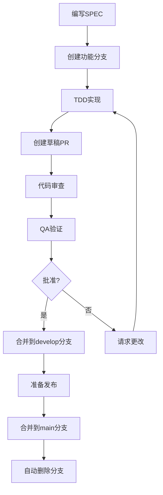
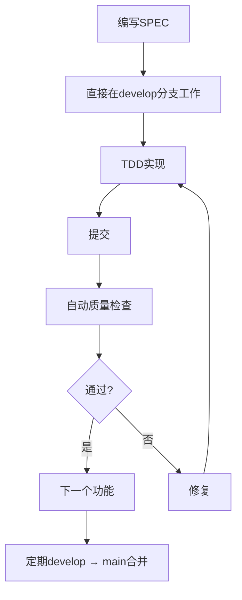

# 完整项目配置指南

详细说明MoAI-ADK项目所有配置选项的指南。涵盖从语言设置到GitHub集成、Agent优化以及个性化设置等项目配置的各个方面。

## 目录

01. [概述](#概述)
02. [核心配置文件](#核心配置文件)
03. [语言和本地化设置](#语言和本地化设置)
04. [项目元数据配置](#项目元数据配置)
05. [GitHub集成设置](#github集成设置)
06. [报告生成控制](#报告生成控制)
07. [Git工作流配置](#git工作流配置)
08. [Hook配置优化](#hook配置优化)
09. [Agent配置](#agent配置)
10. [TAG系统配置](#tag系统配置)
11. [TRUST 5原则配置](#trust-5原则配置)
12. [个性化设置](#个性化设置)
13. [配置文件备份与恢复](#配置文件备份与恢复)
14. [配置优化策略](#配置优化策略)
15. [故障排除](#故障排除)

## 概述

MoAI-ADK配置系统的核心设计理念是灵活性和可扩展性。除了简单的环境设置之外，您还可以控制从AI Agent行为到开发工作流程和团队协作方式的所有内容。

### 配置系统的核心原则

1. **分层结构**: 默认值 → 项目设置 → 用户个性化
2. **自动检测**: 自动检测尽可能多的设置
3. **渐进式披露**: 仅暴露必要的设置，最小化复杂性
4. **安全默认值**: 优先考虑安全性和稳定性的默认设置
5. **团队兼容性**: 个人设置不会破坏团队标准

### 配置文件结构

```
.moai/
├── config.json              # 主配置文件
├── user-config.json         # 用户个人设置（可选）
├── team-config.json         # 团队共同设置（可选）
└── environment-config.json  # 环境特定设置（可选）

.claude/
├── settings.json            # Claude Code配置
├── mcp.json                 # MCP服务器配置
└── permissions.json         # 权限设置（可选）
```

## 核心配置文件

### `.moai/config.json` - 主配置文件

管理所有核心项目设置的文件。

```json
{
  "version": "0.17.0",
  "moai": {
    "version": "0.17.0",
    "template_version": "0.17.0",
    "optimized": false,
    "auto_update": true
  },
  "language": {
    "conversation_language": "ko",
    "conversation_language_name": "한국어",
    "code_language": "python",
    "locale": "ko-KR",
    "timezone": "Asia/Seoul"
  },
  "project": {
    "name": "my-awesome-project",
    "description": "基于AI的创新项目",
    "owner": "username",
    "team": "development-team",
    "mode": "personal",
    "created_at": "2025-11-06T10:00:00Z",
    "updated_at": "2025-11-06T15:30:00Z",
    "domains": ["backend", "api", "database"],
    "tags": ["fastapi", "postgresql", "docker"],
    "visibility": "private"
  },
  "github": {
    "enabled": true,
    "repository": "username/my-awesome-project",
    "default_branch": "main",
    "auto_delete_branches": true,
    "spec_git_workflow": "feature_branch",
    "require_review": true,
    "auto_merge": false,
    "issue_sync": true,
    "release_automation": true
  },
  "report_generation": {
    "enabled": true,
    "level": "minimal",
    "formats": ["markdown"],
    "auto_commit": true,
    "include_metrics": true,
    "include_changelog": true,
    "max_file_size_kb": 100
  },
  "hooks": {
    "timeout_seconds": 5,
    "auto_checkpoint": true,
    "risk_detection": true,
    "tag_validation": true,
    "auto_linting": true,
    "session_recording": true
  },
  "tags": {
    "policy": "strict",
    "auto_validation": true,
    "format": "@TYPE:DOMAIN-NNN",
    "required_types": ["SPEC", "TEST", "CODE", "DOC"],
    "auto_assignment": true,
    "orphan_detection": true
  },
  "constitution": {
    "trust_principles": true,
    "tdd_workflow": true,
    "spec_first": true,
    "code_review_required": false,
    "documentation_required": true
  },
  "ai": {
    "default_model": "claude-3-5-sonnet-20241022",
    "fast_model": "claude-3-5-haiku-20241022",
    "max_tokens": 100000,
    "temperature": 0.1,
    "timeout": 300,
    "retry_attempts": 3
  },
  "security": {
    "scan_dependencies": true,
    "scan_secrets": true,
    "require_authentication": false,
    "audit_log": true,
    "encryption_at_rest": false
  },
  "performance": {
    "parallel_processing": true,
    "cache_enabled": true,
    "cache_ttl": 3600,
    "memory_limit_mb": 1024,
    "concurrent_agents": 3
  }
}
```

### `.claude/settings.json` - Claude Code配置

控制Claude Code行为的配置文件。

```json
{
  "models": {
    "default": "claude-3-5-sonnet-20241022",
    "fast": "claude-3-5-haiku-20241022",
    "reasoning": "claude-3-5-sonnet-20241022"
  },
  "permissions": {
    "allow": [
      "Read(*)",
      "Write(src/*, tests/*, docs/*, .moai/*)",
      "Bash(git status, git log, git diff, pytest, python, uv, node, npm)",
      "Grep(*), Glob(*), Edit(*), Bash(*, cd, ls, mkdir, echo, cat)"
    ],
    "ask": [
      "Bash(git push, git merge, git pull, rm -rf)",
      "Write(.claude/*, .moai/config.json, .env*)",
      "Bash(sudo, docker exec)"
    ],
    "deny": [
      "Bash(sudo rm, dd, mkfs, format)",
      "Write(*.key, *.pem, id_rsa)",
      "Bash(curl -X DELETE, wget -qO-)"
    ]
  },
  "hooks": {
    "SessionStart": ["alfred-hooks"],
    "PreToolUse": ["alfred-hooks"],
    "UserPromptSubmit": ["alfred-hooks"],
    "PostToolUse": ["alfred-hooks"],
    "SessionEnd": ["alfred-hooks"],
    "timeout": 5
  },
  "environment": {
    "PYTHONPATH": "${CLAUDE_PROJECT_DIR}/src",
    "MOAI_PROJECT_ROOT": "${CLAUDE_PROJECT_DIR}",
    "PATH": "${CLAUDE_PROJECT_DIR}/.venv/bin:${PATH}"
  },
  "ui": {
    "theme": "dark",
    "font_size": 14,
    "line_numbers": true,
    "word_wrap": true,
    "auto_save": true
  },
  "features": {
    "auto_completion": true,
    "syntax_highlighting": true,
    "inline_errors": true,
    "quick_actions": true
  },
  "experimental": {
    "multimodal": false,
    "advanced_reasoning": true,
    "context_compression": true
  }
}
```

## 语言和本地化设置

### 语言配置选项

#### conversation_language (对话语言)

用于与Alfred进行所有交互的语言。

```json
{
  "language": {
    "conversation_language": "ko",
    "conversation_language_name": "한국어",
    "supported_languages": {
      "ko": "한국어",
      "en": "English",
      "ja": "日本語",
      "zh": "中文",
      "es": "Español"
    }
  }
}
```

**支持的语言**:

| 代码 | 语言 | 支持级别 | 备注                        |
| ---- | -------- | ------------- | ---------------------------- |
| ko   | 한국어   | 完整      | 默认语言             |
| en   | English  | 完整      | 全球标准              |
| ja   | 日本語   | 完整      | 日语支持             |
| zh   | 中文     | 完整      | 简体中文/繁体中文 |
| es   | Español  | 完整      | 西班牙语支持              |
| fr   | Français | 部分       | 法语（开发中）      |
| de   | Deutsch  | 部分       | 德语（开发中）      |

#### code_language (编程语言)

项目的主要编程语言设置。

```json
{
  "language": {
    "code_language": "python",
    "auto_detection": true,
    "fallback": "python",
    "multi_language": {
      "enabled": false,
      "primary": "python",
      "secondary": ["javascript", "sql"]
    }
  }
}
```

**支持的编程语言**:

| 语言   | 自动检测文件                          | 默认工具            | 模板支持 |
| ---------- | ------------------------------------------ | ------------------------ | ---------------- |
| python     | pyproject.toml, setup.py, requirements.txt | pytest, ruff, mypy       | ✅               |
| javascript | package.json, yarn.lock                    | jest, eslint, prettier   | ✅               |
| typescript | tsconfig.json, package.json                | typescript, eslint, prettier | ✅           |
| go         | go.mod, go.sum                             | go test, golint, gofmt   | ✅               |
| rust       | Cargo.toml                                 | cargo test, clippy, rustfmt | ✅            |
| java       | pom.xml, build.gradle                      | junit, maven, gradle     | ✅               |
| kotlin     | build.gradle.kts                           | junit, ktlint            | ✅               |
| ruby       | Gemfile                                    | rspec, rubocop           | ✅               |
| php        | composer.json                              | phpunit, phpstan         | ✅               |
| csharp     | *.csproj, *.sln                            | xunit, dotnet            | ✅               |
| sql        | *.sql, schema.sql                          | -                        | ⚠️ 有限      |

#### locale设置

配置本地化相关格式规则。

```json
{
  "language": {
    "locale": "ko-KR",
    "timezone": "Asia/Seoul",
    "date_format": "YYYY-MM-DD",
    "time_format": "HH:mm:ss",
    "currency": "KRW",
    "number_format": {
      "decimal_separator": ".",
      "thousands_separator": ","
    }
  }
}
```

### 语言配置优化

#### 自动语言检测

```python
# .claude/hooks/alfred/utils/language_detector.py
import os
from pathlib import Path

def detect_project_language(project_dir: Path) -> dict:
    """自动检测项目语言"""
    indicators = {
        'python': ['pyproject.toml', 'setup.py', 'requirements.txt', 'Pipfile'],
        'javascript': ['package.json', 'yarn.lock', 'package-lock.json'],
        'typescript': ['tsconfig.json', 'package.json'],
        'go': ['go.mod', 'go.sum'],
        'rust': ['Cargo.toml'],
        'java': ['pom.xml', 'build.gradle'],
        'ruby': ['Gemfile', 'Rakefile'],
        'php': ['composer.json', 'composer.lock']
    }

    project_files = os.listdir(project_dir)

    for language, files in indicators.items():
        if any(file in project_files for file in files):
            return {
                'detected_language': language,
                'confidence': 'high',
                'indicators': [f for f in files if f in project_files]
            }

    return {'detected_language': 'python', 'confidence': 'low'}
```

#### 多语言项目配置

```json
{
  "language": {
    "multi_language": {
      "enabled": true,
      "primary": "python",
      "secondary": ["javascript", "sql"],
      "bridging": {
        "enabled": true,
        "apis": ["grpc", "rest"],
        "data_formats": ["json", "protobuf"]
      }
    },
    "documentation": {
      "primary": "ko",
      "secondary": ["en"],
      "auto_translation": false
    }
  }
}
```

## 项目元数据配置

### 基本项目信息

```json
{
  "project": {
    "name": "my-awesome-project",
    "display_name": "My Awesome Project",
    "description": "基于AI的创新Web应用程序",
    "short_description": "AI驱动的Web应用",
    "version": "1.0.0",
    "owner": "username",
    "team": "development-team",
    "organization": "company-name",
    "license": "MIT",
    "homepage": "https://github.com/username/my-awesome-project",
    "repository": "https://github.com/username/my-awesome-project.git",
    "documentation": "https://docs.my-awesome-project.com",
    "created_at": "2025-11-06T10:00:00Z",
    "updated_at": "2025-11-06T15:30:00Z"
  }
}
```

### 项目分类

```json
{
  "project": {
    "type": "web-api",
    "category": "backend",
    "domains": ["backend", "api", "database", "security"],
    "tags": ["fastapi", "postgresql", "docker", "jwt", "rest"],
    "technologies": [
      {
        "name": "Python",
        "version": "3.13",
        "type": "language"
      },
      {
        "name": "FastAPI",
        "version": "0.104",
        "type": "framework"
      },
      {
        "name": "PostgreSQL",
        "version": "15",
        "type": "database"
      }
    ],
    "platforms": ["linux", "macos", "windows"],
    "target_environments": ["development", "staging", "production"]
  }
}
```

### 项目模式配置

```json
{
  "project": {
    "mode": "team",
    "visibility": "private",
    "access_level": "internal",
    "collaboration": {
      "enabled": true,
      "team_size": 5,
      "review_policy": "required",
      "approval_policy": "majority"
    },
    "compliance": {
      "standards": ["ISO27001", "SOC2"],
      "audit_required": true,
      "data_classification": "confidential"
    }
  }
}
```

**项目模式类型**:

| 模式        | 描述        | 适用情况      | 功能                            |
| ----------- | ------------------ | ------------------------ | ----------------------------------- |
| personal    | 个人项目   | 个人开发、学习 | 简单设置、快速开始      |
| team        | 团队项目       | 小型团队开发   | 协作功能、代码审查 |
| enterprise  | 企业项目 | 大型组织 | 安全、合规、审计     |
| open-source | 开源项目 | 公共项目         | 社区、透明度、许可  |

## GitHub集成设置

### 基本GitHub配置

```json
{
  "github": {
    "enabled": true,
    "repository": "username/my-awesome-project",
    "owner": "username",
    "default_branch": "main",
    "protected_branches": ["main", "develop"],
    "auto_delete_branches": true,
    "require_review": true,
    "auto_merge": false,
    "sync_issues": true,
    "sync_projects": true
  }
}
```

### Git工作流配置

```json
{
  "github": {
    "spec_git_workflow": "feature_branch",
    "branch_strategy": {
      "main": {
        "protected": true,
        "require_reviews": 2,
        "require_status_checks": ["ci/cd", "quality-gate"],
        "enforce_admins": true
      },
      "develop": {
        "protected": false,
        "auto_merge": true,
        "require_status_checks": ["lint", "test"]
      },
      "feature": {
        "naming_pattern": "feature/{spec-id}-{description}",
        "auto_create": true,
        "from_spec": true
      }
    },
    "pull_request": {
      "template": ".github/PULL_REQUEST_TEMPLATE.md",
      "auto_assign_reviewers": true,
      "reviewers": ["team-lead", "senior-dev"],
      "require_up_to_date": true
    }
  }
}
```

**Git工作流选项**:

| 工作流       | 描述                   | 分支策略                        | PR策略       |
| -------------- | ----------------------------- | -------------------------------------- | --------------- |
| develop_direct | 直接提交到develop     | develop → main                          | 草稿PR        |
| feature_branch | 创建功能分支       | feature → develop → main                | 完整PR         |
| release_branch | 使用发布分支          | feature → develop → release → main      | 完整PR + QA    |
| gitflow        | 传统GitFlow           | feature → develop → release → main → hotfix | 复杂PR  |

### GitHub Actions集成

```json
{
  "github": {
    "actions": {
      "enabled": true,
      "workflows": [
        {
          "name": "ci.yml",
          "triggers": ["push", "pull_request"],
          "jobs": ["lint", "test", "build", "security-scan"]
        },
        {
          "name": "release.yml",
          "triggers": ["push:tags"],
          "jobs": ["build", "test", "publish", "deploy"]
        },
        {
          "name": "spec-sync.yml",
          "triggers": ["pull_request:opened", "pull_request:synchronize"],
          "jobs": ["spec-validation", "issue-sync"]
        }
      ],
      "secrets": {
        "required": ["GH_TOKEN", "DOCKER_REGISTRY_TOKEN"],
        "optional": ["SLACK_WEBHOOK", "NOTIFICATION_EMAIL"]
      }
    }
  }
}
```

### Issue和项目管理

```json
{
  "github": {
    "issue_management": {
      "auto_sync": true,
      "spec_to_issue": true,
      "labels": {
        "spec": ["spec", "planning"],
        "bug": ["bug", "priority-high"],
        "feature": ["enhancement", "priority-medium"],
        "documentation": ["documentation", "good-first-issue"]
      },
      "templates": {
        "bug_report": ".github/ISSUE_TEMPLATE/bug_report.md",
        "feature_request": ".github/ISSUE_TEMPLATE/feature_request.md",
        "spec": ".github/ISSUE_TEMPLATE/spec.md"
      }
    },
    "project_management": {
      "boards": ["Development", "Backlog", "In Review", "Done"],
      "auto_update": true,
      "sync_with_spec": true
    }
  }
}
```

## 报告生成控制

### 报告生成配置

```json
{
  "report_generation": {
    "enabled": true,
    "level": "minimal",
    "formats": ["markdown", "html"],
    "output_directory": ".moai/reports",
    "auto_commit": true,
    "schedule": {
      "enabled": false,
      "frequency": "weekly",
      "day": "friday",
      "time": "17:00"
    },
    "triggers": {
      "on_sync": true,
      "on_completion": true,
      "on_release": true,
      "manual_only": false
    }
  }
}
```

### 报告级别配置

| 级别         | 描述             | 生成的报告          | Token使用 |
| ------------- | ----------------------- | -------------------------- | ----------- |
| disable       | 不生成报告    | 无                       | 0%          |
| minimal       | 仅生成最小报告    | 同步摘要、TAG状态   | 20%         |
| standard      | 标准报告        | 同步、质量、覆盖率    | 60%         |
| comprehensive | 所有报告             | 所有分析、建议、预测 | 100% |

#### 最小级别报告

```markdown
# 同步报告 - 2025-11-06

## 摘要
- 已同步的SPEC: 3
- 生成的TAG: 12
- 质量验证: 通过

## 变更
- AUTH-001: 用户认证完成
- USER-002: 用户管理实现进行中
- API-003: API文档已更新

## 下一步
- 完成USER-002实现
- 需要审查API-003
```

#### 标准级别报告

```markdown
# 详细项目报告 - 2025-11-06

## 项目概述
- 名称: My Awesome Project
- 版本: 1.0.0
- 状态: 开发中

## 质量指标
- 测试覆盖率: 87.5%
- 代码质量评分: 92/100
- 安全评分: 95/100

## SPEC状态
| ID | 标题 | 状态 | 进度 |
|----|-------|--------|----------|
| AUTH-001 | 用户认证 | completed | 100% |
| USER-002 | 用户管理 | in_progress | 75% |
| API-003 | API文档 | draft | 30% |

## 建议
1. 改进USER-002的测试覆盖率
2. 明确API-003的验收标准
3. 建议缩短安全审查周期
```

### 报告格式配置

```json
{
  "report_generation": {
    "formats": {
      "markdown": {
        "enabled": true,
        "template": "default",
        "include_toc": true,
        "include_charts": false
      },
      "html": {
        "enabled": true,
        "theme": "light",
        "include_interactive_charts": true,
        "export_to_pdf": false
      },
      "json": {
        "enabled": true,
        "pretty_print": true,
        "include_metadata": true
      },
      "csv": {
        "enabled": false,
        "include_metrics_only": true
      }
    }
  }
}
```

## Git工作流配置

### 工作流策略选择

```json
{
  "github": {
    "spec_git_workflow": "feature_branch",
    "workflow_config": {
      "auto_create_branches": true,
      "branch_naming": "feature/{domain}-{id}",
      "auto_create_pr": true,
      "pr_template": "spec_template",
      "require_review": true,
      "auto_merge": false,
      "auto_delete_branches": true
    }
  }
}
```

### 分支策略详情

#### 功能分支工作流



```json
{
  "github": {
    "workflow": "feature_branch",
    "branches": {
      "main": {
        "protection": {
          "enabled": true,
          "required_status_checks": {
            "strict": true,
            "contexts": ["ci/cd", "quality-gate", "security-scan"]
          },
          "enforce_admins": true,
          "required_pull_request_reviews": {
            "required_approving_review_count": 2,
            "dismiss_stale_reviews": true,
            "require_code_owner_reviews": true
          }
        }
      },
      "develop": {
        "protection": {
          "enabled": false,
          "required_status_checks": {
            "contexts": ["lint", "test"]
          }
        }
      },
      "feature": {
        "pattern": "feature/{domain}-{id}",
        "auto_create": true,
        "source_branch": "develop",
        "delete_after_merge": true
      }
    }
  }
}
```

#### Develop直接工作流



```json
{
  "github": {
    "workflow": "develop_direct",
    "settings": {
      "main_branch": "main",
      "develop_branch": "develop",
      "sync_schedule": "daily",
      "auto_merge_develop_to_main": false,
      "require_manual_review_for_main": true
    },
    "quality_gates": {
      "test_coverage_threshold": 85,
      "code_quality_threshold": 90,
      "security_scan_required": true
    }
  }
}
```

### 提交消息配置

```json
{
  "github": {
    "commit_convention": "conventional_commits",
    "commit_templates": {
      "feature": "feat({scope}): {description}",
      "fix": "fix({scope}): {description}",
      "refactor": "refactor({scope}): {description}",
      "test": "test({scope}): {description}",
      "docs": "docs({scope}): {description}",
      "chore": "chore({scope}): {description}"
    },
    "auto_tag_commits": true,
    "require_issue_link": false,
    "max_commit_message_length": 72
  }
}
```

## Hook配置优化

### Hook系统概述

MoAI-ADK的Hook系统在开发流程的所有阶段自动运行，以提高生产力并确保质量。

```json
{
  "hooks": {
    "timeout_seconds": 5,
    "enabled_hooks": {
      "SessionStart": {
        "enabled": true,
        "actions": ["project_summary", "context_loading", "version_check"],
        "priority": "high"
      },
      "PreToolUse": {
        "enabled": true,
        "actions": ["risk_detection", "checkpoint_creation", "tag_validation"],
        "priority": "critical"
      },
      "UserPromptSubmit": {
        "enabled": true,
        "actions": ["jit_context_loading", "intent_analysis"],
        "priority": "medium"
      },
      "PostToolUse": {
        "enabled": true,
        "actions": ["auto_linting", "test_execution", "change_detection"],
        "priority": "medium"
      },
      "SessionEnd": {
        "enabled": true,
        "actions": ["session_summary", "context_persistence", "cleanup"],
        "priority": "low"
      }
    },
    "auto_checkpoint": {
      "enabled": true,
      "triggers": [
        "file_deletion",
        "large_file_modification",
        "config_changes",
        "git_merge_operations"
      ],
      "max_checkpoints": 10,
      "retention_days": 30
    }
  }
}
```

### SessionStart Hook

```python
# .claude/hooks/alfred/session_start.py
import json
import os
from datetime import datetime
from pathlib import Path

def main():
    """会话启动时总结项目状态"""
    project_dir = os.environ.get('CLAUDE_PROJECT_DIR')
    config_path = Path(project_dir) / '.moai' / 'config.json'

    if config_path.exists():
        with open(config_path) as f:
            config = json.load(f)

        # 打印项目信息
        print(f"📋 项目: {config['project']['name']}")
        print(f"🌍 语言: {config['language']['conversation_language_name']}")
        print(f"👤 所有者: {config['project']['owner']}")
        print(f"⚙️ 模式: {config['project']['mode']}")

        # SPEC状态摘要
        specs_dir = Path(project_dir) / '.moai' / 'specs'
        if specs_dir.exists():
            spec_count = len([d for d in specs_dir.iterdir() if d.is_dir()])
            print(f"📄 SPEC文档: {spec_count}")

        # 检查Git状态
        os.system('git status --porcelain | wc -l | xargs echo "🔄 已更改文件:"')

        # 最近活动
        print(f"🕐 最后更新: {config['project']['updated_at']}")
        print("✅ Alfred已就绪")

if __name__ == "__main__":
    main()
```

### PreToolUse Hook

```python
# .claude/hooks/alfred/pre_tool_use.py
import json
import os
import re
from pathlib import Path

def check_risk(operation: str, target: str) -> dict:
    """评估风险级别"""
    risk_patterns = {
        'high': [r'rm\s+-rf', r'sudo', r'format', r'dd\s+if='],
        'medium': [r'git\s+push\s+--force', r'merge', r'reset'],
        'low': [r'rm\s+', r'chmod', r'chown']
    }

    for risk_level, patterns in risk_patterns.items():
        for pattern in patterns:
            if re.search(pattern, operation, re.IGNORECASE):
                return {'level': risk_level, 'pattern': pattern}

    return {'level': 'safe'}

def validate_tags(file_path: str) -> list:
    """验证TAG存在"""
    if not file_path.endswith(('.py', '.js', '.ts', '.md')):
        return []

    with open(file_path, 'r') as f:
        content = f.read()

    # 搜索TAG模式
    tag_pattern = r'@(SPEC|TEST|CODE|DOC):[A-Z]+-\d+'
    tags = re.findall(tag_pattern, content)

    if not tags:
        file_type = file_path.split('/')[-2]  # src/, tests/, docs/
        expected_tag = {
            'src': '@CODE:',
            'tests': '@TEST:',
            'docs': '@DOC:',
            '.moai/specs': '@SPEC:'
        }.get(file_type, '')

        return [f"⚠️ TAG缺失: {file_path} (预期: {expected_tag})"]

    return []

def main():
    """PreToolUse Hook主逻辑"""
    tool_name = os.environ.get('CLAUDE_TOOL_NAME')
    tool_args = os.environ.get('CLAUDE_TOOL_ARGS', '')
    project_dir = os.environ.get('CLAUDE_PROJECT_DIR')

    # 风险评估
    risk = check_risk(tool_name, tool_args)
    if risk['level'] in ['high', 'medium']:
        print(f"⚠️ 检测到风险: {risk['level']} - {risk['pattern']}")
        if risk['level'] == 'high':
            response = input("继续? (y/N): ")
            if response.lower() != 'y':
                exit(1)

    # TAG验证（修改文件时）
    if tool_name in ['Write', 'Edit']:
        file_path = tool_args.split()[0] if tool_args else ''
        full_path = Path(project_dir) / file_path

        if full_path.exists():
            tag_issues = validate_tags(str(full_path))
            for issue in tag_issues:
                print(issue)

if __name__ == "__main__":
    main()
```

### PostToolUse Hook

```python
# .claude/hooks/alfred/post_tool_use.py
import json
import os
import subprocess
from pathlib import Path

def run_linting(file_path: str) -> dict:
    """根据文件类型运行自动linting"""
    if file_path.endswith('.py'):
        return run_python_linting(file_path)
    elif file_path.endswith(('.js', '.ts')):
        return run_js_linting(file_path)
    elif file_path.endswith(('.go')):
        return run_go_linting(file_path)

    return {'status': 'skipped', 'reason': 'unsupported_file_type'}

def run_python_linting(file_path: str) -> dict:
    """Python文件linting"""
    try:
        # ruff格式化
        result = subprocess.run(['ruff', 'format', file_path],
                              capture_output=True, text=True)

        if result.returncode != 0:
            return {'status': 'error', 'message': result.stderr}

        # ruff linting
        result = subprocess.run(['ruff', 'check', '--fix', file_path],
                              capture_output=True, text=True)

        if result.returncode != 0:
            return {'status': 'warning', 'message': result.stderr}

        return {'status': 'success', 'message': '格式化和linting完成'}

    except FileNotFoundError:
        return {'status': 'skipped', 'reason': 'ruff_not_installed'}

def run_tests_if_needed(file_path: str) -> dict:
    """自动运行相关测试"""
    if 'tests' not in file_path:
        return {'status': 'skipped', 'reason': 'not_test_file'}

    try:
        # 运行测试文件
        result = subprocess.run(['pytest', file_path, '-v'],
                              capture_output=True, text=True)

        return {
            'status': 'success' if result.returncode == 0 else 'failed',
            'output': result.stdout,
            'errors': result.stderr
        }

    except FileNotFoundError:
        return {'status': 'skipped', 'reason': 'pytest_not_installed'}

def main():
    """PostToolUse Hook主逻辑"""
    tool_name = os.environ.get('CLAUDE_TOOL_NAME')
    tool_args = os.environ.get('CLAUDE_TOOL_ARGS', '')
    project_dir = os.environ.get('CLAUDE_PROJECT_DIR')

    if tool_name in ['Write', 'Edit']:
        file_path = tool_args.split()[0] if tool_args else ''
        full_path = Path(project_dir) / file_path

        if full_path.exists():
            # 自动linting
            lint_result = run_linting(file_path)
            if lint_result['status'] == 'success':
                print(f"✨ {lint_result['message']}")

            # 运行测试（如果是测试文件）
            if 'tests' in file_path:
                test_result = run_tests_if_needed(file_path)
                if test_result['status'] == 'success':
                    print(f"✅ 测试通过")
                else:
                    print(f"❌ 测试失败")

if __name__ == "__main__":
    main()
```

## Agent配置

### AI模型设置

```json
{
  "ai": {
    "default_model": "claude-3-5-sonnet-20241022",
    "fast_model": "claude-3-5-haiku-20241022",
    "reasoning_model": "claude-3-5-sonnet-20241022",
    "multimodal_model": "claude-3-5-sonnet-20241022",
    "models": {
      "claude-3-5-sonnet-20241022": {
        "context_window": 200000,
        "max_output_tokens": 8192,
        "temperature": 0.1,
        "timeout": 300,
        "retry_attempts": 3,
        "cost_per_input_token": 0.000003,
        "cost_per_output_token": 0.000015
      },
      "claude-3-5-haiku-20241022": {
        "context_window": 200000,
        "max_output_tokens": 4096,
        "temperature": 0.0,
        "timeout": 120,
        "retry_attempts": 2,
        "cost_per_input_token": 0.00000025,
        "cost_per_output_token": 0.00000125
      }
    }
  }
}
```

### Agent特定设置

```json
{
  "agents": {
    "project_manager": {
      "model": "claude-3-5-sonnet-20241022",
      "temperature": 0.1,
      "max_tokens": 4000,
      "timeout": 180,
      "skills": ["project-init", "language-detection", "skill-recommendation"],
      "memory_retention": "session"
    },
    "spec_builder": {
      "model": "claude-3-5-sonnet-20241022",
      "temperature": 0.2,
      "max_tokens": 6000,
      "timeout": 240,
      "skills": ["ears-authoring", "requirement-analysis", "plan-board"],
      "expertise_domains": ["requirements-engineering", "system-design"]
    },
    "code_builder": {
      "model": "claude-3-5-sonnet-20241022",
      "temperature": 0.1,
      "max_tokens": 8000,
      "timeout": 300,
      "skills": ["tdd-implementation", "architecture-design", "code-review"],
      "sub_agents": ["implementation-planner", "tdd-implementer"]
    },
    "doc_syncer": {
      "model": "claude-3-5-haiku-20241022",
      "temperature": 0.0,
      "max_tokens": 4000,
      "timeout": 120,
      "skills": ["documentation-generation", "markdown-formatting", "api-docs"],
      "auto_sync": true
    }
  }
}
```

### 专家Agent设置

```json
{
  "expert_agents": {
    "backend_expert": {
      "enabled": true,
      "auto_activate": ["backend", "api", "server", "database"],
      "model": "claude-3-5-sonnet-20241022",
      "expertise": ["system-design", "scalability", "performance", "security"],
      "skills": ["api-design", "database-design", "caching-strategies", "microservices"],
      "response_style": "detailed",
      "code_examples": true
    },
    "frontend_expert": {
      "enabled": true,
      "auto_activate": ["frontend", "ui", "component", "client-side"],
      "model": "claude-3-5-sonnet-20241022",
      "expertise": ["react", "vue", "angular", "css", "accessibility"],
      "skills": ["component-design", "state-management", "performance-optimization"],
      "response_style": "practical",
      "include_ui_mockups": true
    },
    "security_expert": {
      "enabled": true,
      "auto_activate": ["security", "authentication", "authorization", "vulnerability"],
      "model": "claude-3-5-sonnet-20241022",
      "expertise": ["owasp-top-10", "encryption", "authentication", "audit"],
      "skills": ["threat-modeling", "security-review", "compliance"],
      "response_style": "cautious",
      "require_approval": false
    }
  }
}
```

### Agent优化设置

```json
{
  "agent_optimization": {
    "parallel_processing": true,
    "max_concurrent_agents": 3,
    "agent_timeout": 300,
    "memory_management": {
      "context_compression": true,
      "max_context_size": 150000,
      "priority_cutoff": 0.7
    },
    "cost_optimization": {
      "use_fast_model_for_simple_tasks": true,
      "cache_agent_responses": true,
      "cache_ttl": 3600,
      "max_cache_size_mb": 100
    },
    "performance_monitoring": {
      "track_response_times": true,
      "track_token_usage": true,
      "alert_on_slow_responses": true,
      "slow_response_threshold": 30
    }
  }
}
```

## TAG系统配置

### TAG策略设置

```json
{
  "tags": {
    "policy": "strict",
    "format": "@TYPE:DOMAIN-NNN",
    "required_types": ["SPEC", "TEST", "CODE", "DOC"],
    "auto_assignment": true,
    "validation": {
      "enabled": true,
      "enforce_uniqueness": true,
      "check_format": true,
      "validate_domain": true
    },
    "domains": {
      "AUTH": "认证和授权",
      "USER": "用户管理",
      "API": "API端点",
      "DB": "数据库",
      "UI": "用户界面",
      "SEC": "安全",
      "PERF": "性能",
      "DOCS": "文档"
    }
  }
}
```

### TAG生成规则

```json
{
  "tag_generation": {
    "auto_increment": true,
    "domain_reset": false,
    "padding": 3,
    "separator": "-",
    "examples": {
      "SPEC": "@SPEC:AUTH-001",
      "TEST": "@TEST:AUTH-001",
      "CODE": "@CODE:AUTH-001:SERVICE",
      "DOC": "@DOC:AUTH-001:API"
    }
  },
  "tag_mapping": {
    "file_patterns": {
      "src/**/*.py": "@CODE",
      "tests/**/*.py": "@TEST",
      "docs/**/*.md": "@DOC",
      ".moai/specs/**/spec.md": "@SPEC"
    },
    "content_patterns": {
      "test_*.py": "@TEST",
      "*_test.py": "@TEST",
      "conftest.py": "@TEST",
      "README.md": "@DOC",
      "CHANGELOG.md": "@DOC"
    }
  }
}
```

### TAG验证设置

```python
# .claude/hooks/alfred/core/tag_validator.py
import re
import json
from pathlib import Path
from typing import Dict, List, Optional

class TagValidator:
    def __init__(self, config_path: str):
        with open(config_path) as f:
            self.config = json.load(f)
        self.tag_policy = self.config.get('tags', {})

    def validate_tag_format(self, tag: str) -> Dict:
        """验证TAG格式"""
        pattern = self.tag_policy.get('format', r'@[A-Z]+:[A-Z]+-\d+')

        if not re.match(pattern, tag):
            return {
                'valid': False,
                'error': f'格式无效。预期: {pattern}',
                'tag': tag
            }

        return {'valid': True, 'tag': tag}

    def validate_tag_chain(self, project_dir: Path) -> Dict:
        """验证TAG链完整性"""
        spec_tags = self._find_tags(project_dir, pattern="@SPEC:")
        test_tags = self._find_tags(project_dir, pattern="@TEST:")
        code_tags = self._find_tags(project_dir, pattern="@CODE:")
        doc_tags = self._find_tags(project_dir, pattern="@DOC:")

        issues = []

        # 检查每个SPEC是否有对应的TEST、CODE、DOC
        for spec_tag in spec_tags:
            spec_id = self._extract_tag_id(spec_tag)

            test_match = any(spec_id in tag for tag in test_tags)
            code_match = any(spec_id in tag for tag in code_tags)
            doc_match = any(spec_id in tag for tag in doc_tags)

            if not test_match:
                issues.append(f"{spec_tag}缺少TEST标签")
            if not code_match:
                issues.append(f"{spec_tag}缺少CODE标签")
            if not doc_match:
                issues.append(f"{spec_tag}缺少DOC标签")

        # 查找孤立TAG
        orphan_tags = []
        all_spec_ids = {self._extract_tag_id(tag) for tag in spec_tags}

        for tag in test_tags + code_tags + doc_tags:
            tag_id = self._extract_tag_id(tag)
            if tag_id not in all_spec_ids:
                orphan_tags.append(tag)

        return {
            'valid': len(issues) == 0,
            'issues': issues,
            'orphan_tags': orphan_tags,
            'total_tags': len(spec_tags + test_tags + code_tags + doc_tags)
        }

    def _find_tags(self, directory: Path, pattern: str) -> List[str]:
        """在目录中搜索TAG模式"""
        tags = []
        regex_pattern = re.compile(pattern)

        for file_path in directory.rglob("*"):
            if file_path.is_file() and self._should_search_file(file_path):
                try:
                    with open(file_path, 'r', encoding='utf-8') as f:
                        content = f.read()
                        matches = regex_pattern.findall(content)
                        tags.extend(matches)
                except (UnicodeDecodeError, PermissionError):
                    continue

        return list(set(tags))

    def _should_search_file(self, file_path: Path) -> bool:
        """确定是否搜索文件"""
        exclude_patterns = {
            '.git', '__pycache__', 'node_modules', '.venv',
            '.DS_Store', '*.pyc', '*.log'
        }

        return not any(
            file_path.match(pattern) or pattern in str(file_path)
            for pattern in exclude_patterns
        )

    def _extract_tag_id(self, tag: str) -> str:
        """从TAG提取ID"""
        match = re.search(r'@[A-Z]+:([A-Z]+-\d+)', tag)
        return match.group(1) if match else tag
```

## TRUST 5原则配置

### TRUST原则激活

```json
{
  "constitution": {
    "trust_principles": {
      "enabled": true,
      "principles": {
        "test_first": {
          "enabled": true,
          "coverage_threshold": 85,
          "required_tests": ["unit", "integration"],
          "frameworks": {
            "python": ["pytest"],
            "javascript": ["jest"],
            "typescript": ["jest", "vitest"],
            "go": ["go test"]
          }
        },
        "readable": {
          "enabled": true,
          "max_function_lines": 50,
          "max_file_lines": 300,
          "naming_convention": "snake_case",
          "require_docstrings": true,
          "comment_coverage": 0.3
        },
        "unified": {
          "enabled": true,
          "architectural_consistency": true,
          "naming_consistency": true,
          "pattern_consistency": true,
          "code_style": "enforced"
        },
        "secured": {
          "enabled": true,
          "security_scan": true,
          "dependency_scan": true,
          "secret_detection": true,
          "input_validation": "required",
          "output_encoding": "required"
        },
        "trackable": {
          "enabled": true,
          "tag_system": "required",
          "git_history": "detailed",
          "change_tracking": "automatic",
          "decision_logging": "required"
        }
      }
    }
  }
}
```

### 质量门槛设置

```json
{
  "quality_gates": {
    "enabled": true,
    "gates": [
      {
        "name": "code_quality",
        "type": "static_analysis",
        "tools": ["ruff", "mypy", "security-scan"],
        "threshold": {
          "errors": 0,
          "warnings": 10,
          "suggestions": 50
        },
        "blocking": true
      },
      {
        "name": "test_coverage",
        "type": "test_analysis",
        "tools": ["pytest", "coverage"],
        "threshold": {
          "minimum_coverage": 85,
          "failed_tests": 0
        },
        "blocking": true
      },
      {
        "name": "security_scan",
        "type": "security_analysis",
        "tools": ["bandit", "safety"],
        "threshold": {
          "high_vulnerabilities": 0,
          "medium_vulnerabilities": 5
        },
        "blocking": true
      },
      {
        "name": "documentation",
        "type": "doc_analysis",
        "tools": ["doc_coverage"],
        "threshold": {
          "api_documentation": 100,
          "code_documentation": 80
        },
        "blocking": false
      }
    ],
    "auto_fix": {
      "enabled": true,
      "fixable_issues": ["formatting", "simple_linting"],
      "require_approval": false
    }
  }
}
```

## 个性化设置

### 用户配置文件设置

```json
{
  "user_profile": {
    "name": "用户姓名",
    "nickname": "开发者",
    "email": "user@example.com",
    "timezone": "Asia/Seoul",
    "preferred_working_hours": {
      "start": "09:00",
      "end": "18:00",
      "breaks": ["12:00-13:00"]
    },
    "communication_style": {
      "formality": "casual",
      "verbosity": "detailed",
      "language": "ko",
      "include_emoji": true
    },
    "expertise": {
      "primary": ["python", "backend", "api"],
      "secondary": ["docker", "database", "testing"],
      "learning": ["kubernetes", "machine_learning"]
    },
    "preferences": {
      "auto_suggestions": true,
      "code_examples": true,
      "step_by_step": true,
      "ask_before_major_changes": true
    }
  }
}
```

### 快捷键和宏设置

```json
{
  "shortcuts": {
    "command_shortcuts": {
      "qp": "/alfred:1-plan",
      "qr": "/alfred:2-run",
      "qs": "/alfred:3-sync",
      "q0": "/alfred:0-project",
      "doc": "/alfred:3-sync --docs-only",
      "test": "pytest -v",
      "lint": "ruff check && ruff format"
    },
    "text_macros": {
      "todo": "// TODO: ",
      "fixme": "// FIXME: ",
      "note": "// NOTE: ",
      "spec_template": "# `@SPEC:{DOMAIN}-{ID}: {TITLE}\\n\\n## 概述\\n\\n## 需求\\n\\n## 验收标准"
    },
    "workflow_shortcuts": {
      "new_feature": ["qp", "qr", "qs"],
      "bug_fix": ["qp --type=bug", "qr", "qs"],
      "refactor": ["qr --type=refactor", "qs"]
    }
  }
}
```

### AI响应风格设置

```json
{
  "ai_response_preferences": {
    "code_style": {
      "include_comments": true,
      "include_docstrings": true,
      "include_type_hints": true,
      "follow_project_conventions": true,
      "error_handling": "comprehensive"
    },
    "explanation_style": {
      "detail_level": "detailed",
      "include_examples": true,
      "include_alternatives": true,
      "include_rationale": true,
      "step_by_step": true
    },
    "interaction_style": {
      "ask_confirmations": true,
      "provide_options": true,
      "summarize_actions": true,
      "include_progress": true
    }
  }
}
```

## 配置文件备份与恢复

### 自动备份设置

```json
{
  "backup": {
    "enabled": true,
    "automatic": {
      "enabled": true,
      "schedule": "daily",
      "time": "02:00",
      "retention_days": 30,
      "max_backups": 10
    },
    "manual": {
      "enabled": true,
      "prompt_before_major_changes": true,
      "backup_before_sync": true
    },
    "storage": {
      "location": ".moai/backups",
      "compression": true,
      "encryption": false
    },
    "scope": {
      "include": [
        ".moai/config.json",
        ".claude/settings.json",
        ".moai/project/",
        ".moai/memory/"
      ],
      "exclude": [
        ".moai/reports/",
        ".moai/cache/",
        "*.log"
      ]
    }
  }
}
```

### 备份脚本

```bash
#!/bin/bash
# backup-config.sh

set -e

PROJECT_DIR="$(pwd)"
BACKUP_DIR=".moai/backups"
TIMESTAMP=$(date +"%Y%m%d_%H%M%S")
BACKUP_NAME="config_backup_${TIMESTAMP}"

echo "🔄 创建配置备份..."

# 创建备份目录
mkdir -p "${BACKUP_DIR}"

# 备份配置文件
tar -czf "${BACKUP_DIR}/${BACKUP_NAME}.tar.gz" \
    .moai/config.json \
    .claude/settings.json \
    .moai/project/ \
    .moai/memory/ \
    --exclude='.moai/reports/' \
    --exclude='.moai/cache/' \
    --exclude='*.log'

# 保存备份信息
cat > "${BACKUP_DIR}/${BACKUP_NAME}.info" << EOF_INFO
备份创建时间: $(date)
项目: $(basename $PROJECT_DIR)
Git分支: $(git branch --show-current 2>/dev/null || echo 'N/A')
Git提交: $(git rev-parse --short HEAD 2>/dev/null || echo 'N/A')
包含的文件:
- .moai/config.json
- .claude/settings.json
- .moai/project/
- .moai/memory/
EOF_INFO

echo "✅ 备份已创建: ${BACKUP_DIR}/${BACKUP_NAME}.tar.gz"

# 清理旧备份
cd "${BACKUP_DIR}"
ls -t config_backup_*.tar.gz | tail -n +11 | xargs -r rm
echo "🧹 旧备份已清理"
```

### 恢复脚本

```bash
#!/bin/bash
# restore-config.sh

set -e

BACKUP_DIR=".moai/backups"

# 显示备份列表
echo "📋 可用备份:"
ls -la "${BACKUP_DIR}"/config_backup_*.tar.gz | nl

if [ $# -eq 0 ]; then
    echo -n "选择备份编号 (1-${#BACKUPS}): "
    read -r SELECTION
else
    SELECTION=$1
fi

BACKUP_FILE=$(ls "${BACKUP_DIR}"/config_backup_*.tar.gz | sed -n "${SELECTION}p")

if [ ! -f "$BACKUP_FILE" ]; then
    echo "❌ 无效的备份选择"
    exit 1
fi

echo "🔄 从以下位置恢复: $(basename "$BACKUP_FILE")"

# 备份当前配置
TIMESTAMP=$(date +"%Y%m%d_%H%M%S")
PRE_RESTORE_BACKUP="pre_restore_${TIMESTAMP}"
tar -czf "${BACKUP_DIR}/${PRE_RESTORE_BACKUP}.tar.gz" \
    .moai/config.json \
    .claude/settings.json \
    .moai/project/ \
    .moai/memory/ \
    2>/dev/null || true

# 执行恢复
tar -xzf "$BACKUP_FILE" -C .

echo "✅ 配置已恢复"
echo "💾 恢复前备份: ${PRE_RESTORE_BACKUP}.tar.gz"
```

## 配置优化策略

### 性能优化

```json
{
  "performance": {
    "ai_optimization": {
      "context_compression": true,
      "max_context_tokens": 150000,
      "use_fast_model_for_simple_tasks": true,
      "simple_task_threshold": 1000,
      "cache_responses": true,
      "cache_ttl": 3600
    },
    "parallel_processing": {
      "enabled": true,
      "max_concurrent_agents": 3,
      "agent_timeout": 300,
      "load_balancing": "round_robin"
    },
    "memory_management": {
      "session_memory_limit": "1GB",
      "cache_cleanup_interval": 3600,
      "garbage_collection": "automatic"
    }
  }
}
```

### 成本优化

```json
{
  "cost_optimization": {
    "token_management": {
      "track_usage": true,
      "daily_limit": 1000000,
      "alert_threshold": 0.8,
      "cost_tracking": {
        "enabled": true,
        "currency": "USD",
        "monthly_budget": 100
      }
    },
    "model_selection": {
      "auto_optimize": true,
      "prefer_fast_model": true,
      "complexity_threshold": 0.7,
      "cost_threshold": 0.01
    },
    "caching": {
      "enabled": true,
      "intelligent_caching": true,
      "cache_hit_rate_target": 0.7,
      "cache_size_limit": "100MB"
    }
  }
}
```

### 工作流优化

```json
{
  "workflow_optimization": {
    "automation_level": "high",
    "auto_approve_safe_operations": true,
    "batch_similar_operations": true,
    "parallel_independent_tasks": true,
    "predictive_suggestions": true,
    "learning_from_history": true
  },
  "user_experience": {
    "response_time_target": 2000,
    "progress_indicators": true,
    "cancel_long_operations": true,
    "undo_functionality": true,
    "quick_actions": true
  }
}
```

## 故障排除

### 常见配置问题

#### 1. 配置文件损坏

**症状**:

```
错误: .moai/config.json中的JSON无效
```

**解决方案**:

```bash
# 从备份恢复
./restore-config.sh

# 或使用默认值重新生成
moai-adk init . --restore-config
```

#### 2. 权限问题

**症状**:

```
权限被拒绝: .claude/settings.json
```

**解决方案**:

```bash
# 修复权限
chmod 644 .moai/config.json
chmod 644 .claude/settings.json

# 检查所有权
ls -la .moai/ .claude/
```

#### 3. Hook不工作

**症状**:

```
Hook未响应
```

**解决方案**:

```bash
# 检查hook脚本
ls -la .claude/hooks/alfred/
chmod +x .claude/hooks/alfred/*.py

# 重启Claude Code
exit
claude
```

### 配置诊断工具

```bash
#!/bin/bash
# diagnose-config.sh

echo "🔍 MoAI-ADK配置诊断"
echo "======================================"

# 1. 检查基本文件是否存在
echo "📁 检查基本文件..."
files=(
    ".moai/config.json"
    ".claude/settings.json"
    ".claude/hooks/alfred/alfred_hooks.py"
    "CLAUDE.md"
)

for file in "${files[@]}"; do
    if [ -f "$file" ]; then
        echo "✅ $file 存在"
    else
        echo "❌ $file 缺失"
    fi
done

# 2. 验证JSON文件
echo -e "\n📋 验证JSON文件..."
for json_file in .moai/config.json .claude/settings.json; do
    if [ -f "$json_file" ]; then
        if python3 -c "import json; json.load(open('$json_file'))" 2>/dev/null; then
            echo "✅ $json_file 是有效的JSON"
        else
            echo "❌ $json_file 包含无效的JSON"
        fi
    fi
done

# 3. 检查权限
echo -e "\n🔐 检查权限..."
for file in .moai/config.json .claude/settings.json; do
    if [ -f "$file" ]; then
        permissions=$(stat -f "%Lp" "$file" 2>/dev/null || stat -c "%a" "$file" 2>/dev/null)
        if [ "$permissions" = "644" ]; then
            echo "✅ $file 具有正确的权限 ($permissions)"
        else
            echo "⚠️ $file 具有不寻常的权限 ($permissions)"
        fi
    fi
done

# 4. 检查hook脚本
echo -e "\n🪝 检查hooks..."
if [ -f ".claude/hooks/alfred/alfred_hooks.py" ]; then
    if [ -x ".claude/hooks/alfred/alfred_hooks.py" ]; then
        echo "✅ Hook脚本可执行"
    else
        echo "❌ Hook脚本不可执行"
        echo "   运行: chmod +x .claude/hooks/alfred/alfred_hooks.py"
    fi
else
    echo "❌ Hook脚本缺失"
fi

# 5. 检查版本兼容性
echo -e "\n🔍 检查版本兼容性..."
if [ -f ".moai/config.json" ]; then
    moai_version=$(python3 -c "import json; print(json.load(open('.moai/config.json')).get('moai', {}).get('version', 'unknown'))" 2>/dev/null)
    echo "📦 配置中的MoAI-ADK版本: $moai_version"

    current_version=$(moai-adk --version 2>/dev/null | cut -d' ' -f3 || echo "unknown")
    echo "📦 已安装的MoAI-ADK版本: $current_version"

    if [ "$moai_version" != "$current_version" ] && [ "$moai_version" != "unknown" ] && [ "$current_version" != "unknown" ]; then
        echo "⚠️ 检测到版本不匹配"
        echo "   运行: moai-adk update"
    fi
fi

echo -e "\n🎯 诊断完成!"
```

---
