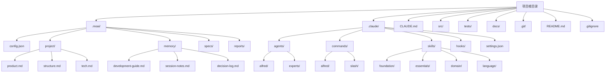

# 项目初始化完全指南

MoAI-ADK 项目初始化过程的详细指南。从新项目创建到现有项目添加,涵盖各种模板使用和问题解决的综合说明。

## 目录

1. [概述](#概述)
2. [前置要求](#前置要求)
3. [创建新项目](#创建新项目)
4. [添加到现有项目](#添加到现有项目)
5. [生成文件结构详解](#生成文件结构详解)
6. [.moai/ 目录深度分析](#moai-目录深度分析)
7. [.claude/ 目录深度分析](#claude-目录深度分析)
8. [按项目类型的模板](#按项目类型的模板)
9. [初始化自动化设置](#初始化自动化设置)
10. [初始化后验证](#初始化后验证)
11. [问题排除](#问题排除)
12. [最佳实践](#最佳实践)

## 概述

MoAI-ADK 的项目初始化超越简单的文件创建,是为 AI 辅助开发构建完整生态系统的过程。通过初始化可以获得:

- **Alfred SuperAgent**: 19 名 AI 专家团队和 56 个 Claude Skills
- **SPEC-First TDD**: 需求 → 测试 → 代码 → 文档的一致工作流
- **@TAG 系统**: 连接所有工件的可追溯性网络
- **自动化 Hook**: 不干扰开发流程的智能保护机制

### 初始化核心原则

1. **最小干预**: 用户仅需提供项目名称
2. **自动检测**: 自动识别语言、框架、结构
3. **渐进式设置**: 详细设置在 `/alfred:0-project` 中收集
4. **安全合并**: 安全集成到现有项目

## 前置要求

### 系统要求

| 项目 | 最低要求 | 推荐配置 |
|------|---------|---------|
| 操作系统 | Windows 10+, macOS 11+, Ubuntu 20.04+ | 最新 LTS 版本 |
| Python | 3.13+ | 3.13.0+ |
| Git | 2.25+ | 2.40+ |
| 内存 | 4GB RAM | 8GB+ RAM |
| 存储空间 | 1GB 可用空间 | 2GB+ 可用空间 |

### 必需工具安装

#### 1. UV 安装 (Python 包管理器)

UV 是 MoAI-ADK 的官方包管理器。

```bash
# macOS/Linux
curl -LsSf https://astral.sh/uv/install.sh | sh

# Windows (PowerShell)
powershell -c "irm https://astral.sh/uv/install.ps1 | iex"

# 验证安装
uv --version
```

#### 2. Git 安装和配置

```bash
# 验证安装
git --version

# 基本配置 (首次)
git config --global user.name "用户名"
git config --global user.email "email@example.com"

# Git 仓库初始化 (新项目)
git init
```

#### 3. MoAI-ADK 安装

```bash
# 通过 UV 安装 (推荐)
uv tool install moai-adk

# 或通过 pip 安装
pip install moai-adk

# 验证安装
moai-adk --version
```

### 可选工具

根据特定开发栈,推荐安装额外工具:

```bash
# Python 项目
uv add pytest ruff mypy black

# Node.js 项目
npm install --save-dev eslint prettier typescript

# Go 项目
go install github.com/golangci/golangci-lint/cmd/golangci-lint@latest

# Rust 项目
rustup component add clippy rustfmt
```

## 创建新项目

### 基本命令

```bash
# 创建新项目
moai-adk init <项目名称>

# 示例
moai-adk init my-awesome-app
cd my-awesome-app
```

### 高级选项

```bash
# 使用特定模板创建
moai-adk init my-app --template web-api

# 使用特定语言创建
moai-adk init my-app --language python

# 包含 MCP 服务器创建
moai-adk init my-app --with-mcp

# 详细信息输出
moai-adk init my-app --verbose

# 查看帮助
moai-adk init --help
```

### 初始化过程详解

#### 步骤 1: 收集项目信息

```bash
$ moai-adk init hello-world
🚀 MoAI-ADK v0.17.0 项目初始化开始...

📁 创建位置: /Users/username/projects/hello-world
⚙️ 模板: auto-detect (默认)
🌍 语言: 将自动检测
```

#### 步骤 2: 创建目录结构

```bash
📂 创建目录结构...
✅ .moai/ - MoAI-ADK 项目设置
✅ .claude/ - Claude Code 自动化
✅ src/ - 源代码目录
✅ tests/ - 测试目录
✅ docs/ - 文档目录
```

#### 步骤 3: 创建配置文件

```bash
⚙️  创建配置文件...
✅ .moai/config.json - 项目配置
✅ .moai/project/ - 项目信息
✅ .claude/settings.json - Claude Code 配置
✅ CLAUDE.md - 项目指南
```

#### 步骤 4: 安装代理和技能

```bash
🤖 设置 AI 代理...
✅ 16 个 Sub-agent 安装完成
✅ 74 个 Claude Skills 加载完成
✅ 5 个 Claude Code Hooks 激活
```

#### 步骤 5: 完成初始化

```bash
🎉 项目初始化完成!

📋 下一步:
1. cd hello-world
2. claude (执行 Claude Code)
3. /alfred:0-project (完成项目设置)

💡 提示: 使用 moai-adk doctor 命令可以检查系统状态。
```

## 添加到现有项目

可以将 MoAI-ADK 集成到正在进行的项目中。现有代码绝不会被修改。

### 基本集成

```bash
# 移动到现有项目目录
cd your-existing-project

# MoAI-ADK 初始化
moai-adk init .

# 或显式指定当前目录
moai-adk init . --force
```

### 集成前验证

```bash
# 检查项目结构
tree -L 2

# 检查 Git 状态
git status

# 备份必要文件 (可选)
cp -r . /backup/your-project-$(date +%Y%m%d)
```

### 集成过程

#### 步骤 1: 项目分析

```bash
🔍 分析现有项目...
✅ 检测到 Python 项目 (发现 pyproject.toml)
✅ 检测到 FastAPI 框架
✅ 已存在 25 个 Python 文件
⚠️  发现 tests/ 目录 (保留现有测试)
```

#### 步骤 2: 添加最少文件

```bash
📂 添加 MoAI-ADK 文件...
✅ .moai/ - 新创建
✅ .claude/ - 新创建
✅ CLAUDE.md - 新创建
⚠️  src/, tests/, docs/ 保留现有文件
```

#### 步骤 3: 优化设置

```bash
⚙️  针对现有项目优化设置...
✅ 语言: python (已检测)
✅ 框架: fastapi (已检测)
✅ 测试工具: pytest (保留现有设置)
✅ 文档格式: markdown (保留现有文档)
```

### 与现有项目集成示例

#### 现有结构
```
my-api/
├── app/
│   ├── main.py
│   ├── models/
│   └── routes/
├── tests/
│   ├── test_main.py
│   └── conftest.py
├── requirements.txt
├── README.md
└── .git/
```

#### 添加 MoAI-ADK 后的结构
```
my-api/
├── .moai/                    # ✅ 新添加
│   ├── config.json
│   ├── project/
│   ├── memory/
│   ├── specs/
│   └── reports/
├── .claude/                  # ✅ 新添加
│   ├── agents/
│   ├── commands/
│   ├── skills/
│   ├── hooks/
│   └── settings.json
├── CLAUDE.md                 # ✅ 新添加
├── app/                      # ✅ 保留现有
│   ├── main.py
│   ├── models/
│   └── routes/
├── tests/                    # ✅ 保留现有
│   ├── test_main.py
│   └── conftest.py
├── requirements.txt
├── README.md
└── .git/
```

## 生成文件结构详解

### 整体结构图



### 核心文件说明

#### 1. `.moai/config.json` - 项目核心

```json
{
  "version": "0.17.0",
  "moai": {
    "version": "0.17.0",
    "template_version": "0.17.0",
    "optimized": false
  },
  "language": {
    "conversation_language": "ko",
    "conversation_language_name": "한국어",
    "code_language": "python"
  },
  "project": {
    "name": "my-project",
    "description": "使用 MoAI-ADK 创建的项目",
    "owner": "username",
    "mode": "personal",
    "created_at": "2025-11-06T10:00:00Z",
    "domains": ["backend"]
  },
  "github": {
    "enabled": false,
    "auto_delete_branches": true,
    "spec_git_workflow": "develop_direct"
  },
  "report_generation": {
    "enabled": false,
    "level": "minimal"
  },
  "hooks": {
    "timeout_seconds": 5
  },
  "tags": {
    "policy": "strict",
    "auto_validation": true
  },
  "constitution": {
    "trust_principles": true,
    "tdd_workflow": true,
    "spec_first": true
  }
}
```

#### 2. `.moai/project/` - 项目元数据

##### `product.md` - 产品愿景
```markdown
# 产品愿景

## 概述
定义项目的核心价值和目标。

## 目标用户
- 定义主要用户群体
- 用户需求和痛点

## 核心功能
- 产品提供的主要功能
- 差异化价值主张

## 成功指标
- 衡量产品成功的 KPI
- 短期和长期目标
```

##### `structure.md` - 项目结构
```markdown
# 项目结构

## 目录结构
```
src/
├── core/           # 核心业务逻辑
├── api/            # API 端点
├── models/         # 数据模型
├── services/       # 服务层
└── utils/          # 工具函数
```

## 架构模式
- 使用的架构模式 (MVC, 清洁架构等)
- 各层职责和交互

## 数据流
- 主要数据流说明
- 与外部系统的集成方式
```

##### `tech.md` - 技术栈
```markdown
# 技术栈

## 核心技术
- **语言**: Python 3.13
- **框架**: FastAPI
- **数据库**: PostgreSQL
- **测试**: pytest

## 开发工具
- **包管理**: uv
- **代码格式化**: black, ruff
- **类型检查**: mypy
- **文档**: Sphinx

## 基础设施
- **部署**: Docker
- **CI/CD**: GitHub Actions
- **监控**: Prometheus + Grafana
```

#### 3. `.claude/settings.json` - Claude Code 配置

```json
{
  "models": {
    "default": "claude-3-5-sonnet-20241022",
    "fast": "claude-3-5-haiku-20241022"
  },
  "permissions": {
    "allow": [
      "Read(*)",
      "Write(src/*, tests/*, docs/*, .moai/*)",
      "Bash(git status, git log, git diff, pytest, python, uv)",
      "Grep(*), Glob(*), Edit(*), Bash(*, cd, ls, mkdir, echo)"
    ],
    "ask": [
      "Bash(git push, git merge, rm -rf)",
      "Write(.claude/*, .moai/config.json)"
    ],
    "deny": [
      "Bash(sudo, rm -rf /, dd)",
      "Write(*.key, *.pem, .env)"
    ]
  },
  "hooks": {
    "SessionStart": ["alfred-hooks"],
    "PreToolUse": ["alfred-hooks"],
    "UserPromptSubmit": ["alfred-hooks"],
    "PostToolUse": ["alfred-hooks"],
    "SessionEnd": ["alfred-hooks"]
  },
  "environment": {
    "PYTHONPATH": "${CLAUDE_PROJECT_DIR}/src",
    "MOAI_PROJECT_ROOT": "${CLAUDE_PROJECT_DIR}"
  }
}
```

## .moai/ 目录深度分析

### 目录结构和作用

```
.moai/
├── config.json              # 项目配置文件
├── project/                 # 项目文档
│   ├── product.md           # 产品愿景和目标
│   ├── structure.md         # 项目结构说明
│   └── tech.md              # 技术栈规范
├── memory/                  # Alfred 的记忆存储
│   ├── development-guide.md # 开发指南
│   ├── session-notes.md     # 会话笔记
│   ├── decision-log.md      # 决策日志
│   ├── user-preferences.md  # 用户偏好
│   ├── project-context.md   # 项目上下文
│   ├── learning-history.md  # 学习历史
│   └── expertise-profile.md # 专业档案
├── specs/                   # SPEC 文档存储
│   └── SPEC-XXX-XXX/
│       ├── spec.md          # 主要 SPEC 文档
│       ├── plan.md          # 实现计划
│       ├── acceptance.md    # 验收标准
│       └── history.md       # 变更历史
└── reports/                 # 分析报告
    ├── sync-report-*.md     # 同步报告
    ├── quality-report-*.md  # 质量报告
    └── analysis-*.md        # 分析报告
```

### memory/ 目录详解

#### `development-guide.md`
存储 Alfred 学习的开发模式和最佳实践。

```markdown
# 开发指南

## 代码风格
- 函数保持在 50 行以内
- 变量名清晰明确
- 使用类型提示

## 测试模式
- AAA 模式 (Arrange, Act, Assert)
- 测试名称清晰
- 边界情况测试必需

## Git 提交信息
- feat: 新功能
- fix: 错误修复
- refactor: 重构
- test: 测试相关
```

#### `session-notes.md`
记录开发会话期间的重要发现和决策。

```markdown
# 会话笔记

## 2025-11-06 会话
### 主要活动
- 实现用户认证 API (AUTH-001)
- 达到 92% 测试覆盖率

### 发现事项
- FastAPI 的依赖注入有利于测试
- 需要改进 JWT 令牌过期处理

### 下一步
- 实现刷新令牌
- 加强安全措施
```

### specs/ 目录详解

SPEC 文档是 MoAI-ADK 的核心。所有开发都从 SPEC 开始。

#### SPEC 文档结构
```
.moai/specs/SPEC-AUTH-001/
├── spec.md              # 主 SPEC 文档
├── plan.md              # 实现计划
├── acceptance.md        # 验收标准
├── history.md           # 变更历史
└── reviews/             # 审查记录
    ├── review-1.md
    └── review-2.md
```

#### `spec.md` 示例
```yaml
---
id: AUTH-001
version: 1.0.0
status: completed
priority: high
created: 2025-11-06T10:00:00Z
updated: 2025-11-06T15:30:00Z
author: Alfred
reviewer: username
---

# @SPEC:AUTH-001: 用户认证系统

## 概述
实现基于 JWT 的用户认证系统

## Ubiquitous Requirements (基本需求)
- 系统必须提供基于 JWT 的认证
- 用户必须能够使用电子邮件和密码登录
- 认证用户必须能够访问受保护的资源

## Event-driven Requirements (条件需求)
- WHEN 提供有效凭据时, 系统必须发放 JWT 令牌
- WHEN 提供过期令牌时, 系统必须返回 401 错误
- WHILE 用户处于认证状态时, 系统必须允许访问受保护的资源

## Optional Requirements (可选需求)
- WHERE 存在刷新令牌时, 系统可以发放新的访问令牌
- WHERE 配置社交登录时, 用户可以使用社交账号认证

## Unwanted Behaviors (禁止行为)
- 系统不得存储明文密码
- 系统不得允许使用无效令牌访问资源
- 系统不得在没有速率限制的情况下允许登录

## Constraints (约束条件)
- 密码必须至少 8 个字符, 最多 128 个字符
- JWT 令牌过期时间不得超过 15 分钟
- 登录尝试必须限制为每分钟 5 次
```

## .claude/ 目录深度分析

### 目录结构和作用

```
.claude/
├── agents/                  # Sub-agent 定义
│   ├── alfred/              # Alfred 核心代理
│   │   ├── project-manager.md
│   │   ├── spec-builder.md
│   │   ├── code-builder.md
│   │   ├── doc-syncer.md
│   │   ├── tag-agent.md
│   │   ├── git-manager.md
│   │   ├── debug-helper.md
│   │   ├── trust-checker.md
│   │   ├── quality-gate.md
│   │   └── cc-manager.md
│   └── experts/             # 领域专家代理
│       ├── backend-expert.md
│       ├── frontend-expert.md
│       ├── ui-ux-expert.md
│       ├── devops-expert.md
│       └── security-expert.md
├── commands/                # 斜杠命令定义
│   ├── alfred/              # Alfred 命令
│   │   ├── 0-project.md
│   │   ├── 1-plan.md
│   │   ├── 2-run.md
│   │   ├── 3-sync.md
│   │   └── 9-feedback.md
│   └── slash/               # 一般斜杠命令
│       ├── help.md
│       ├── status.md
│       └── debug.md
├── skills/                  # Claude Skills
│   ├── foundation/          # 基础技能
│   │   ├── trust.md
│   │   ├── tags.md
│   │   ├── specs.md
│   │   ├── ears.md
│   │   ├── git.md
│   │   └── langs.md
│   ├── essentials/          # 必需技能
│   │   ├── debug.md
│   │   ├── perf.md
│   │   ├── refactor.md
│   │   └── review.md
│   ├── alfred/              # Alfred 专用技能
│   │   ├── workflow.md
│   │   ├── language-detection.md
│   │   ├── spec-validation.md
│   │   └── ask-user-questions.md
│   ├── domain/              # 领域技能
│   │   ├── backend.md
│   │   ├── frontend.md
│   │   ├── database.md
│   │   ├── security.md
│   │   ├── devops.md
│   │   └── mobile-app.md
│   └── language/            # 语言技能
│       ├── python.md
│       ├── typescript.md
│       ├── javascript.md
│       ├── go.md
│       ├── rust.md
│       └── sql.md
├── hooks/                   # Claude Code Hooks
│   └── alfred/
│       ├── alfred_hooks.py  # 主 Hook 脚本
│       ├── core/
│       │   ├── checkpoint.py
│       │   ├── risk_detector.py
│       │   ├── tag_guard.py
│       │   └── session_manager.py
│       └── utils/
│           ├── file_utils.py
│           └── git_utils.py
├── settings.json            # Claude Code 配置
└── mcp.json                 # MCP 服务器配置 (可选)
```

### agents/ 目录详解

#### Alfred 核心代理

##### `project-manager.md`
```markdown
# Project Manager Agent

## 角色
负责项目初始化和元数据管理。

## 主要功能
- 收集项目设置
- 检测语言和框架
- 推荐合适的 Skill Pack
- 设计项目结构

## 激活条件
- 执行 `/alfred:0-project` 命令
- 需要新项目初始化

## 使用模型
- 默认: Claude 3.5 Sonnet
- 简单任务: Claude 3.5 Haiku
```

##### `spec-builder.md`
```markdown
# Spec Builder Agent

## 角色
使用 EARS 格式编写清晰的 SPEC 文档。

## 主要功能
- 需求分析和结构化
- 应用 EARS 模式
- 生成 Plan Board
- 定义验收标准

## 激活条件
- 执行 `/alfred:1-plan` 命令
- 需要编写 SPEC

## 专业知识
- EARS (Easy Approach to Requirements Syntax)
- 需求工程
- 系统设计
```

### commands/ 目录详解

#### Alfred 命令结构

##### `0-project.md` - 项目初始化
```markdown
# /alfred:0-project

## 说明
管理项目初始化和设置的命令。

## 使用方法
```bash
/alfred:0-project                    # 自动检测模式
/alfred:0-project setting           # 设置修改模式
/alfred:0-project update            # 模板优化模式
```

## 分步流程
1. 分析项目状态
2. 收集用户信息 (如需)
3. 应用合适的设置
4. 部署 Skill Pack
5. 初始化报告

## 预期结果
- 完全配置的 `.moai/config.json`
- 生成 5 种项目文档
- 加载推荐的 Skill Pack
```

### skills/ 目录详解

#### Foundation Skills

##### `trust.md` - TRUST 5 原则
```markdown
# TRUST 5 Principles Skill

## 说明
所有代码必须满足 TRUST 5 原则。

## 原则
1. **Test First**: 必须先编写测试
2. **Readable**: 代码必须易读
3. **Unified**: 必须保持一致的结构
4. **Secured**: 必须考虑安全性
5. **Trackable**: 必须可追踪

## 验证标准
- 测试覆盖率 ≥ 85%
- 函数 ≤ 50 行
- 一致的命名规则
- 输入验证
- 使用 @TAG 系统

## 应用方法
- 代码审查时自动验证
- 执行 `/alfred:3-sync` 时检查
- Pull Request 要求
```

### hooks/ 目录详解

#### Hook 架构

```python
# alfred_hooks.py
import os
import sys
import json
from pathlib import Path

def main():
    """Main Hook entry point"""
    hook_name = os.environ.get('CLAUDE_HOOK_NAME')
    project_dir = os.environ.get('CLAUDE_PROJECT_DIR')

    if hook_name == 'SessionStart':
        session_start(project_dir)
    elif hook_name == 'PreToolUse':
        pre_tool_use(project_dir)
    # ... other Hooks

def session_start(project_dir: str):
    """Summarize project status at session start"""
    config_path = Path(project_dir) / '.moai' / 'config.json'

    if config_path.exists():
        with open(config_path) as f:
            config = json.load(f)

        print(f"📋 Project: {config['project']['name']}")
        print(f"🌍 Language: {config['language']['conversation_language_name']}")
        print(f"🤖 Alfred Ready")
```

## 按项目类型的模板

MoAI-ADK 为各种项目类型提供模板。

### 1. Web API 模板

```bash
moai-adk init my-api --template web-api
```

#### 特点
- FastAPI/Express/NestJS 基本结构
- RESTful API 指南
- API 文档自动化设置
- JWT 认证基本结构

#### 生成的结构
```
my-api/
├── src/
│   ├── api/
│   │   ├── __init__.py
│   │   ├── dependencies.py
│   │   └── middleware.py
│   ├── models/
│   │   ├── __init__.py
│   │   └── base.py
│   ├── schemas/
│   │   ├── __init__.py
│   │   └── common.py
│   └── main.py
├── tests/
│   ├── api/
│   └── conftest.py
├── docs/
│   └── api/
└── .moai/specs/SPEC-API-001/
```

### 2. CLI 工具模板

```bash
moai-adk init my-cli --template cli-tool
```

#### 特点
- Click/argparse 基本结构
- 命令行界面指南
- 配置文件处理
- 日志系统

#### 生成的结构
```
my-cli/
├── src/
│   ├── my_cli/
│   │   ├── __init__.py
│   │   ├── main.py
│   │   ├── commands/
│   │   └── config/
│   └── my_cli.py
├── tests/
│   └── unit/
├── docs/
│   └── usage/
└── .moai/specs/SPEC-CLI-001/
```

### 3. 数据分析模板

```bash
moai-adk init my-analysis --template data-science
```

#### 特点
- Jupyter Notebook 基本结构
- pandas/numpy 配置
- 数据可视化设置
- 实验跟踪系统

#### 生成的结构
```
my-analysis/
├── notebooks/
│   ├── 01-exploration.ipynb
│   └── 02-analysis.ipynb
├── src/
│   ├── data/
│   │   ├── __init__.py
│   │   ├── loading.py
│   │   └── cleaning.py
│   └── analysis/
│       ├── __init__.py
│       └── statistics.py
├── data/
│   ├── raw/
│   └── processed/
├── tests/
└── .moai/specs/SPEC-DATA-001/
```

### 4. 移动应用模板

```bash
moai-adk init my-app --template mobile-app
```

#### 特点
- Flutter/React Native 基本结构
- 状态管理设置
- API 通信层
- 测试环境

#### 生成的结构
```
my-app/
├── lib/
│   ├── main.dart
│   ├── app/
│   │   ├── screens/
│   │   ├── widgets/
│   │   └── services/
│   └── core/
│       ├── constants.dart
│       └── themes.dart
├── test/
├── integration_test/
├── docs/
└── .moai/specs/SPEC-MOBILE-001/
```

### 5. 机器学习模板

```bash
moai-adk init my-ml --template ml-project
```

#### 特点
- 模型训练/推理结构
- 数据管道
- 实验管理 (MLflow)
- 模型服务 API

#### 生成的结构
```
my-ml/
├── src/
│   ├── models/
│   │   ├── __init__.py
│   │   ├── base.py
│   │   └── training.py
│   ├── data/
│   │   ├── __init__.py
│   │   ├── preprocessing.py
│   │   └── loading.py
│   └── inference/
│       ├── __init__.py
│       └── predict.py
├── experiments/
├── models/
├── data/
├── tests/
└── .moai/specs/SPEC-ML-001/
```

### 模板选择指南

| 项目类型 | 推荐模板 | 主要特点 | 适用场景 |
|---------|---------|---------|---------|
| Web 后端 | `web-api` | REST API, 数据库集成 | API 服务器, 微服务 |
| 命令行工具 | `cli-tool` | CLI 界面, 配置管理 | 开发工具, 实用程序 |
| 数据分析 | `data-science` | Jupyter, pandas, 可视化 | 研究项目, 分析 |
| 移动应用 | `mobile-app` | Flutter/React Native | iOS/Android 应用 |
| 机器学习 | `ml-project` | 模型训练, 实验管理 | ML 项目, 研究 |
| 通用 | `default` | 通用结构 | 其他项目 |

## 初始化自动化设置

### 环境变量设置

可以通过环境变量设置 MoAI-ADK 初始化的默认值。

```bash
# 基本设置
export MOAI_DEFAULT_LANGUAGE="ko"
export MOAI_DEFAULT_OWNER="username"
export MOAI_DEFAULT_MODE="personal"

# GitHub 集成
export MOAI_GITHUB_ENABLED="true"
export MOAI_GITHUB_AUTO_DELETE_BRANCHES="true"

# 报告设置
export MOAI_REPORT_GENERATION="minimal"

# Hook 设置
export MOAI_HOOK_TIMEOUT="5"
```

### 初始化脚本

自动化重复初始化的脚本示例:

```bash
#!/bin/bash
# init-moai-project.sh

set -e

# Check arguments
if [ $# -eq 0 ]; then
    echo "Usage: $0 <project-name> [template]"
    exit 1
fi

PROJECT_NAME=$1
TEMPLATE=${2:-"default"}

# Set environment variables
export MOAI_DEFAULT_LANGUAGE="ko"
export MOAI_DEFAULT_OWNER="$(git config user.name)"
export MOAI_GITHUB_ENABLED="true"

# Create project
echo "🚀 Creating MoAI-ADK project: $PROJECT_NAME"
moai-adk init "$PROJECT_NAME" --template "$TEMPLATE"

# Move to project directory
cd "$PROJECT_NAME"

# Initialize Git
echo "📦 Initializing Git repository"
git init
git add .
git commit -m "🎉 Initial commit with MoAI-ADK"

# Setup virtual environment (for Python projects)
if [ "$TEMPLATE" = "web-api" ] || [ "$TEMPLATE" = "default" ]; then
    echo "🐍 Setting up Python virtual environment"
    uv venv
    source .venv/bin/activate
    uv add pytest ruff mypy
fi

# Guidance message
echo "✅ Project '$PROJECT_NAME' created successfully!"
echo "📋 Next steps:"
echo "   1. cd $PROJECT_NAME"
echo "   2. claude"
echo "   3. /alfred:0-project"
```

### Docker 集成初始化

```bash
#!/bin/bash
# init-with-docker.sh

PROJECT_NAME=$1
TEMPLATE=${2:-"web-api"}

# Create project
moai-adk init "$PROJECT_NAME" --template "$TEMPLATE"

cd "$PROJECT_NAME"

# Create Dockerfile
cat > Dockerfile << 'EOF'
FROM python:3.13-slim

WORKDIR /app

COPY requirements.txt .
RUN pip install -r requirements.txt

COPY src/ ./src/
COPY tests/ ./tests/

EXPOSE 8000

CMD ["uvicorn", "src.main:app", "--host", "0.0.0.0", "--port", "8000"]
EOF

# Create docker-compose.yml
cat > docker-compose.yml << 'EOF'
version: '3.8'

services:
  app:
    build: .
    ports:
      - "8000:8000"
    environment:
      - DATABASE_URL=postgresql://user:pass@db:5432/mydb
    depends_on:
      - db

  db:
    image: postgres:15
    environment:
      - POSTGRES_DB=mydb
      - POSTGRES_USER=user
      - POSTGRES_PASSWORD=pass
    volumes:
      - postgres_data:/var/lib/postgresql/data

volumes:
  postgres_data:
EOF

echo "🐳 Docker configuration added"
```

## 初始化后验证

### 系统诊断

```bash
# Basic diagnostics
moai-adk doctor

# Detailed diagnostics
moai-adk doctor --verbose

# Check specific items
moai-adk doctor --check python,git,uv
```

#### 诊断项目详解

1. **Python 环境**
   - 版本检查 (3.13+)
   - 虚拟环境状态
   - PATH 设置

2. **Git 配置**
   - 版本检查
   - 用户设置
   - 仓库状态

3. **MoAI-ADK 结构**
   - .moai/ 目录
   - .claude/ 目录
   - 配置文件完整性

4. **依赖项**
   - uv 安装状态
   - 必需包
   - 可选工具

### 文件结构验证

```bash
# Check entire structure
tree -L 3

# Check core files
ls -la .moai/config.json
ls -la .claude/settings.json
ls -la CLAUDE.md

# Check agents
find .claude/agents -name "*.md" | wc -l
# Expected output: 16

# Check skills
find .claude/skills -name "*.md" | wc -l
# Expected output: 74
```

### 配置文件验证

```bash
# Verify config.json syntax
python3 -c "import json; json.load(open('.moai/config.json'))"

# Check CLAUDE.md content
head -20 CLAUDE.md

# Verify Hook settings
python3 -c "import json; json.load(open('.claude/settings.json'))"
```

### Alfred 功能测试

```bash
# Run Claude Code
claude

# Test Alfred
/alfred:0-project

# Check command list
/help

# Check session info
/alfred:session-info
```

### 样本 SPEC 生成测试

```bash
# Simple SPEC creation test
/alfred:1-plan "简单的 Hello World API"

# Check generated SPEC
ls -la .moai/specs/
cat .moai/specs/SPEC-HELLO-001/spec.md
```

## 问题排除

### 常见初始化问题

#### 1. 权限错误

**症状**:
```
Permission denied: .moai/config.json
```

**原因**: 文件系统权限问题

**解决方案**:
```bash
# Check owner
ls -la

# Modify permissions
chmod 755 .
chmod 644 .moai/config.json

# Or use sudo (not recommended)
sudo moai-adk init my-project
```

#### 2. 路径错误

**症状**:
```
Error: Directory already exists and is not empty
```

**原因**: 目标目录非空

**解决方案**:
```bash
# Method 1: Create empty directory
mkdir new-project
cd new-project
moai-adk init .

# Method 2: Add to existing project
moai-adk init . --force

# Method 3: Use different name
moai-adk init my-project-v2
```

#### 3. 网络错误

**症状**:
```
Error: Failed to download template
```

**原因**: 互联网连接或 PyPI 访问问题

**解决方案**:
```bash
# Check network
ping pypi.org

# Proxy settings (if needed)
export https_proxy=http://proxy.company.com:8080
export http_proxy=http://proxy.company.com:8080

# Offline mode (local template)
moai-adk init my-project --offline
```

#### 4. 版本兼容性问题

**症状**:
```
Error: Python 3.11 found, but 3.13+ required
```

**原因**: Python 版本兼容性问题

**解决方案**:
```bash
# Manage Python versions with pyenv
pyenv install 3.13.0
pyenv local 3.13.0

# Or auto-manage Python with uv
uv python install 3.13
uv python pin 3.13

# Verify
python --version
```

### 恢复过程

#### 初始化失败恢复

```bash
#!/bin/bash
# recover-init.sh

PROJECT_NAME=$1

# Clean up failed directory
echo "🧹 Cleaning up failed initialization..."
rm -rf "$PROJECT_NAME"

# Check system state
echo "🔍 Checking system state..."
moai-adk doctor

# Retry
echo "🔄 Retrying initialization..."
moai-adk init "$PROJECT_NAME"

# Verify
echo "✅ Verifying initialization..."
cd "$PROJECT_NAME"
moai-adk doctor
```

#### 配置文件损坏恢复

```bash
# Check config file backup
ls -la .moai/backups/

# Restore from backup
cp .moai/backups/config.json.backup .moai/config.json

# Or regenerate
moai-adk init . --restore-config
```

### 日志分析

#### 初始化日志检查

```bash
# MoAI-ADK log location
ls -la ~/.moai/logs/

# Check latest log
tail -f ~/.moai/logs/latest.log

# Filter error logs
grep "ERROR" ~/.moai/logs/latest.log
```

#### Claude Code 日志检查

```bash
# Claude Code log location
ls -la ~/.claude/logs/

# Check session log
cat ~/.claude/projects/*/session-*.log | tail -20
```

## 最佳实践

### 项目命名规则

```bash
# Good examples
moai-adk init user-auth-service
moai-adk init data-analytics-platform
moai-adk init mobile-shopping-app
moai-adk init cli-deployment-tool

# Examples to avoid
moai-adk init project1
moai-adk init test
moai-adk init temp
moai-adk init my-app-v2.0.1-beta
```

### 目录结构最佳实践

#### 成功的项目结构
```
awesome-api/
├── .moai/                   # ✅ Clear MoAI-ADK settings
├── .claude/                 # ✅ Claude Code automation
├── src/                     # ✅ Source code logical separation
│   ├── core/               # ✅ Core business logic
│   ├── api/                # ✅ API layer
│   ├── models/             # ✅ Data models
│   └── services/           # ✅ Service layer
├── tests/                   # ✅ Test code separation
│   ├── unit/               # ✅ Unit tests
│   ├── integration/        # ✅ Integration tests
│   └── e2e/                # ✅ End-to-end tests
├── docs/                    # ✅ Documentation
├── scripts/                 # ✅ Utility scripts
├── docker/                  # ✅ Docker configuration
└── README.md                # ✅ Project description
```

### 初始化检查清单

#### 事前检查
- [ ] Python 3.13+ installed
- [ ] uv installed
- [ ] Git configured
- [ ] MoAI-ADK latest version installed
- [ ] Sufficient disk space
- [ ] Stable network connection

#### 初始化期间
- [ ] Appropriate project name selected
- [ ] Correct template selected
- [ ] Recommended tools installation confirmed
- [ ] Generated file structure understood

#### 初始化后
- [ ] `moai-adk doctor` executed
- [ ] Git repository initialized
- [ ] First commit created
- [ ] `/alfred:0-project` executed
- [ ] Sample SPEC creation tested

### 团队协作最佳实践

#### 团队标准设置

```bash
# Team standard settings script
#!/bin/bash
# setup-team-standards.sh

# Team common settings
export MOAI_DEFAULT_LANGUAGE="ko"
export MOAI_DEFAULT_OWNER="$(git config user.name)"
export MOAI_GITHUB_ENABLED="true"
export MOAI_REPORT_GENERATION="enable"

# Team standard templates
TEAM_TEMPLATES=("web-api" "cli-tool" "data-science")

for template in "${TEAM_TEMPLATES[@]}"; do
    echo "📦 Setting up template: $template"
    moai-adk init "example-$template" --template "$template"
    cd "example-$template"

    # Apply team standard settings
    /alfred:0-project

    # Documentation
    echo "📚 Team standard setup for $template" > TEAM_SETUP.md

    cd ..
done
```

#### 文档化标准

```markdown
# 团队项目初始化指南

## 1. 项目创建
```bash
moai-adk init project-name --template web-api
```

## 2. 初始设置
- 执行 `/alfred:0-project`
- 应用团队设置
- GitHub 集成

## 3. 首个功能开发
- 使用 `/alfred:1-plan` 编写 SPEC
- 使用 `/alfred:2-run` 进行 TDD 实现
- 使用 `/alfred:3-sync` 同步文档

## 4. 代码审查
- 创建 PR 时检查 TAG 链
- 验证 TRUST 5 原则
- 通过自动化质量检查
```

---

通过本指南,您可以理解 MoAI-ADK 项目初始化的所有步骤,并成功启动项目。请记住,初始化不仅仅是简单的文件创建,而是为 AI 辅助开发构建强大基础的过程。
