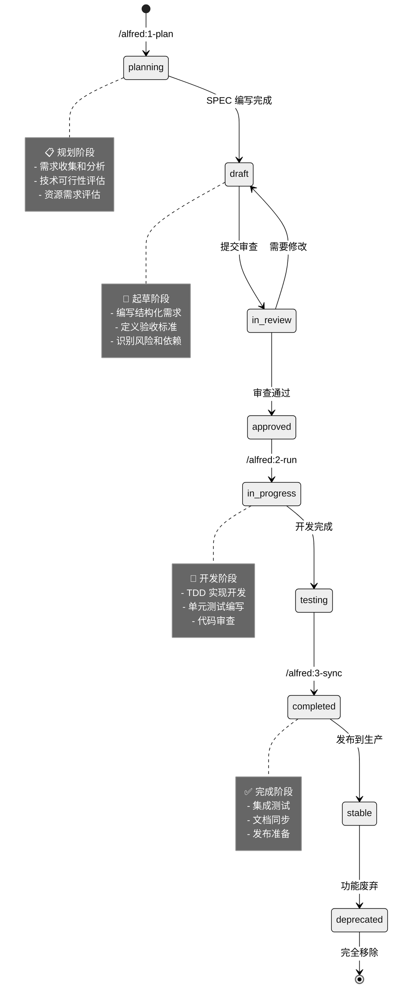

______________________________________________________________________

## title: SPEC 基础指南 description: 学习 MoAI-ADK 中 SPEC 文档的基础知识、结构和最佳实践

# SPEC 基础指南

SPEC（规格说明）是 MoAI-ADK 的核心概念，它定义了系统的需求、约束和验收标准。本指南将帮助您理解 SPEC 的基本概念、结构和编写规范。

## 什么是 SPEC？

### SPEC 的定义

SPEC（Specification）是一个**结构化的需求文档**，它清晰地定义了系统应该做什么、如何做以及验收标准。在 MoAI-ADK 中，SPEC 是所有开发工作的起点和依据。

### SPEC 的重要性

#### 1. 需求明确化

- **传统问题**：模糊的需求导致开发偏离预期
- **SPEC 解决方案**：结构化的需求确保理解一致

#### 2. 验收标准

- **传统问题**：没有明确的完成标准
- **SPEC 解决方案**：可测试的验收标准确保质量

#### 3. 变更管理

- **传统问题**：需求变更时影响难以评估
- **SPEC 解决方案**：结构化的变更追踪确保可控

#### 4. 团队协作

- **传统问题**：团队成员理解不一致
- **SPEC 解决方案**：统一的文档促进协作

## SPEC 文档结构

### 文件命名规范

#### 基本命名格式

```
.moai/specs/SPEC-{DOMAIN}-{ID}/spec.md
```

#### 命名规则

- **DOMAIN**: 3-10 个大写字母，表示业务领域
- **ID**: 3位数字，从 001 开始递增

**示例**：

```
.moai/specs/SPEC-USER-001/spec.md     # 用户管理功能
.moai/specs/SPEC-AUTH-001/spec.md     # 认证授权功能
.moai/specs/SPEC-ORDER-001/spec.md    # 订单管理功能
.moai/specs/SPEC-PAYMENT-001/spec.md # 支付系统功能
```

### YAML Frontmatter 结构

每个 SPEC 文件都以 YAML frontmatter 开始：

```yaml
---
id: DOMAIN-ID
version: 0.1.0
status: draft
priority: high
created: 2025-01-15
updated: 2025-01-15
author: @username
reviewer: @reviewer
tags: [tag1, tag2]
estimated_effort: 3d
estimated_complexity: medium
---
```

#### 字段说明

| 字段                   | 类型   | 必需 | 说明                                                       |
| ---------------------- | ------ | ---- | ---------------------------------------------------------- |
| `id`                   | string | 是   | SPEC 唯一标识符，格式为 DOMAIN-ID                          |
| `version`              | string | 是   | 语义版本号 (遵循 SemVer)                                   |
| `status`               | string | 是   | 当前状态：draft/in-review/in-progress/completed/deprecated |
| `priority`             | string | 是   | 优先级：critical/high/medium/low                           |
| `created`              | date   | 是   | 创建日期                                                   |
| `updated`              | date   | 是   | 最后更新日期                                               |
| `author`               | string | 是   | 作者 GitHub 用户名                                         |
| `reviewer`             | string | 否   | 审查者 GitHub 用户名                                       |
| `tags`                 | array  | 否   | 标签列表，用于分类和搜索                                   |
| `estimated_effort`     | string | 否   | 预估工作量（如：3d, 2w, 1m）                               |
| `estimated_complexity` | string | 否   | 复杂度：low/medium/high                                    |

### 文档主体结构

#### 1. 标题

```markdown
# `@SPEC:DOMAIN-ID: SPEC 标题

示例：
# `@SPEC:USER-001: 用户管理系统
```

#### 2. 概述（可选）

```markdown
## 概述
简要描述功能的背景、目标和重要性。
```

#### 3. EARS 需求部分

```markdown
## Ubiquitous Requirements
- 系统必须 [基本功能]
- 系统必须 [基本功能]

## Event-driven Requirements
- 当 [条件] 时，系统必须 [响应]
- 当 [条件] 时，系统应该 [可选响应]

## State-driven Requirements
- 当 [状态条件] 时，系统必须 [行为]
- 当 [状态条件] 时，系统应该 [可选行为]

## Optional Requirements
- 如果 [可选条件]，系统可以 [可选功能]
- 如果 [可选条件]，系统可能 [可选功能]

## Constraints
- [约束对象] 必须 [约束条件]
- [约束对象] 不应该 [禁止条件]
```

#### 4. 验收标准

```markdown
## 验收标准

### 功能验收
- [ ] [具体验收条件 1]
- [ ] [具体验收条件 2]
- [ ] [具体验收条件 3]

### 非功能验收
- [ ] [性能要求]
- [ ] [安全要求]
- [ ] [可用性要求]

### 验收测试
- [ ] [测试场景 1]
- [ ] [测试场景 2]
```

#### 5. 依赖关系

```markdown
## 依赖关系

### 前置条件
- [ ] [前置条件 1]
- [ ] [前置条件 2]

### 后置影响
- [ ] [影响的组件 1]
- [ ] [影响的组件 2]

### 外部依赖
- [ ] [外部系统 1]
- [ ] [外部系统 2]
```

#### 6. 风险评估

```markdown
## 风险评估

### 技术风险
- **风险描述**：[风险说明]
  - **影响**：[影响描述]
  - **概率**：[高/中/低]
  - **缓解措施**：[解决方案]

### 业务风险
- **风险描述**：[风险说明]
  - **影响**：[影响描述]
  - **概率**：[高/中/低]
  - **缓解措施**：[解决方案]

### 时间风险
- **风险描述**：[风险说明]
  - **影响**：[影响描述]
  - **概率**：[高/中/低]
  - **缓解措施**：[解决方案]
```

#### 7. 附录（可选）

```markdown
## 附录

### 术语表
- **术语1**：定义
- **术语2**：定义

### 参考资料
- [参考文档 1](链接)
- [参考文档 2](链接)

### 相关 SPEC
- `@SPEC:RELATED-ID-001`：相关规格说明
```

______________________________________________________________________

## EARS 语法详解

### EARS 语法概述

EARS（Easy Approach to Requirements Syntax）是一种结构化的需求描述语法，它提供了 5 种清晰的模式来描述不同类型的需求。

### 1. Ubiquitous Requirements（普遍需求）

#### 语法结构

```
系统必须 [动词] [对象]
```

#### 特点

- **永恒性**：描述系统必须持续具备的功能
- **无条件**：不需要特定触发条件
- **核心功能**：描述系统的基本能力

#### 示例

```yaml
## Ubiquitous Requirements
- 系统必须提供用户注册功能
- 系统必须支持多语言界面
- 系统必须记录所有操作日志
- 系统必须支持数据备份和恢复
```

#### 使用场景

- **核心业务功能**：系统必须具备的基础功能
- **系统架构**：必须遵守的架构原则
- **非功能性要求**：必须满足的质量标准

### 2. Event-driven Requirements（事件驱动需求）

#### 语法结构

```
当 [条件] 时，系统必须 [响应]
```

#### 特点

- **条件性**：基于特定事件或条件
- **响应性**：描述系统在特定情况下的行为
- **因果关系**：明确的触发-响应关系

#### 示例

```yaml
## Event-driven Requirements
- 当用户提供有效邮箱时，系统必须发送验证邮件
- 当用户点击验证链接时，系统必须激活账户
- 当系统检测到异常登录时，系统必须发送安全警报
- 当支付成功时，系统必须生成订单确认
- 当库存不足时，系统必须显示缺货提示
```

#### 使用场景

- **用户交互**：用户操作触发的系统响应
- **系统事件**：内部事件触发的处理
- **集成场景**：外部系统调用的响应

### 3. State-driven Requirements（状态驱动需求）

#### 语法结构

```
当 [状态条件] 时，系统必须 [行为]
```

#### 特点

- **状态性**：基于系统当前状态的行为
- **持续性**：状态持续期间的行为保持
- **条件性**：特定状态下的功能限制

#### 示例

```yaml
## State-driven Requirements
- 当用户处于未认证状态时，系统必须限制访问受保护资源
- 当订单处于待支付状态时，系统必须禁止修改订单内容
- 当系统处于维护模式时，系统必须拒绝写操作请求
- 当用户会话过期时，系统必须要求重新登录
- 当系统负载超过阈值时，系统必须启用降级模式
```

#### 使用场景

- **权限控制**：基于用户状态的功能限制
- **业务流程**：业务流程中的状态约束
- **系统状态**：系统运行状态下的行为控制

### 4. Optional Requirements（可选需求）

#### 语法结构

```
如果 [可选条件]，系统可以 [可选功能]
如果 [可选条件]，系统可能 [可选功能]
```

#### 特点

- **可选性**：不是必须实现的功能
- **增强性**：为系统增加价值
- **灵活性**：可以根据资源和优先级选择实现

#### 示例

```yaml
## Optional Requirements
- 如果配置了邮件服务，系统可以发送通知邮件
- 如果用户上传了头像，系统可以显示用户头像
- 如果支持第三方登录，系统可以集成 OAuth 提供商
- 如果资源充足，系统可以实现实时协作功能
```

#### 使用场景

- **增强功能**：提升用户体验的附加功能
- **集成选项**：与外部系统的集成
- **扩展能力**：未来可能实现的功能

### 5. Constraints（约束）

#### 语法结构

```
[约束对象] 必须 [约束条件]
[约束对象] 不应该 [禁止条件]
```

#### 特点

- **限制性**：对系统行为的限制
- **必要性**：必须遵守的规则
- **质量性**：保证系统质量的约束

#### 示例

```yaml
## Constraints
- 用户密码长度必须在 8-128 字符之间
- API 响应时间不应该超过 2 秒
- 单个文件上传大小不能超过 100MB
- 系统必须每小时备份一次数据
- 用户名必须是唯一的
- 不应该暴露敏感的系统信息
```

#### 使用场景

- **数据验证**：输入数据的格式和长度限制
- **性能要求**：响应时间、吞吐量限制
- **安全约束**：安全相关的规则和要求
- **资源限制**：内存、存储、网络等资源限制

______________________________________________________________________

## 编写最佳实践

### 1. 语言表达

#### 清晰简洁

```yaml
# ✅ 好的表达
- 当用户提供有效邮箱和密码时，系统必须发放访问令牌

# <span class="material-icons">cancel</span> 避免的表达
- 当用户输入正确的邮箱和密码后，系统要给用户一个令牌用来访问系统
```

#### 具体明确

```yaml
# ✅ 好的表达
- 用户密码长度必须在 8-128 字符之间，包含大小写字母和数字

# <span class="material-icons">cancel</span> 模糊的表达
- 密码长度要合适，不要太短也不要太长
```

#### 避免歧义

```yaml
# ✅ 好的表达
- 系统必须支持 JPEG、PNG、GIF 格式的图片上传
- 图片文件大小不能超过 10MB

# <span class="material-icons">cancel</span> 有歧义的表达
- 系统要支持图片，但不能太大
```

### 2. 结构组织

#### 逻辑分组

```yaml
# ✅ 按功能分组
## 用户管理
- 用户注册
- 用户登录
- 用户信息管理

## 订单管理
- 订单创建
- 订单查询
- 订单状态更新
```

#### 优先级排序

```yaml
# ✅ 按重要性排序
## 核心功能
- 用户认证
- 数据安全

## 重要功能
- 订单处理
- 支付系统

## 附加功能
- 数据分析
- 报表生成
```

### 3. 验收标准

#### 可测试性

```yaml
# ✅ 可测试的验收标准
- [ ] 用户可以使用邮箱和密码成功登录
- [ ] 登录失败时显示错误信息
- [ ] 令牌可以在 1 小时内有效访问受保护资源

# <span class="material-icons">cancel</span> 难以测试的标准
- [ ] 系统应该运行良好
- [ ] 用户体验应该不错
```

#### 完整性

```yaml
# ✅ 完整的验收标准
### 功能验收
- [ ] 用户注册流程完整
- [ ] 输入验证有效
- [ ] 错误处理完善

### 性能验收
- [ ] 注册响应时间 < 2 秒
- [ ] 登录响应时间 < 1 秒
- [ ] 支持 1000 并发用户

### 安全验收
- [ ] 密码使用 bcrypt 加密
- [ ] 令牌使用强密钥签名
- [ ] 输入经过验证和清理
```

### 4. 风险评估

#### 风险识别

```yaml
# ✅ 明确的风险识别
### 技术风险
- **JWT 令牌管理复杂性**
  - 影响：令牌泄露可能导致安全问题
  - 概率：中等
  - 缓解措施：使用成熟的 JWT 库，定期轮换密钥

# <span class="material-icons">cancel</span> 模糊的风险描述
### 技术风险
- 技术实现可能有困难
```

#### 缓解措施具体化

```yaml
# ✅ 具体的缓解措施
**缓解措施**：
1. 使用 `python-jose` 库处理 JWT 令牌
2. 实施令牌自动轮换机制
3. 添加令牌黑名单功能
4. 定期安全审计和测试

# <span class="material-icons">cancel</span> 笼统的缓解措施
- 加强安全措施
- 注意安全性
```

______________________________________________________________________

## SPEC 生命周期管理

### 状态流转图



### 状态详细说明

#### Planning（规划阶段）

- **触发条件**：`/alfred:1-plan` 命令执行
- **主要活动**：
  - 收集和分析需求
  - 评估技术可行性
  - 确定 ID 和优先级
  - 制定开发计划
- **输出产物**：
  - 初步 SPEC 结构
  - 项目元数据
  - 风险评估报告

#### Draft（起草阶段）

- **触发条件**：需求分析完成
- **主要活动**：
  - 使用 EARS 语法编写需求
  - 定义验收标准
  - 识别依赖关系
  - 完善风险评估
- **输出产物**：
  - 完整的 SPEC 文档
  - 验收测试套件
  - 实现计划建议

#### In Review（审查阶段）

- **触发条件**：提交给团队审查
- **主要活动**：
  - 团队成员审查需求
  - 技术可行性验证
  - 业务价值评估
  - 资源需求确认
- **输出产物**：
  - 审查意见和修改建议
  - 更新的 SPEC 文档
  - 审查结论

#### Approved（批准阶段）

- **触发条件**：审查通过
- **主要活动**：
  - 最终确认 SPEC 内容
  - 锁定版本号
  - 分配开发资源
  - 确定开发时间线
- **输出产物**：
  - 最终版 SPEC 文档
  - 开发任务分配
  - 时间计划安排

#### In Progress（开发阶段）

- **触发条件**：`/alfred:2-run` 命令执行
- **主要活动**：
  - 基于 SPEC 进行 TDD 开发
  - 编写单元测试
  - 代码实现和审查
  - 集成测试
- **输出产物**：
  - 代码实现
  - 测试套件
  - 开发文档

#### Completed（完成阶段）

- **触发条件**：开发完成并通过测试
- **主要活动**：
  - 文档同步更新
  - 最终质量检查
  - 部署准备
  - 发布就绪确认
- **输出产物**：
  - 更新的文档
  - 同步报告
  - 发布说明

#### Stable（稳定阶段）

- **触发条件**：成功发布到生产环境
- **主要活动**：
  - 生产环境监控
  - 用户反馈收集
  - 性能监控
  - 问题修复
- **输出产物**：
  - 运维文档
  - 监控报告
  - 问题修复记录

#### Deprecated（废弃阶段）

- **触发条件**：功能被替代或不再需要
- **主要活动**：
  - 废弃计划制定
  - 数据迁移
  - 用户通知
  - 最终移除
- **输出产物**：
  - 废弃计划
  - 迁移指南
  - 最终通知

______________________________________________________________________

## 与其他组件的集成

### 与 TDD 的集成

#### SPEC 驱动 TDD

```bash
# 1. 创建 SPEC
/alfred:1-plan "用户认证功能"
# 生成 SPEC-USER-AUTH-001

# 2. 基于 SPEC 进行 TDD
/alfred:2-run USER-AUTH-001
# 根据 SPEC 编写测试，然后实现代码

# 3. 验证一致性
/alfred:3-sync
# 确保代码、测试、文档与 SPEC 一致
```

#### SPEC 验收标准指导测试

```yaml
## 验收标准
### 功能验收
- [ ] 用户可以使用邮箱和密码注册账户
- [ ] 注册后必须验证邮箱才能登录
- [ ] 用户可以使用正确凭证登录
- [ ] 登录成功后获得 JWT 令牌

# 对应的测试用例
def test_user_registration_with_valid_data():
    """当提供有效数据时，系统必须创建用户账户并发送验证邮件"""
    # 测试实现
    pass

def test_user_login_with_valid_credentials():
    """当提供正确凭证时，系统必须发放 JWT 令牌"""
    # 测试实现
    pass
```

### 与 @TAG 系统的集成

#### TAG 链接

```markdown
# SPEC 文档
# `@SPEC:USER-AUTH-001: 用户认证系统

## 实现追踪
- `@CODE:USER-AUTH-001:API`: 认证 API 实现
- `@TEST:USER-AUTH-001`: 认证测试套件
- `@DOC:USER-AUTH-001`: 认证文档
```

#### 自动验证

```bash
# Alfred 会自动验证 TAG 链的完整性
/alfred:3-sync --verify-tags

# 输出：
# ✅ TAG 链验证通过
# SPEC:USER-AUTH-001 → TEST:USER-AUTH-001 → CODE:USER-AUTH-001 → DOC:USER-AUTH-001
```

### 与 Alfred 命令的集成

#### 1-plan 命令创建 SPEC

```bash
/alfred:1-plan "用户认证功能"
# Alfred 会：
# 1. 分析用户输入
# 2. 使用 EARS 语法编写 SPEC
# 3. 自动分配 ID (USER-AUTH-001)
# 4. 创建 SPEC 文件
# 5. 生成验收标准
```

#### 2-run 命令基于 SPEC 开发

```bash
/alfred:2-run USER-AUTH-001
# Alfred 会：
# 1. 读取 SPEC-USER-AUTH-001.md
# 2. 分析需求和验收标准
# 3. 设计技术方案
# 4. 执行 TDD 开发
# 5. 确保所有验收标准都有测试覆盖
```

#### 3-sync 命令同步文档

```bash
/alfred:3-sync
# Alfred 会：
# 1. 基于 SPEC 生成 API 文档
# 2. 更新 README 和 CHANGELOG
# 3. 验证 @TAG 链完整性
# 4. 生成同步报告
```

______________________________________________________________________

## 常见问题与解决方案

### 1. SPEC 编写困难

#### 问题：不知道如何开始写 SPEC

**解决方案**：

```bash
# 使用 Alfred 的交互式引导
/alfred:1-plan "模糊的功能描述"

# Alfred 会通过提问帮助您明确需求：
# Q1: 这个功能的主要目标是什么？
# Q2：用户会如何使用这个功能？
# Q3：有哪些输入和输出？
# Q4：需要处理哪些边界情况？
```

#### 问题：需求太复杂，难以结构化

**解决方案**：

```bash
# 分解复杂需求
/alfred:1-plan "复杂功能的第一个部分"
/alfred:1-plan "复杂功能的第二个部分"
# 或者
/alfred:1-plan "核心功能，暂时忽略边缘情况"
```

### 2. EARS 语法困惑

#### 问题：不知道应该用哪种 EARS 模式

**解决方案**：

```yaml
# 参考以下决策指南：

## 选择 Ubiquitous Requirements 当：
- 描述系统必须持续具备的基本功能
- 描述不需要触发条件的系统行为
- 描述核心业务能力

## 选择 Event-driven Requirements 当：
- 描述用户操作触发的系统响应
- 描述外部事件触发的处理
- 描述明确的因果关系

## 选择 State-driven Requirements 当：
- 描述基于状态的权限或限制
- 描述业务流程中的状态约束
- 描述系统状态下的行为

## 选择 Optional Requirements 当：
- 描述增强功能或可选特性
- 描述与外部系统的集成
- 描述未来可能实现的功能

## 选择 Constraints 当：
- 描述输入数据的格式限制
- 描述性能或资源限制
- 描述安全或合规要求
```

### 3. 验收标准设计

#### 问题：不知道如何编写可测试的验收标准

**解决方案**：

```yaml
## 验收标准编写指南

### 功能验收标准编写规则：
1. **具体明确**：避免模糊描述
   - ✅ "用户可以在 2 秒内完成登录"
   - <span class="material-icons">cancel</span> "登录要快一些"

2. **可观察可验证**：必须有明确的验证方法
   - ✅ "响应状态码为 200，包含用户信息"
   - <span class="material-icons">cancel</span> "登录成功"

3. **使用 Gherkin 格式**：
   ```gherkin
   Scenario: 用户成功登录
     When 用户输入正确的邮箱和密码
     Then 系统应该返回 JWT 令牌
     And 状态码应该是 200
```

### 验收测试要求：

- 每个 Ubiquitous Requirement 都要有对应的测试
- 关键的业务流程要有完整的端到端测试
- 边界条件和异常情况也要有测试覆盖

### 4. 风险评估

#### 问题：不知道如何识别和评估风险
**解决方案**：
```yaml
## 风险评估指南

### 技术风险识别检查清单：
- [ ] **新技术栈**：团队是否熟悉？
- [ ] **复杂度**：技术实现是否复杂？
- [ ] **依赖项**：外部依赖是否可靠？
- [ ] **性能要求**：现有架构是否能满足？
- [ ] **安全考虑**：是否涉及敏感数据？

### 业务风险识别检查清单：
- [ ] **需求变更**：需求是否可能变更？
- [ ] **用户接受度**：用户是否会接受这个功能？
- [ ] **业务价值**：功能是否对业务有明确价值？
- [ ] **竞争优势**：是否需要这个功能来竞争？

### 风险影响评估：
- **Critical**：可能导致项目失败或重大损失
- **High**：影响主要功能或用户体验
- **Medium**：影响次要功能或性能
- **Low**：轻微影响或改进机会

### 缓解措施制定原则：
1. **具体可行**：避免模糊的"加强监控"
2. **可执行性**：提供具体的实施步骤
3. **可验证性**：能够验证措施是否有效
4. **时效性**：在合理时间内能够实施
```

______________________________________________________________________

## 总结

SPEC 是 MoAI-ADK 开发流程的核心，它通过以下方式为项目带来价值：

### 1. 明确性

- 结构化的需求描述避免理解偏差
- EARS 语法提供清晰的表达模式
- 验收标准确保可测试性

### 2. 可追踪性

- @TAG 系统建立完整的追踪链
- 从需求到代码到文档的完整关联
- 变更影响的可评估性

### 3. 质量保证

- 明确的验收标准确保功能正确实现
- 风险评估帮助提前识别和规避问题
- 结构化流程确保开发质量

### 4. 团队协作

- 统一的文档格式促进团队沟通
- 清晰的责任分配提高协作效率
- 版本化管理支持演进控制

### 关键要点

1. **从 SPEC 开始**：所有开发工作都从 SPEC 开始
2. **使用 EARS 语法**：掌握 5 种 EARS 模式的适用场景
3. **结构化组织**：按照标准结构组织 SPEC 内容
4. **编写可测试标准**：确保验收标准可以被验证
5. **进行风险评估**：提前识别和规避风险

### 下一步

- [学习 EARS 语法详细指南](ears.md)
- [掌握 @TAG 系统使用](tags.md)
- [查看 SPEC 编写示例](examples.md)
- [开始第一个 SPEC](../alfred/1-plan.md)

通过掌握 SPEC 基础知识，您可以为项目奠定坚实的基础，确保开发过程的透明度和可控性。
