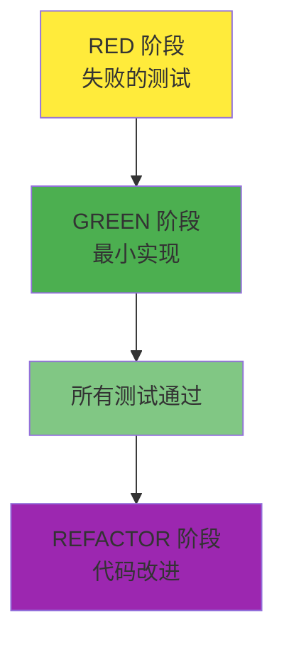

# TDD GREEN 阶段指南：通过最小实现使测试通过

## 目录

1. [GREEN 阶段的目标和原则](#green-阶段的目标和原则)
2. [最小实现策略（YAGNI 原则）](#最小实现策略yagni-原则)
3. [用于测试通过的快速解决方案](#用于测试通过的快速解决方案)
4. [性能与功能实现的平衡](#性能与功能实现的平衡)
5. [实战代码示例](#实战代码示例)
6. [GREEN 阶段应避免的事项](#green-阶段应避免的事项)
7. [Git 提交策略（GREEN 阶段）](#git-提交策略green-阶段)
8. [GREEN 阶段检查清单](#green-阶段检查清单)

______________________________________________________________________

## GREEN 阶段的目标和原则

### GREEN 阶段的核心目标

GREEN 阶段唯一且明确的目标是**"使所有失败的测试通过"**。在这个阶段，需要记住以下几点：



### 1. 通过优先（Passing First）

GREEN 阶段的哲学很简单：

- **通过优于完美**：能通过的代码优于美观的代码
- **简单是美德**：寻找最简单的解决方案
- **快速反馈**：测试必须快速通过才能进入下一阶段

### 2. YAGNI 原则（You Aren't Gonna Need It）

> "不要实现当前不需要的功能"

```python
# 不好的例子：过度工程化
class UserService:
    def __init__(self):
        self.cache = RedisCache()           # 目前还不需要
        self.logger = StructuredLogger()    # 目前还不需要
        self.metrics = PrometheusMetrics()  # 目前还不需要
        self.validator = ComplexValidator() # 目前还不需要

    def create_user(self, user_data):
        # 复杂的逻辑...
        pass

# 好的例子：最小实现
class UserService:
    def create_user(self, user_data):
        # 只实现测试通过所需的最少逻辑
        if not user_data.get("email"):
            raise ValueError("Email is required")

        return User(
            email=user_data["email"],
            name=user_data.get("name", "")
        )
```

### 3. KISS 原则（Keep It Simple, Stupid）

简单的解决方案总是最好的：

- **避免复杂性**：避免复杂的算法和设计模式
- **直观的代码**：其他开发人员能够轻松理解的代码
- **最小依赖**：避免不必要的外部库或服务

______________________________________________________________________

## 最小实现策略（YAGNI 原则）

### 1. 硬编码策略

有时硬编码是最好的选择：

```python
# RED 阶段测试
def test_get_current_temperature_should_return_25():
    """查询当前温度应返回25度"""
    response = temperature_service.get_current_temperature()
    assert response == 25

# GREEN 阶段最小实现
class TemperatureService:
    def get_current_temperature(self):
        # 返回硬编码值而不是实际传感器
        return 25  # 用于测试通过的最小实现
```

**什么时候硬编码是合适的？**

- 当测试期望单一固定值时
- 当外部依赖（传感器、API、数据库）很复杂时
- 当想快速获得第一次通过时

### 2. 伪实现（Fake Implementation）

从简单的内存实现开始：

```python
# RED 阶段测试
def test_user_creation_should_return_user_with_id():
    """创建用户时应返回带有ID的用户对象"""
    user_data = {"name": "John", "email": "john@example.com"}
    user = user_service.create_user(user_data)

    assert user.id is not None
    assert user.name == "John"
    assert user.email == "john@example.com"

# GREEN 阶段最小实现
class UserService:
    def __init__(self):
        self._users = {}  # 简单的内存存储
        self._next_id = 1

    def create_user(self, user_data):
        # 最少的验证逻辑
        if not user_data.get("email"):
            raise ValueError("Email is required")

        # 最简单的ID生成
        user_id = f"user_{self._next_id}"
        self._next_id += 1

        # 最少的用户对象创建
        user = User(
            id=user_id,
            email=user_data["email"],
            name=user_data.get("name", "")
        )

        self._users[user_id] = user
        return user
```

### 3. 条件最小实现

只实现必要的条件：

```python
# RED 阶段测试
def test_admin_can_access_admin_panel():
    """管理员应能访问管理面板"""
    admin = User(role="admin")
    assert auth_service.can_access_admin_panel(admin) is True

def test_regular_user_cannot_access_admin_panel():
    """普通用户不能访问管理面板"""
    user = User(role="user")
    assert auth_service.can_access_admin_panel(user) is False

def test_guest_cannot_access_admin_panel():
    """访客不能访问管理面板"""
    guest = User(role="guest")
    assert auth_service.can_access_admin_panel(guest) is False

# GREEN 阶段最小实现
class AuthService:
    def can_access_admin_panel(self, user):
        # 只实现测试所需的最少条件
        return user.role == "admin"
```

### 4. 固定返回值策略

```python
# RED 阶段测试
def test_calculate_tax_should_return_10_percent():
    """计算所得税应返回10%"""
    tax = tax_calculator.calculate_tax(1000)
    assert tax == 100

# GREEN 阶段最小实现
class TaxCalculator:
    def calculate_tax(self, income):
        # 对所有收入固定返回10%（测试所需的最小实现）
        return income * 0.10
```

______________________________________________________________________

## 用于测试通过的快速解决方案

### 1. 分步骤方法

将复杂的测试分解为小步骤：

```python
# 复杂的测试
def test_user_registration_complete_flow():
    """完整的用户注册流程测试"""
    # 1. 使用有效数据注册
    # 2. 确认发送邮件验证令牌
    # 3. 使用令牌验证邮件
    # 4. 已验证用户登录
    # 5. 确认接收JWT令牌

# GREEN 阶段：逐个实现
class UserService:
    def register_user(self, user_data):
        # 步骤1：只实现最少的用户创建
        if not user_data.get("email"):
            raise ValueError("Email required")

        user = User(
            id=self._generate_id(),
            email=user_data["email"],
            is_verified=False  # 尚未实现验证逻辑
        )

        return user

    def send_verification_email(self, user):
        # 步骤2：伪造邮件发送
        return True  # 始终返回成功

    def verify_email(self, token):
        # 步骤3：伪造令牌验证
        return True  # 始终返回成功

    def login_user(self, email, password):
        # 步骤4：简单登录
        return {"token": "fake_jwt_token"}
```

### 2. 使用Mock/Stub消除依赖

```python
# RED 阶段测试
def test_order_processing_should_send_email():
    """处理订单时应发送确认邮件"""
    order = Order(id="123", customer_email="customer@example.com")

    # 注入Mock
    mock_email_service = Mock()
    order_service = OrderService(email_service=mock_email_service)

    # When
    order_service.process_order(order)

    # Then
    mock_email_service.send_order_confirmation.assert_called_once_with(order)

# GREEN 阶段最小实现
class OrderService:
    def __init__(self, email_service):
        self.email_service = email_service

    def process_order(self, order):
        # 最少的订单处理逻辑
        order.status = "processed"
        order.processed_at = datetime.now()

        # 发送邮件（只委托，没有实际逻辑）
        self.email_service.send_order_confirmation(order)

        return order
```

### 3. 内存存储代替数据库

```python
# RED 阶段测试
def test_product_repository_can_save_and_retrieve():
    """产品仓库应能保存和查询"""
    product = Product(name="Laptop", price=999.99)

    repo = ProductRepository()
    saved_product = repo.save(product)
    retrieved_product = repo.get_by_id(saved_product.id)

    assert retrieved_product.name == "Laptop"
    assert retrieved_product.price == 999.99

# GREEN 阶段最小实现
class ProductRepository:
    def __init__(self):
        self._products = {}  # 使用内存而不是数据库

    def save(self, product):
        # 最少的ID生成
        if not hasattr(product, 'id') or not product.id:
            product.id = str(uuid.uuid4())

        self._products[product.id] = product
        return product

    def get_by_id(self, product_id):
        return self._products.get(product_id)
```

### 4. 简单的有效性验证

```python
# RED 阶段测试
def test_email_validation_should_reject_invalid_emails():
    """邮件有效性验证应拒绝无效的邮件"""
    invalid_emails = [
        "invalid-email",
        "@example.com",
        "user@",
        "user..name@example.com"
    ]

    for email in invalid_emails:
        assert email_validator.is_valid(email) is False

# GREEN 阶段最小实现
class EmailValidator:
    def is_valid(self, email):
        # 最简单的有效性验证
        if not email or "@" not in email:
            return False

        local, domain = email.split("@", 1)

        # 只实现最少的验证
        return len(local) > 0 and len(domain) > 0 and "." in domain
```

______________________________________________________________________

## 性能与功能实现的平衡

### 1. 推迟性能优化

在GREEN阶段不要考虑性能：

```python
# 不好的例子：在GREEN阶段尝试性能优化
class UserService:
    def __init__(self):
        self.user_cache = LRUCache(maxsize=1000)  # 不必要的复杂性
        self.db_pool = ConnectionPool(max_connections=20)  # 过度工程化

    def get_user(self, user_id):
        # 复杂的缓存逻辑
        if user_id in self.user_cache:
            return self.user_cache[user_id]

        # 复杂的数据库连接管理
        with self.db_pool.get_connection() as conn:
            user = conn.execute("SELECT * FROM users WHERE id = ?", user_id)
            self.user_cache[user_id] = user
            return user

# 好的例子：简单的实现
class UserService:
    def __init__(self):
        self.users = {}  # 简单的内存存储

    def get_user(self, user_id):
        return self.users.get(user_id)  # 最少的实现
```

### 2. 功能优先级


### 3. 数据库与内存

| 情况     | GREEN 阶段选择 | REFACTOR 阶段 |
| -------- | -------------- | ------------- |
| 简单CRUD | 内存存储       | 实际数据库    |
| 复杂查询 | 硬编码结果     | 查询优化      |
| 大数据量 | 小测试数据     | 分页/索引     |
| 并发性   | 忽略           | 锁/事务       |

```python
# GREEN 阶段：基于内存
class OrderService:
    def __init__(self):
        self.orders = {}

    def create_order(self, order_data):
        order_id = f"order_{len(self.orders) + 1}"
        order = Order(id=order_id, **order_data)
        self.orders[order_id] = order
        return order

# REFACTOR 阶段将改进的内容：
# - 数据库连接
# - 事务管理
# - 并发控制
# - 数据库索引
# - 缓存策略
```

### 4. 外部API通信

```python
# GREEN 阶段：伪造API响应
class PaymentService:
    def process_payment(self, payment_data):
        # 伪造响应而不是实际API调用
        if payment_data["amount"] > 0:
            return {
                "status": "success",
                "transaction_id": f"txn_{uuid.uuid4().hex[:8]}"
            }
        else:
            return {
                "status": "failed",
                "error": "Invalid amount"
            }

# REFACTOR 阶段将改进的内容：
# - 实际API通信
# - 重试逻辑
# - 错误处理
# - 超时管理
# - 日志和监控
```

______________________________________________________________________

## 实战代码示例

### Python 示例：用户认证服务

#### RED 阶段测试（在前一阶段编写）

```python
# tests/test_auth.py
def test_login_with_valid_credentials_should_return_jwt_token():
    """使用有效凭证登录应返回JWT令牌"""
    login_data = {"email": "test@example.com", "password": "correct_password"}
    response = client.post("/auth/login", json=login_data)

    assert response.status_code == 200
    assert "access_token" in response.json()
    assert response.json()["token_type"] == "bearer"

def test_login_with_invalid_credentials_should_return_401():
    """使用无效凭证登录应返回401错误"""
    login_data = {"email": "test@example.com", "password": "wrong_password"}
    response = client.post("/auth/login", json=login_data)

    assert response.status_code == 401
    assert response.json()["detail"] == "Invalid credentials"
```

#### GREEN 阶段最小实现

```python
# src/auth_service.py
import jwt
from datetime import datetime, timedelta
from typing import Dict, Any

class AuthService:
    def __init__(self):
        # 伪造的用户数据库
        self.users = {
            "test@example.com": {
                "password": "correct_password",
                "user_id": "user_123"
            }
        }
        self.secret_key = "fake_secret_key_for_testing"

    def authenticate(self, email: str, password: str) -> Dict[str, Any]:
        """最少的认证逻辑"""
        # 确认用户
        if email not in self.users:
            raise AuthenticationError("Invalid credentials")

        # 确认密码（简单字符串比较）
        if self.users[email]["password"] != password:
            raise AuthenticationError("Invalid credentials")

        # 生成JWT令牌（只有最少的声明）
        token_payload = {
            "sub": self.users[email]["user_id"],
            "email": email,
            "exp": datetime.utcnow() + timedelta(hours=24)
        }

        access_token = jwt.encode(token_payload, self.secret_key, algorithm="HS256")

        return {
            "access_token": access_token,
            "token_type": "bearer"
        }

# src/main.py (FastAPI 端点)
from fastapi import FastAPI, HTTPException
from pydantic import BaseModel

app = FastAPI()

class LoginRequest(BaseModel):
    email: str
    password: str

@app.post("/auth/login")
def login(login_data: LoginRequest):
    auth_service = AuthService()

    try:
        result = auth_service.authenticate(login_data.email, login_data.password)
        return result
    except AuthenticationError:
        raise HTTPException(status_code=401, detail="Invalid credentials")

class AuthenticationError(Exception):
    pass
```

**执行结果：**

```bash
$ pytest tests/test_auth.py -v
============================ test session starts ============================
tests/test_auth.py::test_login_with_valid_credentials_should_return_jwt_token PASSED
tests/test_auth.py::test_login_with_invalid_credentials_should_return_401 PASSED

============================= 2 passed in 0.12s ==============================
```

### TypeScript 示例：待办事项管理 API

#### RED 阶段测试

```typescript
// tests/todo-api.test.ts
describe('POST /todos', () => {
  it('should create a new todo with valid data and return 201', async () => {
    const todoData = {
      title: 'Learn TDD',
      description: 'Master Test-Driven Development'
    };

    const response = await request(app)
      .post('/todos')
      .send(todoData);

    expect(response.status).toBe(201);
    expect(response.body).toHaveProperty('id');
    expect(response.body.title).toBe(todoData.title);
    expect(response.body.completed).toBe(false);
  });

  it('should return 400 when title is missing', async () => {
    const invalidTodoData = {
      description: 'Missing title field'
    };

    const response = await request(app)
      .post('/todos')
      .send(invalidTodoData);

    expect(response.status).toBe(400);
    expect(response.body.error).toContain('title is required');
  });
});
```

#### GREEN 阶段最小实现

```typescript
// src/services/TodoService.ts
import { v4 as uuidv4 } from 'uuid';

export interface Todo {
  id: string;
  title: string;
  description?: string;
  completed: boolean;
  createdAt: Date;
}

export interface CreateTodoRequest {
  title: string;
  description?: string;
}

export class TodoService {
  private todos: Map<string, Todo> = new Map();

  createTodo(request: CreateTodoRequest): Todo {
    // 最少的有效性验证
    if (!request.title || request.title.trim().length === 0) {
      throw new Error('title is required');
    }

    // 最少的Todo对象创建
    const todo: Todo = {
      id: uuidv4(),
      title: request.title.trim(),
      description: request.description?.trim(),
      completed: false,
      createdAt: new Date()
    };

    // 保存到内存存储
    this.todos.set(todo.id, todo);
    return todo;
  }

  getTodo(id: string): Todo | undefined {
    return this.todos.get(id);
  }

  getAllTodos(): Todo[] {
    return Array.from(this.todos.values());
  }
}

// src/routes/todoRoutes.ts
import express from 'express';
import { TodoService } from '../services/TodoService';

const router = express.Router();
const todoService = new TodoService();

router.post('/todos', (req, res) => {
  try {
    const todo = todoService.createTodo(req.body);
    res.status(201).json(todo);
  } catch (error) {
    res.status(400).json({ error: error.message });
  }
});

router.get('/todos', (req, res) => {
  const todos = todoService.getAllTodos();
  res.json(todos);
});

export default router;
```

### Java 示例：产品库存管理

#### RED 阶段测试

```java
@Test
@DisplayName("创建产品时使用有效数据应成功")
void createProduct_WithValidData_ShouldReturnProduct() {
    ProductRequest request = new ProductRequest(
        "Test Product",
        29.99,
        "electronics",
        100
    );

    Product result = productService.createProduct(request);

    assertNotNull(result.getId());
    assertEquals(request.getName(), result.getName());
    assertEquals(request.getPrice(), result.getPrice());
    assertEquals(request.getStock(), result.getStock());
}

@Test
@DisplayName("创建价格为0或以下的产品应失败")
void createProduct_WithZeroPrice_ShouldThrowException() {
    ProductRequest request = new ProductRequest(
        "Invalid Product",
        -10.0,
        "electronics",
        100
    );

    assertThrows(ValidationException.class,
                 () -> productService.createProduct(request));
}
```

#### GREEN 阶段最小实现

```java
// src/main/java/com/example/service/ProductService.java
@Service
public class ProductService {
    private final Map<String, Product> products = new ConcurrentHashMap<>();
    private final AtomicLong idGenerator = new AtomicLong(1);

    public Product createProduct(ProductRequest request) {
        // 最少的有效性验证
        if (request.getPrice() <= 0) {
            throw new ValidationException("Price must be greater than 0");
        }

        if (request.getStock() < 0) {
            throw new ValidationException("Stock cannot be negative");
        }

        // 最少的Product对象创建
        Product product = new Product();
        product.setId(String.valueOf(idGenerator.getAndIncrement()));
        product.setName(request.getName());
        product.setPrice(request.getPrice());
        product.setCategory(request.getCategory());
        product.setStock(request.getStock());
        product.setCreatedAt(LocalDateTime.now());

        // 保存到内存存储
        products.put(product.getId(), product);

        return product;
    }

    public Product getProduct(String id) {
        return products.get(id);
    }

    public List<Product> getAllProducts() {
        return new ArrayList<>(products.values());
    }
}

// src/main/java/com/example/dto/ProductRequest.java
public class ProductRequest {
    private String name;
    private double price;
    private String category;
    private int stock;

    // 省略构造函数、getter、setter
}

// src/main/java/com/example/controller/ProductController.java
@RestController
@RequestMapping("/api/products")
public class ProductController {
    private final ProductService productService;

    public ProductController(ProductService productService) {
        this.productService = productService;
    }

    @PostMapping
    public ResponseEntity<Product> createProduct(@RequestBody ProductRequest request) {
        try {
            Product product = productService.createProduct(request);
            return ResponseEntity.status(HttpStatus.CREATED).body(product);
        } catch (ValidationException e) {
            return ResponseEntity.badRequest().build();
        }
    }

    @GetMapping
    public ResponseEntity<List<Product>> getAllProducts() {
        List<Product> products = productService.getAllProducts();
        return ResponseEntity.ok(products);
    }
}
```

### Go 示例：支付服务

#### RED 阶段测试

```go
func TestPaymentService_ProcessPayment(t *testing.T) {
    service := NewPaymentService()

    t.Run("使用有效支付信息处理应成功", func(t *testing.T) {
        request := &PaymentRequest{
            Amount:      100.50,
            Currency:    "USD",
            CardNumber:  "4111111111111111",
            ExpiryMonth: "12",
            ExpiryYear:  "2025",
            CVV:         "123",
        }

        result, err := service.ProcessPayment(request)

        if err != nil {
            t.Fatalf("Expected no error, got %v", err)
        }

        if result.Status != "success" {
            t.Errorf("Expected success status, got %s", result.Status)
        }

        if result.TransactionID == "" {
            t.Error("Expected transaction ID to be generated")
        }
    })

    t.Run("0元支付应失败", func(t *testing.T) {
        request := &PaymentRequest{
            Amount:     0,
            Currency:   "USD",
            CardNumber: "4111111111111111",
        }

        _, err := service.ProcessPayment(request)

        if err == nil {
            t.Error("Expected error for zero amount")
        }

        if !errors.Is(err, ErrInvalidAmount) {
            t.Errorf("Expected ErrInvalidAmount, got %v", err)
        }
    })
}
```

#### GREEN 阶段最小实现

```go
// pkg/payment/service.go
package payment

import (
    "errors"
    "fmt"
    "strconv"
    "time"
)

var (
    ErrInvalidAmount = errors.New("payment amount must be greater than 0")
    ErrInvalidCard   = errors.New("invalid card information")
)

type PaymentRequest struct {
    Amount      float64
    Currency    string
    CardNumber  string
    ExpiryMonth string
    ExpiryYear  string
    CVV         string
}

type PaymentResult struct {
    TransactionID string
    Status        string
    Amount        float64
    Currency      string
    ProcessedAt   time.Time
}

type PaymentService struct {
    transactionCounter int64
}

func NewPaymentService() *PaymentService {
    return &PaymentService{}
}

func (s *PaymentService) ProcessPayment(request *PaymentRequest) (*PaymentResult, error) {
    // 最少的有效性验证
    if request.Amount <= 0 {
        return nil, ErrInvalidAmount
    }

    if len(request.CardNumber) < 13 || len(request.CardNumber) > 19 {
        return nil, ErrInvalidCard
    }

    // 简单的交易ID生成
    s.transactionCounter++
    transactionID := fmt.Sprintf("txn_%d_%d",
        time.Now().Unix(), s.transactionCounter)

    // 最少的支付结果创建
    result := &PaymentResult{
        TransactionID: transactionID,
        Status:        "success", // 总是成功（实际支付逻辑在REFACTOR中）
        Amount:        request.Amount,
        Currency:      request.Currency,
        ProcessedAt:   time.Now(),
    }

    return result, nil
}
```

______________________________________________________________________

## GREEN 阶段应避免的事项

### 1. 过度设计（Over-Engineering）

**应避免的事项：**

- 应用复杂的设计模式
- 不必要的抽象层
- 预测未来的需求
- 尝试性能优化

```python
# 不好的例子：GREEN阶段的过度工程化
class UserFactory(AbstractFactory):
    def create_user(self, user_type: UserType) -> User:
        if user_type == UserType.ADMIN:
            return AdminUserBuilder().build()
        elif user_type == UserType.CUSTOMER:
            return CustomerUserBuilder().build()
        # ... 复杂的工厂模式

class UserService:
    def __init__(self):
        self.factory = UserFactory()
        self.validator_chain = ValidatorChain([
            EmailValidator(),
            PasswordValidator(),
            NameValidator(),
            # ... 复杂的链
        ])
        self.cache_manager = CacheManager()
        self.event_bus = EventBus()

    def create_user(self, user_data):
        # 复杂的创建逻辑
        pass

# 好的例子：简单的实现
class UserService:
    def create_user(self, user_data):
        if not user_data.get("email"):
            raise ValueError("Email required")

        return User(
            id=f"user_{uuid.uuid4().hex[:8]}",
            email=user_data["email"],
            name=user_data.get("name", "")
        )
```

### 2. 引入外部依赖

**GREEN阶段应避免的外部依赖：**

- 数据库连接
- 外部API调用
- 消息队列
- 文件系统访问

```python
# 不好的例子：不必要的外部依赖
class UserService:
    def __init__(self):
        self.db = PostgreSQLDatabase("connection_string")  # 不必要
        self.redis = RedisClient()                        # 不必要
        self.email_api = SendGridAPI()                    # 不必要

    def create_user(self, user_data):
        # 数据库保存（增加复杂性）
        query = "INSERT INTO users (email, name) VALUES (?, ?)"
        self.db.execute(query, user_data["email"], user_data["name"])

        # 保存到缓存（不必要的复杂性）
        self.redis.set(f"user:{email}", user_data)

        # 发送邮件（外部依赖）
        self.email_api.send_welcome_email(user_data["email"])

# 好的例子：无依赖的实现
class UserService:
    def __init__(self):
        self.users = {}  # 简单的内存存储

    def create_user(self, user_data):
        user = User(
            id=f"user_{len(self.users) + 1}",
            email=user_data["email"],
            name=user_data.get("name", "")
        )
        self.users[user.id] = user
        return user
```

### 3. 不准确的实现

**为通过测试而使用的不准确方法：**

- 硬编码测试结果
- 总是成功的伪造实现
- 与实际业务逻辑不同的行为

```python
# 不好的例子：不准确的实现
class Calculator:
    def add(self, a, b):
        # 只依赖测试的错误实现
        if a == 2 and b == 3:
            return 5  # 只适配特定测试用例
        return 0      # 其他情况返回错误结果

# 好的例子：正确的实现
class Calculator:
    def add(self, a, b):
        # 实际的加法逻辑
        return a + b
```

### 4. 通过修改测试来解决问题

```python
# 不好的例子：通过修改测试来解决问题
# 原始测试
def test_user_age_validation():
    user = User(age=15)
    assert user.is_adult() is False

# 因为实现困难而修改测试（不好的方式）
def test_user_age_validation():
    user = User(age=20)  # 将测试改为容易的情况
    assert user.is_adult() is True

# 好的例子：通过修改实现来解决问题
class User:
    def is_adult(self):
        return self.age >= 18
```

______________________________________________________________________

## Git 提交策略（GREEN 阶段）

### 1. 提交消息约定

GREEN阶段的提交应表示实现完成：

```bash
# 好的提交消息示例
git commit -m "🟢 feat(AUTH-001): implement user authentication service

- Add AuthService with basic email/password validation
- Add JWT token generation functionality
- Add /auth/login endpoint with proper error handling
- Implement in-memory user storage for testing

All authentication tests now passing. Next: REFACTOR phase."

# 简单版本
git commit -m "🟢 feat(AUTH-001): implement basic auth functionality"
```

### 2. 提交单位和内容

**一个GREEN提交应包含的内容：**

- 使RED阶段所有失败测试通过的最小实现
- 相关的领域逻辑
- 基本的错误处理

```bash
# 提交前确认状态
git status
# 修改的文件：
# src/auth_service.py
# src/main.py
# tests/test_auth.py (未修改)

# 提交
git add src/auth_service.py src/main.py
git commit -m "🟢 feat(AUTH-001): implement authentication service"
```

### 3. 分支管理

```bash
# GREEN阶段完成后的分支状态
git status
# On branch feature/user-authentication
# Changes to be committed:
#   modified:   src/auth_service.py
#   modified:   src/main.py

# 确认测试通过
pytest tests/test_auth.py -v
# 2 passed

# GREEN阶段提交
git commit -m "🟢 feat(AUTH-001): implement authentication service"

# 准备REFACTOR阶段
git checkout -b refactor/user-authentication-improvements
```

### 4. 代码审查要点

GREEN阶段代码审查检查清单：

```markdown
## GREEN 阶段审查检查清单

### 功能实现
- [ ] 所有RED测试都通过了吗？
- [ ] 实现是否符合测试的意图？
- [ ] 是否为最小实现？（不是过度工程化）

### 代码质量
- [ ] 代码是否易于理解？
- [ ] 是否没有不必要的复杂性？
- [ ] 是否使用了适当的变量名和函数名？

### 测试覆盖率
- [ ] 测试是否验证了实际逻辑？
- [ ] 测试和实现是否同步？

### 技术决策
- [ ] 是否选择了简单的解决方案？
- [ ] 是否最小化了外部依赖？
- [ ] 是否没有预测未来的需求？
```

### 5. CI/CD 流水线

```yaml
# .github/workflows/test.yml
name: Test Suite

on:
  push:
    branches: [ main, develop, feature/* ]
  pull_request:
    branches: [ main ]

jobs:
  test:
    runs-on: ubuntu-latest

    steps:
    - uses: actions/checkout@v3

    - name: Set up Python
      uses: actions/setup-python@v4
      with:
        python-version: '3.11'

    - name: Install dependencies
      run: |
        pip install -r requirements.txt
        pip install -r requirements-test.txt

    - name: Run tests
      run: |
        pytest tests/ -v --tb=short --cov=src --cov-fail-under=80

    - name: Check GREEN phase
      run: |
        # GREEN阶段所有测试必须通过
        pytest tests/ -v
        if [ $? -ne 0 ]; then
          echo "GREEN phase: All tests must pass!"
          exit 1
        fi
```

______________________________________________________________________

## GREEN 阶段检查清单

### 实现质量检查清单

- [ ] **所有测试通过**：RED阶段编写的所有测试都通过了吗？
- [ ] **最小实现**：是否遵循YAGNI原则？
- [ ] **简单性**：代码是否简单易懂？
- [ ] **功能为中心**：是否专注于功能实现而非性能优化？

### 功能准确性检查清单

- [ ] **满足需求**：是否实现了测试验证的所有需求？
- [ ] **边界情况**：是否处理了边界值和异常情况？
- [ ] **错误处理**：是否返回了适当的错误？
- [ ] **数据有效性**：是否实现了输入数据验证？

### 技术决策检查清单

- [ ] **最小化依赖**：是否避免了不必要的外部依赖？
- [ ] **基于内存**：是否使用内存存储而不是数据库？
- [ ] **允许硬编码**：是否适当地使用了简单的硬编码？
- [ ] **使用Mock/Stub**：是否使用Mock/Stub而不是外部服务？

### 代码风格检查清单

- [ ] **一致的风格**：是否遵循团队的代码风格指南？
- [ ] **有意义的名称**：变量名、函数名、类名是否明确？
- [ ] **适当的注释**：是否为复杂的逻辑添加了注释？
- [ ] **函数大小**：函数是否不太大？

### 与测试的一致性检查清单

- [ ] **测试通过**：所有新测试都通过了吗？
- [ ] **现有测试**：现有测试仍然通过吗？
- [ ] **测试意图**：实现是否准确反映了测试的意图？
- [ ] **测试覆盖率**：新功能是否得到适当测试？

### Git 工作流程检查清单

- [ ] **提交消息**：是否明确表示GREEN阶段完成？
- [ ] **标签连接**：是否使用@TAG:ID与相关SPEC连接？
- [ ] **文件管理**：是否没有提交不必要的文件？
- [ ] **分支整理**：是否在适当的分支上工作？

### 下一步准备检查清单

- [ ] **REFACTOR准备**：代码是否处于可重构状态？
- [ ] **技术债务**：是否没有严重的技术债务？
- [ ] **文档化**：复杂的部分是否已文档化？
- [ ] **同步**：是否与团队成员共享了状态？

______________________________________________________________________

## 结论

GREEN阶段是TDD周期中**实际实现功能的第一步**。这个阶段的成功：

1. 通过**快速反馈循环**提高开发速度
2. 通过**简单实现**管理复杂性
3. 通过**测试通过**清楚地显示进展
4. 通过**REFACTOR阶段准备**为代码质量改进奠定基础

在GREEN阶段最重要的是记住**"不是完美的实现，而是通过的实现"**这一事实。

**GREEN阶段的成功保证了REFACTOR阶段的成功！** 🚀

______________________________________________________________________

## 下一步

完成GREEN阶段后，进入下一阶段：

- [**REFACTOR 阶段指南**](./refactor.md) - 代码质量改进和重构
