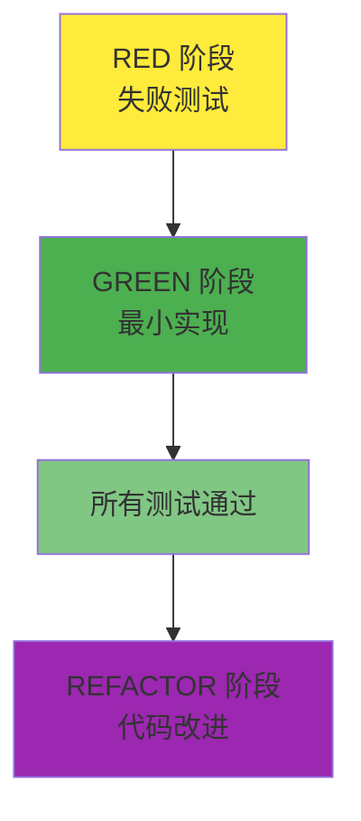
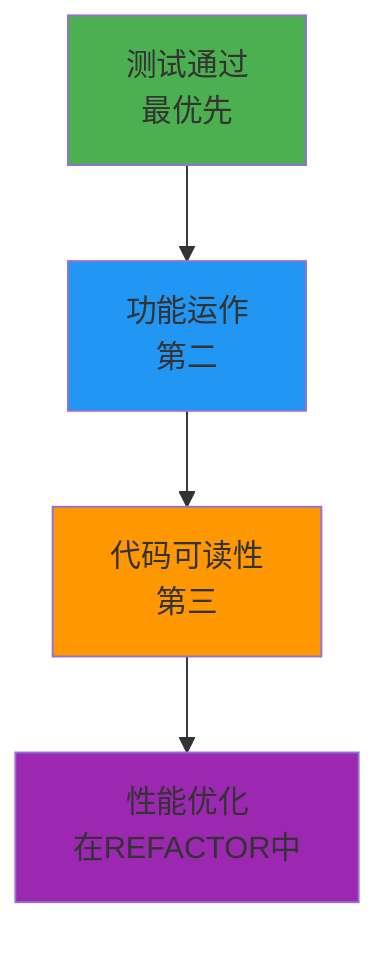

# TDD GREEN 阶段指南: 用最小实现通过测试

## 目录

1. [GREEN 阶段的目标与原则](#green-阶段的目标与原则)
2. [最小实现策略 (YAGNI 原则)](#最小实现策略-yagni-原则)
3. [快速通过测试的解决方案](#快速通过测试的解决方案)
4. [性能 vs 功能实现的平衡](#性能-vs-功能实现的平衡)
5. [实战代码示例](#实战代码示例)
6. [GREEN 阶段应避免的事项](#green-阶段应避免的事项)
7. [Git 提交策略 (GREEN 阶段)](#git-提交策略-green-阶段)
8. [GREEN 阶段检查清单](#green-阶段检查清单)

______________________________________________________________________

## GREEN 阶段的目标与原则

### GREEN 阶段的核心目标

GREEN 阶段唯一且明确的目标是**"使所有失败的测试通过"**。在这个阶段要记住:



### 1. 通过优先 (Passing First)

GREEN 阶段的哲学很简单:

- **通过胜于完美**: 能通过的代码优先于优美的代码
- **简单是美德**: 寻找最简单的解决方案
- **快速反馈**: 测试要快速通过才能进入下一阶段

### 2. YAGNI 原则 (You Aren't Gonna Need It)

> "不要实现现在不需要的功能"

```python
# 不好示例: 过度工程
class UserService:
    def __init__(self):
        self.cache = RedisCache()           # 暂不需要
        self.logger = StructuredLogger()    # 暂不需要
        self.metrics = PrometheusMetrics()  # 暂不需要
        self.validator = ComplexValidator() # 暂不需要

    def create_user(self, user_data):
        # 复杂逻辑...
        pass

# 好示例: 最小实现
class UserService:
    def create_user(self, user_data):
        # 仅测试通过所需的最小逻辑
        if not user_data.get("email"):
            raise ValueError("Email is required")

        return User(
            email=user_data["email"],
            name=user_data.get("name", "")
        )
```

### 3. KISS 原则 (Keep It Simple, Stupid)

简单的解决方案总是最佳的:

- **避免复杂性**: 避免复杂算法和设计模式
- **直观代码**: 其他开发者易于理解的代码
- **最小依赖**: 避免不必要的外部库或服务

______________________________________________________________________

## 最小实现策略 (YAGNI 原则)

### 1. 硬编码策略

有时硬编码是最好的选择:

```python
# RED 阶段测试
def test_get_current_temperature_should_return_25():
    """查询当前温度应返回 25 度"""
    response = temperature_service.get_current_temperature()
    assert response == 25

# GREEN 阶段最小实现
class TemperatureService:
    def get_current_temperature(self):
        # 返回硬编码值而非实际传感器
        return 25  # 通过测试的最小实现
```

**何时适合硬编码?**

- 测试只期望一个固定值时
- 外部依赖(传感器、API、数据库)复杂时
- 想要快速获得第一次通过时

### 2. 假实现 (Fake Implementation)

从简单的内存实现开始:

```python
# RED 阶段测试
def test_user_creation_should_return_user_with_id():
    """创建用户时应返回带 ID 的用户对象"""
    user_data = {"name": "John", "email": "john@example.com"}
    user = user_service.create_user(user_data)

    assert user.id is not None
    assert user.name == "John"
    assert user.email == "john@example.com"

# GREEN 阶段最小实现
class UserService:
    def __init__(self):
        self._users = {}  # 简单内存存储
        self._next_id = 1

    def create_user(self, user_data):
        # 最小验证逻辑
        if not user_data.get("email"):
            raise ValueError("Email is required")

        # 最简单的 ID 生成
        user_id = f"user_{self._next_id}"
        self._next_id += 1

        # 最小用户对象创建
        user = User(
            id=user_id,
            email=user_data["email"],
            name=user_data.get("name", "")
        )

        self._users[user_id] = user
        return user
```

### 3. 条件式最小实现

仅实现必需的条件:

```python
# RED 阶段测试
def test_admin_can_access_admin_panel():
    """管理员应该能访问管理面板"""
    admin = User(role="admin")
    assert auth_service.can_access_admin_panel(admin) is True

def test_regular_user_cannot_access_admin_panel():
    """普通用户不能访问管理面板"""
    user = User(role="user")
    assert auth_service.can_access_admin_panel(user) is False

def test_guest_cannot_access_admin_panel():
    """访客不能访问管理面板"""
    guest = User(role="guest")
    assert auth_service.can_access_admin_panel(guest) is False

# GREEN 阶段最小实现
class AuthService:
    def can_access_admin_panel(self, user):
        # 仅实现测试所需的最小条件
        return user.role == "admin"
```

### 4. 固定返回值策略

```python
# RED 阶段测试
def test_calculate_tax_should_return_10_percent():
    """所得税计算应返回 10%"""
    tax = tax_calculator.calculate_tax(1000)
    assert tax == 100

# GREEN 阶段最小实现
class TaxCalculator:
    def calculate_tax(self, income):
        # 对所有收入固定 10% (测试所需的最小实现)
        return income * 0.10
```

______________________________________________________________________

## 快速通过测试的解决方案

### 1. 分步方法

将复杂测试分解解决:

```python
# 复杂测试
def test_user_registration_complete_flow():
    """完整用户注册流程测试"""
    # 1. 用有效数据注册
    # 2. 确认邮件验证令牌发送
    # 3. 用令牌验证邮箱
    # 4. 已验证用户登录
    # 5. 确认接收 JWT 令牌

# GREEN 阶段: 逐步实现
class UserService:
    def register_user(self, user_data):
        # 第1步: 仅最小用户创建实现
        if not user_data.get("email"):
            raise ValueError("Email required")

        user = User(
            id=self._generate_id(),
            email=user_data["email"],
            is_verified=False  # 验证逻辑尚未实现
        )

        return user

    def send_verification_email(self, user):
        # 第2步: 假邮件发送
        return True  # 总是返回成功

    def verify_email(self, token):
        # 第3步: 假令牌验证
        return True  # 总是返回成功

    def login_user(self, email, password):
        # 第4步: 简单登录
        return {"token": "fake_jwt_token"}
```

### 2. 利用 Mock/Stub 移除依赖

```python
# RED 阶段测试
def test_order_processing_should_send_email():
    """订单处理应发送确认邮件"""
    order = Order(id="123", customer_email="customer@example.com")

    # 注入 Mock
    mock_email_service = Mock()
    order_service = OrderService(email_service=mock_email_service)

    # When
    order_service.process_order(order)

    # Then
    mock_email_service.send_order_confirmation.assert_called_once_with(order)

# GREEN 阶段最小实现
class OrderService:
    def __init__(self, email_service):
        self.email_service = email_service

    def process_order(self, order):
        # 最小订单处理逻辑
        order.status = "processed"
        order.processed_at = datetime.now()

        # 邮件发送 (无实际逻辑仅委托)
        self.email_service.send_order_confirmation(order)

        return order
```

### 3. 内存存储替代数据库

```python
# RED 阶段测试
def test_product_repository_can_save_and_retrieve():
    """产品存储库应能保存和检索"""
    product = Product(name="Laptop", price=999.99)

    repo = ProductRepository()
    saved_product = repo.save(product)
    retrieved_product = repo.get_by_id(saved_product.id)

    assert retrieved_product.name == "Laptop"
    assert retrieved_product.price == 999.99

# GREEN 阶段最小实现
class ProductRepository:
    def __init__(self):
        self._products = {}  # 使用内存而非数据库

    def save(self, product):
        # 最小 ID 生成
        if not hasattr(product, 'id') or not product.id:
            product.id = str(uuid.uuid4())

        self._products[product.id] = product
        return product

    def get_by_id(self, product_id):
        return self._products.get(product_id)
```

### 4. 简单验证

```python
# RED 阶段测试
def test_email_validation_should_reject_invalid_emails():
    """邮箱验证应拒绝无效邮箱"""
    invalid_emails = [
        "invalid-email",
        "@example.com",
        "user@",
        "user..name@example.com"
    ]

    for email in invalid_emails:
        assert email_validator.is_valid(email) is False

# GREEN 阶段最小实现
class EmailValidator:
    def is_valid(self, email):
        # 最简单的有效性验证
        if not email or "@" not in email:
            return False

        local, domain = email.split("@", 1)

        # 仅最小验证实现
        return len(local) > 0 and len(domain) > 0 and "." in domain
```

______________________________________________________________________

## 性能 vs 功能实现的平衡

### 1. 推迟性能优化

GREEN 阶段不要考虑性能:

```python
# 不好示例: GREEN 阶段尝试性能优化
class UserService:
    def __init__(self):
        self.user_cache = LRUCache(maxsize=1000)  # 不必要的复杂性
        self.db_pool = ConnectionPool(max_connections=20)  # 过度工程

    def get_user(self, user_id):
        # 复杂缓存逻辑
        if user_id in self.user_cache:
            return self.user_cache[user_id]

        # 复杂数据库连接管理
        with self.db_pool.get_connection() as conn:
            user = conn.execute("SELECT * FROM users WHERE id = ?", user_id)
            self.user_cache[user_id] = user
            return user

# 好示例: 简单实现
class UserService:
    def __init__(self):
        self.users = {}  # 简单内存存储

    def get_user(self, user_id):
        return self.users.get(user_id)  # 最小实现
```

### 2. 功能优先级



### 3. 数据库 vs 内存

| 情况 | GREEN 阶段选择 | REFACTOR 阶段 |
| ------------- | ------------------ | ----------------- |
| 简单 CRUD | 内存存储 | 实际数据库 |
| 复杂查询 | 硬编码结果 | 查询优化 |
| 大数据量 | 小测试数据 | 分页/索引 |
| 并发 | 忽略 | 锁/事务 |

```python
# GREEN 阶段: 基于内存
class OrderService:
    def __init__(self):
        self.orders = {}

    def create_order(self, order_data):
        order_id = f"order_{len(self.orders) + 1}"
        order = Order(id=order_id, **order_data)
        self.orders[order_id] = order
        return order

# REFACTOR 阶段将改进的内容:
# - 数据库连接
# - 事务管理
# - 并发控制
# - 数据库索引
# - 缓存策略
```

### 4. 外部 API 通信

```python
# GREEN 阶段: 假 API 响应
class PaymentService:
    def process_payment(self, payment_data):
        # 假响应而非实际 API 调用
        if payment_data["amount"] > 0:
            return {
                "status": "success",
                "transaction_id": f"txn_{uuid.uuid4().hex[:8]}"
            }
        else:
            return {
                "status": "failed",
                "error": "Invalid amount"
            }

# REFACTOR 阶段将改进的内容:
# - 实际 API 通信
# - 重试逻辑
# - 错误处理
# - 超时管理
# - 日志和监控
```

______________________________________________________________________

## 实战代码示例

### Python 示例: 用户认证服务

#### RED 阶段测试 (前一阶段编写)

```python
# tests/test_auth.py
def test_login_with_valid_credentials_should_return_jwt_token():
    """使用有效凭证登录应返回 JWT 令牌"""
    login_data = {"email": "test@example.com", "password": "correct_password"}
    response = client.post("/auth/login", json=login_data)

    assert response.status_code == 200
    assert "access_token" in response.json()
    assert response.json()["token_type"] == "bearer"

def test_login_with_invalid_credentials_should_return_401():
    """使用错误凭证登录应返回 401 错误"""
    login_data = {"email": "test@example.com", "password": "wrong_password"}
    response = client.post("/auth/login", json=login_data)

    assert response.status_code == 401
    assert response.json()["detail"] == "Invalid credentials"
```

#### GREEN 阶段最小实现

```python
# src/auth_service.py
import jwt
from datetime import datetime, timedelta
from typing import Dict, Any

class AuthService:
    def __init__(self):
        # 假用户数据库
        self.users = {
            "test@example.com": {
                "password": "correct_password",
                "user_id": "user_123"
            }
        }
        self.secret_key = "fake_secret_key_for_testing"

    def authenticate(self, email: str, password: str) -> Dict[str, Any]:
        """最小认证逻辑"""
        # 用户确认
        if email not in self.users:
            raise AuthenticationError("Invalid credentials")

        # 密码确认 (简单字符串比较)
        if self.users[email]["password"] != password:
            raise AuthenticationError("Invalid credentials")

        # JWT 令牌生成 (仅最小声明)
        token_payload = {
            "sub": self.users[email]["user_id"],
            "email": email,
            "exp": datetime.utcnow() + timedelta(hours=24)
        }

        access_token = jwt.encode(token_payload, self.secret_key, algorithm="HS256")

        return {
            "access_token": access_token,
            "token_type": "bearer"
        }

# src/main.py (FastAPI 端点)
from fastapi import FastAPI, HTTPException
from pydantic import BaseModel

app = FastAPI()

class LoginRequest(BaseModel):
    email: str
    password: str

@app.post("/auth/login")
def login(login_data: LoginRequest):
    auth_service = AuthService()

    try:
        result = auth_service.authenticate(login_data.email, login_data.password)
        return result
    except AuthenticationError:
        raise HTTPException(status_code=401, detail="Invalid credentials")

class AuthenticationError(Exception):
    pass
```

**执行结果:**

```bash
$ pytest tests/test_auth.py -v
============================ test session starts ============================
tests/test_auth.py::test_login_with_valid_credentials_should_return_jwt_token PASSED
tests/test_auth.py::test_login_with_invalid_credentials_should_return_401 PASSED

============================= 2 passed in 0.12s ==============================
```

______________________________________________________________________

## GREEN 阶段应避免的事项

### 1. 过度设计 (Over-Engineering)

**应避免的事项:**

- 应用复杂设计模式
- 不必要的抽象层
- 预测未来需求
- 尝试性能优化

```python
# 不好示例: GREEN 阶段的过度工程
class UserFactory(AbstractFactory):
    def create_user(self, user_type: UserType) -> User:
        if user_type == UserType.ADMIN:
            return AdminUserBuilder().build()
        elif user_type == UserType.CUSTOMER:
            return CustomerUserBuilder().build()
        # ... 复杂工厂模式

class UserService:
    def __init__(self):
        self.factory = UserFactory()
        self.validator_chain = ValidatorChain([
            EmailValidator(),
            PasswordValidator(),
            NameValidator(),
            # ... 复杂链
        ])
        self.cache_manager = CacheManager()
        self.event_bus = EventBus()

    def create_user(self, user_data):
        # 复杂创建逻辑
        pass

# 好示例: 简单实现
class UserService:
    def create_user(self, user_data):
        if not user_data.get("email"):
            raise ValueError("Email required")

        return User(
            id=f"user_{uuid.uuid4().hex[:8]}",
            email=user_data["email"],
            name=user_data.get("name", "")
        )
```

### 2. 引入外部依赖

**GREEN 阶段应避免的外部依赖:**

- 数据库连接
- 外部 API 调用
- 消息队列
- 文件系统访问

```python
# 不好示例: 不必要的外部依赖
class UserService:
    def __init__(self):
        self.db = PostgreSQLDatabase("connection_string")  # 不必要
        self.redis = RedisClient()                        # 不必要
        self.email_api = SendGridAPI()                    # 不必要

    def create_user(self, user_data):
        # 数据库保存 (增加复杂性)
        query = "INSERT INTO users (email, name) VALUES (?, ?)"
        self.db.execute(query, user_data["email"], user_data["name"])

        # 缓存保存 (不必要的复杂性)
        self.redis.set(f"user:{email}", user_data)

        # 邮件发送 (外部依赖)
        self.email_api.send_welcome_email(user_data["email"])

# 好示例: 无依赖实现
class UserService:
    def __init__(self):
        self.users = {}  # 简单内存存储

    def create_user(self, user_data):
        user = User(
            id=f"user_{len(self.users) + 1}",
            email=user_data["email"],
            name=user_data.get("name", "")
        )
        self.users[user.id] = user
        return user
```

### 3. 不准确的实现

**为通过测试的不准确方法:**

- 硬编码测试结果
- 总是成功的假实现
- 与实际业务逻辑不同的行为

```python
# 不好示例: 不准确实现
class Calculator:
    def add(self, a, b):
        # 仅依赖测试的错误实现
        if a == 2 and b == 3:
            return 5  # 仅针对特定测试用例
        return 0      # 其他情况返回错误结果

# 好示例: 正确实现
class Calculator:
    def add(self, a, b):
        # 实际加法逻辑
        return a + b
```

### 4. 修改测试解决问题

```python
# 不好示例: 修改测试解决问题
# 原测试
def test_user_age_validation():
    user = User(age=15)
    assert user.is_adult() is False

# 因实现困难修改测试 (不好的方式)
def test_user_age_validation():
    user = User(age=20)  # 改为容易的情况
    assert user.is_adult() is True

# 好示例: 修改实现解决问题
class User:
    def is_adult(self):
        return self.age >= 18
```

______________________________________________________________________

## Git 提交策略 (GREEN 阶段)

### 1. 提交消息约定

GREEN 阶段提交应表明实现完成:

```bash
# 好的提交消息示例
git commit -m "🟢 feat(AUTH-001): implement user authentication service

- Add AuthService with basic email/password validation
- Add JWT token generation functionality
- Add /auth/login endpoint with proper error handling
- Implement in-memory user storage for testing

All authentication tests now passing. Next: REFACTOR phase."

# 简单版本
git commit -m "🟢 feat(AUTH-001): implement basic auth functionality"
```

### 2. 提交单位和内容

**一个 GREEN 提交应包含:**

- 使 RED 阶段所有失败测试通过的最小实现
- 相关领域逻辑
- 基本错误处理

```bash
# 提交前状态确认
git status
# 修改的文件:
# src/auth_service.py
# src/main.py
# tests/test_auth.py (未修改)

# 提交
git add src/auth_service.py src/main.py
git commit -m "🟢 feat(AUTH-001): implement authentication service"
```

### 3. 分支管理

```bash
# GREEN 阶段完成后的分支状态
git status
# On branch feature/user-authentication
# Changes to be committed:
#   modified:   src/auth_service.py
#   modified:   src/main.py

# 确认测试通过
pytest tests/test_auth.py -v
# 2 passed

# GREEN 阶段提交
git commit -m "🟢 feat(AUTH-001): implement authentication service"

# 准备 REFACTOR 阶段
git checkout -b refactor/user-authentication-improvements
```

### 4. 代码审查要点

GREEN 阶段代码审查检查清单:

```markdown
## GREEN 阶段审查检查清单

### 功能实现
- [ ] 所有 RED 测试是否通过?
- [ ] 实现是否符合测试意图?
- [ ] 是否是最小实现? (非过度工程)

### 代码质量
- [ ] 代码是否易于理解?
- [ ] 是否没有不必要的复杂性?
- [ ] 是否使用了适当的变量名和函数名?

### 测试覆盖
- [ ] 测试是否验证实际逻辑?
- [ ] 测试和实现是否同步?

### 技术决策
- [ ] 是否选择了简单解决方案?
- [ ] 是否最小化了外部依赖?
- [ ] 是否未预测未来需求?
```

### 5. CI/CD 管道

```yaml
# .github/workflows/test.yml
name: Test Suite

on:
  push:
    branches: [ main, develop, feature/* ]
  pull_request:
    branches: [ main ]

jobs:
  test:
    runs-on: ubuntu-latest

    steps:
    - uses: actions/checkout@v3

    - name: Set up Python
      uses: actions/setup-python@v4
      with:
        python-version: '3.11'

    - name: Install dependencies
      run: |
        pip install -r requirements.txt
        pip install -r requirements-test.txt

    - name: Run tests
      run: |
        pytest tests/ -v --tb=short --cov=src --cov-fail-under=80

    - name: Check GREEN phase
      run: |
        # GREEN 阶段所有测试都必须通过
        pytest tests/ -v
        if [ $? -ne 0 ]; then
          echo "GREEN phase: All tests must pass!"
          exit 1
        fi
```

______________________________________________________________________

## GREEN 阶段检查清单

### 实现质量检查清单

- [ ] **所有测试通过**: RED 阶段编写的所有测试是否通过?
- [ ] **最小实现**: 是否遵循 YAGNI 原则?
- [ ] **简单性**: 代码是否简单易懂?
- [ ] **功能中心**: 是否专注于功能实现而非性能优化?

### 功能准确性检查清单

- [ ] **需求满足**: 是否实现了测试验证的所有需求?
- [ ] **边缘情况**: 是否处理边界值和异常情况?
- [ ] **错误处理**: 是否返回适当的错误?
- [ ] **数据有效性**: 是否实现了输入数据验证?

### 技术决策检查清单

- [ ] **依赖最小化**: 是否避免了不必要的外部依赖?
- [ ] **基于内存**: 是否使用内存存储替代数据库?
- [ ] **允许硬编码**: 是否适当使用简单硬编码?
- [ ] **Mock/Stub 使用**: 是否使用 Mock/Stub 替代外部服务?

### 代码风格检查清单

- [ ] **一致风格**: 是否遵循团队代码风格指南?
- [ ] **有意义名称**: 变量名、函数名、类名是否明确?
- [ ] **适当注释**: 复杂逻辑是否添加了注释?
- [ ] **函数大小**: 函数是否不会太大?

### 与测试一致性检查清单

- [ ] **测试通过**: 重构后所有测试是否仍通过?
- [ ] **现有测试**: 现有测试是否仍通过?
- [ ] **测试意图**: 实现是否准确反映测试意图?
- [ ] **测试覆盖**: 新功能是否得到适当测试?

### Git 工作流检查清单

- [ ] **提交消息**: 是否明确表示 GREEN 阶段完成?
- [ ] **标签连接**: 是否用 @TAG:ID 连接相关 SPEC?
- [ ] **文件管理**: 是否未提交不必要的文件?
- [ ] **分支清理**: 是否在适当分支上工作?

### 下一步准备检查清单

- [ ] **REFACTOR 准备**: 代码是否处于可重构状态?
- [ ] **技术债务**: 是否没有严重技术债务?
- [ ] **文档化**: 复杂部分是否已文档化?
- [ ] **同步**: 是否与团队成员共享状态?

______________________________________________________________________

## 结论

GREEN 阶段是 TDD 循环中**实际实现功能的第一阶段**。这个阶段的成功:

1. **快速反馈循环**提高开发速度
2. **简单实现**管理复杂性
3. **测试通过**明确展示进度
4. **REFACTOR 阶段准备**为代码质量改进奠定基础

在 GREEN 阶段最重要的是记住**"能通过的实现而非完美实现"**这一事实。

**GREEN 阶段的成功保证 REFACTOR 阶段的成功!** 🚀

______________________________________________________________________

## 下一步

完成 GREEN 阶段后，转到下一阶段:

- [**REFACTOR 阶段指南**](./refactor.md) - 代码质量改进和重构
