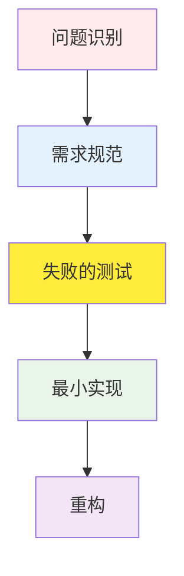
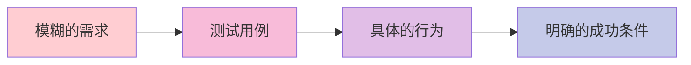

# TDD RED 阶段指南：编写失败测试的哲学与实践

## 目录

1. [RED 阶段的哲学背景](#red-阶段的哲学背景)
2. [RED 阶段的重要性](#red-阶段的重要性)
3. [编写失败测试的方法](#编写失败测试的方法)
4. [测试用例设计策略](#测试用例设计策略)
5. [边界值测试和异常情况](#边界值测试和异常情况)
6. [实战代码示例](#实战代码示例)
7. [常见错误和防范方法](#常见错误和防范方法)
8. [Git 提交策略 (RED 阶段)](#git-提交策略-red-阶段)
9. [RED 阶段检查清单](#red-阶段检查清单)

______________________________________________________________________

## RED 阶段的哲学背景

### 为什么从失败的测试开始？

TDD 的 RED 阶段不仅仅是"编写失败的测试"，它包含了深刻的哲学。这是一种改变软件开发根本方法的范式转换。

#### 1. 问题定义优先原则



传统开发方式：

- 实现 → 测试 → 调试（修改成本高）

TDD 方式：

- 规范 → 测试 → 实现（修改成本低）

#### 2. 失败的价值

**失败是成功之母这句话在 TDD 中字面上适用：**

- **有意的失败**：清楚定义我们需要实现什么
- **可预测的失败**：我们已经知道测试会失败
- **学习性失败**：通过失败理解系统边界

```python
# 良好 RED 阶段的示例
def test_user_authentication_with_valid_credentials():
    """使用有效凭据进行身份验证时应返回 JWT 令牌"""
    # Given: 有效的用户凭据
    valid_credentials = {
        "email": "user@example.com",
        "password": "correct_password"
    }

    # When: 身份验证请求
    response = auth_service.authenticate(valid_credentials)

    # Then: 返回 JWT 令牌
    assert response.status_code == 200
    assert "access_token" in response.json()
    assert response.json()["token_type"] == "bearer"
```

这个测试现在运行会失败。因为 `auth_service` 还不存在。**这就是 RED 阶段的核心。**

#### 3. 认知负荷减少

RED 阶段显著减少开发者的认知负荷：

- **一次只关注一个问题**：专注于当前测试用例
- **明确的成功标准**："测试通过"是唯一目标
- **渐进式进展**：重复小的成功经验

______________________________________________________________________

## RED 阶段的重要性

### 1. 需求具体化



**示例：**

| 模糊的需求 | 测试用例具体化 |
| ------------------ | ------------------------------------------------- |
| "用户身份验证功能" | "使用电子邮件和密码登录时返回 JWT 令牌" |
| "数据验证" | "电子邮件格式错误时返回 400 错误" |
| "权限管理" | "只有管理员可以访问删除 API" |

### 2. 强制设计

先编写测试自然会导致良好的设计：

- **依赖注入**：可测试的结构
- **单一职责原则**：小而专注的函数
- **基于接口的设计**：测试与实现分离

```python
# RED 阶段强制的良好设计
class UserService:
    def __init__(self, user_repository: UserRepository, email_service: EmailService):
        self.user_repository = user_repository
        self.email_service = email_service

    def create_user(self, user_data: dict) -> User:
        # 实现在 GREEN 阶段
        pass
```

### 3. 风险缓解

| 风险类型 | RED 阶段的解决方案 |
| ------------------- | ---------------------------------- |
| **需求误解** | 通过测试定义明确的行为 |
| **过度工程** | 从最小测试开始 |
| **集成问题** | 在隔离环境中使用单元测试验证 |
| **回归错误** | 通过测试套件持续验证 |

______________________________________________________________________

## 编写失败测试的方法

### 1. AAA 模式 (Arrange-Act-Assert)

所有测试都应该有明确的结构：

```python
def test_product_creation_with_valid_data():
    # Arrange (准备)
    valid_product_data = {
        "name": "Test Product",
        "price": 29.99,
        "category": "electronics"
    }

    # Act (执行)
    result = product_service.create_product(valid_product_data)

    # Assert (验证)
    assert result["id"] is not None
    assert result["name"] == "Test Product"
    assert result["price"] == 29.99
```

### 2. Given-When-Then 模式

BDD 风格的更具描述性的方法：

```python
def test_order_processing_with_sufficient_inventory():
    # Given: 库存充足的商品和订单信息
    product = create_product(name="Laptop", inventory=10)
    order_request = {"product_id": product.id, "quantity": 2}

    # When: 订单处理请求
    order_result = order_service.process_order(order_request)

    # Then: 订单成功创建且库存减少
    assert order_result.status == "confirmed"
    assert product.inventory == 8
```

### 3. 测试命名约定

良好的测试名称充当文档：

```python
# 好的示例（传达清晰的意图）
def test_user_registration_with_duplicate_email_should_return_409()
def test_password_reset_with_invalid_token_should_return_400()
def test_product_search_with_empty_query_should_return_all_products()

# 不好的示例（意图模糊）
def test_user_registration()
def test_password_reset()
def test_product_search()
```

### 4. 失败确认步骤

在 RED 阶段，**必须确认测试失败**：

```bash
# 运行测试
pytest tests/test_user_service.py::test_user_registration_with_duplicate_email_should_return_409 -v

# 预期结果：FAILED
# 实际结果：AssertionError: Expected 409 but got 201
```

这个失败确认很重要：

- 确认测试实际上在验证某些东西
- 防止误报（false positive）
- 在实现之前重新审查需求

______________________________________________________________________

## 测试用例设计策略

### 1. 基于边界的测试 (Boundary-Based Testing)

```python
def test_age_validation():
    """年龄验证：仅允许 0-120 岁"""

    # 边界值测试
    test_cases = [
        (-1, False),   # 边界以下（预期失败）
        (0, True),     # 最小边界（预期成功）
        (1, True),     # 边界上方（预期成功）
        (119, True),   # 边界下方（预期成功）
        (120, True),   # 最大边界（预期成功）
        (121, False),  # 边界以上（预期失败）
    ]

    for age, expected_valid in test_cases:
        result = user_service.validate_age(age)
        assert result.is_valid == expected_valid, f"Age {age} validation failed"
```

### 2. 等价类划分 (Equivalence Partitioning)

```python
def test_email_validation():
    """电子邮件格式验证"""

    # 有效电子邮件组
    valid_emails = [
        "user@example.com",
        "user.name@example.co.kr",
        "user+tag@example.org",
        "123@example.com"
    ]

    # 无效电子邮件组
    invalid_emails = [
        "invalid-email",
        "@example.com",
        "user@",
        "user..name@example.com",
        "user@.com"
    ]

    for email in valid_emails:
        assert email_service.is_valid(email), f"Valid email {email} marked as invalid"

    for email in invalid_emails:
        assert not email_service.is_valid(email), f"Invalid email {email} marked as valid"
```

### 3. 决策表 (Decision Table)

```python
def test_user_permission_check():
    """用户权限检查决策表"""

    test_cases = [
        # (role, is_active, has_subscription, expected_result)
        ("admin", True, True, True),    # 管理员始终可以访问
        ("admin", False, True, True),   # 非活动管理员也可以访问
        ("user", True, True, True),     # 活动用户 + 订阅 = 可以访问
        ("user", True, False, False),   # 活动用户 + 无订阅 = 无法访问
        ("user", False, True, False),   # 非活动用户 = 无法访问
        ("guest", True, True, False),   # 访客 = 无法访问
    ]

    for role, is_active, has_subscription, expected in test_cases:
        user = create_user(role=role, is_active=is_active, has_subscription=has_subscription)
        result = permission_service.can_access_premium_content(user)
        assert result == expected, f"Permission check failed for {role}"
```

### 4. 状态转换测试

```python
def test_order_state_transitions():
    """订单状态转换测试"""

    # 有效状态转换
    valid_transitions = [
        ("pending", "confirmed"),
        ("confirmed", "processing"),
        ("processing", "shipped"),
        ("shipped", "delivered"),
        ("pending", "cancelled"),
        ("confirmed", "cancelled")
    ]

    # 无效状态转换
    invalid_transitions = [
        ("delivered", "processing"),
        ("cancelled", "confirmed"),
        ("shipped", "pending")
    ]

    for from_state, to_state in valid_transitions:
        order = create_order(state=from_state)
        result = order_service.transition_state(order, to_state)
        assert result.success, f"Valid transition {from_state} -> {to_state} failed"

    for from_state, to_state in invalid_transitions:
        order = create_order(state=from_state)
        result = order_service.transition_state(order, to_state)
        assert not result.success, f"Invalid transition {from_state} -> {to_state} should fail"
```

______________________________________________________________________

## 边界值测试和异常情况

### 1. 数字边界值测试

```python
def test_product_price_validation():
    """商品价格验证：0.01 ~ 999999.99"""

    boundary_tests = [
        # (price, expected_valid, description)
        (0, False, "0 元不可用"),
        (0.009, False, "低于 0.01 元不可用"),
        (0.01, True, "最小金额"),
        (0.011, True, "超过最小金额"),
        (999999.99, True, "最大金额"),
        (1000000, False, "超过最大金额"),
    ]

    for price, expected, description in boundary_tests:
        result = product_service.validate_price(price)
        assert result.is_valid == expected, f"Price validation failed: {description}"
```

### 2. 字符串边界值测试

```python
def test_username_length_validation():
    """用户名长度验证：3-20 字符"""

    test_cases = [
        ("", False, "空字符串"),
        ("ab", False, "2 字符（低于最小值）"),
        ("abc", True, "3 字符（最小值）"),
        ("a" * 19, True, "19 字符（最大值-1）"),
        ("a" * 20, True, "20 字符（最大值）"),
        ("a" * 21, False, "21 字符（超过最大值）"),
        ("가나다", True, "韩文 3 字符"),
        ("가" * 20, True, "韩文 20 字符"),
        ("가" * 21, False, "韩文 21 字符"),
    ]

    for username, expected, description in test_cases:
        result = user_service.validate_username(username)
        assert result.is_valid == expected, f"Username validation failed: {description}"
```

### 3. 日期/时间边界值测试

```python
def test_event_registration_deadline():
    """活动注册截止日期测试"""

    now = datetime.now()

    test_cases = [
        # (registration_time, event_deadline, expected_result, description)
        (now - timedelta(days=1), now, False, "截止后 1 天"),
        (now - timedelta(seconds=1), now, False, "截止后 1 秒"),
        (now, now, True, "截止时刻"),
        (now - timedelta(seconds=1), now + timedelta(seconds=1), True, "截止前 1 秒"),
        (now - timedelta(days=1), now + timedelta(days=1), True, "截止前 1 天"),
    ]

    for reg_time, deadline, expected, description in test_cases:
        result = event_service.can_register(reg_time, deadline)
        assert result == expected, f"Deadline test failed: {description}"
```

### 4. 异常情况系统方法

```python
def test_file_upload_edge_cases():
    """文件上传异常情况"""

    exception_cases = [
        # (file_input, expected_exception, description)
        (None, ValueError, "None 文件输入"),
        ("", ValueError, "空字符串文件路径"),
        ("/invalid/path", FileNotFoundError, "文件不存在"),
        ("./large_file.txt", FileTooLargeError, "文件大小超限"),
        ("./virus.exe", SecurityError, "安全风险文件"),
        ("./malformed.jpg", InvalidFileFormatError, "文件格式错误"),
    ]

    for file_input, expected_exception, description in exception_cases:
        with pytest.raises(expected_exception):
            file_service.upload(file_input)
```

______________________________________________________________________

## 实战代码示例

### Python 示例 (FastAPI + Pytest)

#### RED 阶段：用户身份验证 API

```python
# tests/test_auth.py
import pytest
from fastapi.testclient import TestClient
from src.main import app

client = TestClient(app)

def test_login_with_valid_credentials_should_return_jwt_token():
    """
    WHEN 使用有效凭据请求登录
    THEN 应返回 JWT 访问令牌
    """
    # Given
    login_data = {
        "email": "test@example.com",
        "password": "correct_password_123"
    }

    # When
    response = client.post("/auth/login", json=login_data)

    # Then
    assert response.status_code == 200
    response_data = response.json()
    assert "access_token" in response_data
    assert response_data["token_type"] == "bearer"
    assert len(response_data["access_token"]) > 100  # JWT 令牌长度验证

def test_login_with_invalid_email_should_return_401():
    """
    WHEN 使用错误电子邮件请求登录
    THEN 应返回 401 Unauthorized 错误
    """
    # Given
    login_data = {
        "email": "invalid@example.com",
        "password": "some_password"
    }

    # When
    response = client.post("/auth/login", json=login_data)

    # Then
    assert response.status_code == 401
    assert response.json()["detail"] == "Invalid credentials"

def test_login_with_invalid_password_should_return_401():
    """
    WHEN 使用错误密码请求登录
    THEN 应返回 401 Unauthorized 错误
    """
    # Given
    login_data = {
        "email": "test@example.com",
        "password": "wrong_password"
    }

    # When
    response = client.post("/auth/login", json=login_data)

    # Then
    assert response.status_code == 401
    assert response.json()["detail"] == "Invalid credentials"

def test_login_with_missing_fields_should_return_422():
    """
    WHEN 缺少必填字段请求登录
    THEN 应返回 422 Validation Error
    """
    # Given: 缺少电子邮件字段
    login_data = {
        "password": "some_password"
    }

    # When
    response = client.post("/auth/login", json=login_data)

    # Then
    assert response.status_code == 422
    assert "email" in response.json()["detail"][0]["loc"]
```

运行这些测试当然会失败。因为 `/auth/login` 端点还不存在。

```bash
$ pytest tests/test_auth.py -v
============================ test session starts ============================
collected 4 items

tests/test_auth.py::test_login_with_valid_credentials_should_return_jwt_token FAILED
tests/test_auth.py::test_login_with_invalid_email_should_return_401 FAILED
tests/test_auth.py::test_login_with_invalid_password_should_return_401 FAILED
tests/test_auth.py::test_login_with_missing_fields_should_return_422 FAILED

============================= 4 failed in 0.12s ==============================
```

**这是完美的 RED 阶段结果！**

### TypeScript 示例 (Jest + Express)

#### RED 阶段：待办事项管理 API

```typescript
// tests/todo-api.test.ts
import request from 'supertest';
import app from '../src/app';

describe('Todo API', () => {
  describe('POST /todos', () => {
    it('should create a new todo with valid data and return 201', async () => {
      // Given
      const todoData = {
        title: 'Learn TDD',
        description: 'Master Test-Driven Development',
        dueDate: '2024-12-31'
      };

      // When
      const response = await request(app)
        .post('/todos')
        .send(todoData);

      // Then
      expect(response.status).toBe(201);
      expect(response.body).toHaveProperty('id');
      expect(response.body.title).toBe(todoData.title);
      expect(response.body.description).toBe(todoData.description);
      expect(response.body.completed).toBe(false);
    });

    it('should return 400 when title is missing', async () => {
      // Given
      const invalidTodoData = {
        description: 'Missing title field',
        dueDate: '2024-12-31'
      };

      // When
      const response = await request(app)
        .post('/todos')
        .send(invalidTodoData);

      // Then
      expect(response.status).toBe(400);
      expect(response.body.error).toContain('title is required');
    });

    it('should return 400 when title exceeds 200 characters', async () => {
      // Given
      const longTitle = 'a'.repeat(201);
      const invalidTodoData = {
        title: longTitle,
        description: 'Too long title'
      };

      // When
      const response = await request(app)
        .post('/todos')
        .send(invalidTodoData);

      // Then
      expect(response.status).toBe(400);
      expect(response.body.error).toContain('title must be less than 200 characters');
    });
  });

  describe('GET /todos', () => {
    it('should return empty array when no todos exist', async () => {
      // When
      const response = await request(app)
        .get('/todos');

      // Then
      expect(response.status).toBe(200);
      expect(response.body).toEqual([]);
    });

    it('should return all todos when todos exist', async () => {
      // This test would need setup in GREEN phase
      // For RED phase, we just define the expectation

      // When
      const response = await request(app)
        .get('/todos');

      // Then
      expect(response.status).toBe(200);
      expect(Array.isArray(response.body)).toBe(true);
    });
  });
});
```

### Java 示例 (JUnit + Spring Boot)

#### RED 阶段：用户管理服务

```java
// src/test/java/com/example/service/UserServiceTest.java
import org.junit.jupiter.api.Test;
import org.junit.jupiter.api.DisplayName;
import static org.junit.jupiter.api.Assertions.*;
import static org.assertj.core.api.Assertions.*;

class UserServiceTest {

    @Test
    @DisplayName("使用有效用户信息注册时应成功")
    void createUser_WithValidData_ShouldReturnUser() {
        // Given
        UserCreationRequest request = new UserCreationRequest(
            "test@example.com",
            "password123!",
            "Test User"
        );

        // When
        User result = userService.createUser(request);

        // Then
        assertNotNull(result.getId());
        assertEquals(request.getEmail(), result.getEmail());
        assertEquals(request.getName(), result.getName());
        assertNotNull(result.getCreatedAt());
        assertFalse(result.isEmailVerified());
    }

    @Test
    @DisplayName("使用重复电子邮件注册时应抛出异常")
    void createUser_WithDuplicateEmail_ShouldThrowException() {
        // Given
        UserCreationRequest request = new UserCreationRequest(
            "existing@example.com",
            "password123!",
            "Existing User"
        );

        // When & Then
        EmailAlreadyExistsException exception = assertThrows(
            EmailAlreadyExistsException.class,
            () -> userService.createUser(request)
        );

        assertEquals("Email already exists: existing@example.com", exception.getMessage());
    }

    @Test
    @DisplayName("使用无效电子邮件格式注册时应抛出异常")
    void createUser_WithInvalidEmail_ShouldThrowException() {
        // Given
        UserCreationRequest request = new UserCreationRequest(
            "invalid-email",
            "password123!",
            "Test User"
        );

        // When & Then
        ValidationException exception = assertThrows(
            ValidationException.class,
            () -> userService.createUser(request)
        );

        assertTrue(exception.getMessage().contains("Invalid email format"));
    }

    @Test
    @DisplayName("使用弱密码注册时应抛出异常")
    void createUser_WithWeakPassword_ShouldThrowException() {
        // Given
        UserCreationRequest request = new UserCreationRequest(
            "test@example.com",
            "123",
            "Test User"
        );

        // When & Then
        ValidationException exception = assertThrows(
            ValidationException.class,
            () -> userService.createUser(request)
        );

        assertTrue(exception.getMessage().contains("Password too weak"));
    }
}
```

### Go 示例 (Go Testing)

#### RED 阶段：产品库存管理

```go
// product_service_test.go
package service

import (
    "errors"
    "testing"
)

func TestProductService_CreateProduct(t *testing.T) {
    service := NewProductService()

    t.Run("使用有效产品信息创建时成功", func(t *testing.T) {
        // Given
        product := &Product{
            Name:        "Test Product",
            Price:       29.99,
            Category:    "electronics",
            Stock:       100,
        }

        // When
        result, err := service.CreateProduct(product)

        // Then
        if err != nil {
            t.Fatalf("Expected no error, got %v", err)
        }

        if result.ID == "" {
            t.Error("Expected product ID to be generated")
        }

        if result.Name != product.Name {
            t.Errorf("Expected name %s, got %s", product.Name, result.Name)
        }
    })

    t.Run("价格为 0 或以下时创建失败", func(t *testing.T) {
        // Given
        product := &Product{
            Name:     "Invalid Product",
            Price:    -10.0,
            Category: "electronics",
            Stock:    100,
        }

        // When
        _, err := service.CreateProduct(product)

        // Then
        if err == nil {
            t.Error("Expected error for invalid price")
        }

        if !errors.Is(err, ErrInvalidPrice) {
            t.Errorf("Expected ErrInvalidPrice, got %v", err)
        }
    })

    t.Run("库存为负数时创建失败", func(t *testing.T) {
        // Given
        product := &Product{
            Name:     "Invalid Product",
            Price:    29.99,
            Category: "electronics",
            Stock:    -5,
        }

        // When
        _, err := service.CreateProduct(product)

        // Then
        if err == nil {
            t.Error("Expected error for negative stock")
        }

        if !errors.Is(err, ErrInvalidStock) {
            t.Errorf("Expected ErrInvalidStock, got %v", err)
        }
    })
}

func TestProductService_UpdateStock(t *testing.T) {
    service := NewProductService()

    t.Run("减少库存时正常运行", func(t *testing.T) {
        // Given
        product := &Product{Name: "Test", Price: 10.0, Stock: 100}
        created, _ := service.CreateProduct(product)

        // When
        err := service.UpdateStock(created.ID, 90) // 100 -> 90

        // Then
        if err != nil {
            t.Fatalf("Expected no error, got %v", err)
        }

        updated, err := service.GetProduct(created.ID)
        if err != nil {
            t.Fatalf("Expected no error, got %v", err)
        }

        if updated.Stock != 90 {
            t.Errorf("Expected stock 90, got %d", updated.Stock)
        }
    })

    t.Run("将库存减少到负数时失败", func(t *testing.T) {
        // Given
        product := &Product{Name: "Test", Price: 10.0, Stock: 5}
        created, _ := service.CreateProduct(product)

        // When
        err := service.UpdateStock(created.ID, -10) // 5 -> -5

        // Then
        if err == nil {
            t.Error("Expected error for negative stock")
        }

        if !errors.Is(err, ErrInsufficientStock) {
            t.Errorf("Expected ErrInsufficientStock, got %v", err)
        }
    })
}
```

______________________________________________________________________

## 常见错误和防范方法

### 1. 测试过大

**问题：**

```python
# 不好的示例：一个测试验证太多东西
def test_user_complete_flow():
    # 用户创建
    # 登录
    # 个人资料更新
    # 帖子创建
    # 评论创建
    # 登出
    # ... 数十行代码
```

**解决方案：**

```python
# 好的示例：每个测试专注于一个行为
def test_user_registration_with_valid_data()
def test_user_login_with_valid_credentials()
def test_user_profile_update()
def test_post_creation()
def test_comment_creation()
```

### 2. 依赖实现细节的测试

**问题：**

```python
# 不好的示例：依赖数据库模式
def test_user_creation():
    user = User(name="John", email="john@example.com")
    assert user._password_hash.startswith("bcrypt$")
    assert user.created_at.microsecond == 0  # 依赖数据库精度
```

**解决方案：**

```python
# 好的示例：仅依赖公共接口
def test_user_creation():
    user = User(name="John", email="john@example.com")
    assert user.name == "John"
    assert user.email == "john@example.com"
    assert user.is_password_valid("some_password")  # 使用公共方法
```

### 3. 过度重用测试数据

**问题：**

```python
# 不好的示例：测试之间产生依赖
@pytest.fixture
def sample_user():
    return User.objects.create(name="John", email="john@example.com")

def test_user_update(sample_user):
    sample_user.name = "Jane"
    sample_user.save()
    # 此测试修改 sample_user 影响其他测试

def test_user_delete(sample_user):
    # 可能受到前一个测试的影响
    pass
```

**解决方案：**

```python
# 好的示例：每个测试使用独立数据
def test_user_update():
    user = User.objects.create(name="John", email="john@example.com")
    # 测试逻辑
    pass

def test_user_delete():
    user = User.objects.create(name="John", email="john@example.com")
    # 独立测试
    pass
```

### 4. 不当使用 Mock/Stub

**问题：**

```python
# 不好的示例：过度 mocking 不验证实际行为
def test_email_service():
    with patch('email_service.send_email') as mock_send:
        mock_send.return_value = True

        result = user_service.send_welcome_email("user@example.com")

        assert result is True
        # 实际电子邮件逻辑完全未验证
```

**解决方案：**

```python
# 好的示例：验证实际逻辑或集成测试
def test_email_service_with_real_provider():
    # 使用实际电子邮件提供商或测试提供商
    service = EmailService(test_mode=True)
    result = service.send_welcome_email("test@example.com")

    assert result is True
    assert len(service.sent_emails) == 1
    assert service.sent_emails[0].to == "test@example.com"
```

### 5. 无断言的测试

**问题：**

```python
# 不好的示例：没有验证的测试
def test_user_creation():
    user = user_service.create_user({
        "name": "John",
        "email": "john@example.com"
    })
    # 没有断言！这个测试总是通过
```

**解决方案：**

```python
# 好的示例：明确的验证
def test_user_creation():
    user = user_service.create_user({
        "name": "John",
        "email": "john@example.com"
    })

    assert user is not None
    assert user.name == "John"
    assert user.email == "john@example.com"
    assert user.id is not None
```

______________________________________________________________________

## Git 提交策略 (RED 阶段)

### 1. 提交消息约定

RED 阶段的提交应明确表明添加了失败的测试：

```bash
# 好的提交消息示例
git commit -m "🔴 test(AUTH-001): add failing authentication tests

- Add login with valid credentials test
- Add login with invalid email test
- Add login with invalid password test
- Add validation error test for missing fields

All tests currently failing as authentication service not implemented yet."

# 简单版本
git commit -m "🔴 test(AUTH-001): add failing auth API tests"
```

### 2. 提交单位

**好的提交单位：**

- 一个功能/故事的测试用例组
- 逻辑相关的测试
- 一个完整的测试套件

**不好的提交单位：**

- 每个测试用例单独提交
- 一次提交太多功能

### 3. 分支策略

```bash
# 创建功能分支
git checkout -b feature/user-authentication

# 添加 RED 阶段测试
# ... 编写测试文件 ...

# RED 阶段提交
git add tests/test_auth.py
git commit -m "🔴 test(AUTH-001): add failing user authentication tests"

# 现在进入 GREEN 阶段
```

### 4. 代码审查要点

RED 阶段代码审查时应检查的事项：

```markdown
## RED 阶段审查清单

### 测试质量
- [ ] 测试名称是否清晰且描述性？
- [ ] 是否遵循 AAA/Given-When-Then 模式？
- [ ] 一个测试是否只验证一个行为？
- [ ] 是否包括边界值和异常情况？

### 失败确认
- [ ] 测试实际上失败了吗？
- [ ] 失败原因是否清楚？
- [ ] 是否没有误报可能性？

### 覆盖率
- [ ] 是否覆盖了所有主要场景？
- [ ] 是否考虑了边缘情况？
- [ ] 是否测试了业务逻辑的所有路径？
```

### 5. CI/CD 集成

```yaml
# .github/workflows/test.yml
name: Test Suite

on:
  push:
    branches: [ main, develop ]
  pull_request:
    branches: [ main ]

jobs:
  test:
    runs-on: ubuntu-latest

    steps:
    - uses: actions/checkout@v3

    - name: Set up Python
      uses: actions/setup-python@v4
      with:
        python-version: '3.11'

    - name: Install dependencies
      run: |
        pip install -r requirements.txt
        pip install -r requirements-test.txt

    - name: Run tests
      run: |
        pytest tests/ -v --tb=short --cov=src --cov-report=xml

    - name: Check that tests are failing in RED phase
      # RED 阶段可能故意有失败的测试
      run: |
        if [ "$PHASE" = "RED" ]; then
          echo "RED phase: expecting some test failures"
          pytest tests/test_new_feature.py -v || true
        else
          pytest tests/ -v
        fi
```

______________________________________________________________________

## RED 阶段检查清单

### 测试设计检查清单

- [ ] **需求明确性**：每个测试是否反映了明确的业务需求？
- [ ] **单一职责**：每个测试是否只验证一个行为/场景？
- [ ] **独立性**：测试之间是否相互独立运行？
- [ ] **可读性**：测试代码是否易于理解并可作为文档使用？
- [ ] **可重现性**：测试是否总是产生相同的结果？

### 测试用例覆盖率检查清单

- [ ] **正常场景**：是否测试了所有愉快路径？
- [ ] **边界值**：是否测试了最小/最大值、边界附近的值？
- [ ] **异常情况**：是否测试了错误情况和异常处理？
- [ ] **无效输入**：是否测试了错误输入值的处理？
- [ ] **权限/安全**：是否测试了认证/授权场景？

### 测试实现检查清单

- [ ] **AAA 模式**：是否遵循 Arrange-Act-Assert 结构？
- [ ] **明确的验证**：断言语句是否具体且清晰？
- [ ] **有意义的名称**：测试和变量名称是否清楚表达意图？
- [ ] **适当的测试数据**：是否只使用测试所需的最少数据？
- [ ] **设置清理**：测试后是否适当清理资源？

### RED 阶段确认检查清单

- [ ] **失败确认**：所有新测试实际上都失败了吗？
- [ ] **失败原因**：失败原因是否清楚且可预测？
- [ ] **防止误报**：测试是否不会始终通过？
- [ ] **错误消息**：失败时是否提供有意义的错误消息？
- [ ] **执行时间**：测试是否在适当的时间内完成执行？

### Git 工作流程检查清单

- [ ] **提交消息**：是否明确标明了 RED 阶段？
- [ ] **标签包含**：是否使用 @TAG:ID 格式连接相关 SPEC？
- [ ] **分支**：是否在适当的功能分支上工作？
- [ ] **推送**：是否将更改推送到远程存储库？
- [ ] **PR 准备**：是否准备好代码审查？

### 质量保证检查清单

- [ ] **代码检查**：是否遵循代码风格指南？
- [ ] **类型检查**：类型提示是否正确使用？（TypeScript/Python）
- [ ] **文档化**：是否为复杂的测试逻辑添加了注释？
- [ ] **性能**：测试是否不会不必要地缓慢？
- [ ] **资源使用**：测试是否不会使用过多的内存/CPU？

______________________________________________________________________

## 结论

RED 阶段是 TDD 最重要的基础。精心设计的失败测试：

1. 通过**明确的需求定义**提供开发方向
2. **强制良好的设计**提高可维护性
3. **早期发现风险**降低开发成本
4. 通过**渐进式开发**将复杂问题分解为小问题

在 RED 阶段投入足够的时间并彻底设计测试是决定整个开发过程质量的关键因素。

**记住：良好的 RED 阶段是成功 TDD 的一半！** 🎯

______________________________________________________________________

## 下一步

完成 RED 阶段后，进入下一阶段：

- [**GREEN 阶段指南**](./green.md) - 以最小实现通过测试
- [**REFACTOR 阶段指南**](./refactor.md) - 改进代码质量和重构
