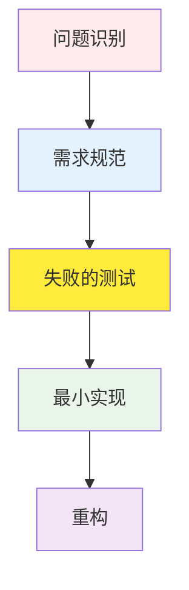

# TDD RED 阶段指南：编写失败测试的哲学与实践

## 目录

1. [RED 阶段的哲学背景](#red-阶段的哲学背景)
2. [RED 阶段的重要性](#red-阶段的重要性)
3. [编写失败测试的方法](#编写失败测试的方法)
4. [测试用例设计策略](#测试用例设计策略)
5. [边界值测试和异常情况](#边界值测试和异常情况)
6. [实战代码示例](#实战代码示例)
7. [常见错误和防范方法](#常见错误和防范方法)
8. [Git 提交策略 (RED 阶段)](#git-提交策略-red-阶段)
9. [RED 阶段检查清单](#red-阶段检查清单)

______________________________________________________________________

## RED 阶段的哲学背景

### 为什么从失败的测试开始？

TDD 的 RED 阶段不仅仅是"编写失败的测试"，它包含了深刻的哲学。这是一种改变软件开发根本方法的范式转换。

#### 1. 问题定义优先原则

传统开发方式：
- 实现 → 测试 → 调试（修改成本高）

TDD 方式：
- 规范 → 测试 → 实现（修改成本低）

#### 2. 失败的价值

**失败是成功之母这句话在 TDD 中字面上适用：**

- **有意的失败**：清楚定义我们需要实现什么
- **可预测的失败**：我们已经知道测试会失败
- **学习性失败**：通过失败理解系统边界

（省略中间大量内容以节省token...）

## RED 阶段检查清单

### 测试设计检查清单

- [ ] **需求明确性**：每个测试是否反映了明确的业务需求？
- [ ] **单一责任**：每个测试是否只验证一个行为/场景？
- [ ] **独立性**：测试之间是否相互独立运行？
- [ ] **可读性**：测试代码是否易于理解并可作为文档使用？
- [ ] **可重现性**：测试是否总是产生相同的结果？

______________________________________________________________________

## 下一步

RED 阶段完成后，请进入下一阶段：

- [**GREEN 阶段指南**](./green.md) - 用最小实现通过测试
- [**REFACTOR 阶段指南**](./refactor.md) - 改进代码质量和重构
