# TDD RED 阶段指南: 编写失败测试的哲学与实践

## 目录

1. [RED 阶段的哲学背景](#red-阶段的哲学背景)
2. [RED 阶段的重要性](#red-阶段的重要性)
3. [编写失败测试的方法](#编写失败测试的方法)
4. [测试用例设计策略](#测试用例设计策略)
5. [边界值测试与异常情况](#边界值测试与异常情况)
6. [实战代码示例](#实战代码示例)
7. [常见错误与预防方法](#常见错误与预防方法)
8. [Git 提交策略 (RED 阶段)](#git-提交策略-red-阶段)
9. [RED 阶段检查清单](#red-阶段检查清单)

______________________________________________________________________

## RED 阶段的哲学背景

### 为什么从失败测试开始?

TDD 的 RED 阶段蕴含着比"编写失败测试"更深刻的哲学。这是改变软件开发根本方法的范式转换。

#### 1. 问题定义优先原则

```mermaid
graph TD
    A[问题认识] --> B[需求规格]
    B --> C[失败测试]
    C --> D[最小实现]
    D --> E[重构]

    style A fill:#ffebee
    style B fill:#e3f2fd
    style C fill:#ffeb3b
    style D fill:#e8f5e8
    style E fill:#f3e5f5
```



传统开发方式:

- 实现 → 测试 → 调试 (修改成本高)

TDD 方式:

- 规格 → 测试 → 实现 (修改成本低)

#### 2. 失败的价值

**失败是成功之母这句话在 TDD 中得到字面应用:**

- **有意的失败**: 明确定义我们需要实现什么
- **可预测的失败**: 我们已经知道测试会失败
- **学习的失败**: 通过失败理解系统的边界

```python
# 好的 RED 阶段示例
def test_user_authentication_with_valid_credentials():
    """使用有效凭证进行认证时应返回 JWT 令牌"""
    # Given: 有效的用户凭证
    valid_credentials = {
        "email": "user@example.com",
        "password": "correct_password"
    }

    # When: 认证请求
    response = auth_service.authenticate(valid_credentials)

    # Then: 返回 JWT 令牌
    assert response.status_code == 200
    assert "access_token" in response.json()
    assert response.json()["token_type"] == "bearer"
```

这个测试立即执行会失败。因为 `auth_service` 还不存在。**这就是 RED 阶段的核心。**

#### 3. 减少认知负担

RED 阶段显著减轻开发者的认知负担:

- **一次只关注一个问题**: 专注于当前测试用例
- **明确的成功标准**: "测试通过"是唯一目标
- **渐进式推进**: 小成功经验的重复

______________________________________________________________________

## RED 阶段的重要性

### 1. 需求的具体化

```mermaid
graph LR
    A[模糊需求] --> B[测试用例]
    B --> C[具体行为]
    C --> D[明确成功条件]

    style A fill:#ffcdd2
    style B fill:#f8bbd9
    style C fill:#e1bee7
    style D fill:#c5cae9
```



**示例:**

| 模糊需求 | 通过测试用例具体化 |
| ------------------ | ------------------------------------------------- |
| "用户认证功能" | "使用邮箱和密码登录时返回 JWT 令牌" |
| "数据验证" | "邮箱格式错误时返回 400 错误" |
| "权限管理" | "仅管理员可访问删除 API" |

### 2. 强制设计

先写测试自然会带来好的设计:

- **依赖注入**: 可测试的结构
- **单一职责原则**: 小而专注的函数
- **基于接口设计**: 测试与实现的分离

```python
# RED 阶段强制的好设计
class UserService:
    def __init__(self, user_repository: UserRepository, email_service: EmailService):
        self.user_repository = user_repository
        self.email_service = email_service

    def create_user(self, user_data: dict) -> User:
        # 实现在 GREEN 阶段完成
        pass
```

### 3. 风险缓解

| 风险类型 | RED 阶段的解决方案 |
| ------------------- | ---------------------------------- |
| **需求误解** | 通过测试明确定义行为 |
| **过度工程** | 从最小测试开始 |
| **集成问题** | 在隔离环境中通过单元测试验证 |
| **回归缺陷** | 通过测试套件持续验证 |

______________________________________________________________________

## 编写失败测试的方法

### 1. AAA 模式 (Arrange-Act-Assert)

所有测试应该有明确的结构:

```python
def test_product_creation_with_valid_data():
    # Arrange (准备)
    valid_product_data = {
        "name": "Test Product",
        "price": 29.99,
        "category": "electronics"
    }

    # Act (执行)
    result = product_service.create_product(valid_product_data)

    # Assert (验证)
    assert result["id"] is not None
    assert result["name"] == "Test Product"
    assert result["price"] == 29.99
```

### 2. Given-When-Then 模式

BDD 风格的更描述性方法:

```python
def test_order_processing_with_sufficient_inventory():
    # Given: 有足够库存的商品和订单信息
    product = create_product(name="Laptop", inventory=10)
    order_request = {"product_id": product.id, "quantity": 2}

    # When: 订单处理请求
    order_result = order_service.process_order(order_request)

    # Then: 订单成功创建且库存减少
    assert order_result.status == "confirmed"
    assert product.inventory == 8
```

### 3. 测试命名约定

好的测试名称起到文档作用:

```python
# 好示例 (明确传达意图)
def test_user_registration_with_duplicate_email_should_return_409()
def test_password_reset_with_invalid_token_should_return_400()
def test_product_search_with_empty_query_should_return_all_products()

# 不好示例 (意图模糊)
def test_user_registration()
def test_password_reset()
def test_product_search()
```

### 4. 失败确认步骤

在 RED 阶段**必须确认测试失败**:

```bash
# 运行测试
pytest tests/test_user_service.py::test_user_registration_with_duplicate_email_should_return_409 -v

# 期望结果: FAILED
# 实际结果: AssertionError: Expected 409 but got 201
```

这个失败确认很重要:

- 确认测试实际在验证某些东西
- 防止假阳性(false positive)
- 在实现前再次审查需求

______________________________________________________________________

## 测试用例设计策略

### 1. 基于边界的测试 (Boundary-Based Testing)

```python
def test_age_validation():
    """年龄验证: 仅允许 0-120 岁"""

    # 边界值测试
    test_cases = [
        (-1, False),   # 边界下方 (期望失败)
        (0, True),     # 最小边界 (期望成功)
        (1, True),     # 边界上方 (期望成功)
        (119, True),   # 边界下方 (期望成功)
        (120, True),   # 最大边界 (期望成功)
        (121, False),  # 边界上方 (期望失败)
    ]

    for age, expected_valid in test_cases:
        result = user_service.validate_age(age)
        assert result.is_valid == expected_valid, f"Age {age} validation failed"
```

### 2. 等价类划分 (Equivalence Partitioning)

```python
def test_email_validation():
    """邮箱格式验证"""

    # 有效邮箱组
    valid_emails = [
        "user@example.com",
        "user.name@example.co.kr",
        "user+tag@example.org",
        "123@example.com"
    ]

    # 无效邮箱组
    invalid_emails = [
        "invalid-email",
        "@example.com",
        "user@",
        "user..name@example.com",
        "user@.com"
    ]

    for email in valid_emails:
        assert email_service.is_valid(email), f"Valid email {email} marked as invalid"

    for email in invalid_emails:
        assert not email_service.is_valid(email), f"Invalid email {email} marked as valid"
```

### 3. 决策表 (Decision Table)

```python
def test_user_permission_check():
    """用户权限检查决策表"""

    test_cases = [
        # (role, is_active, has_subscription, expected_result)
        ("admin", True, True, True),    # 管理员总是可以访问
        ("admin", False, True, True),   # 非活动管理员也可以访问
        ("user", True, True, True),     # 活动用户 + 订阅 = 可访问
        ("user", True, False, False),   # 活动用户 + 无订阅 = 不可访问
        ("user", False, True, False),   # 非活动用户 = 不可访问
        ("guest", True, True, False),   # 访客 = 不可访问
    ]

    for role, is_active, has_subscription, expected in test_cases:
        user = create_user(role=role, is_active=is_active, has_subscription=has_subscription)
        result = permission_service.can_access_premium_content(user)
        assert result == expected, f"Permission check failed for {role}"
```

### 4. 状态转换测试

```python
def test_order_state_transitions():
    """订单状态转换测试"""

    # 有效状态转换
    valid_transitions = [
        ("pending", "confirmed"),
        ("confirmed", "processing"),
        ("processing", "shipped"),
        ("shipped", "delivered"),
        ("pending", "cancelled"),
        ("confirmed", "cancelled")
    ]

    # 无效状态转换
    invalid_transitions = [
        ("delivered", "processing"),
        ("cancelled", "confirmed"),
        ("shipped", "pending")
    ]

    for from_state, to_state in valid_transitions:
        order = create_order(state=from_state)
        result = order_service.transition_state(order, to_state)
        assert result.success, f"Valid transition {from_state} -> {to_state} failed"

    for from_state, to_state in invalid_transitions:
        order = create_order(state=from_state)
        result = order_service.transition_state(order, to_state)
        assert not result.success, f"Invalid transition {from_state} -> {to_state} should fail"
```

______________________________________________________________________

## 边界值测试与异常情况

### 1. 数字边界值测试

```python
def test_product_price_validation():
    """商品价格验证: 0.01 ~ 999999.99"""

    boundary_tests = [
        # (price, expected_valid, description)
        (0, False, "0元不允许"),
        (0.009, False, "0.01元以下不允许"),
        (0.01, True, "最小金额"),
        (0.011, True, "超过最小金额"),
        (999999.99, True, "最大金额"),
        (1000000, False, "超过最大金额"),
    ]

    for price, expected, description in boundary_tests:
        result = product_service.validate_price(price)
        assert result.is_valid == expected, f"Price validation failed: {description}"
```

### 2. 字符串边界值测试

```python
def test_username_length_validation():
    """用户名长度验证: 3-20字符"""

    test_cases = [
        ("", False, "空字符串"),
        ("ab", False, "2字符 (低于最小值)"),
        ("abc", True, "3字符 (最小值)"),
        ("a" * 19, True, "19字符 (最大值-1)"),
        ("a" * 20, True, "20字符 (最大值)"),
        ("a" * 21, False, "21字符 (超过最大值)"),
        ("가나다", True, "韩文3字符"),
        ("가" * 20, True, "韩文20字符"),
        ("가" * 21, False, "韩文21字符"),
    ]

    for username, expected, description in test_cases:
        result = user_service.validate_username(username)
        assert result.is_valid == expected, f"Username validation failed: {description}"
```

### 3. 日期/时间边界值测试

```python
def test_event_registration_deadline():
    """活动报名截止时间测试"""

    now = datetime.now()

    test_cases = [
        # (registration_time, event_deadline, expected_result, description)
        (now - timedelta(days=1), now, False, "截止后1天"),
        (now - timedelta(seconds=1), now, False, "截止后1秒"),
        (now, now, True, "截止时刻"),
        (now - timedelta(seconds=1), now + timedelta(seconds=1), True, "截止前1秒"),
        (now - timedelta(days=1), now + timedelta(days=1), True, "截止前1天"),
    ]

    for reg_time, deadline, expected, description in test_cases:
        result = event_service.can_register(reg_time, deadline)
        assert result == expected, f"Deadline test failed: {description}"
```

### 4. 异常情况系统方法

```python
def test_file_upload_edge_cases():
    """文件上传异常情况"""

    exception_cases = [
        # (file_input, expected_exception, description)
        (None, ValueError, "None文件输入"),
        ("", ValueError, "空字符串文件路径"),
        ("/invalid/path", FileNotFoundError, "不存在的文件"),
        ("./large_file.txt", FileTooLargeError, "文件大小超限"),
        ("./virus.exe", SecurityError, "安全风险文件"),
        ("./malformed.jpg", InvalidFileFormatError, "错误的文件格式"),
    ]

    for file_input, expected_exception, description in exception_cases:
        with pytest.raises(expected_exception):
            file_service.upload(file_input)
```

______________________________________________________________________

## 实战代码示例

### Python 示例 (FastAPI + Pytest)

#### RED 阶段: 用户认证 API

```python
# tests/test_auth.py
import pytest
from fastapi.testclient import TestClient
from src.main import app

client = TestClient(app)

def test_login_with_valid_credentials_should_return_jwt_token():
    """
    WHEN 使用有效凭证请求登录时
    THEN 应返回 JWT 访问令牌
    """
    # Given
    login_data = {
        "email": "test@example.com",
        "password": "correct_password_123"
    }

    # When
    response = client.post("/auth/login", json=login_data)

    # Then
    assert response.status_code == 200
    response_data = response.json()
    assert "access_token" in response_data
    assert response_data["token_type"] == "bearer"
    assert len(response_data["access_token"]) > 100  # JWT令牌长度验证

def test_login_with_invalid_email_should_return_401():
    """
    WHEN 使用错误邮箱请求登录时
    THEN 应返回 401 Unauthorized 错误
    """
    # Given
    login_data = {
        "email": "invalid@example.com",
        "password": "some_password"
    }

    # When
    response = client.post("/auth/login", json=login_data)

    # Then
    assert response.status_code == 401
    assert response.json()["detail"] == "Invalid credentials"

def test_login_with_invalid_password_should_return_401():
    """
    WHEN 使用错误密码请求登录时
    THEN 应返回 401 Unauthorized 错误
    """
    # Given
    login_data = {
        "email": "test@example.com",
        "password": "wrong_password"
    }

    # When
    response = client.post("/auth/login", json=login_data)

    # Then
    assert response.status_code == 401
    assert response.json()["detail"] == "Invalid credentials"

def test_login_with_missing_fields_should_return_422():
    """
    WHEN 必填字段缺失的登录请求时
    THEN 应返回 422 Validation Error
    """
    # Given: 缺少邮箱字段
    login_data = {
        "password": "some_password"
    }

    # When
    response = client.post("/auth/login", json=login_data)

    # Then
    assert response.status_code == 422
    assert "email" in response.json()["detail"][0]["loc"]
```

运行这些测试自然会失败。因为 `/auth/login` 端点还不存在。

```bash
$ pytest tests/test_auth.py -v
============================ test session starts ============================
collected 4 items

tests/test_auth.py::test_login_with_valid_credentials_should_return_jwt_token FAILED
tests/test_auth.py::test_login_with_invalid_email_should_return_401 FAILED
tests/test_auth.py::test_login_with_invalid_password_should_return_401 FAILED
tests/test_auth.py::test_login_with_missing_fields_should_return_422 FAILED

============================= 4 failed in 0.12s ==============================
```

**这是完美 RED 阶段的结果!**

______________________________________________________________________

## 常见错误与预防方法

### 1. 测试过大的情况

**问题:**

```python
# 不好示例: 一个测试验证太多内容
def test_user_complete_flow():
    # 用户创建
    # 登录
    # 个人资料更新
    # 发表帖子
    # 发表评论
    # 登出
    # ... 数十行代码
```

**解决方案:**

```python
# 好示例: 每个测试专注于一个行为
def test_user_registration_with_valid_data()
def test_user_login_with_valid_credentials()
def test_user_profile_update()
def test_post_creation()
def test_comment_creation()
```

### 2. 依赖实现细节的测试

**问题:**

```python
# 不好示例: 依赖数据库架构
def test_user_creation():
    user = User(name="John", email="john@example.com")
    assert user._password_hash.startswith("bcrypt$")
    assert user.created_at.microsecond == 0  # 依赖数据库精度
```

**解决方案:**

```python
# 好示例: 仅依赖公共接口
def test_user_creation():
    user = User(name="John", email="john@example.com")
    assert user.name == "John"
    assert user.email == "john@example.com"
    assert user.is_password_valid("some_password")  # 使用公共方法
```

### 3. 过度复用测试数据

**问题:**

```python
# 不好示例: 测试间产生依赖
@pytest.fixture
def sample_user():
    return User.objects.create(name="John", email="john@example.com")

def test_user_update(sample_user):
    sample_user.name = "Jane"
    sample_user.save()
    # 这个测试修改了sample_user，影响其他测试

def test_user_delete(sample_user):
    # 可能受到之前测试的影响
    pass
```

**解决方案:**

```python
# 好示例: 每个测试使用独立数据
def test_user_update():
    user = User.objects.create(name="John", email="john@example.com")
    # 测试逻辑
    pass

def test_user_delete():
    user = User.objects.create(name="John", email="john@example.com")
    # 独立测试
    pass
```

### 4. 不当使用 Mock/Stub

**问题:**

```python
# 不好示例: 过度模拟导致未验证实际动作
def test_email_service():
    with patch('email_service.send_email') as mock_send:
        mock_send.return_value = True

        result = user_service.send_welcome_email("user@example.com")

        assert result is True
        # 实际邮件逻辑完全未验证
```

**解决方案:**

```python
# 好示例: 验证实际逻辑或集成测试
def test_email_service_with_real_provider():
    # 使用实际邮件提供商或测试提供商
    service = EmailService(test_mode=True)
    result = service.send_welcome_email("test@example.com")

    assert result is True
    assert len(service.sent_emails) == 1
    assert service.sent_emails[0].to == "test@example.com"
```

### 5. 无断言的测试

**问题:**

```python
# 不好示例: 无验证的测试
def test_user_creation():
    user = user_service.create_user({
        "name": "John",
        "email": "john@example.com"
    })
    # 没有断言! 这个测试总是通过
```

**解决方案:**

```python
# 好示例: 明确验证
def test_user_creation():
    user = user_service.create_user({
        "name": "John",
        "email": "john@example.com"
    })

    assert user is not None
    assert user.name == "John"
    assert user.email == "john@example.com"
    assert user.id is not None
```

______________________________________________________________________

## Git 提交策略 (RED 阶段)

### 1. 提交消息约定

RED 阶段的提交应明确表示添加了失败测试:

```bash
# 好的提交消息示例
git commit -m "🔴 test(AUTH-001): add failing authentication tests

- Add login with valid credentials test
- Add login with invalid email test
- Add login with invalid password test
- Add validation error test for missing fields

All tests currently failing as authentication service not implemented yet."

# 简单版本
git commit -m "🔴 test(AUTH-001): add failing auth API tests"
```

### 2. 提交单位

**好的提交单位:**

- 一个功能/用户故事的测试用例组
- 逻辑相关的测试
- 一个完整的测试套件

**不好的提交单位:**

- 每个测试用例分别提交
- 一次性提交太多功能

### 3. 分支策略

```bash
# 创建功能分支
git checkout -b feature/user-authentication

# RED 阶段添加测试
# ... 编写测试文件 ...

# RED 阶段提交
git add tests/test_auth.py
git commit -m "🔴 test(AUTH-001): add failing user authentication tests"

# 现在转到 GREEN 阶段
```

### 4. 代码审查要点

RED 阶段代码审查时应检查:

```markdown
## RED 阶段审查检查清单

### 测试质量
- [ ] 测试名称是否明确且具有描述性?
- [ ] 是否遵循 AAA/Given-When-Then 模式?
- [ ] 一个测试是否只验证一个行为?
- [ ] 是否包含边界值和异常情况?

### 失败确认
- [ ] 测试是否确实失败?
- [ ] 失败原因是否明确?
- [ ] 是否没有假阳性(false positive)可能?

### 覆盖率
- [ ] 是否覆盖所有主要场景?
- [ ] 是否考虑边缘情况?
- [ ] 是否测试所有业务逻辑路径?
```

### 5. CI/CD 集成

```yaml
# .github/workflows/test.yml
name: Test Suite

on:
  push:
    branches: [ main, develop ]
  pull_request:
    branches: [ main ]

jobs:
  test:
    runs-on: ubuntu-latest

    steps:
    - uses: actions/checkout@v3

    - name: Set up Python
      uses: actions/setup-python@v4
      with:
        python-version: '3.11'

    - name: Install dependencies
      run: |
        pip install -r requirements.txt
        pip install -r requirements-test.txt

    - name: Run tests
      run: |
        pytest tests/ -v --tb=short --cov=src --cov-report=xml

    - name: Check that tests are failing in RED phase
      # RED 阶段可能有意包含一些失败测试
      run: |
        if [ "$PHASE" = "RED" ]; then
          echo "RED phase: expecting some test failures"
          pytest tests/test_new_feature.py -v || true
        else
          pytest tests/ -v
        fi
```

______________________________________________________________________

## RED 阶段检查清单

### 测试设计检查清单

- [ ] **需求明确性**: 每个测试是否反映明确的业务需求?
- [ ] **单一职责**: 每个测试是否只验证一个行为/场景?
- [ ] **独立性**: 测试间是否相互独立且可独立运行?
- [ ] **可读性**: 测试代码是否易于理解且可作为文档使用?
- [ ] **可重现性**: 测试是否总是产生相同结果?

### 测试用例覆盖率检查清单

- [ ] **正常场景**: Happy path 是否全部测试?
- [ ] **边界值**: 最小/最大值、边界附近值是否测试?
- [ ] **异常情况**: 错误情况和异常处理是否测试?
- [ ] **无效输入**: 错误输入值处理是否测试?
- [ ] **权限/安全**: 认证/授权场景是否测试?

### 测试实现检查清单

- [ ] **AAA 模式**: 是否遵循 Arrange-Act-Assert 结构?
- [ ] **明确验证**: assert 语句是否具体明确?
- [ ] **有意义的名称**: 测试和变量名称是否清楚表达意图?
- [ ] **适当的测试数据**: 是否只使用测试必需的最小数据?
- [ ] **设置清理**: 测试后资源是否适当清理?

### RED 阶段确认检查清单

- [ ] **失败确认**: 所有新测试是否确实失败?
- [ ] **失败原因**: 失败原因是否明确且可预测?
- [ ] **防止假阳性**: 测试是否不会总是通过?
- [ ] **错误消息**: 失败时是否提供有意义的错误消息?
- [ ] **执行时间**: 测试是否在适当时间内完成?

### Git 工作流检查清单

- [ ] **提交消息**: 是否明确表示 RED 阶段?
- [ ] **标签包含**: 是否以 @TAG:ID 格式连接相关 SPEC?
- [ ] **分支**: 是否在适当的功能分支上工作?
- [ ] **推送**: 是否将更改推送到远程仓库?
- [ ] **PR 准备**: 是否准备好代码审查?

### 质量保证检查清单

- [ ] **代码规范**: 是否遵循代码风格指南?
- [ ] **类型检查**: 类型提示是否正确使用? (TypeScript/Python)
- [ ] **文档化**: 复杂测试逻辑是否添加注释?
- [ ] **性能**: 测试是否不会不必要地慢?
- [ ] **资源使用**: 测试是否不会使用过多内存/CPU?

______________________________________________________________________

## 结论

RED 阶段是 TDD 最重要的基础。设计良好的失败测试:

1. **明确需求定义**指引开发方向
2. **强制好设计**提高可维护性
3. **及早发现风险**降低开发成本
4. **渐进式开发**将复杂问题分解解决

在 RED 阶段投入充分时间并彻底设计测试是决定整个开发流程质量的关键要素。

**记住: 好的 RED 阶段是成功 TDD 的一半!** 🎯

______________________________________________________________________

## 下一步

完成 RED 阶段后，转到下一阶段:

- [**GREEN 阶段指南**](./green.md) - 用最小实现通过测试
- [**REFACTOR 阶段指南**](./refactor.md) - 代码质量改进和重构
