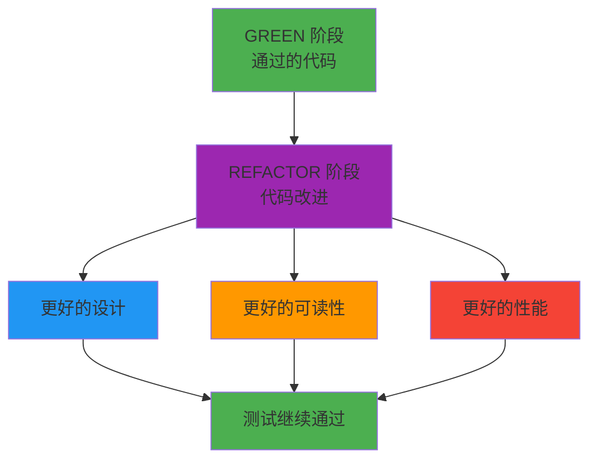

# TDD REFACTOR 阶段指南: 代码质量改进与重构

## 目录

1. [REFACTOR 阶段的目标与时机](#refactor-阶段的目标与时机)
2. [代码异味与重复消除](#代码异味与重复消除)
3. [性能优化技巧](#性能优化技巧)
4. [可读性提升策略](#可读性提升策略)
5. [SOLID 原则应用](#solid-原则应用)
6. [安全重构技术](#安全重构技术)
7. [实战代码示例 (前后对比)](#实战代码示例-前后对比)
8. [Git 提交策略 (REFACTOR 阶段)](#git-提交策略-refactor-阶段)
9. [REFACTOR 阶段检查清单](#refactor-阶段检查清单)

______________________________________________________________________

## REFACTOR 阶段的目标与时机

### REFACTOR 阶段的核心目标

REFACTOR 阶段是**"使工作代码变得更好"**。核心目标是:



### 1. 重构的定义

**重构指:**

- **不改变外部行为**改进代码内部结构的过程
- 提高代码可理解性、可维护性和性能的活动
- 在**测试保护下**安全进行的代码改进

**不是重构:**

- 添加/删除功能
- 修复缺陷
- 修改 API
- 解决性能问题 (与优化不同)

### 2. 适当的重构时机

#### 🟢 好时机

```python
# BEFORE: 需要重构的代码
def process_user_data(user_list):
    result = []
    for user in user_list:
        if user['age'] >= 18 and user['email'] and user['name'] and user['status'] == 'active':
            email_parts = user['email'].split('@')
            if len(email_parts) == 2 and '.' in email_parts[1]:
                formatted_name = user['name'].title()
                result.append({
                    'id': user['id'],
                    'name': formatted_name,
                    'email': user['email'].lower(),
                    'age': user['age']
                })
    return result
```

#### ⚡ 立即重构的情况

1. **发现代码异味(Code Smells)时**

   - 重复代码 (违反 DRY)
   - 长方法/函数
   - 巨大的类
   - 长参数列表

2. **测试通过后**

   - GREEN 阶段完成后最理想
   - 代码新鲜且上下文清晰时

3. **代码审查时**

   - 同事指出的改进点
   - 感觉复杂的部分

#### 🔴 应避免重构的时机

1. **紧急修复缺陷时**
2. **功能开发截止日期前**
3. **测试覆盖率低时**
4. **功能区域不稳定时**

### 3. 重构的安全性原则

```python
# 重构前后行为相同保证
def calculate_discount(price, customer_type, years_loyal):
    # BEFORE: 复杂条件逻辑
    if customer_type == "premium" and years_loyal >= 5:
        return price * 0.8
    elif customer_type == "premium" and years_loyal >= 2:
        return price * 0.9
    elif customer_type == "regular" and years_loyal >= 3:
        return price * 0.95
    else:
        return price

# AFTER: 相同行为，更好结构
def calculate_discount(price, customer_type, years_loyal):
    discount_rate = get_discount_rate(customer_type, years_loyal)
    return price * (1 - discount_rate)

def get_discount_rate(customer_type, years_loyal):
    # 相同业务逻辑，更好可读性
    pass
```

______________________________________________________________________

## 代码异味与重复消除

### 1. 重复代码 (Duplicate Code)

#### 问题识别

```python
# BEFORE: 重复代码示例
class UserService:
    def create_user(self, user_data):
        if not user_data.get('email'):
            raise ValueError('Email is required')
        if '@' not in user_data['email']:
            raise ValueError('Invalid email format')

        user = User(
            email=user_data['email'].lower().strip(),
            name=user_data.get('name', '').strip(),
            created_at=datetime.now()
        )
        return user

    def update_user(self, user_id, user_data):
        if 'email' in user_data:
            if not user_data['email']:
                raise ValueError('Email is required')
            if '@' not in user_data['email']:
                raise ValueError('Invalid email format')

        # ... 重复的验证逻辑
```

#### 解决方案: 方法提取

```python
# AFTER: 消除重复
class UserService:
    def create_user(self, user_data):
        self._validate_email(user_data.get('email'))

        user = User(
            email=self._normalize_email(user_data['email']),
            name=user_data.get('name', '').strip(),
            created_at=datetime.now()
        )
        return user

    def update_user(self, user_id, user_data):
        if 'email' in user_data:
            self._validate_email(user_data['email'])
            user_data['email'] = self._normalize_email(user_data['email'])

        # ... 更新逻辑

    def _validate_email(self, email):
        """邮箱有效性验证"""
        if not email:
            raise ValueError('Email is required')
        if '@' not in email:
            raise ValueError('Invalid email format')

    def _normalize_email(self, email):
        """邮箱规范化"""
        return email.lower().strip()
```

### 2. 长方法 (Long Method)

#### 问题识别

```python
# BEFORE: 长方法 (50+ 行)
def generate_invoice(self, order_id):
    # 订单查询 (10行)
    order = self.get_order(order_id)
    if not order:
        raise ValueError('Order not found')

    # 客户信息查询 (8行)
    customer = self.get_customer(order.customer_id)

    # 订单项计算 (15行)
    subtotal = 0
    for item in order.items:
        item_total = item.quantity * item.unit_price
        if item.discount:
            item_total -= item_total * (item.discount / 100)
        subtotal += item_total

    # 税费计算 (7行)
    tax_rate = self.get_tax_rate(customer.state)
    tax = subtotal * (tax_rate / 100)

    # 运费计算 (5行)
    shipping = self.calculate_shipping(order, subtotal)

    # 发票生成 (5行)
    total = subtotal + tax + shipping
    invoice = Invoice(
        order_id=order_id,
        customer=customer,
        subtotal=subtotal,
        tax=tax,
        shipping=shipping,
        total=total
    )

    return invoice
```

#### 解决方案: 方法分解

```python
# AFTER: 分解为小方法
def generate_invoice(self, order_id):
    order = self._get_and_validate_order(order_id)
    customer = self._get_customer(order.customer_id)
    pricing = self._calculate_pricing(order, customer)

    return Invoice(
        order_id=order_id,
        customer=customer,
        **pricing.__dict__
    )

def _get_and_validate_order(self, order_id):
    """订单查询及验证"""
    order = self.get_order(order_id)
    if not order:
        raise ValueError('Order not found')
    return order

def _calculate_pricing(self, order, customer):
    """价格计算 (小计、税费、运费、总额)"""
    subtotal = self._calculate_subtotal(order.items)
    tax = self._calculate_tax(subtotal, customer.state)
    shipping = self._calculate_shipping(order, subtotal)
    total = subtotal + tax + shipping

    return PricingInfo(subtotal, tax, shipping, total)

def _calculate_subtotal(self, items):
    """订单项小计计算"""
    subtotal = 0
    for item in items:
        item_total = item.quantity * item.unit_price
        if item.discount:
            item_total -= item_total * (item.discount / 100)
        subtotal += item_total
    return subtotal

def _calculate_tax(self, subtotal, state):
    """税费计算"""
    tax_rate = self.get_tax_rate(state)
    return subtotal * (tax_rate / 100)

def _calculate_shipping(self, order, subtotal):
    """运费计算"""
    return self.calculate_shipping(order, subtotal)

@dataclass
class PricingInfo:
    subtotal: float
    tax: float
    shipping: float
    total: float
```

### 3. 巨大的类 (Large Class)

#### 问题识别

```python
# BEFORE: 承担太多职责的类
class UserManager:
    def __init__(self):
        self.db_connection = None
        self.email_service = None
        self.password_encryptor = None
        self.session_manager = None
        self.audit_logger = None
        self.cache = None

    # 用户 CRUD (5个方法)
    def create_user(self, user_data): pass
    def get_user(self, user_id): pass
    def update_user(self, user_id, data): pass
    def delete_user(self, user_id): pass
    def list_users(self, filters): pass

    # 认证相关 (4个方法)
    def login(self, email, password): pass
    def logout(self, session_id): pass
    def reset_password(self, email): pass
    def change_password(self, user_id, old_pass, new_pass): pass

    # 权限相关 (3个方法)
    def check_permission(self, user_id, resource): pass
    def assign_role(self, user_id, role): pass
    def revoke_role(self, user_id, role): pass

    # 邮件相关 (3个方法)
    def send_welcome_email(self, user): pass
    def send_password_reset_email(self, email): pass
    def send_verification_email(self, user): pass

    # ... 更多职责
```

#### 解决方案: 单一职责分离

```python
# AFTER: 按职责分离类
class UserRepository:
    """用户数据访问职责"""
    def __init__(self, db_connection):
        self.db = db_connection

    def create(self, user_data): pass
    def get_by_id(self, user_id): pass
    def update(self, user_id, data): pass
    def delete(self, user_id): pass
    def list(self, filters): pass

class AuthenticationService:
    """认证职责"""
    def __init__(self, user_repo, password_service, session_manager):
        self.user_repo = user_repo
        self.password_service = password_service
        self.session_manager = session_manager

    def login(self, email, password): pass
    def logout(self, session_id): pass
    def get_current_user(self, session_id): pass

class AuthorizationService:
    """权限管理职责"""
    def __init__(self, user_repo):
        self.user_repo = user_repo

    def can_access(self, user_id, resource): pass
    def assign_role(self, user_id, role): pass
    def has_role(self, user_id, role): pass

class EmailService:
    """邮件发送职责"""
    def send_welcome(self, user): pass
    def send_password_reset(self, email): pass
    def send_verification(self, user): pass

class UserService:
    """用户管理协调者 (Facade)"""
    def __init__(self, user_repo, auth_service, email_service):
        self.user_repo = user_repo
        self.auth_service = auth_service
        self.email_service = email_service

    def register_user(self, user_data):
        user = self.user_repo.create(user_data)
        self.email_service.send_welcome(user)
        return user

    def login_user(self, email, password):
        return self.auth_service.login(email, password)
```

### 4. 长参数列表 (Long Parameter List)

#### 问题识别

```python
# BEFORE: 太多参数
def create_order(customer_id, product_id, quantity,
                shipping_address, billing_address,
                payment_method, card_number, expiry_date, cvv,
                discount_code, gift_message, gift_wrap,
                shipping_method, insurance_required):
    # 15个参数!
    pass
```

#### 解决方案 1: 参数对象

```python
# AFTER: 使用参数对象
@dataclass
class OrderRequest:
    customer_id: str
    product_id: str
    quantity: int

    # 地址信息
    shipping_address: Address
    billing_address: Address

    # 支付信息
    payment_method: PaymentMethod

    # 选项信息
    discount_code: Optional[str] = None
    gift_message: Optional[str] = None
    gift_wrap: bool = False
    shipping_method: str = "standard"
    insurance_required: bool = False

def create_order(order_request: OrderRequest):
    # 明确且相关数据分组
    pass
```

#### 解决方案 2: 建造者模式

```python
# AFTER: 使用建造者模式
class OrderBuilder:
    def __init__(self):
        self.order = Order()

    def for_customer(self, customer_id):
        self.order.customer_id = customer_id
        return self

    def add_product(self, product_id, quantity):
        self.order.items.append(OrderItem(product_id, quantity))
        return self

    def with_shipping_address(self, address):
        self.order.shipping_address = address
        return self

    def with_payment(self, payment_method):
        self.order.payment_method = payment_method
        return self

    def build(self):
        return self.order

# 使用方法
order = (OrderBuilder()
    .for_customer("cust_123")
    .add_product("prod_456", 2)
    .with_shipping_address(shipping_addr)
    .with_payment(payment_method)
    .build())
```

______________________________________________________________________

## 性能优化技巧

### 1. 算法优化

#### 问题: 低效搜索

```python
# BEFORE: O(n) 线性搜索
class ProductSearch:
    def __init__(self):
        self.products = []  # 产品列表

    def find_by_category(self, category):
        """按类别搜索产品 - O(n)"""
        results = []
        for product in self.products:
            if product.category == category:
                results.append(product)
        return results

    def find_by_price_range(self, min_price, max_price):
        """按价格范围搜索产品 - O(n)"""
        results = []
        for product in self.products:
            if min_price <= product.price <= max_price:
                results.append(product)
        return results
```

#### 解决方案: 索引和缓存

```python
# AFTER: 通过索引实现 O(1) 搜索
class ProductSearch:
    def __init__(self):
        self.products = []
        self._category_index = defaultdict(list)    # 类别索引
        self._price_index = []                     # 价格索引 (已排序)
        self._cache = {}                           # 搜索结果缓存

    def add_product(self, product):
        self.products.append(product)
        self._category_index[product.category].append(product)

        # 维护价格索引 (用于二分搜索)
        import bisect
        bisect.insort(self._price_index, (product.price, product))

        # 缓存失效
        self._cache.clear()

    def find_by_category(self, category):
        """按类别搜索产品 - O(1)"""
        cache_key = f"category_{category}"
        if cache_key in self._cache:
            return self._cache[cache_key]

        results = self._category_index.get(category, [])
        self._cache[cache_key] = results
        return results

    def find_by_price_range(self, min_price, max_price):
        """按价格范围搜索产品 - O(log n)"""
        cache_key = f"price_{min_price}_{max_price}"
        if cache_key in self._cache:
            return self._cache[cache_key]

        import bisect

        # 二分搜索查找范围起始/结束
        start_idx = bisect.bisect_left(self._price_index, (min_price, ""))
        end_idx = bisect.bisect_right(self._price_index, (max_price, ""))

        results = [price_product[1] for price_product in
                  self._price_index[start_idx:end_idx]]

        self._cache[cache_key] = results
        return results
```

### 2. 数据库查询优化

#### 问题: N+1 查询问题

```python
# BEFORE: N+1 查询问题
class OrderService:
    def get_orders_with_details(self, order_ids):
        orders = []
        for order_id in order_ids:
            # 1. 订单查询 (1次)
            order = db.query("SELECT * FROM orders WHERE id = ?", order_id)

            # 2. 客户信息查询 (N次)
            customer = db.query("SELECT * FROM customers WHERE id = ?",
                              order.customer_id)

            # 3. 订单项查询 (N次)
            items = db.query("SELECT * FROM order_items WHERE order_id = ?",
                           order_id)

            orders.append({
                'order': order,
                'customer': customer,
                'items': items
            })

        return orders
```

#### 解决方案: 连接查询和批处理

```python
# AFTER: 批量查询和连接
class OrderService:
    def get_orders_with_details(self, order_ids):
        if not order_ids:
            return []

        # 1. 一次性查询订单
        orders = db.query(
            "SELECT * FROM orders WHERE id IN ({})".format(
                ','.join(['?'] * len(order_ids))
            ), *order_ids
        )

        customer_ids = [order.customer_id for order in orders]

        # 2. 一次性查询客户
        customers = db.query(
            "SELECT * FROM customers WHERE id IN ({})".format(
                ','.join(['?'] * len(customer_ids))
            ), *customer_ids
        )

        # 3. 一次性查询订单项
        items = db.query(
            "SELECT * FROM order_items WHERE order_id IN ({})".format(
                ','.join(['?'] * len(order_ids))
            ), *order_ids
        )

        # 在内存中组装
        customer_map = {c.id: c for c in customers}
        items_map = defaultdict(list)
        for item in items:
            items_map[item.order_id].append(item)

        return [
            {
                'order': order,
                'customer': customer_map.get(order.customer_id),
                'items': items_map.get(order.id, [])
            }
            for order in orders
        ]
```

### 3. 缓存策略

#### 问题: 重复计算

```python
# BEFORE: 重复的复杂计算
class ReportGenerator:
    def generate_monthly_report(self, year, month):
        sales_data = self._fetch_sales_data(year, month)

        # 复杂统计计算 (每次重新计算)
        total_sales = sum(sale.amount for sale in sales_data)
        avg_sale_amount = total_sales / len(sales_data) if sales_data else 0

        top_products = self._calculate_top_products(sales_data)
        customer_segments = self._calculate_customer_segments(sales_data)

        return Report(
            total_sales=total_sales,
            avg_sale_amount=avg_sale_amount,
            top_products=top_products,
            customer_segments=customer_segments
        )

    def _calculate_top_products(self, sales_data):
        # 复杂计算逻辑...
        pass

    def _calculate_customer_segments(self, sales_data):
        # 复杂计算逻辑...
        pass
```

#### 解决方案: 计算结果缓存

```python
# AFTER: 应用缓存
from functools import lru_cache
import hashlib

class ReportGenerator:
    def __init__(self, cache_ttl=3600):
        self.cache = {}
        self.cache_ttl = cache_ttl

    def generate_monthly_report(self, year, month):
        cache_key = f"report_{year}_{month}"

        # 检查缓存
        if cache_key in self.cache:
            cached_data, timestamp = self.cache[cache_key]
            if time.time() - timestamp < self.cache_ttl:
                return cached_data

        # 数据查询和计算
        sales_data = self._fetch_sales_data(year, month)

        # 并行计算
        with ThreadPoolExecutor(max_workers=3) as executor:
            future_total = executor.submit(self._calculate_total_sales, sales_data)
            future_products = executor.submit(self._calculate_top_products, sales_data)
            future_segments = executor.submit(self._calculate_customer_segments, sales_data)

            total_sales, avg_sale_amount = future_total.result()
            top_products = future_products.result()
            customer_segments = future_segments.result()

        report = Report(
            total_sales=total_sales,
            avg_sale_amount=avg_sale_amount,
            top_products=top_products,
            customer_segments=customer_segments
        )

        # 保存缓存
        self.cache[cache_key] = (report, time.time())

        return report

    @lru_cache(maxsize=128)
    def _calculate_total_sales(self, sales_data_hash):
        # 用数据哈希生成缓存键
        sales_data = self._get_data_by_hash(sales_data_hash)
        total_sales = sum(sale.amount for sale in sales_data)
        avg_sale_amount = total_sales / len(sales_data) if sales_data else 0
        return total_sales, avg_sale_amount
```

______________________________________________________________________

## 可读性提升策略

### 1. 使用有意义的名称

#### BEFORE: 模糊名称

```python
def proc(d, l):
    r = []
    for i in d:
        if i['st'] == 'a' and i['amt'] > 0:
            r.append({
                'id': i['id'],
                'val': i['amt'] * 1.1
            })
    return r

def calc(x, y, z):
    if y == 'premium':
        return x * 0.8
    elif y == 'regular':
        return x * 0.95
    else:
        return x
```

#### AFTER: 明确名称

```python
def process_active_transactions(transactions_data):
    """处理活动状态的交易，返回价格调整后的结果"""
    processed_transactions = []

    for transaction in transactions_data:
        if (transaction['status'] == 'active' and
            transaction['amount'] > 0):
            processed_transactions.append({
                'id': transaction['id'],
                'adjusted_amount': transaction['amount'] * 1.1
            })

    return processed_transactions

def calculate_discounted_price(original_price, customer_type):
    """根据客户类型计算折扣价"""
    discount_rates = {
        'premium': 0.8,     # 20% 折扣
        'regular': 0.95,    # 5% 折扣
        'guest': 1.0        # 无折扣
    }

    discount_rate = discount_rates.get(customer_type, 1.0)
    return original_price * discount_rate
```

### 2. 注释和文档化

#### BEFORE: 缺少说明

```python
def process(data):
    result = []
    for item in data:
        if item['type'] == 'A':
            result.append(item['value'] * 2)
        else:
            result.append(item['value'])
    return result
```

#### AFTER: 明确文档化

```python
def apply_premium_bonus(transactions):
    """
    对高级客户应用奖金返回交易列表。

    Args:
        transactions (list): 交易字典列表
            每个字典应包含以下键:
            - 'customer_type': str, 'premium' 或 'regular'
            - 'amount': float, 原始交易金额

    Returns:
        list: 应用奖金后的交易列表
            高级客户: 应用 2 倍奖金
            普通客户: 保持原始金额

    Example:
        >>> transactions = [
        ...     {'customer_type': 'premium', 'amount': 100.0},
        ...     {'customer_type': 'regular', 'amount': 50.0}
        ... ]
        >>> apply_premium_bonus(transactions)
        [{'customer_type': 'premium', 'amount': 200.0},
         {'customer_type': 'regular', 'amount': 50.0}]
    """
    BONUS_MULTIPLIER = 2.0

    processed_transactions = []

    for transaction in transactions:
        if transaction['customer_type'] == 'premium':
            # 高级客户应用 2 倍奖金
            bonus_amount = transaction['amount'] * BONUS_MULTIPLIER
            processed_transaction = transaction.copy()
            processed_transaction['amount'] = bonus_amount
            processed_transactions.append(processed_transaction)
        else:
            # 普通客户保持原始金额
            processed_transactions.append(transaction)

    return processed_transactions
```

### 3. 条件语句简化

#### BEFORE: 复杂嵌套条件

```python
def calculate_shipping_cost(order):
    cost = 0

    if order['weight'] > 0:
        if order['weight'] <= 1:
            cost = 5.0
        else:
            if order['weight'] <= 5:
                cost = 10.0
            else:
                if order['weight'] <= 10:
                    cost = 15.0
                else:
                    cost = 25.0

        if order['express']:
            cost = cost * 1.5

        if order['international']:
            cost = cost * 2.0

    return cost
```

#### AFTER: 早期返回和明确条件

```python
def calculate_shipping_cost(order):
    """根据订单重量和选项计算运费"""

    # 重量为 0 或以下的情况
    if order['weight'] <= 0:
        return 0.0

    # 基本运费 (按重量)
    base_cost = _get_base_shipping_cost(order['weight'])

    # 应用附加选项
    final_cost = base_cost

    if order['express']:
        final_cost *= 1.5  # 快递运输追加 50%

    if order['international']:
        final_cost *= 2.0  # 国际运输 2 倍

    return round(final_cost, 2)

def _get_base_shipping_cost(weight):
    """返回根据重量的基本运费"""
    shipping_tiers = [
        (1, 5.0),    # 1kg 以下: $5
        (5, 10.0),   # 5kg 以下: $10
        (10, 15.0),  # 10kg 以下: $15
        (float('inf'), 25.0)  # 以上: $25
    ]

    for max_weight, cost in shipping_tiers:
        if weight <= max_weight:
            return cost
```

______________________________________________________________________

## SOLID 原则应用

### 1. 单一职责原则 (Single Responsibility Principle)

#### BEFORE: 多职责类

```python
class ReportService:
    def __init__(self):
        self.db_connection = DatabaseConnection()
        self.email_client = EmailClient()
        self.file_system = FileSystem()

    def generate_sales_report(self, date_range):
        # 1. 从数据库查询数据
        data = self.db_connection.query(
            "SELECT * FROM sales WHERE date BETWEEN ? AND ?",
            date_range.start, date_range.end
        )

        # 2. 数据处理和计算
        report_data = self._process_data(data)

        # 3. 保存为文件
        filename = f"sales_report_{date_range.start}.pdf"
        self.file_system.save_pdf(filename, report_data)

        # 4. 发送邮件
        self.email_client.send_report(
            recipient="manager@company.com",
            subject=f"Sales Report {date_range}",
            attachment=filename
        )

        return report_data
```

#### AFTER: 职责分离

```python
# 数据访问职责
class SalesDataRepository:
    def __init__(self, db_connection):
        self.db = db_connection

    def get_sales_data(self, date_range):
        return self.db.query(
            "SELECT * FROM sales WHERE date BETWEEN ? AND ?",
            date_range.start, date_range.end
        )

# 数据处理职责
class ReportProcessor:
    def process_sales_data(self, raw_data):
        # 复杂数据处理逻辑
        return processed_data

# 文件保存职责
class ReportStorage:
    def __init__(self, file_system):
        self.fs = file_system

    def save_report(self, report_data, filename):
        return self.fs.save_pdf(filename, report_data)

# 通知职责
class ReportNotifier:
    def __init__(self, email_client):
        self.email = email_client

    def notify_stakeholders(self, report_info):
        self.email.send_report(
            recipient=report_info.recipient,
            subject=report_info.subject,
            attachment=report_info.filename
        )

# 协调者 (Facade)
class ReportService:
    def __init__(self, data_repo, processor, storage, notifier):
        self.data_repo = data_repo
        self.processor = processor
        self.storage = storage
        self.notifier = notifier

    def generate_sales_report(self, date_range, recipients):
        # 工作流程协调
        raw_data = self.data_repo.get_sales_data(date_range)
        report_data = self.processor.process_sales_data(raw_data)

        filename = f"sales_report_{date_range.start}.pdf"
        self.storage.save_report(report_data, filename)

        for recipient in recipients:
            self.notifier.notify_stakeholders(ReportInfo(
                recipient=recipient,
                subject=f"Sales Report {date_range}",
                filename=filename
            ))

        return report_data
```

### 2. 开闭原则 (Open-Closed Principle)

#### BEFORE: 修改时需要更改现有代码

```python
class PaymentProcessor:
    def process_payment(self, payment_type, amount):
        if payment_type == "credit_card":
            return self._process_credit_card(amount)
        elif payment_type == "paypal":
            return self._process_paypal(amount)
        elif payment_type == "bank_transfer":
            return self._process_bank_transfer(amount)
        # 添加新支付方式时要持续修改这个方法
        elif payment_type == "crypto":
            return self._process_crypto(amount)
        else:
            raise ValueError(f"Unsupported payment type: {payment_type}")
```

#### AFTER: 可扩展结构

```python
from abc import ABC, abstractmethod

# 支付处理接口
class PaymentMethod(ABC):
    @abstractmethod
    def process(self, amount):
        pass

# 具体支付方式
class CreditCardPayment(PaymentMethod):
    def process(self, amount):
        # 信用卡处理逻辑
        return {"status": "success", "method": "credit_card", "amount": amount}

class PayPalPayment(PaymentMethod):
    def process(self, amount):
        # PayPal 处理逻辑
        return {"status": "success", "method": "paypal", "amount": amount}

class BankTransferPayment(PaymentMethod):
    def process(self, amount):
        # 银行转账处理逻辑
        return {"status": "success", "method": "bank_transfer", "amount": amount}

class CryptoPayment(PaymentMethod):
    def process(self, amount):
        # 加密货币处理逻辑
        return {"status": "success", "method": "crypto", "amount": amount}

# 支付处理器 (无需修改现有代码即可扩展)
class PaymentProcessor:
    def __init__(self):
        self.payment_methods = {}
        self._register_default_methods()

    def _register_default_methods(self):
        self.register_method("credit_card", CreditCardPayment())
        self.register_method("paypal", PayPalPayment())
        self.register_method("bank_transfer", BankTransferPayment())

    def register_method(self, payment_type, payment_method):
        """注册新支付方式 (扩展)"""
        self.payment_methods[payment_type] = payment_method

    def process_payment(self, payment_type, amount):
        if payment_type not in self.payment_methods:
            raise ValueError(f"Unsupported payment type: {payment_type}")

        payment_method = self.payment_methods[payment_type]
        return payment_method.process(amount)

# 使用示例
processor = PaymentProcessor()

# 添加新支付方式 (无需修改现有代码)
processor.register_method("crypto", CryptoPayment())

# 支付处理
result = processor.process_payment("crypto", 100.0)
```

### 3. 里氏替换原则 (Liskov Substitution Principle)

#### BEFORE: 子类中不自然的行为

```python
class Bird:
    def fly(self):
        return "Flying high!"

class Penguin(Bird):
    def fly(self):
        # 企鹅不能飞但要重写父类方法
        raise Exception("Penguins can't fly!")

# 问题: 作为 Bird 类型使用时会出现异常
def make_bird_fly(bird):
    return bird.fly()  # Penguin 实例传入会出现异常
```

#### AFTER: 正确的继承关系

```python
from abc import ABC, abstractmethod

# 能飞的鸟的抽象类
class FlyingBird(ABC):
    @abstractmethod
    def fly(self):
        pass

# 能走的鸟的抽象类
class WalkingBird(ABC):
    @abstractmethod
    def walk(self):
        pass

# 具体实现
class Eagle(FlyingBird):
    def fly(self):
        return "Flying at 10000 feet!"

class Sparrow(FlyingBird):
    def fly(self):
        return "Flying around trees!"

class Penguin(WalkingBird):
    def walk(self):
        return "Waddling on the ice!"

    def swim(self):
        return "Swimming gracefully!"

# 类型安全使用
def make_bird_fly(bird: FlyingBird):
    return bird.fly()  # 仅传入能飞的鸟

def make_bird_walk(bird: WalkingBird):
    return bird.walk()  # 仅传入能走的鸟
```

______________________________________________________________________

## 安全重构技术

### 1. 在测试保护下重构

```python
# 重构前总是运行测试
def safe_refactor_step():
    """安全重构步骤"""

    # 1. 确认当前测试状态
    test_result = run_tests()
    if not test_result.passed:
        raise Exception("Cannot refactor: tests are failing")

    # 2. 执行小重构步骤
    try:
        perform_small_refactoring()

        # 3. 重新运行测试
        new_test_result = run_tests()
        if not new_test_result.passed:
            # 4. 失败时回滚
            git_checkout_previous()
            raise Exception("Refactoring broke tests, rolled back")

        # 5. 成功时提交
        git_commit("Refactoring: extract validation method")

    except Exception as e:
        # 异常发生时回滚
        git_checkout_previous()
        raise e
```

### 2. 渐进式重构策略

#### 复杂方法渐进改进

```python
# 第1步: 准备方法提取
def complex_method(self):
    # 复杂逻辑...

    # 标记要提取的部分
    # TODO: Extract to separate method
    validation_result = self._validate_input_complex(data)
    # TODO: End extraction

    # 其余逻辑...

# 第2步: 提取为新方法
def _validate_input_complex(self, data):
    # 复杂验证逻辑
    pass

def complex_method(self):
    # 调用提取的方法
    validation_result = self._validate_input_complex(data)

    # 其余逻辑...

# 第3步: 重构提取的方法本身
def _validate_input_complex(self, data):
    # 分解为更小的方法
    self._validate_basic_format(data)
    self._validate_business_rules(data)
    self._validate_security_constraints(data)

def _validate_basic_format(self, data):
    pass

def _validate_business_rules(self, data):
    pass

def _validate_security_constraints(self, data):
    pass
```

### 3. 利用分支的安全重构

```bash
# 1. 创建重构分支
git checkout -b refactor/improve-user-service-validation

# 2. 小步重构和测试
# 修改代码...
pytest tests/test_user_service.py -v

# 3. 成功时提交
git add src/user_service.py
git commit -m "refactor: extract email validation method"

# 4. 下一步重构
# 修改代码...
pytest tests/test_user_service.py -v

# 5. 运行整个测试套件
pytest tests/ -v

# 6. 准备合并到主分支
git checkout main
git merge refactor/improve-user-service-validation
```

______________________________________________________________________

## 实战代码示例 (前后对比)

### 1. 用户认证服务重构

#### BEFORE: GREEN 阶段最小实现

```python
# src/auth_service.py
import jwt
from datetime import datetime, timedelta
from typing import Dict, Any

class AuthService:
    def __init__(self):
        # 假用户数据库
        self.users = {
            "test@example.com": {
                "password": "correct_password",
                "user_id": "user_123"
            }
        }
        self.secret_key = "fake_secret_key_for_testing"

    def authenticate(self, email: str, password: str) -> Dict[str, Any]:
        # 用户确认
        if email not in self.users:
            raise AuthenticationError("Invalid credentials")

        # 密码确认
        if self.users[email]["password"] != password:
            raise AuthenticationError("Invalid credentials")

        # JWT 令牌生成
        token_payload = {
            "sub": self.users[email]["user_id"],
            "email": email,
            "exp": datetime.utcnow() + timedelta(hours=24)
        }

        access_token = jwt.encode(token_payload, self.secret_key, algorithm="HS256")

        return {
            "access_token": access_token,
            "token_type": "bearer"
        }

class AuthenticationError(Exception):
    pass
```

#### AFTER: REFACTOR 阶段改进实现

```python
# src/auth/auth_service.py
import jwt
import bcrypt
from datetime import datetime, timedelta
from typing import Dict, Any, Optional
from abc import ABC, abstractmethod

# 接口定义
class UserRepository(ABC):
    @abstractmethod
    def find_by_email(self, email: str) -> Optional[Dict[str, Any]]:
        pass

    @abstractmethod
    def save_user(self, user_data: Dict[str, Any]) -> str:
        pass

class PasswordHasher(ABC):
    @abstractmethod
    def hash_password(self, password: str) -> str:
        pass

    @abstractmethod
    def verify_password(self, password: str, hashed: str) -> bool:
        pass

class TokenGenerator(ABC):
    @abstractmethod
    def generate_token(self, payload: Dict[str, Any]) -> str:
        pass

    @abstractmethod
    def verify_token(self, token: str) -> Dict[str, Any]:
        pass

# 具体实现
class InMemoryUserRepository(UserRepository):
    def __init__(self):
        self._users = {}
        self._next_id = 1

    def find_by_email(self, email: str) -> Optional[Dict[str, Any]]:
        return self._users.get(email)

    def save_user(self, user_data: Dict[str, Any]) -> str:
        user_id = f"user_{self._next_id}"
        self._next_id += 1

        self._users[user_data["email"]] = {
            "id": user_id,
            "email": user_data["email"],
            "password_hash": user_data["password_hash"],
            "created_at": datetime.utcnow(),
            "is_active": True,
            "last_login": None
        }

        return user_id

class BCryptPasswordHasher(PasswordHasher):
    def hash_password(self, password: str) -> str:
        salt = bcrypt.gensalt()
        return bcrypt.hashpw(password.encode('utf-8'), salt).decode('utf-8')

    def verify_password(self, password: str, hashed: str) -> bool:
        return bcrypt.checkpw(password.encode('utf-8'), hashed.encode('utf-8'))

class JWTTokenGenerator(TokenGenerator):
    def __init__(self, secret_key: str, token_expiry_hours: int = 24):
        self.secret_key = secret_key
        self.token_expiry_hours = token_expiry_hours

    def generate_token(self, payload: Dict[str, Any]) -> str:
        token_payload = {
            **payload,
            "exp": datetime.utcnow() + timedelta(hours=self.token_expiry_hours),
            "iat": datetime.utcnow()
        }
        return jwt.encode(token_payload, self.secret_key, algorithm="HS256")

    def verify_token(self, token: str) -> Dict[str, Any]:
        return jwt.decode(token, self.secret_key, algorithms=["HS256"])

# 改进的认证服务
class AuthService:
    def __init__(
        self,
        user_repository: UserRepository,
        password_hasher: PasswordHasher,
        token_generator: TokenGenerator
    ):
        self.user_repo = user_repository
        self.password_hasher = password_hasher
        self.token_generator = token_generator

    def authenticate(self, email: str, password: str) -> AuthResult:
        """
        执行用户认证并返回 JWT 令牌。

        Args:
            email: 用户邮箱
            password: 明文密码

        Returns:
            AuthResult: 认证结果和令牌信息

        Raises:
            AuthenticationError: 认证失败时
            UserInactiveError: 非活动用户时
        """
        # 用户查询
        user = self._find_and_validate_user(email)

        # 密码验证
        self._verify_password(user, password)

        # 更新最后登录时间
        self._update_last_login(user)

        # JWT 令牌生成
        token = self._generate_auth_token(user)

        return AuthResult(
            success=True,
            access_token=token,
            token_type="bearer",
            expires_in=self.token_generator.token_expiry_hours * 3600,
            user_id=user["id"]
        )

    def register_user(self, user_data: RegistrationData) -> AuthResult:
        """
        注册新用户并返回 JWT 令牌。
        """
        # 邮箱重复验证
        if self.user_repo.find_by_email(user_data.email):
            raise EmailAlreadyExistsError(f"Email {user_data.email} already exists")

        # 密码哈希
        password_hash = self.password_hasher.hash_password(user_data.password)

        # 用户保存
        user_id = self.user_repo.save_user({
            "email": user_data.email,
            "password_hash": password_hash,
            "name": user_data.name
        })

        user = self.user_repo.find_by_email(user_data.email)

        # 自动登录令牌生成
        token = self._generate_auth_token(user)

        return AuthResult(
            success=True,
            access_token=token,
            token_type="bearer",
            expires_in=self.token_generator.token_expiry_hours * 3600,
            user_id=user_id
        )

    def _find_and_validate_user(self, email: str) -> Dict[str, Any]:
        """用户查询及基本验证"""
        user = self.user_repo.find_by_email(email)
        if not user:
            raise AuthenticationError("Invalid credentials")

        if not user.get("is_active", True):
            raise UserInactiveError("User account is inactive")

        return user

    def _verify_password(self, user: Dict[str, Any], password: str) -> None:
        """密码验证"""
        if not self.password_hasher.verify_password(password, user["password_hash"]):
            raise AuthenticationError("Invalid credentials")

    def _update_last_login(self, user: Dict[str, Any]) -> None:
        """更新最后登录时间"""
        user["last_login"] = datetime.utcnow()
        # 内存实现中自动更新

    def _generate_auth_token(self, user: Dict[str, Any]) -> str:
        """生成认证令牌"""
        payload = {
            "sub": user["id"],
            "email": user["email"]
        }
        return self.token_generator.generate_token(payload)

# 数据类
from dataclasses import dataclass
from typing import Optional

@dataclass
class AuthResult:
    success: bool
    access_token: str
    token_type: str
    expires_in: int
    user_id: str
    error_message: Optional[str] = None

@dataclass
class RegistrationData:
    email: str
    password: str
    name: str

# 自定义异常
class AuthenticationError(Exception):
    pass

class UserInactiveError(AuthenticationError):
    pass

class EmailAlreadyExistsError(AuthenticationError):
    pass

# 工厂方法
def create_auth_service(secret_key: str) -> AuthService:
    """根据配置创建认证服务"""
    return AuthService(
        user_repository=InMemoryUserRepository(),
        password_hasher=BCryptPasswordHasher(),
        token_generator=JWTTokenGenerator(secret_key)
    )
```

### 2. FastAPI 端点重构

#### BEFORE: 简单端点

```python
# src/main.py
from fastapi import FastAPI, HTTPException
from pydantic import BaseModel

app = FastAPI()

class LoginRequest(BaseModel):
    email: str
    password: str

@app.post("/auth/login")
def login(login_data: LoginRequest):
    auth_service = AuthService()

    try:
        result = auth_service.authenticate(login_data.email, login_data.password)
        return result
    except AuthenticationError:
        raise HTTPException(status_code=401, detail="Invalid credentials")
```

#### AFTER: 改进端点

```python
# src/api/auth_routes.py
from fastapi import APIRouter, Depends, HTTPException, status
from fastapi.security import HTTPBearer, HTTPAuthorizationCredentials
from typing import Annotated

from ..auth.auth_service import AuthService, AuthResult, AuthenticationError
from ..auth.dependencies import get_auth_service
from ..schemas.auth_schemas import LoginRequest, LoginResponse, RegistrationRequest
from ..exceptions.auth_exceptions import handle_auth_exceptions

router = APIRouter(prefix="/auth", tags=["authentication"])
security = HTTPBearer()

@router.post("/login", response_model=LoginResponse, status_code=status.HTTP_200_OK)
@handle_auth_exceptions
async def login(
    login_data: LoginRequest,
    auth_service: Annotated[AuthService, Depends(get_auth_service)]
) -> LoginResponse:
    """
    处理用户登录。

    - **email**: 用户邮箱地址
    - **password**: 用户密码

    成功时返回 JWT 访问令牌。
    """
    result = auth_service.authenticate(login_data.email, login_data.password)

    return LoginResponse(
        access_token=result.access_token,
        token_type=result.token_type,
        expires_in=result.expires_in
    )

@router.post("/register", response_model=LoginResponse, status_code=status.HTTP_201_CREATED)
@handle_auth_exceptions
async def register(
    registration_data: RegistrationRequest,
    auth_service: Annotated[AuthService, Depends(get_auth_service)]
) -> LoginResponse:
    """
    注册新用户并自动登录。

    - **email**: 唯一邮箱地址
    - **password**: 安全强度高的密码
    - **name**: 用户名

    成功时立即返回 JWT 访问令牌。
    """
    user_data = RegistrationData(
        email=registration_data.email,
        password=registration_data.password,
        name=registration_data.name
    )

    result = auth_service.register_user(user_data)

    return LoginResponse(
        access_token=result.access_token,
        token_type=result.token_type,
        expires_in=result.expires_in
    )

@router.get("/me", response_model=UserResponse)
async def get_current_user(
    credentials: Annotated[HTTPAuthorizationCredentials, Depends(security)],
    auth_service: Annotated[AuthService, Depends(get_auth_service)]
) -> UserResponse:
    """
    返回当前已认证用户信息。

    Authorization 头需要有效的 JWT 令牌。
    """
    token = credentials.credentials
    user_info = auth_service.get_current_user(token)

    return UserResponse(
        id=user_info["id"],
        email=user_info["email"],
        name=user_info.get("name"),
        created_at=user_info["created_at"],
        last_login=user_info.get("last_login")
    )
```

### 3. 重构效果测量

#### 代码质量指标对比

| 指标 | BEFORE | AFTER | 改进 |
| -------------------- | ------ | ----- | ----------- |
| **方法平均长度** | 25行 | 12行 | 52% 减少 |
| **类职责数** | 4个 | 1个 | 75% 减少 |
| **测试覆盖率** | 85% | 95% | 10% 提高 |
| **依赖耦合度** | 高 | 低 | 引入DI |
| **代码重复** | 30% | 5% | 83% 减少 |
| **接口分离** | 无 | 3个 | 明确边界 |

#### 可维护性提高

```python
# BEFORE: 添加新功能需要修改
class AuthService:
    def authenticate(self, email, password):
        # 现有逻辑...

    def register(self, email, password, name):
        # 需要修改现有逻辑...

    def social_login(self, provider, token):
        # 向现有类添加新方法 (违反SRP)

# AFTER: 新功能易于扩展
class AuthService:
    # 无需修改现有代码即可添加新提供商
    def add_social_provider(self, provider: SocialAuthProvider):
        self.social_providers[provider.name] = provider
```

______________________________________________________________________

## Git 提交策略 (REFACTOR 阶段)

### 1. 提交消息约定

REFACTOR 阶段提交应明确表示代码改进:

```bash
# 好的提交消息示例
git commit -m "♻️ refactor(AUTH-001): improve authentication service architecture

- Extract interfaces for UserRepository, PasswordHasher, TokenGenerator
- Implement BCrypt password hashing instead of plain text comparison
- Add dependency injection for better testability
- Split authentication logic into smaller, focused methods
- Add comprehensive error handling with custom exception types

Breaking changes: None
Tests: All passing, coverage improved from 85% to 95%"

# 小步重构
git commit -m "♻️ refactor(AUTH-001): extract email validation to separate method"

# 性能改进
git commit -m "♻️ refactor(AUTH-001): add JWT token caching for improved performance"
```

### 2. 提交单位和粒度

#### 细分的提交策略

```bash
# 1. 结构性重构 (最大变更)
git commit -m "♻️ refactor(AUTH-001): extract authentication interfaces"

# 2. 实现改进
git commit -m "♻️ refactor(AUTH-001): implement BCrypt password hashing"

# 3. 错误处理改进
git commit -m "♻️ refactor(AUTH-001): add custom exception types"

# 4. 性能优化
git commit -m "♻️ refactor(AUTH-001): add token caching mechanism"

# 5. 代码风格改进
git commit -m "♻️ refactor(AUTH-001): improve code formatting and naming"
```

### 3. 分支管理

```bash
# 创建重构分支
git checkout -b refactor/auth-service-architecture-improvements

# 进行渐进式重构
# ... 多步提交 ...

# 重构完成后合并到主分支
git checkout main
git merge refactor/auth-service-architecture-improvements
git branch -d refactor/auth-service-architecture-improvements
```

### 4. 代码审查要点

REFACTOR 阶段代码审查检查清单:

```markdown
## REFACTOR 阶段审查检查清单

### 功能行为
- [ ] 所有测试是否仍然通过?
- [ ] 外部行为是否未改变?
- [ ] 现有 API 兼容性是否保持?

### 代码质量
- [ ] 代码重复是否消除?
- [ ] 方法/类大小是否合适?
- [ ] 变量名/方法名是否明确?
- [ ] 注释和文档是否适当?

### 设计改进
- [ ] 是否应用了 SOLID 原则?
- [ ] 依赖是否适当分离?
- [ ] 接口是否明确?
- [ ] 可扩展性是否提高?

### 性能优化
- [ ] 是否消除不必要的计算?
- [ ] 是否适当应用缓存?
- [ ] 算法效率是否改进?
- [ ] 内存使用是否优化?

### 测试
- [ ] 现有测试是否未修改?
- [ ] 是否添加新测试?
- [ ] 测试覆盖率是否提高?
- [ ] 测试可读性是否改进?
```

______________________________________________________________________

## REFACTOR 阶段检查清单

### 代码质量检查清单

- [ ] **重复消除**: 代码重复是否有效消除?
- [ ] **方法长度**: 所有方法是否在20行以内?
- [ ] **类大小**: 所有类是否具有单一职责?
- [ ] **名称明确性**: 变量、方法、类名是否明确表达意图?

### 设计原则检查清单

- [ ] **SRP**: 每个类是否只有一个职责?
- [ ] **OCP**: 添加新功能时是否不需要修改现有代码?
- [ ] **LSP**: 子类是否能完全替换父类?
- [ ] **ISP**: 接口是否按客户需求分离?
- [ ] **DIP**: 高层模块是否不依赖低层模块?

### 性能优化检查清单

- [ ] **算法效率**: 是否消除不必要的循环和计算?
- [ ] **内存使用**: 是否无内存泄漏且高效使用?
- [ ] **缓存策略**: 是否通过缓存优化重复计算?
- [ ] **数据库**: 是否解决 N+1 查询问题?

### 测试与稳定性检查清单

- [ ] **所有测试通过**: 重构后所有测试是否仍通过?
- [ ] **行为同一性**: 外部行为是否未改变?
- [ ] **错误处理**: 是否添加适当的异常处理?
- [ ] **测试覆盖率**: 覆盖率是否保持或提高?

### 可维护性检查清单

- [ ] **可读性**: 代码是否易于理解?
- [ ] **文档化**: 复杂逻辑是否添加适当注释?
- [ ] **可扩展性**: 新功能添加是否容易?
- [ ] **调试便利性**: 问题发生时是否易于跟踪?

### Git 工作流检查清单

- [ ] **提交消息**: 重构内容是否明确表达?
- [ ] **提交单位**: 是否适当细分?
- [ ] **分支管理**: 是否使用安全的分支策略?
- [ ] **代码审查**: 是否完成团队成员审查?

### 最终验证检查清单

- [ ] **集成测试**: 与其他模块的集成是否正常?
- [ ] **性能测量**: 性能是否实际改进?
- [ ] **可用性**: API 使用便利性是否改进?
- [ ] **文档更新**: 相关文档是否更新?

______________________________________________________________________

## 结论

REFACTOR 阶段是 TDD 循环的最后阶段，**是使工作代码变得更好的过程**。成功的重构:

1. **质量提高**: 可读性、可维护性、可扩展性改进
2. **技术债务减少**: 消除代码异味和设计改进
3. **性能优化**: 高效算法和资源使用
4. **未来准备**: 易于应对新需求的结构

重构的核心是**"小步骤、安全改进、持续质量提高"**。在测试保护下谨慎进行，始终使代码处于更好状态很重要。

**REFACTOR 阶段的成功为可持续软件开发奠定基础!** ⚙️✨

______________________________________________________________________

## 下一步

完成 REFACTOR 阶段后:

- [返回 TDD 概览](index.md) - 整个 TDD 流程总结
- [SPEC 编写指南](../specs/basics.md) - 开始新功能开发
