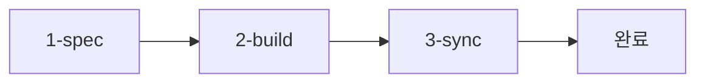

# @DOC:WORKFLOW-001 | Chain: @SPEC:DOCS-003 -> @DOC:WORKFLOW-001

# 3-Step Workflow

MoAI-ADK의 핵심 개발 워크플로우입니다.

## Overview



---

## Step 1️⃣: SPEC 작성 (/alfred:1-spec)

**목적**: 요구사항을 EARS 방식의 SPEC으로 변환

```bash
/alfred:1-spec "사용자 인증 기능 구현"
```

### 산출물

- `.moai/specs/SPEC-<ID>/spec.md`
- @SPEC:<ID> TAG

---

## Step 2️⃣: TDD 구현 (/alfred:2-build)

**목적**: SPEC 기반 TDD Red-Green-Refactor 구현

```bash
/alfred:2-build "SPEC-<ID>"
```

### TDD 사이클

1. **🔴 RED**: 실패하는 테스트 작성
2. **🟢 GREEN**: 최소 구현으로 테스트 통과
3. **🔄 REFACTOR**: 코드 품질 개선

### 산출물

- 구현 코드: @CODE:<ID>
- 테스트 코드: @TEST:<ID>

---

## Step 3️⃣: 문서 동기화 (/alfred:3-sync)

**목적**: 코드와 문서 동기화, TAG 체인 검증

```bash
/alfred:3-sync
```

### 작업 내용

1. TAG 체인 무결성 검증
2. API 문서 자동 생성
3. README 업데이트

### 산출물

- API 문서: @DOC:<ID>
- TAG 체인 검증 보고서

---

## 완성된 TAG 체인

```
@SPEC:<ID> (요구사항)
  ├─ @CODE:<ID> (구현)
  ├─ @TEST:<ID> (테스트)
  └─ @DOC:<ID> (문서)
```

---

## 다음 단계

- [Commands](commands/alfred-commands.md) - Alfred 명령어 상세
- [Agents](agents/spec-builder.md) - 에이전트별 가이드
- [Configuration](configuration/config-json.md) - 설정 최적화
