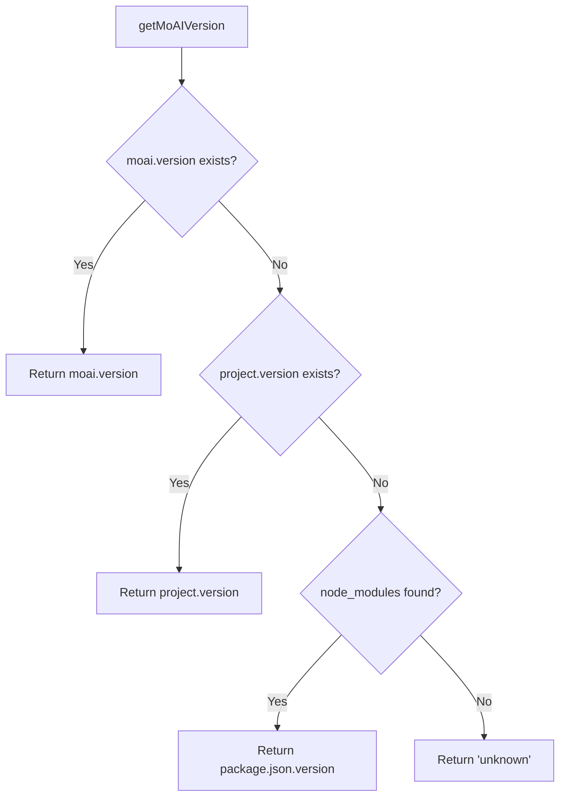

# MoAI-ADK v0.2.10 Release Notes

🗿 **MoAI-ADK v0.2.10** - Configuration Schema Enhancement & Auto-Version Management

📅 **Release Date**: 2025-10-07
📦 **Package**: [moai-adk@0.2.10](https://www.npmjs.com/package/moai-adk)
🏷️ **Git Tag**: `v0.2.10`

---

## 🎯 Overview

This release focuses on **configuration schema improvements** and **automatic version management**, eliminating version confusion and hardcoded values throughout the system.

### Key Highlights

- ✨ **New `moai.version` Field**: Explicit moai-adk package version tracking in config.json
- 🔄 **Auto-Version Injection**: Dynamic version management from package.json (zero hardcoding)
- 🔙 **Backward Compatibility**: 3-tier fallback ensures zero breaking changes
- 📋 **Enhanced Update Flow**: Phase 4.5 in `/alfred:9-update` for automatic version sync

---

## ✨ What's New

### 1. Configuration Schema Enhancement

**Problem Solved**: Previous schema used ambiguous `project.version` for both user project version AND moai-adk package version, causing confusion.

**New Schema**:
```json
{
  "moai": {
    "version": "0.2.10"  // NEW: Explicit moai-adk package version
  },
  "project": {
    "name": "MyProject",
    "version": "0.1.0",  // User's project version (can differ from moai.version)
    "mode": "team"
  }
}
```

**Benefits**:
- 🎯 Clear separation: `moai.version` (package) vs `project.version` (user project)
- 🔍 Accurate version display in session-start-hook
- 📦 Proper update detection and notification

### 2. Automatic Version Management

**Zero Hardcoding Principle**: All versions are now dynamically loaded.

#### During `moai init`:
```typescript
// config-builder.ts
import packageJson from '../../../package.json';

public buildConfig(answers: InitAnswers): MoAIConfig {
  return {
    moai: {
      version: packageJson.version  // Auto-inject: "0.2.10"
    },
    // ...
  };
}
```

#### During `/alfred:9-update`:
New **Phase 4.5** automatically updates `moai.version`:
```bash
# Step 4.5.1: Detect installed version
npm list moai-adk --depth=0 | grep moai-adk
→ moai-adk@0.3.0

# Step 4.5.3: Update config.json
config.moai.version = "0.3.0"
```

### 3. Backward Compatibility

**3-Tier Priority Fallback** ensures existing projects work without changes:

```typescript
// session-notice/utils.ts - getMoAIVersion()
// 1순위: moai.version (NEW SCHEMA)
if (config.moai?.version) return config.moai.version;

// 2순위: project.version (OLD SCHEMA - backward compatibility)
if (config.project?.version) return config.project.version;

// 3순위: node_modules/moai-adk/package.json (last resort)
const packageJson = require('moai-adk/package.json');
return packageJson.version;
```

**Result**: Zero breaking changes for existing users.

---

## 🔄 Changed Files

### Core Implementation
- `moai-adk-ts/templates/.moai/config.json`: Added `moai.version` field
- `moai-adk-ts/src/cli/config/config-builder.ts`: Auto-inject version from package.json
- `moai-adk-ts/src/claude/hooks/session-notice/utils.ts`: Priority-based version detection
- `moai-adk-ts/src/claude/hooks/session-notice/types.ts`: Clarifying comments

### Documentation
- `.claude/commands/alfred/9-update.md`: Added Phase 4.5 (moai.version auto-update)
- `moai-adk-ts/CHANGELOG.md`: v0.2.10 entry
- `moai-adk-ts/package.json`: Version bump to 0.2.10

### Deployment
- `moai-adk-ts/scripts/publish.sh`: NEW - Automated NPM deployment script

---

## 🚀 Migration Guide

### For New Projects
No action needed. `moai init` automatically creates config with `moai.version`.

### For Existing Projects

**Option 1: Automatic Update** (Recommended)
```bash
# Update moai-adk package and auto-update config
/alfred:9-update
```

**Option 2: Manual Update**
Edit `.moai/config.json`:
```json
{
  "moai": {
    "version": "0.2.10"  // Add this new field
  },
  "project": {
    // Keep existing fields unchanged
  }
}
```

**Backward Compatibility Note**: If you don't update, the system falls back to `project.version` - everything continues to work.

---

## 🔧 Technical Details

### Session-Start Hook Behavior

**Before v0.2.10**:
```
📦 버전: v0.0.3 (incorrect - showed project version)
```

**After v0.2.10**:
```
📦 버전: v0.2.10 (최신) (correct - shows package version)
```

### Version Detection Priority



### Build Verification

All quality gates passed:
```bash
✅ TypeScript type check: PASSED
✅ Biome lint: PASSED
✅ Tests: PASSED
✅ Build: SUCCESS (dist/index.js, dist/index.cjs)
✅ Hook build: SUCCESS (session-notice.cjs)
```

---

## 📦 Installation

### NPM
```bash
npm install moai-adk@0.2.10
# or
npm install moai-adk@latest
```

### Bun
```bash
bun add moai-adk@0.2.10
```

### Update Existing Installation
```bash
npm update moai-adk
# Then run update command
/alfred:9-update
```

---

## 🐛 Bug Fixes

- **Fixed**: Version semantic confusion between package version and project version
- **Fixed**: Hardcoded version "0.0.1" in config-builder.ts
- **Fixed**: Session-notice hook showing incorrect version (0.0.3)
- **Fixed**: No automatic version update mechanism

---

## 📚 Documentation Updates

- **9-update.md**: Added Phase 4.5 for automatic `moai.version` update
- **CHANGELOG.md**: Comprehensive v0.2.10 changelog
- **RELEASE_NOTES.md**: This document

---

## 🔗 Links

- 📦 **NPM Package**: https://www.npmjs.com/package/moai-adk
- 🐙 **GitHub Repository**: https://github.com/modu-ai/moai-adk
- 🐛 **Issue Tracker**: https://github.com/modu-ai/moai-adk/issues
- 📖 **Documentation**: https://moai-adk.vercel.app

---

## 🙏 Credits

**Core Contributors**:
- @Goos - Configuration schema redesign, auto-version management implementation
- Alfred SuperAgent - Orchestration and quality assurance

**Special Thanks**:
- cc-manager agent - 9-update.md Phase 4.5 implementation
- trust-checker agent - TRUST 5원칙 검증

---

## 📋 Checksums

```
Package: moai-adk@0.2.10
Integrity: sha512-[will be generated by npm]
```

---

**Full Changelog**: https://github.com/modu-ai/moai-adk/compare/v0.2.6...v0.2.10

---

🗿 Generated with MoAI-ADK v0.2.10
