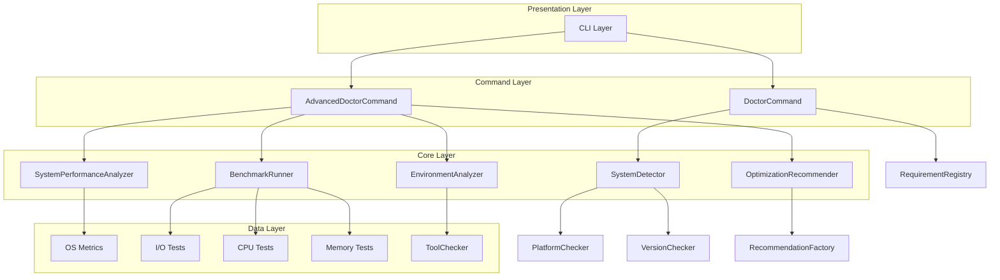
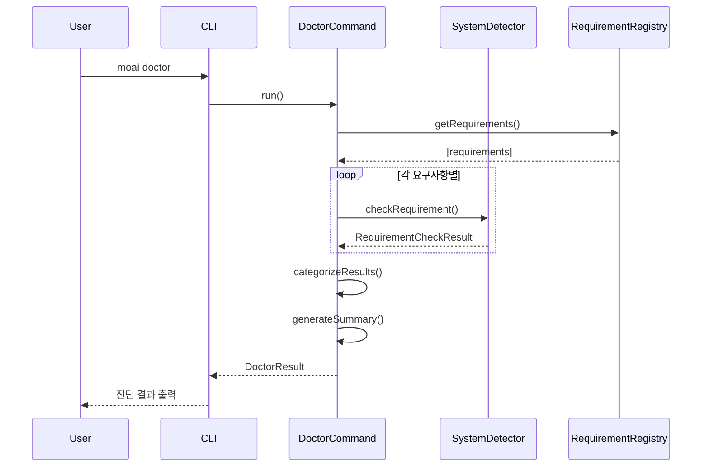
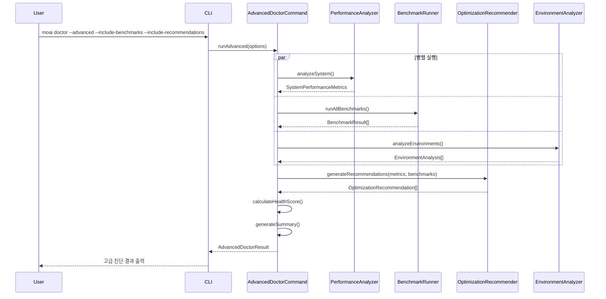

# MoAI-ADK Diagnostics System Architecture

**최종 업데이트**: 2025-09-29
**버전**: v0.0.1
**태그**: @ARCH:DIAGNOSTICS-001 @DESIGN:SYSTEM-ARCHITECTURE-001

## 개요

MoAI-ADK의 진단 시스템은 기본 시스템 요구사항 검증부터 고급 성능 분석까지 포괄하는 다층 아키텍처를 채택합니다. 모듈형 설계로 각 컴포넌트가 독립적으로 동작하면서도 통합된 진단 경험을 제공합니다.

## 시스템 아키텍처 개요



## 아키텍처 계층

### 1. Presentation Layer (프레젠테이션 계층)

#### CLI Interface
**위치**: `src/cli/index.ts`
**책임**: 사용자 명령어 처리 및 결과 출력

```typescript
// 주요 명령어 라우팅
export class CLIRouter {
  routes = {
    'doctor': DoctorCommand,
    'doctor --advanced': AdvancedDoctorCommand,
    'doctor --list-backups': BackupListCommand
  };
}
```

**특징**:
- Commander.js 기반 명령어 파싱
- 통일된 배너 시스템
- 구조화된 에러 출력
- 진행률 표시 (고급 진단)

### 2. Command Layer (명령어 계층)

#### DoctorCommand (기본 진단)
**위치**: `src/cli/commands/doctor.ts`
**책임**: 기본 시스템 요구사항 검증

```typescript
interface DoctorResult {
  allPassed: boolean;
  results: RequirementCheckResult[];
  missingRequirements: RequirementCheckResult[];
  versionConflicts: RequirementCheckResult[];
  summary: {
    total: number;
    passed: number;
    failed: number;
  };
}
```

**진단 흐름**:
1. **요구사항 수집**: RuntimeRequirements + DevelopmentRequirements
2. **병렬 검증**: 모든 도구 동시 검사
3. **결과 분류**: 누락/버전충돌/통과
4. **설치 제안**: 플랫폼별 명령어 생성

#### AdvancedDoctorCommand (고급 진단)
**위치**: `src/cli/commands/doctor-advanced.ts`
**책임**: 종합적 시스템 성능 분석

```typescript
interface AdvancedDoctorResult {
  allPassed: boolean;
  performanceMetrics: SystemPerformanceMetrics;
  benchmarks: BenchmarkResult[];
  recommendations: OptimizationRecommendation[];
  environments: EnvironmentAnalysis[];
  healthScore: number; // 0-100
  summary: {
    status: 'excellent' | 'good' | 'fair' | 'poor';
    criticalIssues: number;
    warnings: number;
    suggestions: number;
  };
}
```

**고급 진단 흐름**:
1. **성능 메트릭 수집**: CPU, 메모리, 디스크 사용률
2. **벤치마크 실행**: I/O, CPU, 메모리 성능 테스트
3. **권장사항 생성**: 성능 분석 기반 최적화 제안
4. **환경 분석**: 개발 도구 호환성 검증
5. **건강도 계산**: 종합 점수 산출 (0-100점)

### 3. Core Layer (핵심 계층)

#### SystemDetector (시스템 탐지기)
**위치**: `src/core/system-checker/detector.ts`
**책임**: 시스템 도구 설치 상태 및 버전 검증

```typescript
class SystemDetector {
  // 단일 요구사항 검증
  async checkRequirement(requirement: SystemRequirement): Promise<RequirementCheckResult>

  // 다중 요구사항 병렬 검증
  async checkMultipleRequirements(requirements: SystemRequirement[]): Promise<RequirementCheckResult[]>

  // 플랫폼별 설치 명령어 생성
  getInstallCommandForCurrentPlatform(requirement: SystemRequirement): string | null
}
```

**검증 알고리즘**:
1. **도구 존재 확인**: `which` 명령어 또는 `where` (Windows)
2. **버전 추출**: 각 도구별 버전 명령어 실행
3. **semver 비교**: 최소 요구 버전과 비교
4. **플랫폼 감지**: macOS(brew), Linux(apt/yum), Windows(choco)

#### SystemPerformanceAnalyzer (성능 분석기)
**위치**: `src/core/diagnostics/performance-analyzer.ts`
**책임**: 실시간 시스템 성능 메트릭 수집

```typescript
interface SystemPerformanceMetrics {
  cpuUsage: number; // 0-100%
  memoryUsage: {
    used: number; // MB
    total: number; // MB
    percentage: number; // 0-100%
  };
  diskSpace: {
    used: number; // GB
    available: number; // GB
    percentage: number; // 0-100%
  };
  networkLatency?: number; // ms
}
```

**수집 방법**:
- **CPU**: `os.loadavg()` + 프로세스 통계
- **메모리**: `process.memoryUsage()` + `os.totalmem()`
- **디스크**: `fs.statSync()` + 플랫폼별 명령어
- **네트워크**: DNS 조회 시간 측정

#### BenchmarkRunner (벤치마크 실행기)
**위치**: `src/core/diagnostics/benchmark-runner.ts`
**책임**: 성능 벤치마크 테스트 실행

```typescript
interface BenchmarkResult {
  name: string;
  duration: number; // ms
  score: number; // 0-100
  status: 'pass' | 'warning' | 'fail';
  details?: {
    operations: number;
    throughput: string;
    memory: string;
  };
}
```

**벤치마크 유형**:

| 벤치마크 | 측정 대상 | 성능 목표 | 평가 기준 |
|----------|-----------|-----------|-----------|
| File I/O | 디스크 읽기/쓰기 | >100MB/s | SSD 기준 |
| CPU Ops | 연산 처리 속도 | >1M ops/s | 단일 코어 |
| Memory | 메모리 할당/해제 | <10ms GC | Node.js V8 |
| JSON | 직렬화/파싱 | >10MB/s | 표준 객체 |

#### OptimizationRecommender (최적화 권장사항 엔진)
**위치**: `src/core/diagnostics/optimization-recommender.ts`
**책임**: 시스템 분석 결과 기반 최적화 제안

```typescript
interface OptimizationRecommendation {
  id: string;
  title: string;
  description: string;
  severity: DiagnosticSeverity; // CRITICAL, ERROR, WARNING, INFO
  impact: 'critical' | 'high' | 'medium' | 'low';
  category: 'performance' | 'security' | 'compatibility' | 'maintenance';
  actionRequired: boolean;
  estimatedTimeToFix: string;
  resources?: string[];
}
```

**권장사항 생성 알고리즘**:
```typescript
class RecommendationEngine {
  generateRecommendations(metrics: SystemPerformanceMetrics, benchmarks: BenchmarkResult[]) {
    const recommendations = [];

    // 성능 기반 권장사항
    if (metrics.cpuUsage > 80) {
      recommendations.push(this.createCPURecommendation(metrics.cpuUsage));
    }

    // 벤치마크 기반 권장사항
    const failedBenchmarks = benchmarks.filter(b => b.status === 'fail');
    failedBenchmarks.forEach(benchmark => {
      recommendations.push(this.createBenchmarkRecommendation(benchmark));
    });

    return this.prioritizeRecommendations(recommendations);
  }
}
```

#### EnvironmentAnalyzer (환경 분석기)
**위치**: `src/core/diagnostics/environment-analyzer.ts`
**책임**: 개발 환경 호환성 및 설정 분석

```typescript
interface EnvironmentAnalysis {
  name: string;
  version?: string;
  status: 'optimal' | 'good' | 'warning' | 'poor';
  issues?: string[];
  recommendations?: string[];
  configPath?: string;
  lastUsed?: Date;
}
```

**분석 대상**:
- **패키지 매니저**: npm, yarn, pnpm, bun
- **개발 도구**: VS Code, WebStorm, vim/neovim
- **런타임**: Node.js, Python, Java, Go, Rust
- **VCS**: Git 설정, SSH 키, GPG 서명

### 4. Data Layer (데이터 계층)

#### RequirementRegistry (요구사항 레지스트리)
**위치**: `src/core/system-checker/requirements.ts`
**책임**: 시스템 요구사항 정의 및 관리

```typescript
interface SystemRequirement {
  name: string;
  category: 'runtime' | 'development';
  description: string;
  minVersion?: string;
  versionCommand: string;
  versionRegex: RegExp;
  installCommands: {
    darwin?: string; // macOS
    linux?: string;  // Linux
    win32?: string;  // Windows
  };
  optional: boolean;
}
```

**등록된 요구사항**:
```typescript
const RUNTIME_REQUIREMENTS: SystemRequirement[] = [
  {
    name: 'Node.js',
    category: 'runtime',
    minVersion: '18.0.0',
    versionCommand: 'node --version',
    versionRegex: /v?(\d+\.\d+\.\d+)/,
    installCommands: {
      darwin: 'brew install node',
      linux: 'curl -fsSL https://deb.nodesource.com/setup_lts.x | sudo -E bash - && sudo apt-get install -y nodejs',
      win32: 'choco install nodejs'
    }
  },
  // ... 기타 요구사항
];
```

## 데이터 플로우

### 기본 진단 플로우



### 고급 진단 플로우



## 설계 원칙

### 1. 단일 책임 원칙 (SRP)
각 모듈은 명확히 정의된 단일 책임을 가집니다:
- **SystemDetector**: 도구 설치 상태 검증만
- **PerformanceAnalyzer**: 성능 메트릭 수집만
- **BenchmarkRunner**: 벤치마크 실행만
- **OptimizationRecommender**: 권장사항 생성만

### 2. 개방-폐쇄 원칙 (OCP)
새로운 진단 모듈 추가 시 기존 코드 수정 없이 확장 가능:
```typescript
// 새로운 분석기 추가 예시
export class SecurityAnalyzer {
  async analyzeSecurity(): Promise<SecurityAnalysis> {
    // 보안 분석 로직
  }
}

// 기존 AdvancedDoctorCommand에 쉽게 통합
```

### 3. 의존성 역전 원칙 (DIP)
고수준 모듈이 저수준 모듈에 의존하지 않도록 인터페이스 활용:
```typescript
interface ISystemDetector {
  checkRequirement(requirement: SystemRequirement): Promise<RequirementCheckResult>;
}

class DoctorCommand {
  constructor(private detector: ISystemDetector) {}
}
```

### 4. 인터페이스 분리 원칙 (ISP)
클라이언트가 사용하지 않는 인터페이스에 의존하지 않도록 분리:
```typescript
interface IBasicDiagnostics {
  checkSystemRequirements(): Promise<DoctorResult>;
}

interface IAdvancedDiagnostics {
  runPerformanceAnalysis(): Promise<PerformanceMetrics>;
  runBenchmarks(): Promise<BenchmarkResult[]>;
}
```

## 성능 최적화

### 1. 병렬 처리
- 시스템 요구사항 검증을 병렬로 실행
- 고급 진단의 각 모듈을 독립적으로 실행
- Promise.all()을 활용한 비동기 최적화

### 2. 캐싱 전략
```typescript
class CachedSystemDetector {
  private cache = new Map<string, RequirementCheckResult>();
  private cacheTimeout = 5 * 60 * 1000; // 5분

  async checkRequirement(requirement: SystemRequirement): Promise<RequirementCheckResult> {
    const cacheKey = requirement.name;
    const cached = this.cache.get(cacheKey);

    if (cached && this.isCacheValid(cached)) {
      return cached;
    }

    const result = await this.performCheck(requirement);
    this.cache.set(cacheKey, result);
    return result;
  }
}
```

### 3. 리소스 관리
- 벤치마크 실행 시 임시 파일 자동 정리
- 메모리 사용량 모니터링 및 가비지 컬렉션 최적화
- 장시간 실행 방지를 위한 타임아웃 설정

## 확장성

### 1. 플러그인 시스템
```typescript
interface DiagnosticPlugin {
  name: string;
  version: string;
  run(context: DiagnosticContext): Promise<DiagnosticResult>;
}

class PluginManager {
  private plugins: DiagnosticPlugin[] = [];

  registerPlugin(plugin: DiagnosticPlugin): void {
    this.plugins.push(plugin);
  }

  async runAllPlugins(context: DiagnosticContext): Promise<DiagnosticResult[]> {
    return Promise.all(this.plugins.map(plugin => plugin.run(context)));
  }
}
```

### 2. 설정 기반 확장
```typescript
interface DiagnosticConfig {
  enabledModules: string[];
  benchmarkTimeout: number;
  performanceThresholds: {
    cpu: number;
    memory: number;
    disk: number;
  };
  customRequirements: SystemRequirement[];
}
```

### 3. 언어별 확장
각 프로그래밍 언어별로 특화된 진단 모듈 제공:
- **Python**: pip, conda, virtual environment 검증
- **Java**: Maven, Gradle, JDK 버전 검증
- **Go**: go mod, GOPATH 설정 검증
- **Rust**: cargo, rustc 버전 검증

## 에러 처리 전략

### 1. 계층별 에러 처리
```typescript
// Command Layer: 사용자 친화적 메시지
class DoctorCommand {
  async run(): Promise<DoctorResult> {
    try {
      return await this.performDiagnostics();
    } catch (error) {
      throw new UserFriendlyError(
        'System diagnostics failed',
        'Please check your system configuration and try again.',
        error
      );
    }
  }
}

// Core Layer: 기술적 상세 정보
class SystemDetector {
  async checkRequirement(requirement: SystemRequirement): Promise<RequirementCheckResult> {
    try {
      return await this.executeCheck(requirement);
    } catch (error) {
      return {
        requirement,
        result: {
          isInstalled: false,
          versionSatisfied: false,
          error: `Failed to check ${requirement.name}: ${error.message}`
        }
      };
    }
  }
}
```

### 2. 복구 전략
- 권한 부족 시 대안 명령어 제시
- 네트워크 오류 시 로컬 검증으로 fallback
- 부분 실패 허용 (일부 진단 실패 시에도 결과 제공)

### 3. 로깅 및 디버깅
```typescript
class DiagnosticLogger {
  logDiagnosticStart(module: string): void;
  logDiagnosticResult(module: string, result: any): void;
  logDiagnosticError(module: string, error: Error): void;
  logPerformanceMetric(metric: string, value: number, unit: string): void;
}
```

## 보안 고려사항

### 1. 명령어 실행 보안
```typescript
class SecureCommandExecutor {
  private allowedCommands = ['node', 'git', 'npm', 'yarn', 'pnpm'];

  async executeCommand(command: string): Promise<string> {
    const [cmd] = command.split(' ');
    if (!this.allowedCommands.includes(cmd)) {
      throw new SecurityError(`Command '${cmd}' is not allowed`);
    }

    return this.safeExecute(command);
  }
}
```

### 2. 민감 정보 보호
- 시스템 정보 수집 시 개인정보 제외
- 로그 출력 시 민감 정보 마스킹
- 임시 파일 안전한 삭제

### 3. 권한 최소화
- 최소 필요 권한으로 실행
- 시스템 변경 없이 읽기 전용 검사
- 사용자 동의 없는 자동 설치 금지

---

**관련 문서**:
- [CLI Commands API](../api/cli-commands.md)
- [Diagnostics System API](../api/diagnostics-system.md)
- [사용자 가이드](../guides/user-guide.md)