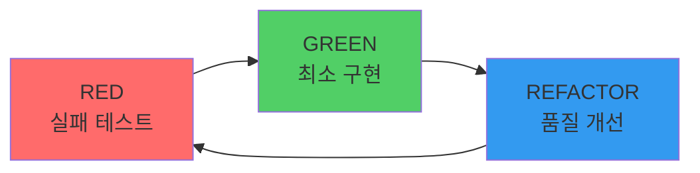
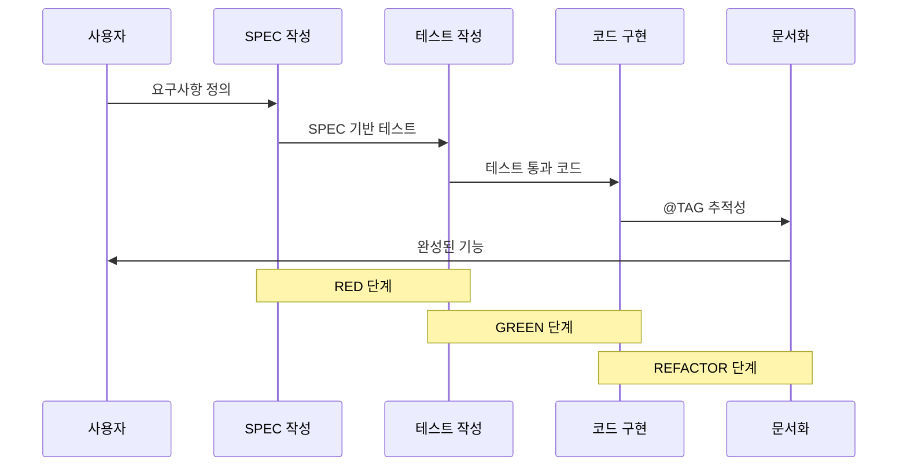

# SPEC 우선 TDD 방법론

## 핵심 철학

> "명세 없으면 코드 없다. 테스트 없으면 구현 없다."

## SPEC 우선 원칙

### 1. 코드보다 요구사항 먼저

모든 구현은 명시적인 명세에 의해 주도되어야 합니다:

- **@REQ**: 요구사항 정의
- **@DESIGN**: 아키텍처 및 설계 결정
- **@TASK**: 구현 작업
- **@TEST**: 테스트 명세

### 2. EARS 요구사항 구문

EARS (Easy Approach to Requirements Syntax) 형식을 사용합니다:

#### Ubiquitous Requirements (기본 요구사항)
```markdown
시스템은 사용자 인증을 제공해야 한다
```

#### Event-Driven Requirements (이벤트 기반)
```markdown
WHEN 사용자가 유효한 자격증명으로 로그인하면,
시스템은 JWT 토큰을 생성해야 한다
```

#### State-Driven Requirements (상태 기반)
```markdown
WHILE 사용자가 인증된 상태일 때,
시스템은 보호된 리소스 접근을 허용해야 한다
```

#### Optional Features (선택적 기능)
```markdown
WHERE 리프레시 토큰이 제공되면,
시스템은 새로운 액세스 토큰을 발급할 수 있다
```

#### Constraints (제약사항)
```markdown
IF 잘못된 토큰이 제공되면,
시스템은 접근을 거부해야 한다
```

## TDD 사이클



### Red 단계
1. SPEC 기반 실패하는 테스트 작성
2. 올바른 이유로 실패하는지 확인
3. 예상 동작 문서화

### Green 단계
1. 테스트를 통과하는 최소한의 코드 구현
2. SPEC 준수에 집중
3. 조기 최적화 회피

### Refactor 단계
1. 코드 품질 개선
2. SPEC 준수 유지
3. 모든 테스트 통과 유지

## 언어별 구현

### TypeScript (주력 언어)
```typescript
// @TEST:AUTH-001: 유효한 사용자 인증
describe('AuthService', () => {
  test('@TEST:AUTH-001: 유효한 자격증명 인증', async () => {
    const result = await authService.authenticate('user', 'pass');
    expect(result).toBeTruthy();
  });
});

// @FEATURE:AUTH-001: 인증 서비스 구현
class AuthService {
  async authenticate(username: string, password: string): Promise<boolean> {
    // 구현...
  }
}
```

### Python
```python
# @TEST:AUTH-001: 유효한 사용자 인증
def test_should_authenticate_valid_user():
    """@TEST:AUTH-001: 유효한 자격증명 인증"""
    result = auth_service.authenticate("user", "pass")
    assert result is True

# @FEATURE:AUTH-001: 인증 서비스 구현
class AuthService:
    def authenticate(self, username: str, password: str) -> bool:
        # 구현...
        pass
```

### Java
```java
// @TEST:AUTH-001: 유효한 사용자 인증
@Test
public void testAuthenticateValidUser() {
    // @TEST:AUTH-001: 유효한 자격증명 인증
    boolean result = authService.authenticate("user", "pass");
    assertTrue(result);
}

// @FEATURE:AUTH-001: 인증 서비스 구현
public class AuthService {
    public boolean authenticate(String username, String password) {
        // 구현...
    }
}
```

## TRUST 5원칙

```mermaid
graph TD
    A[TRUST 5원칙] --> B[Test First]
    A --> C[Readable]
    A --> D[Unified]
    A --> E[Secured]
    A --> F[Trackable]

    B --> B1[TDD 사이클 엄격 준수]
    C --> C1[SPEC 언어 반영]
    D --> D1[일관된 아키텍처]
    E --> E1[설계 시 보안]
    F --> F1[@TAG 추적성]

    style A fill:#fab005
    style B fill:#51cf66
    style C fill:#339af0
    style D fill:#845ef7
    style E fill:#ff6b6b
    style F fill:#20c997
```

- **T**est First: TDD 사이클 엄격 준수
- **R**eadable: 코드가 SPEC 언어를 반영
- **U**nified: 언어 간 일관된 아키텍처
- **S**ecured: SPEC에 보안 요구사항 포함
- **T**rackable: @TAG 시스템으로 완전한 추적성

## SPEC-TDD 통합



## 실전 예시

### 1. SPEC 작성 (`/moai:1-spec`)

```markdown
# SPEC-AUTH-001: 사용자 인증

## @REQ:AUTH-001 요구사항

### Ubiquitous
- 시스템은 사용자 인증 기능을 제공해야 한다

### Event-driven
- WHEN 사용자가 유효한 자격증명으로 로그인하면
- 시스템은 JWT 토큰을 발급해야 한다

### Constraints
- 액세스 토큰 유효기간은 15분이다
- 리프레시 토큰 유효기간은 7일이다
```

### 2. 테스트 작성 (RED)

```typescript
describe('@TEST:AUTH-001 사용자 인증', () => {
  test('유효한 자격증명으로 로그인 시 토큰 발급', async () => {
    const result = await authService.login('user', 'password');

    expect(result.accessToken).toBeDefined();
    expect(result.refreshToken).toBeDefined();
    expect(result.expiresIn).toBe(900); // 15분
  });

  test('잘못된 자격증명으로 로그인 시 실패', async () => {
    await expect(
      authService.login('user', 'wrong')
    ).rejects.toThrow('Invalid credentials');
  });
});
```

### 3. 구현 (GREEN)

```typescript
// @FEATURE:AUTH-001 | Chain: @REQ:AUTH-001 -> @DESIGN:AUTH-001 -> @TASK:AUTH-001 -> @TEST:AUTH-001
class AuthService {
  async login(username: string, password: string): Promise<AuthResult> {
    // @SEC:AUTH-001: 입력 검증
    if (!username || !password) {
      throw new Error('Invalid credentials');
    }

    // 사용자 검증
    const user = await this.validateUser(username, password);
    if (!user) {
      throw new Error('Invalid credentials');
    }

    // @TASK:AUTH-001: JWT 토큰 생성
    const accessToken = this.generateAccessToken(user);
    const refreshToken = this.generateRefreshToken(user);

    return {
      accessToken,
      refreshToken,
      expiresIn: 900 // 15분
    };
  }
}
```

### 4. 리팩토링 (REFACTOR)

```typescript
class AuthService {
  private readonly ACCESS_TOKEN_EXPIRY = 900; // 15분
  private readonly REFRESH_TOKEN_EXPIRY = 604800; // 7일

  async login(username: string, password: string): Promise<AuthResult> {
    this.validateCredentials(username, password);

    const user = await this.authenticateUser(username, password);

    return this.generateTokens(user);
  }

  private validateCredentials(username: string, password: string): void {
    if (!username || !password) {
      throw new ValidationError('Invalid credentials');
    }
  }

  private generateTokens(user: User): AuthResult {
    return {
      accessToken: this.jwt.sign(user, this.ACCESS_TOKEN_EXPIRY),
      refreshToken: this.jwt.sign(user, this.REFRESH_TOKEN_EXPIRY),
      expiresIn: this.ACCESS_TOKEN_EXPIRY
    };
  }
}
```

## 품질 기준

- **테스트 커버리지**: 85% 이상
- **함수 길이**: 50 LOC 이하
- **파일 길이**: 300 LOC 이하
- **매개변수 수**: 5개 이하
- **복잡도**: 10 이하

## 다음 단계

- [@TAG 시스템](/guide/tag-system) 이해
- [3단계 워크플로우](/guide/workflow) 실습