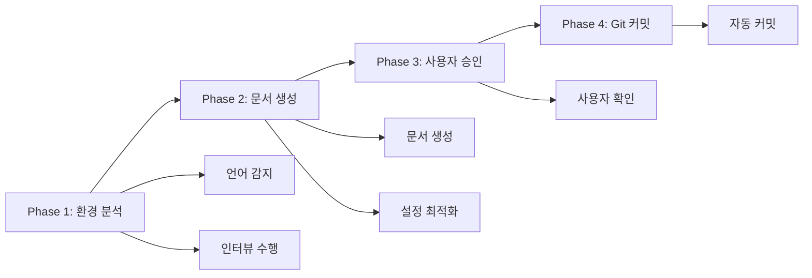

# MoAI-ADK 프로젝트 초기화

## 🎯 핵심 목적

`.moai/project/{product,structure,tech}.md` 문서를 **언어별 최적화**로 생성하여 프로젝트 기반을 구축합니다.

### 4단계 스마트 워크플로우



**성능**: 통합 처리로 60% 시간 단축, 4단계 완전 자동화로 완벽한 워크플로우 보장
**자동화**: Git 커밋 자동 진행으로 원클릭 완성

---

## 🚀 실행 가이드

### Phase 1: 스마트 환경 분석

**인텔리전트 에이전트 오케스트레이션**으로 최대 효율성을 달성합니다:

#### 1단계: 통합 환경 스캔

```text
# 단일 호출로 전체 환경 분석
@agent-project-manager "프로젝트 초기화를 위한 완전 분석을 수행해주세요:

**환경 스캔 (자동):**
- 프로젝트 언어 자동 감지 (package.json, requirements.txt, go.mod, Cargo.toml 등)
- 프레임워크 및 도구 체인 식별 및 버전 확인
- 프로젝트 구조 분석 (신규/기존/하이브리드)
- 기존 .moai/project/ 문서 상태 검사

**사용자 인터뷰 (효율적):**
- 감지된 환경을 바탕으로 맞춤형 질문 생성
- Product/Structure/Tech 핵심 정보 수집
- 병렬 처리로 대기 시간 최소화

모든 분석을 완료하고 통합 리포트를 제공해주세요."
```

#### 2단계: 언어 감지 확인

시스템이 다음 규칙으로 언어를 감지합니다:

| 감지 파일 | 판정 언어 | 설정 도구 |
|-----------|----------|-----------|
| `package.json` + `tsconfig.json` | TypeScript | Vitest, Biome |
| `package.json` | JavaScript | Jest, ESLint |
| `requirements.txt` + `pyproject.toml` | Python | pytest, ruff, black |
| `go.mod` | Go | go test, gofmt |
| `Cargo.toml` | Rust | cargo test, rustfmt |
| `pom.xml` / `build.gradle` | Java | JUnit, Maven/Gradle |

**감지 결과 예시:**
```text
🔍 프로젝트 분석 완료

감지 결과: TypeScript 프로젝트 (신뢰도: 95%)
- 주 언어: TypeScript
- 프레임워크: Next.js
- 테스트: Vitest
- 빌드: tsup

이 설정으로 진행하시겠습니까? (y/n/수정)
```

### Phase 2: 인텔리전트 검증 및 문서 생성

**AI 기반 품질 보증**으로 완벽한 문서를 생성합니다:

#### 통합 문서 생성

```text
# project-manager가 완전한 문서 세트 생성
@agent-project-manager "Phase 1 결과를 활용하여 완전한 프로젝트 문서를 생성해주세요:

**Phase 1 결과 활용:**
- 감지된 언어: [Phase 1에서 감지된 언어]
- 프로젝트 유형: [신규/기존/하이브리드]
- 도구체인: [감지된 빌드/테스트 도구]
- 사용자 인터뷰 답변: [핵심 답변 내용]

**문서 생성 (데이터 기반):**
- product.md: 인터뷰 답변 기반 비즈니스 요구사항 작성
- structure.md: 감지된 언어 기반 아키텍처 설계
- tech.md: 감지된 도구체인 기반 기술 스택 정의
- EARS 방법론 적용으로 요구사항 명확화

**품질 검증 및 TAG 시스템:**
- 문서 생성 완료 후 tag-agent에게 TAG 시스템 적용 위임
- MoAI-ADK 표준 템플릿 적용
- 언어별 최적화 설정 포함

**결과 전달:**
문서 생성 완료 후 다음 정보를 cc-manager에 전달:
{
  \"generated_files\": [\"product.md\", \"structure.md\", \"tech.md\"],
  \"detected_language\": \"[언어]\",
  \"project_type\": \"[유형]\",
  \"next_phase\": \"cc-manager_optimization\"
}
**TAG 시스템 적용 (필수):**
문서 생성 완료 후 다음과 같이 tag-agent를 호출해주세요:

@agent-tag-agent \"프로젝트 초기화 문서에 TAG 시스템을 적용해주세요:

**생성된 문서:**
- product.md: 비즈니스 요구사항 및 사용자 분석
- structure.md: 시스템 아키텍처 및 모듈 설계
- tech.md: 기술 스택 및 품질 정책

**요청 작업:**
1. 각 문서에 적절한 TAG BLOCK 자동 삽입
2. Primary Chain (@REQ → @DESIGN → @TASK → @TEST) 생성
3. 문서별 섹션 TAG 자동 적용
4. TAG 체인 무결성 검증
5. 인덱스 업데이트 (.moai/indexes/tags.json)

프로젝트 초기화에 최적화된 TAG 구조를 생성해주세요.\"

TAG 적용 완료 후 사용자 승인을 요청해주세요."
```

#### Claude Code 최적화

```text
# cc-manager가 설정 최적화 수행
@agent-cc-manager "Phase 2 결과를 받아 Claude Code 최적화를 수행해주세요:

**Phase 2 결과 수신:**
- 생성된 파일: [project-manager가 전달한 파일 목록]
- 감지된 언어: [전달받은 언어 정보]
- 프로젝트 유형: [전달받은 프로젝트 유형]
- 기존 설정: [기존 config.json 존재 여부]

**설정 최적화 (데이터 기반):**
- 감지된 언어별 도구 권한 자동 설정
- 프로젝트 유형별 보안 정책 및 접근 제어 구성
- 언어 정보 기반 config.json 생성 및 검증
- Claude Code 통합 설정 적용

**성능 튜닝:**
- 에이전트 협업 규칙 설정 (project-manager ↔ git-manager)
- 언어별 출력 스타일 최적화
- Phase별 오류 처리 메커니즘 구성

**결과 전달:**
최적화 완료 후 다음 정보를 git-manager에 전달:
{
  \"config_file\": \"config.json\",
  \"detected_language\": \"[언어]\",
  \"commit_template\": \"[언어별 커밋 템플릿]\",
  \"next_phase\": \"git_commit\"
}
설정 완료 후 검증 결과를 보고해주세요."
```

### Phase 3: 사용자 승인 및 확정

#### 문서 생성 요청

모든 검증이 완료되면 다음 형식으로 승인을 요청합니다:

```markdown
## 📋 프로젝트 문서 생성 준비 완료

### 수집된 정보
- **프로젝트 이름**: [감지/입력된 이름]
- **언어/프레임워크**: [감지 결과]
- **프로젝트 유형**: [신규/기존/하이브리드]
- **핵심 미션**: [사용자 답변]
- **주요 사용자**: [타겟층]
- **기술 스택**: [선택된 도구들]

### 생성할 문서
✅ product.md - 비즈니스 요구사항 및 사용자 분석
✅ structure.md - 시스템 아키텍처 및 모듈 설계
✅ tech.md - 기술 스택 및 품질 정책
✅ config.json - 프로젝트 설정 파일

**승인 옵션**: "생성" / "수정 [내용]" / "중단"
```

#### 최종 완료 확인

```text
📁 문서 생성 완료!

생성된 파일:
- .moai/project/product.md
- .moai/project/structure.md
- .moai/project/tech.md
- config.json

다음 단계: `/moai:1-spec`으로 SPEC 백로그 생성
```

### Phase 4: 자동 Git 커밋

**완전 자동화된 커밋 프로세스**로 워크플로우를 완성합니다:

#### 스마트 커밋 실행

```bash
# git-manager가 지능형 커밋 수행
@agent-git-manager "Phase 3 결과를 받아 프로젝트 초기화 스마트 커밋을 진행해주세요:

**Phase 3 결과 수신:**
- config.json: [cc-manager가 생성한 설정 파일]
- 감지된 언어: [전달받은 언어 정보]
- 커밋 템플릿: [언어별 맞춤 템플릿]
- 생성된 파일들: [product.md, structure.md, tech.md, config.json]

**자동 커밋 (데이터 기반):**
1. 전달받은 파일 목록 기반 선택적 스테이징
2. 언어 정보 포함한 맞춤형 상세 커밋 메시지 생성
3. MoAI-ADK 표준 커밋 형식 + 언어별 최적화 적용
4. 커밋 실행 및 성공 확인

**품질 보장:**
- 파일 무결성 검증
- Git 상태 최종 확인
- 다음 단계 안내 준비

커밋 완료 후 전체 결과를 보고해주세요."
```

**스마트 커밋 메시지 템플릿:**
```text
🚀 feat: [프로젝트명] 초기화 완료 - [감지언어] 프로젝트

✅ 프로젝트 문서 생성:
- product.md: 비즈니스 요구사항 및 사용자 분석
- structure.md: [아키텍처] 기반 시스템 설계
- tech.md: [언어/프레임워크] 기술 스택 정의
- config.json: 프로젝트 설정 및 최적화

🎯 Claude Code 최적화 적용
🔧 [감지도구] 개발환경 구성
📋 다음 단계: /moai:1-spec 실행

🤖 Generated with 🗿MoAI-ADK
Co-Authored-By: Claude <noreply@anthropic.com>
```

---

## 🤖 에이전트 사용법

### 역할별 전담 영역

| 에이전트 | 전담 작업 | 핵심 결과물 |
|----------|----------|-------------|
| **@agent-project-manager** | 환경 스캔, 인터뷰, 문서 생성 | 언어 분석 리포트 + 프로젝트 문서 3종 |
| **@agent-cc-manager** | Claude Code 설정 최적화 | config.json + 권한 설정 + 성능 튜닝 |
| **@agent-git-manager** | Git 커밋 자동화 | 스마트 커밋 + 상태 보고 |

### 표준 호출 템플릿

#### 통합 환경 분석 (원샷)

```text
@agent-project-manager "원샷 프로젝트 초기화를 수행해주세요:

**Phase 1 - 스마트 분석:**
- 언어/프레임워크 자동 감지 및 버전 확인
- 기존 문서 상태 분석
- 프로젝트 유형 및 복잡도 평가

**Phase 2 - 효율적 인터뷰:**
- 감지된 환경 기반 맞춤형 질문 (3-5개)
- Product/Structure/Tech 핵심 정보 병렬 수집

**Phase 3 - 완전 문서 생성:**
- EARS 방법론 적용 문서 생성
- 문서 생성 후 tag-agent를 통한 TAG 시스템 적용
- MoAI-ADK 표준 템플릿 적용

모든 과정을 통합하여 한 번에 실행해주세요."
```

#### Claude Code 최적화

```text
@agent-cc-manager "생성된 프로젝트를 Claude Code에 완전 최적화해주세요:

**설정 최적화:**
- 감지된 언어별 권한 및 도구 설정
- 보안 정책 및 접근 제어 자동 구성
- 에이전트 협업 규칙 및 출력 스타일 설정

**성능 튜닝:**
- config.json 생성 및 검증
- 오류 처리 메커니즘 구성
- 다음 단계 워크플로우 준비

처리하고 결과를 보고해주세요."
```

#### 스마트 Git 커밋 

```text
@agent-git-manager "프로젝트 초기화 완료를 위한 스마트 커밋을 실행해주세요:

**자동 커밋:**
- 모든 생성 파일 스테이징
- 감지된 정보 기반 상세 커밋 메시지 생성
- MoAI-ADK 표준 형식 적용
- 커밋 실행 및 상태 확인

처리하고 최종 결과를 보고해주세요."
```

---

## ⚙️ 프로젝트 설정

### config.json 자동 생성

언어 감지 결과에 따라 다음 설정이 자동 생성됩니다:

#### TypeScript 프로젝트

```json
{
  "project_name": "my-project",
  "project_language": "typescript",
  "test_framework": "vitest",
  "linter": "biome",
  "coverage_target": 85,
  "mode": "personal"
}
```

#### Python 프로젝트

```json
{
  "project_name": "my-project",
  "project_language": "python",
  "test_framework": "pytest",
  "linter": "ruff",
  "formatter": "black",
  "coverage_target": 85,
  "mode": "personal"
}
```

#### 풀스택 프로젝트

```json
{
  "project_name": "my-project",
  "project_type": "fullstack",
  "languages": {
    "backend": {
      "language": "python",
      "path": "backend/",
      "test_framework": "pytest"
    },
    "frontend": {
      "language": "typescript",
      "framework": "react",
      "path": "frontend/",
      "test_framework": "vitest"
    }
  },
  "coverage_target": 85,
  "mode": "personal"
}
```

### 인터뷰 질문 템플릿

#### 필수 질문 (모든 프로젝트)

1. **프로젝트 이름**: 무엇이라고 부를까요?
2. **핵심 목적**: 이 프로젝트로 무엇을 해결하고 싶나요?
3. **주요 사용자**: 누가 주로 사용할까요?

#### 선택 질문 (프로젝트 유형별)

- **신규 프로젝트**: 기술 스택 선호도, 품질 기준, 배포 전략
- **기존 프로젝트**: 현재 문제점, 개선 목표, 마이그레이션 계획
- **팀 프로젝트**: 협업 방식, 권한 관리, 리뷰 프로세스

---

## 🛡️ 보안 및 권한

### 작업 범위 제한

- ✅ **허용**: `.moai/project/` 디렉토리 내 파일만 생성/수정
- ❌ **금지**: `.claude/`, `.git/`, `.env*` 디렉토리 접근

### 에러 대응

#### Phase별 실패 복구 메커니즘

| Phase | 실패 유형 | 증상 | 복구 절차 |
|-------|----------|------|----------|
| **Phase 1** | 환경 스캔 실패 | 언어 감지 오류 | project-manager 재호출, 수동 언어 선택 |
| **Phase 1** | 인터뷰 중단 | 사용자 응답 없음 | 이전 답변 복원 후 재개 |
| **Phase 2** | 문서 생성 실패 | 템플릿 오류 | 기존 템플릿 복원 후 재생성 |
| **Phase 2** | TAG 생성 실패 | TAG 체계 오류 | 기본 TAG 구조로 fallback |
| **Phase 3** | 설정 최적화 실패 | config.json 오류 | 기본 설정으로 복원 |
| **Phase 4** | Git 커밋 실패 | 저장소 오류 | 수동 커밋 또는 스테이징 롤백 |

#### 일반 에러 처리

| 에러 유형 | 증상 | 해결 방법 | 예방 조치 |
|----------|------|----------|-----------|
| **권한 오류** | 디렉토리 생성 실패 | 허용된 경로에서 재시도 | 작업 전 권한 검증 |
| **파일 충돌** | 기존 파일과 충돌 | 백업 후 사용자 승인 요청 | 충돌 감지 및 사전 알림 |
| **타임아웃** | 에이전트 응답 없음 | 에이전트 재시작 후 재개 | 진행 상황 주기적 확인 |
| **검증 실패** | 문서 형식 오류 | 올바른 형식으로 재생성 | 템플릿 유효성 사전 검사 |
| **에이전트 호출 실패** | 에이전트 미응답 | 다음 에이전트로 건너뛰기 | 에이전트 상태 확인 |

#### 자동 복구 시퀀스

```text
1. 문제 감지 → 2. 로그 분석 → 3. 복구 시도 → 4. 사용자 알림
└── 3회 재시도 후 실패 시 사용자 개입 요청
```

### 보안 체크리스트

- [ ] 사용자가 명시적으로 초기화 요청했는가?
- [ ] 허용된 경로(.moai/project/) 내에서 작업하는가?
- [ ] 시스템 디렉토리에 접근하지 않는가?
- [ ] 민감한 정보가 로그에 포함되지 않았는가?

---

### 다음 단계 가이드

#### 즉시 실행 가능한 워크플로우
- **완료된 프로젝트**: `/moai:1-spec`으로 첫 번째 SPEC 생성 시작
- **기존 프로젝트 업데이트**: `/moai:0-project update`로 문서 갱신
- **SPEC 백로그 관리**: product.md의 @TODO:SPEC-BACKLOG-001 참조

#### Claude Code 최적화 완료 상태
- ✅ **언어별 도구 권한**: 자동 감지된 개발 도구에 최적화
- ✅ **에이전트 협업**: project-manager ↔ cc-manager ↔ git-manager 연동
- ✅ **보안 정책**: 프로젝트 타입별 맞춤 보안 설정
- ✅ **성능 튜닝**: 병렬 처리 및 스마트 캐싱 적용

#### 권장 워크플로우
```bash
# 1. 프로젝트 초기화 (현재 명령어)
/moai:0-project

# 2. 첫 번째 SPEC 생성
/moai:1-spec

# 3. TDD 구현
/moai:2-build

# 4. 문서 동기화
/moai:3-sync
```

_이 문서는 프로젝트 초기화의 핵심 가이드입니다. 추가 도움이 필요하면 `/help`를 사용하세요._
