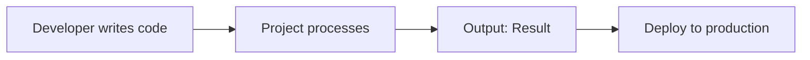

# [Announcement: Project/Feature Name] is Now Available 🎉

## What's New?

[1-2 sentence hook: What did you build and why should people care?]

Today, we're excited to announce the release of [Project Name], a [brief description of what it is].

## The Problem We're Solving

[2-3 sentences describing the problem that existing solutions didn't address well]

Developers today face:
- **Challenge 1**: [Description and impact]
- **Challenge 2**: [Description and impact]
- **Challenge 3**: [Description and impact]

## Introducing [Project Name]

[2-3 sentences introducing your solution]

[Project Name] is:
- **Feature 1**: [Benefit and why it matters]
- **Feature 2**: [Benefit and why it matters]
- **Feature 3**: [Benefit and why it matters]

### Key Highlights

```
✨ Feature 1: [Value proposition]
⚡ Feature 2: [Value proposition]
🚀 Feature 3: [Value proposition]
🔐 Feature 4: [Value proposition]
```

## How It Works

[Visual representation would be helpful here]



### Quick Example

See how easy it is:

\`\`\`typescript
import { ProjectName } from '@organization/project-name';

// Before (old way)
// [Complex code with many steps]

// Now (with Project Name)
const result = new ProjectName({
  option1: value,
  option2: value,
});

console.log(result);
// Output: Success!
\`\`\`

**That's it!** In just [X lines of code], you can [accomplish goal].

## Why We Built This

[Background story: Why your team/company created this]

Our team realized that [problem statement]. After [time period] of development, we're proud to share [Project Name] with the community.

### Design Philosophy

[Core principles that guided the design]

1. **Principle 1**: [Explanation]
2. **Principle 2**: [Explanation]
3. **Principle 3**: [Explanation]

## Feature Comparison

How [Project Name] compares to alternatives:

| Feature | [Project Name] | Alternative A | Alternative B |
|---------|----------------|---------------|---------------|
| Feature 1 | ✅ Yes | ❌ No | ⚠️ Limited |
| Feature 2 | ✅ Yes | ✅ Yes | ❌ No |
| Feature 3 | ✅ Yes | ⚠️ Limited | ✅ Yes |
| Learning Curve | Easy | Moderate | Steep |
| Community | Growing | Large | Small |

## Getting Started

### Installation

\`\`\`bash
# Using npm
npm install @organization/project-name

# Using yarn
yarn add @organization/project-name

# Using pnpm
pnpm add @organization/project-name
\`\`\`

### Your First [Example]

Follow this simple 3-step guide:

**Step 1**: Initialize
\`\`\`typescript
import { ProjectName } from '@organization/project-name';
\`\`\`

**Step 2**: Configure
\`\`\`typescript
const project = new ProjectName({
  config: 'value'
});
\`\`\`

**Step 3**: Use
\`\`\`typescript
const result = project.run();
\`\`\`

For more detailed setup, see the [Getting Started Guide](./getting-started.md).

## Use Cases

[Project Name] is perfect for:

### Use Case 1: [Scenario]

[Description of how [Project Name] helps]

\`\`\`typescript
// Example code
\`\`\`

### Use Case 2: [Scenario]

[Description]

### Use Case 3: [Scenario]

[Description]

## Roadmap

We're just getting started! Here's what's planned:

### Q4 2025
- [ ] [Feature 1]
- [ ] [Feature 2]
- [ ] [Improvement 1]

### Q1 2026
- [ ] [Major feature]
- [ ] [Performance improvement]
- [ ] [Integration 1]

### Beyond
- [ ] [Long-term vision]
- [ ] [Research direction]

## Thank You!

[Project Name] wouldn't be possible without:

- **Contributors**: [Mention key team members]
- **Community**: [Mention community help/feedback]
- **Supporters**: [Mention sponsors if applicable]

## Learn More

- 📖 **Documentation**: [Link to full docs]
- 🐙 **GitHub Repository**: [Link to GitHub]
- 🚀 **Live Demo**: [Link to demo]
- 💬 **Discord Community**: [Link to community]
- 📺 **Video Tutorial**: [Link to video]

## Call to Action

Ready to try [Project Name]?

**[Get Started Now →](./getting-started.md)**

Or if you have questions:
- 💬 [Join our Discord](#discord)
- 🐛 [Report an Issue](https://github.com/organization/project-name/issues)
- 💡 [Suggest a Feature](https://github.com/organization/project-name/discussions)

## What's Next?

We'd love to hear your feedback and see what you build with [Project Name]!

**Share your projects** with us on [Twitter/X](#twitter), [LinkedIn](#linkedin), or [Dev.to](#devto) using [#ProjectName](#hashtag).

---

**Questions?** Check out the [FAQ](./faq.md) or ask in our [Community Forum](./community).

**Found this announcement helpful?** Share it with your network! 🙌
