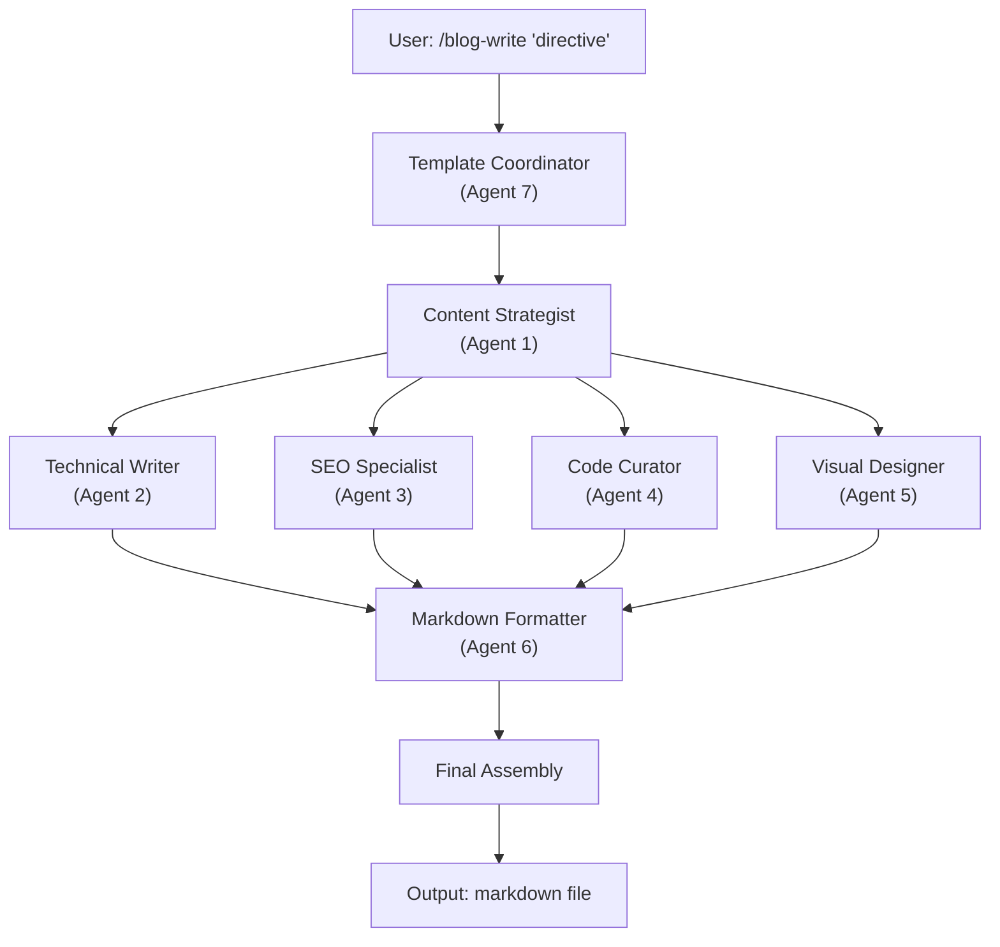

# /blog-write Command

**Description**: Write or optimize blog posts with natural language directives
**Model**: Orchestrated (Uses Sonnet Coordinator + Haiku Specialists)
**Execution**: Automatic template selection and agent coordination

## Usage

### Mode 1: Create New Blog Post

```bash
/blog-write "Next.js 15 초보자 튜토리얼 작성"
/blog-write "마이그레이션으로 20% 성능 향상한 사례 작성"
/blog-write "React Server Components vs Client Components 비교 분석"
/blog-write "TypeScript 5.0 새 기능 How-to 가이드"
```

### Mode 2: Optimize Existing Post

```bash
/blog-write "./posts/nextjs-tutorial.md 최적화"
/blog-write "기존 포스트 SEO 개선: ./posts/case-study.md"
```

### Mode 3: View Templates

```bash
/blog-write "템플릿 목록"
/blog-write "사용 가능한 템플릿 보기"
```

## Automatic Template Selection

| Keyword | Template | Description |
|---------|----------|-------------|
| "튜토리얼", "가이드", "배우기", "시작하기" | **Tutorial** | Step-by-step learning guide |
| "케이스 스터디", "사례", "성공", "개선" | **Case Study** | Problem → Solution → Results |
| "방법", "어떻게", "구현" | **How-to** | Task-oriented how-to guide |
| "발표", "공지", "소개", "릴리즈" | **Announcement** | Feature/product announcement |
| "비교", "vs", "차이점" | **Comparison** | Tool/framework comparison |

## Workflow

### CREATE Mode (New Post)

```
/blog-write "<directive>"
    ↓
Template Coordinator (Agent 7)
├─ Parse directive (keyword detection)
├─ Infer template (Tutorial, Case Study, How-to, etc.)
├─ Infer difficulty ("초보자" → beginner)
├─ Extract topic
└─ Start orchestration
    ↓
[Sequential] Technical Content Strategist (Agent 1)
├─ Analyze audience
├─ Define learning objectives
├─ Create content structure
└─ Pass to all agents
    ↓
[Parallel] 4 Specialist Agents (Agents 2,3,4,5)
├─ Technical Writer (content creation)
├─ SEO Specialist (meta tags, hashtags)
├─ Code Curator (code examples)
└─ Visual Designer (images, diagrams)
    ↓
[Sequential] Markdown Formatter (Agent 6)
├─ Lint and validate
├─ Auto-fix issues
└─ Generate QA report
    ↓
Final Assembly
├─ Merge all sections
├─ Create output file: ./posts/[slug].md
└─ Return completion report
```

### OPTIMIZE Mode (Existing Post)

```
/blog-write "<filepath> 최적화"
    ↓
Template Coordinator
├─ Parse filepath
├─ Load existing markdown
└─ Start optimization
    ↓
[Parallel] SEO Specialist + Markdown Formatter
├─ SEO: Update meta tags, hashtags, llms.txt
├─ Markdown: Fix formatting, auto-correct issues
└─ Generate optimization report
    ↓
Output: Optimized markdown file
```

## Output Example

```
✅ Blog Writing Complete

Template: Tutorial
Title: Next.js 15 초보자 튜토리얼
File: ./posts/nextjs-15-tutorial.md
Status: Ready for publish

📊 Summary
- Content: 1,850 words (~9 min read)
- Difficulty: Beginner
- Code Examples: 5 (TypeScript, React, Next.js)
- SEO: Optimized for "next.js 15 tutorial" (8.1K searches/month)
- Meta Tags: ✅ Title ✅ Description ✅ OG ✅ Twitter
- Hashtags: #NextJS #Tutorial #React #TypeScript
- Markdown: ✅ Valid (markdownlint passed)
- Images: ✅ OG prompt ✅ Mermaid diagram ✅ Alt texts

🚀 Next Steps
1. Review: ./posts/nextjs-15-tutorial.md
2. Add OG image (use prompt from agent output)
3. Generate code screenshots
4. Publish and share with hashtags
```

## Agents Involved

| Agent | Role | Model |
|-------|------|-------|
| Template & Workflow Coordinator | Orchestration, parsing, final assembly | Sonnet |
| Technical Content Strategist | Content strategy, audience profiling | Sonnet |
| Technical Writer | Blog post writing | Haiku |
| SEO & Discoverability Specialist | SEO optimization, meta tags, hashtags | Haiku |
| Code Example Curator | Code examples generation | Haiku |
| Visual Content Designer | Images, diagrams, OG prompts | Haiku |
| Markdown Formatter & Linter | Quality assurance, validation | Haiku |

## Execution Flow



## Tips

- **For tutorials**: Include prerequisites and step-by-step structure
- **For case studies**: Highlight business value and metrics
- **For how-to guides**: Focus on actionable steps
- **For announcements**: Lead with "what" and "why"
- **For comparisons**: Use structured criteria analysis

## Examples

### Tutorial Example
```bash
/blog-write "Next.js 15 App Router 초보자 튜토리얼 작성"

→ Template: Tutorial
→ Difficulty: Beginner (inferred from "초보자")
→ Topic: Next.js 15 App Router
→ Output: ./posts/nextjs-15-app-router-tutorial.md
```

### Case Study Example
```bash
/blog-write "마이그레이션으로 페이지 로드 시간 50% 단축한 사례 공유"

→ Template: Case Study
→ Focus: Performance improvement metrics
→ Output: ./posts/migration-performance-case-study.md
```

### Optimization Example
```bash
/blog-write "./posts/old-tutorial.md SEO 최적화"

→ Mode: OPTIMIZE
→ Actions: Update meta tags, add hashtags, fix markdown
→ Output: ./posts/old-tutorial.md (updated)
```
