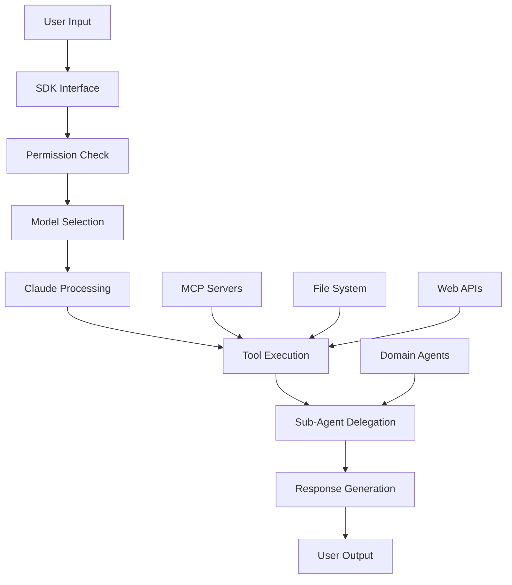

# Claude Code SDK Overview

## Introduction

The Claude Code SDK provides programmatic access to Claude Code's capabilities, enabling developers to build AI agents with advanced tool access and conversation management. The SDK offers the same powerful features as the interactive CLI in a programmable interface, now enhanced with 2025's latest capabilities.

## Key Features

### Core Capabilities

- **Optimized Claude Integration**: Built-in prompt caching and performance optimizations with Claude 4.0 and 4.1 support
- **Rich Tool Ecosystem**: Access to file operations, code execution, web search, MCP integration, and specialized sub-agents
- **Advanced Permissions**: Fine-grained control with new "ask" mode and enhanced security options
- **Production Essentials**: Improved error handling, session management, cost tracking, and monitoring
- **MCP Integration**: Connect to Model Context Protocol servers with token management and API integration
- **Sub-Agent System**: Delegate specialized tasks to domain-specific agents

### Multi-Language Support

- **TypeScript/JavaScript**: Native Node.js and web applications with full type safety
- **Python**: Python applications and data science workflows with async/await patterns
- **Headless CLI**: Command-line automation and scripting with enhanced output formats

## Installation

### Prerequisites

- Node.js 18+ (for all SDK variants)
- Python 3.10+ (for Python SDK only)

### Install Options

#### TypeScript/JavaScript

```bash
npm install -g @anthropic-ai/claude-code
```

#### Python

```bash
pip install claude-code-sdk
npm install -g @anthropic-ai/claude-code
```

#### CLI Only

```bash
# Native installer (recommended)
curl -fsSL claude.ai/install.sh | bash

# Or via NPM
npm install -g @anthropic-ai/claude-code
```

## Authentication

Set up authentication before using any SDK:

```bash
export ANTHROPIC_API_KEY="your-api-key-here"
```

**Alternative Providers (2025):**

```bash
# Amazon Bedrock
export CLAUDE_CODE_USE_BEDROCK=1
export VERTEX_REGION_CLAUDE_4_0_OPUS="us-east-1"

# Google Vertex AI
export CLAUDE_CODE_USE_VERTEX=1
export VERTEX_REGION_CLAUDE_4_1_OPUS="us-central1"
```

## Quick Start Examples

### TypeScript: Simple Query

```typescript
import { query } from '@anthropic-ai/claude-code';

for await (const message of query({
  prompt: 'Analyze the performance of this function',
  options: {
    model: 'claude-4-1-opus',
    maxTurns: 3,
    allowedTools: ['Read', 'Grep'],
    permissionMode: 'ask', // New 2025 permission mode
  },
})) {
  if (message.type === 'result') {
    console.log(message.result);
  }
}
```

### Python: Multi-Turn Conversation

```python
import asyncio
from claude_code_sdk import ClaudeSDKClient, ClaudeCodeOptions

async def code_review():
    async with ClaudeSDKClient(
        options=ClaudeCodeOptions(
            system_prompt="You are a senior code reviewer",
            max_turns=5,
            model="claude-4-1-opus",
            permission_mode="ask"  # Enhanced permission control
        )
    ) as client:
        await client.query("Review the authentication module for security issues")

        async for message in client.receive_response():
            if hasattr(message, 'content'):
                for block in message.content:
                    if hasattr(block, 'text'):
                        print(block.text)

asyncio.run(code_review())
```

### CLI: Headless Automation

```bash
# One-shot query with new permission mode
claude -p "Fix linting errors" \
  --allowedTools "Bash,Edit" \
  --permission-mode ask \
  --output-format json

# Multi-turn session with model selection
claude --model claude-4-1-opus \
  --resume session-id \
  "Continue working on the test suite"
```

## Architecture Overview

### Components

1. **Core Engine**: Claude 4.0/4.1 models with specialized system prompts
2. **Tool System**: Extensible set of capabilities (file ops, web access, MCP tools)
3. **Permission Manager**: Enhanced access control with "ask" mode and audit logging
4. **Session Manager**: Conversation state, resumption, and SessionEnd events
5. **MCP Integration**: External tool and data source connections with token management
6. **Sub-Agent System**: Specialized domain agents with parallel execution

### Data Flow



## 2025 Feature Highlights

### Enhanced Permission System

```typescript
interface PermissionMode {
  'ask': 'Request approval for each tool use (new 2025 mode)',
  'acceptEdits': 'Auto-approve file operations, ask for others',
  'acceptAll': 'Approve all tool uses automatically',
  'bypassPermissions': 'Skip permission system (advanced)'
}
```

### Model Configuration

```typescript
const options = {
  model: 'claude-4-1-opus',        // Latest model support
  opusplan: true,                  // Hybrid mode for cost optimization
  environmentVariables: {
    VERTEX_REGION_CLAUDE_4_0_OPUS: 'us-east-1'
  }
};
```

### Session Management Enhancements

```typescript
// Session lifecycle events
const client = new ClaudeSDKClient({
  onSessionStart: (sessionId) => console.log('Session started:', sessionId),
  onSessionEnd: (sessionId, summary) => console.log('Session ended:', summary),
  resumeSessionId: 'previous-session-id'
});
```

## Use Cases and Examples

### Development Automation

```typescript
// Code review agent with sub-agent delegation
const reviewer = await query({
  prompt: 'Use the security-reviewer agent to analyze recent git changes',
  options: {
    systemPrompt: 'You coordinate specialized review agents',
    allowedTools: ['Bash', 'Read', 'Task'],
    maxTurns: 5,
    model: 'claude-4-1-opus'
  },
});
```

### Data Analysis

```python
# Data processing with MCP integration
async with ClaudeSDKClient(
    options=ClaudeCodeOptions(
        system_prompt="You are a data scientist",
        allowed_tools=["Read", "Bash", "Write", "mcp__database__query"],
        max_mcp_output_tokens=50000  # New 2025 MCP token management
    )
) as client:
    await client.query("Analyze sales_data.csv using database context")
```

### Documentation Generation

```bash
# Automated documentation with parallel processing
find src/ -name "*.ts" | head -10 | xargs -I {} \
  claude -p "Generate comprehensive docs for {}" \
    --allowedTools "Read,Edit,Task" \
    --permission-mode ask \
    --model claude-4-1-opus
```

### Incident Response

```typescript
// SRE automation with enhanced monitoring
const incident_response = await query({
  prompt: 'Investigate high memory usage alerts from monitoring',
  options: {
    systemPrompt: 'You are an SRE diagnosing production issues',
    allowedTools: ['Bash', 'WebFetch', 'Read', 'mcp__monitoring__query'],
    maxTurns: 10,
    model: 'claude-4-1-opus',
    permissionMode: 'ask', // Require approval for production changes
  },
});
```

## Tool Capabilities

### File Operations

- **Read**: View file contents with syntax highlighting and image support
- **Write**: Create new files with validation and encoding detection
- **Edit**: Targeted modifications preserving structure and formatting
- **MultiEdit**: Atomic multi-location edits with rollback capability
- **Glob**: Pattern-based file discovery with performance optimizations

### Code Execution

- **Bash**: Shell command execution with enhanced safety controls and background execution
- **NotebookEdit**: Jupyter notebook cell modification with kernel management

### Web and Data

- **WebFetch**: Retrieve and process web content with caching and rate limiting
- **WebSearch**: Intelligent web searches with domain filtering and result ranking
- **MCP Tools**: Custom integrations via MCP servers with token management

### Development Tools

- **Task**: Delegate to specialized sub-agents with parallel execution
- **TodoWrite**: Structured task management with progress tracking
- **Git Integration**: Enhanced version control operations with hooks

### 2025 Enhanced Tools

- **Sub-Agent System**: Domain-specific agents (security-reviewer, code-generator, etc.)
- **MCP API Integration**: Beta API features for advanced integrations
- **Cost Tracking**: Built-in usage monitoring and optimization

## Configuration Options

### Global Settings

```typescript
interface ClaudeCodeOptions {
  // Core configuration
  systemPrompt?: string; // Custom system instructions
  maxTurns?: number; // Limit conversation rounds

  // Model configuration (2025)
  model?: 'claude-4-1-opus' | 'claude-4-0-sonnet' | 'claude-3-5-sonnet';
  opusplan?: boolean; // Hybrid mode for cost optimization

  // Tool control
  allowedTools?: string[]; // Restrict tool access
  permissionMode?: 'ask' | 'acceptEdits' | 'acceptAll' | 'bypassPermissions';

  // Session management (enhanced 2025)
  resumeSessionId?: string; // Resume specific session
  onSessionStart?: (sessionId: string) => void;
  onSessionEnd?: (sessionId: string, summary: object) => void;

  // Output control
  verbose?: boolean; // Enable debug output
  stream?: boolean; // Enable streaming responses
  outputFormat?: 'text' | 'json' | 'stream-json';

  // MCP configuration (2025)
  maxMcpOutputTokens?: number; // Token limit for MCP responses
  mcpServerConfig?: Record<string, any>; // MCP server settings

  // Advanced options
  environmentVariables?: Record<string, string>;
  timeout?: number; // Operation timeout in seconds
  abortController?: AbortController; // Cancel operations
}
```

### Permission Modes (Enhanced 2025)

- **ask**: Request approval for each tool use (new interactive mode)
- **acceptEdits**: Auto-approve file edits, ask for others
- **acceptAll**: Approve all tool uses automatically
- **bypassPermissions**: Skip permission system (advanced use)

## Error Handling

### Enhanced Error Types (2025)

```typescript
interface ClaudeCodeError {
  code: 'PERMISSION_DENIED' | 'RATE_LIMIT' | 'MODEL_ERROR' | 'MCP_ERROR' | 'SESSION_ERROR';
  message: string;
  context?: {
    sessionId?: string;
    toolName?: string;
    mcpServer?: string;
    retryAfter?: number;
  };
}
```

### Best Practices

```typescript
try {
  for await (const message of query({ prompt: 'task' })) {
    // Process messages
  }
} catch (error) {
  switch (error.code) {
    case 'PERMISSION_DENIED':
      // Handle permission issues with ask mode
      break;
    case 'RATE_LIMIT':
      // Implement exponential backoff
      break;
    case 'MCP_ERROR':
      // Handle MCP server issues
      break;
    case 'SESSION_ERROR':
      // Handle session lifecycle issues
      break;
    default:
      // Handle other errors
      break;
  }
}
```

## Performance Optimization

### Efficient Usage (2025 Enhancements)

- Use model selection for cost optimization (opusplan mode)
- Leverage prompt caching for repeated patterns
- Set appropriate `maxTurns` to control costs
- Use streaming for real-time feedback
- Configure MCP token limits for external tool calls

### Monitoring and Analytics

- Track token usage with built-in cost tracking
- Monitor tool execution times and success rates
- Log MCP server performance and errors
- Session lifecycle analytics and optimization

## Security Considerations

### Best Practices (Enhanced 2025)

1. **Enhanced Permission Control**: Use "ask" mode for sensitive operations
2. **Input Validation**: Sanitize user inputs before processing
3. **Credential Management**: Never log API keys or sensitive data
4. **Tool Restrictions**: Use `allowedTools` to limit capabilities
5. **MCP Security**: Validate MCP server configurations and outputs
6. **Session Security**: Implement session timeout and cleanup
7. **Audit Logging**: Track all tool usage for compliance

### Enterprise Deployment

- Use managed settings for organization-wide policies
- Implement comprehensive audit logging for compliance
- Control external network access and MCP server connections
- Review and validate all tool and MCP server configurations
- Enable session lifecycle monitoring and alerting

## Getting Started

### Next Steps

1. **Choose Your SDK**: Pick TypeScript, Python, or CLI based on your needs
2. **Set Up Authentication**: Configure API keys and provider settings (including Vertex regions)
3. **Configure Models**: Select appropriate Claude 4.x models for your use case
4. **Start Small**: Begin with simple queries and single tools
5. **Add Permission Controls**: Implement appropriate security measures
6. **Expand Capabilities**: Add MCP servers and custom sub-agents
7. **Production Deploy**: Implement monitoring, error handling, and cost controls

### Additional Resources

- [TypeScript SDK Documentation](sdk-typescript.md)
- [Python SDK Documentation](sdk-python.md)
- [Headless CLI Guide](sdk-headless.md)
- [MCP Integration Guide](mcp.md)
- [Sub-Agents Documentation](sub-agents-en.md)
- [Security Best Practices](security-best-practices.md)
- [Model Configuration Guide](model-config.md)

This SDK overview provides a comprehensive foundation for building sophisticated AI applications with Claude Code's enhanced 2025 capabilities.