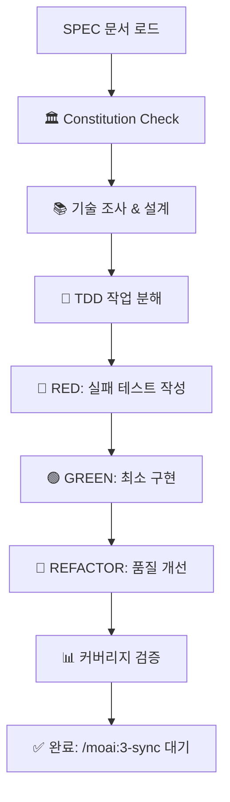

# MoAI-ADK  TDD 구현 (GitFlow 통합)

!@ code-builder 에이전트가 Constitution Check부터 Red-Green-Refactor까지 완전 자동화합니다.

## 🔀 TDD GitFlow 자동화 실행 코드 (완전 투명)

```bash
# 1. Constitution 5원칙 검증
python .moai/scripts/check_constitution.py --strict

# 2. TDD Red-Green-Refactor 3단계 자동 커밋
# RED 단계: 실패하는 테스트 작성
git add tests/
git commit -m "🔴 ${SPEC_ID}: 실패하는 테스트 작성 완료 (RED)

- ${TEST_COUNT}개 테스트 케이스 작성
- Given-When-Then 구조 준수
- 의도적 실패 확인 완료"

# GREEN 단계: 최소 구현으로 테스트 통과
git add src/
git commit -m "🟢 ${SPEC_ID}: 최소 구현으로 테스트 통과 (GREEN)

- 모든 테스트 통과 확인
- 최소 요구사항 충족
- 커버리지 ${COVERAGE_PERCENT}% 달성"

# REFACTOR 단계: 코드 품질 개선
git add -A
git commit -m "🔄 ${SPEC_ID}: 코드 품질 개선 및 리팩터링 완료

- Constitution 5원칙 준수
- 코드 중복 제거 및 최적화
- 문서화 및 타입 힌트 추가"

# 3. GitHub Actions CI/CD 자동 트리거
git push origin $(git branch --show-current)

# 4. PR 상태 업데이트 (구현 진행률)
gh pr edit --add-label "implementation-complete" --add-label "ready-for-review-pending"
```

SPEC을 바탕으로 Constitution Check → 기술 설계 → 작업 분해 → TDD 구현까지 완전 자동화하는 MoAI-ADK의 핵심 명령어입니다.


## 🚀 빠른 시작

```bash
# 단일 SPEC 완전 구현
/moai:2-build SPEC-001

# 모든 SPEC 병렬 구현
/moai:2-build all

```

## 🔄 통합 실행 흐름



## 🤖 code-builder 에이전트 완전 자동화

**code-builder 에이전트**가 전체 구현 과정을 완전 자동화:

### 1단계: Constitution 검증
- **Simplicity**: 프로젝트 복잡도 ≤ 3개 확인
- **Architecture**: 모든 기능 라이브러리화 검증
- **Testing**: TDD 강제 및 85% 커버리지 확보
- **Observability**: 구조화 로깅 필수
- **Versioning**: MAJOR.MINOR.BUILD 체계

### 2단계: 기술 설계
- **기술 스택 조사**: 최신 동향 및 베스트 프랙티스
- **아키텍처 설계**: 필요시 data-model.md, contracts/ 생성
- **의존성 분석**: 외부 라이브러리 및 API 검토

### 3단계: TDD 구현
- **작업 분해**: 구현 가능한 단위로 태스크 분할
- **Red-Green-Refactor**: 엄격한 TDD 사이클 준수
- **품질 검증**: 린팅, 타입 체킹, 커버리지 확인

## 🏛️ Constitution Check (5원칙 자동 검증)

### 필수 통과 기준
```markdown
✅ Simplicity: 독립 모듈 ≤ 3개
✅ Architecture: 100% 라이브러리화
✅ Testing: 85% 커버리지 + TDD
✅ Observability: 구조화 로깅 구현
✅ Versioning: 시맨틱 버전 관리
```

### 위반 시 자동 해결
- 복잡도 초과 → 모듈 통합 제안
- 라이브러리화 미흡 → 구조 리팩터링
- 테스트 부족 → 추가 테스트 자동 생성

## 🔴🟢🔄 TDD 사이클 자동화

### RED 단계: 실패하는 테스트 작성
```python
# 예시: 사용자 인증 테스트
def test_user_authentication():
    # Given
    user = User(email="test@example.com", password="password123")

    # When
    token = authenticate_user(user.email, user.password)

    # Then
    assert token is not None
    assert is_valid_jwt_token(token)
    # 이 테스트는 처음에 실패해야 함 (RED)
```

### GREEN 단계: 최소 구현
```python
def authenticate_user(email: str, password: str) -> str:
    # 테스트를 통과시키는 최소 구현
    if email and password:
        return generate_jwt_token(email)
    return None
```

### REFACTOR 단계: 품질 개선
```python
def authenticate_user(email: str, password: str) -> Optional[str]:
    """사용자 인증 및 JWT 토큰 생성"""
    if not _validate_email(email) or not _validate_password(password):
        raise AuthenticationError("Invalid credentials")

    user = UserRepository.find_by_email(email)
    if user and user.verify_password(password):
        return JWTTokenGenerator.generate(user.id)

    return None
```

## 📊 커버리지 및 품질 검증

### 자동 검증 항목
- **테스트 커버리지**: 최소 85% (기본값)
- **타입 커버리지**: mypy/typescript strict 모드
- **린팅 통과**: ruff/eslint 규칙 준수
- **보안 검사**: bandit/semgrep 취약점 스캔

### 품질 게이트 실패 시
```bash
🔴 품질 게이트 실패:
- 커버리지 78% < 85% (목표)
- 타입 오류 3건
- 린팅 경고 5건

자동 수정 중...
✅ 추가 테스트 생성
✅ 타입 어노테이션 추가
✅ 코드 스타일 수정
```

## 📁 생성 파일 구조

### 설계 단계 산출물
```
.moai/specs/SPEC-XXX/
├── plan.md              # Constitution Check 결과
├── research.md          # 기술 조사 결과
├── data-model.md        # 데이터 모델 설계
└── contracts/           # API 계약서
    ├── user-auth.yaml
    └── api-responses.yaml
```

### 구현 단계 산출물
```
src/
├── models/              # 데이터 모델
├── services/            # 비즈니스 로직
├── controllers/         # API 엔드포인트
└── utils/              # 유틸리티 함수

tests/
├── unit/               # 단위 테스트
├── integration/        # 통합 테스트
└── fixtures/           # 테스트 데이터
```

## 🔄 완료 후 다음 단계

### 성공적인 구현 완료
```bash
🎉 TDD 구현 완료!

📊 최종 품질 지표:
- 테스트 커버리지: 87%
- 구현 파일: 12개
- 테스트 파일: 18개
- Constitution: 100% 준수

📝 생성된 파일:
├── src/ (12개 구현 파일)
├── tests/ (18개 테스트 파일)
└── .moai/specs/SPEC-001/ (설계 문서)

🎯 다음 단계:
> /moai:3-sync  # 문서 동기화 및 TAG 업데이트
> git add . && git commit -m "feat: implement SPEC-001"
```

### 병렬 구현 결과 (all 옵션)
```bash
🚀 모든 SPEC 구현 완료!

구현 결과:
├── ✅ SPEC-001: 사용자 인증 (87% 커버리지)
├── ✅ SPEC-002: 게시글 관리 (89% 커버리지)
├── ✅ SPEC-003: 댓글 시스템 (91% 커버리지)
└── ⚠️  SPEC-004: 결제 시스템 (외부 API 미확인)

총 처리 시간: 12분 30초
평균 커버리지: 89%
```

## ⚠️ 에러 처리

### SPEC 문서 누락
```bash
❌ SPEC-001을 찾을 수 없습니다.
먼저: /moai:1-spec "기능 설명" 실행
```

### Constitution 위반
```bash
🔴 Constitution 위반 감지:
- Simplicity: 4개 모듈 (임계값: 3개)

해결 방안:
1. 모듈 통합을 통한 복잡도 감소 [추천]
2. 위반 정당화 문서 작성
3. SPEC 수정 및 재시도
```

### TDD 사이클 실패
```bash
⚠️ 테스트가 통과하지 않습니다.
- test_user_authentication: FAILED

자동 수정 시도 중...
Green 단계 재구현 필요
```

## 🔁 응답 구조

출력은 반드시 3단계 구조를 따릅니다:
1. **Phase 1 Results**: Constitution & 설계 결과
2. **Phase 2 Plan**: TDD 구현 계획
3. **Phase 3 Implementation**: 실제 구현 및 검증

이 명령어는 MoAI-ADK 0.2.0의 핵심으로, 완전 자동화된 TDD 구현을 제공합니다.