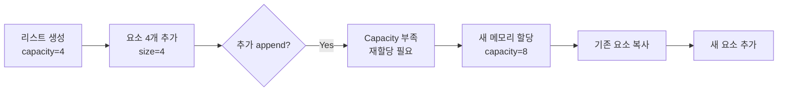
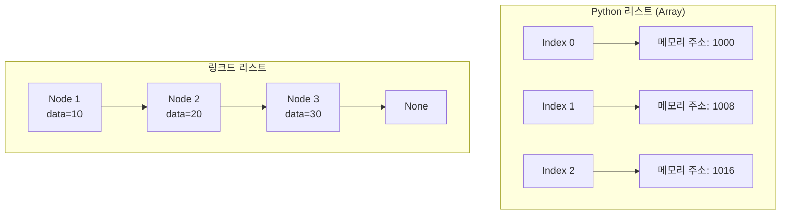

# 한국어 기술 서적 작성 실전 예시

이 문서는 `yoda-korean-technical-book-writing` Skill의 실전 적용 사례를 제공합니다.

---

## 예시 1: 잘 구조화된 장(Chapter) 전체 예시

```markdown
# Chapter 3. 리스트와 튜플 마스터하기

## 학습 목표
이 장을 마치면 다음을 할 수 있습니다:
- 리스트와 튜플의 차이점을 이해하고 설명할 수 있습니다
- 리스트의 주요 메서드를 사용하여 데이터를 조작할 수 있습니다
- 리스트 컴프리헨션으로 간결한 코드를 작성할 수 있습니다
- 실무에서 리스트와 튜플을 적절히 선택하여 사용할 수 있습니다

## 도입: 왜 여러 개의 값을 저장해야 할까?

학생 성적 관리 프로그램을 만든다고 가정해 봅시다. 학생이 한 명이라면 간단합니다:

```python
student_score = 85
```

그런데 학생이 30명이라면? 변수를 30개 만들어야 할까요?

```python
student1_score = 85
student2_score = 92
student3_score = 78
# ... 30개?
```

이런 상황에서 **컬렉션**(collection)이 필요합니다. Python의 가장 기본적인 컬렉션이 바로 
**리스트**(list)와 **튜플**(tuple)입니다.

## 3.1 리스트: 변경 가능한 순서형 컬렉션

### What: 리스트란?

리스트는 여러 값을 순서대로 저장하는 **가변**(mutable) 데이터 타입입니다.

```python
# 리스트 생성
scores = [85, 92, 78, 95, 88]
names = ["철수", "영희", "민수"]
mixed = [1, "Hello", 3.14, True]  # 다양한 타입 혼합 가능
```

### Why: 언제 리스트를 사용하나?

✅ **사용하면 좋은 경우**:
- 데이터가 추가/삭제/수정되어야 할 때
- 순서가 중요한 데이터
- 동적으로 크기가 변하는 컬렉션

❌ **피해야 할 경우**:
- 데이터가 변경되어서는 안 될 때 (→ 튜플 사용)
- 키-값 쌍이 필요할 때 (→ 딕셔너리 사용)

### How: 리스트 기본 조작

#### 1) 요소 접근

```python
scores = [85, 92, 78, 95, 88]

# 인덱싱 (0부터 시작)
first = scores[0]      # 85
last = scores[-1]      # 88 (음수 인덱스는 뒤에서부터)

# 슬라이싱
first_three = scores[0:3]   # [85, 92, 78]
middle = scores[1:4]        # [92, 78, 95]
every_second = scores[::2]  # [85, 78, 88]
```

#### 2) 요소 수정

```python
scores = [85, 92, 78, 95, 88]

# 단일 요소 수정
scores[2] = 80  # [85, 92, 80, 95, 88]

# 여러 요소 수정
scores[0:2] = [90, 93]  # [90, 93, 80, 95, 88]
```

#### 3) 요소 추가

```python
scores = [85, 92, 78]

# 끝에 추가
scores.append(95)  # [85, 92, 78, 95]

# 특정 위치에 삽입
scores.insert(1, 88)  # [85, 88, 92, 78, 95]

# 여러 요소 추가
scores.extend([82, 90])  # [85, 88, 92, 78, 95, 82, 90]
```

#### 4) 요소 삭제

```python
scores = [85, 92, 78, 95, 88]

# 값으로 삭제 (첫 번째 매칭만)
scores.remove(78)  # [85, 92, 95, 88]

# 인덱스로 삭제 후 반환
removed = scores.pop(1)  # removed=92, scores=[85, 95, 88]

# 마지막 요소 삭제
last = scores.pop()  # last=88, scores=[85, 95]

# 전체 삭제
scores.clear()  # []
```

### Try It: 직접 해보기

**문제**: 다음 요구사항을 만족하는 학생 관리 프로그램을 작성하세요.

1. 빈 리스트 `students` 생성
2. "김철수", "이영희", "박민수" 추가
3. "이영희"를 "이민지"로 수정
4. 첫 번째 학생 삭제
5. 최종 리스트 출력

<details>
<summary>💡 해답 보기</summary>

```python
# 1. 빈 리스트 생성
students = []

# 2. 학생 추가
students.append("김철수")
students.append("이영희")
students.append("박민수")
print(f"추가 후: {students}")  # ['김철수', '이영희', '박민수']

# 3. "이영희"를 "이민지"로 수정
index = students.index("이영희")
students[index] = "이민지"
print(f"수정 후: {students}")  # ['김철수', '이민지', '박민수']

# 4. 첫 번째 학생 삭제
students.pop(0)
print(f"삭제 후: {students}")  # ['이민지', '박민수']

# 5. 최종 결과
print(f"최종: {students}")
```

**또 다른 방법**:
```python
# 더 간결한 방법
students = ["김철수", "이영희", "박민수"]
students[1] = "이민지"
del students[0]
print(students)  # ['이민지', '박민수']
```
</details>

## 3.2 리스트 컴프리헨션: 파이썬다운 방식

### What: 리스트 컴프리헨션이란?

리스트를 생성하는 간결하고 읽기 쉬운 문법입니다.

### Before vs After

**Before (전통적 방법)**:
```python
# 1부터 10까지의 제곱수 리스트
squares = []
for i in range(1, 11):
    squares.append(i ** 2)
print(squares)  # [1, 4, 9, 16, 25, 36, 49, 64, 81, 100]
```

**After (리스트 컴프리헨션)**:
```python
squares = [i ** 2 for i in range(1, 11)]
print(squares)  # [1, 4, 9, 16, 25, 36, 49, 64, 81, 100]
```

### 패턴별 예시

#### 1) 기본 형태
```python
# [표현식 for 항목 in 시퀀스]
numbers = [x * 2 for x in range(5)]  # [0, 2, 4, 6, 8]
```

#### 2) 조건 필터링
```python
# [표현식 for 항목 in 시퀀스 if 조건]
evens = [x for x in range(10) if x % 2 == 0]  # [0, 2, 4, 6, 8]
```

#### 3) 중첩 반복문
```python
# 구구단 2~4단
multiplication_table = [
    f"{i} x {j} = {i*j}"
    for i in range(2, 5)
    for j in range(1, 10)
]
print(multiplication_table[0])  # "2 x 1 = 2"
```

#### 4) 실전 예시: 파일 필터링
```python
# 특정 확장자 파일만 추출
files = ["data.txt", "image.png", "script.py", "doc.txt"]
text_files = [f for f in files if f.endswith(".txt")]
print(text_files)  # ['data.txt', 'doc.txt']
```

> ⚠️ **주의**: 리스트 컴프리헨션이 항상 좋은 것은 아닙니다. 
> 로직이 복잡하면 일반 for 문이 더 읽기 쉽습니다.

```python
# ❌ 너무 복잡함
result = [x if x > 0 else -x if x < -10 else 0 for x in data if x != None]

# ✅ 명확함
result = []
for x in data:
    if x is None:
        continue
    if x > 0:
        result.append(x)
    elif x < -10:
        result.append(-x)
    else:
        result.append(0)
```

## 3.3 튜플: 변경 불가능한 순서형 컬렉션

### What: 튜플이란?

튜플은 리스트와 비슷하지만 **불변**(immutable)인 데이터 타입입니다.

```python
# 튜플 생성
coordinates = (3, 4)
rgb_color = (255, 128, 0)
single_item = (42,)  # 주의: 쉼표 필수!
```

### Why: 언제 튜플을 사용하나?

✅ **사용하면 좋은 경우**:
- 데이터가 변경되어서는 안 될 때 (예: 좌표, RGB 값)
- 딕셔너리 키로 사용 (리스트는 불가능)
- 함수에서 여러 값 반환
- 메모리 효율이 중요할 때 (튜플이 리스트보다 가벼움)

❌ **피해야 할 경우**:
- 데이터 수정이 필요한 경우

### 리스트 vs 튜플 비교

| 특성 | 리스트 | 튜플 |
|------|--------|------|
| 변경 가능 | ✅ | ❌ |
| 생성 속도 | 느림 | 빠름 |
| 메모리 사용 | 많음 | 적음 |
| 딕셔너리 키 사용 | ❌ | ✅ |
| 메서드 수 | 많음 (11개) | 적음 (2개) |

### 실전 예시: 함수 다중 반환

```python
def get_user_info():
    """사용자 정보를 튜플로 반환"""
    name = "김철수"
    age = 28
    city = "서울"
    return (name, age, city)  # 튜플 반환

# 튜플 언패킹
user_name, user_age, user_city = get_user_info()
print(f"{user_name}님은 {user_age}세이며 {user_city}에 거주합니다.")
```

## 실전 프로젝트: 학생 성적 관리 시스템

전체 장의 내용을 종합하여 간단한 성적 관리 시스템을 만들어 봅시다.

```python
# students: [(이름, 점수), ...]
students = [
    ("김철수", 85),
    ("이영희", 92),
    ("박민수", 78),
    ("최지훈", 95),
    ("정수진", 88),
]

# 1. 평균 점수 계산
scores = [score for name, score in students]
average = sum(scores) / len(scores)
print(f"평균 점수: {average:.1f}")  # 87.6

# 2. 90점 이상 학생 필터링
high_scorers = [name for name, score in students if score >= 90]
print(f"우수 학생: {', '.join(high_scorers)}")  # 이영희, 최지훈

# 3. 점수 순으로 정렬
sorted_students = sorted(students, key=lambda x: x[1], reverse=True)
print("석차:")
for rank, (name, score) in enumerate(sorted_students, 1):
    print(f"  {rank}등: {name} ({score}점)")

# 4. 새 학생 추가
students.append(("한민지", 91))
print(f"\n총 학생 수: {len(students)}명")
```

**출력 결과**:
```
평균 점수: 87.6
우수 학생: 이영희, 최지훈
석차:
  1등: 최지훈 (95점)
  2등: 이영희 (92점)
  3등: 박민수 (88점)
  4등: 김철수 (85점)
  5등: 정수진 (78점)

총 학생 수: 6명
```

## 요약

- **리스트**는 가변적이고 다양한 메서드를 제공하는 순서형 컬렉션입니다
- **리스트 컴프리헨션**은 간결한 리스트 생성 문법이지만, 과도하게 복잡하면 피해야 합니다
- **튜플**은 불변적이고 메모리 효율적인 순서형 컬렉션입니다
- **리스트 vs 튜플**: 수정 필요 시 리스트, 불변 데이터는 튜플을 선택합니다

## 연습 문제

**기초 문제**:
1. 1부터 100까지의 숫자 중 3의 배수만 포함하는 리스트를 컴프리헨션으로 생성하세요.
2. `("red", "green", "blue")` 튜플을 리스트로 변환한 후 "yellow"를 추가하세요.

**응용 문제**:
3. 주어진 문자열 리스트에서 길이가 5 이상인 단어만 추출하여 대문자로 변환하세요.
   ```python
   words = ["apple", "cat", "banana", "dog", "elephant"]
   # 결과: ['APPLE', 'BANANA', 'ELEPHANT']
   ```

**심화 문제**:
4. 2차원 리스트(행렬)를 전치(transpose)하는 함수를 리스트 컴프리헨션으로 작성하세요.
   ```python
   matrix = [
       [1, 2, 3],
       [4, 5, 6],
   ]
   # 결과: [[1, 4], [2, 5], [3, 6]]
   ```

## 더 읽을거리

- [Python 공식 문서 - 자료 구조](https://docs.python.org/ko/3/tutorial/datastructures.html)
- [Real Python - Lists and Tuples](https://realpython.com/python-lists-tuples/)
- [Python 리스트 vs 튜플 성능 비교](https://wiki.python.org/moin/TimeComplexity)
```

---

## 예시 2: 효과적 vs 비효과적 코드 설명

### ❌ Bad Example: 코드가 말하는 것을 반복

```python
# 변수 i를 0으로 초기화합니다
i = 0

# i가 10보다 작은 동안 반복합니다
while i < 10:
    # i의 값을 출력합니다
    print(i)
    # i를 1 증가시킵니다
    i = i + 1
```

**문제점**:
- 주석이 코드를 그대로 번역만 함
- 아무런 추가 정보를 제공하지 않음
- 주석 없이도 코드가 충분히 명확함

### ✅ Good Example: "왜"를 설명하는 주석

```python
# 사용자 입력 재시도 한도는 보안상 3회로 제한
# (무한 재시도 시 브루트 포스 공격 위험)
MAX_RETRIES = 3

# 이전 버전과의 호환성을 위해 레거시 포맷 유지 (2026년 1월 제거 예정)
def format_date_legacy(date):
    return date.strftime("%d/%m/%Y")

# O(n²) 알고리즘이지만 데이터셋이 항상 < 100개이므로 허용
# 더 빠른 정렬은 메모리 사용량이 3배 증가
for i in range(len(items)):
    for j in range(i + 1, len(items)):
        if items[i] > items[j]:
            items[i], items[j] = items[j], items[i]
```

**장점**:
- 비즈니스 로직 설명
- 설계 결정의 이유 제공
- 트레이드오프 명시
- 향후 리팩토링 힌트 제공

---

## 예시 3: Good vs Bad 문체 비교

### ❌ Bad: 장황하고 모호한 문장

```
이번 섹션에서는 정말로 중요하고 핵심적인 내용인 React의 Hooks라는 놀라운 기능에 대해서 
상세하게 알아보도록 하겠습니다. React Hooks는 함수형 컴포넌트에서 상태 관리를 할 수 있게 
해주는 정말 혁신적인 기능으로, 기존의 클래스 컴포넌트 방식과 비교했을 때 훨씬 더 간결하고 
이해하기 쉬운 코드를 작성할 수 있게 도와주는데, 특히나 useState나 useEffect 같은 기본 
Hooks들을 잘 활용하면 복잡한 상태 로직도 깔끔하게 처리할 수 있으며...
```

**문제점**:
- 한 문장이 너무 김 (100어절 이상)
- 수식어가 과도함 ("정말로", "놀라운", "혁신적인")
- 핵심 정보가 묻힘
- 호흡이 끊기지 않아 읽기 힘듦

### ✅ Good: 명확하고 간결한 문장

```
React Hooks는 함수형 컴포넌트에서 상태를 관리하는 기능입니다. 클래스 컴포넌트 없이도 
상태와 생명주기를 다룰 수 있어 코드가 간결해집니다.

가장 많이 사용하는 Hooks는 다음 두 가지입니다:

1. **useState**: 컴포넌트의 상태를 저장하고 업데이트합니다
2. **useEffect**: 부수 효과(side effect)를 처리합니다

예를 들어, 버튼 클릭 횟수를 세는 카운터를 만들어 봅시다:

[코드 예제]

Hooks를 사용하면 19줄이던 클래스 컴포넌트가 9줄로 줄어듭니다.
```

**장점**:
- 문장이 짧고 명확 (15-25어절)
- 불필요한 수식어 제거
- 구체적인 예시 제공
- 숫자로 효과 입증 (19줄 → 9줄)

---

## 예시 4: 목차 구조 비교

### ❌ Bad: 불균형하고 깊이 일관성 없음

```
Part 1. 기초
  Chapter 1. 시작하기 (3절)
  Chapter 2. 변수 (2절)
  
Part 2. 중급
  Chapter 3. 함수 (12절)  ← 너무 많음
    3.1 함수 정의
    3.2 매개변수
      3.2.1 위치 인자
      3.2.2 키워드 인자
      3.2.3 가변 인자
        3.2.3.1 *args
        3.2.3.2 **kwargs  ← 너무 깊음
    3.3 반환값
    ...
  Chapter 4. 클래스 (2절)  ← 너무 적음
```

**문제점**:
- 장별 절 개수 편차가 큼 (2개 vs 12개)
- 깊이가 4단계 이상 (읽기 힘듦)
- 균형이 맞지 않음

### ✅ Good: 균형 잡힌 구조

```
Part 1. 기초 다지기
  Chapter 1. Python 시작하기 (6절)
  Chapter 2. 변수와 자료형 (7절)
  Chapter 3. 제어문 (6절)

Part 2. 핵심 기능
  Chapter 4. 함수 (7절)
    4.1 함수 정의와 호출
    4.2 매개변수 전달
    4.3 기본값과 키워드 인자
    4.4 가변 인자 (*args, **kwargs)
    4.5 반환값
    4.6 람다 함수
    4.7 실전 예제
    
  Chapter 5. 클래스와 객체 (8절)
    5.1 클래스 정의
    5.2 생성자와 속성
    5.3 메서드
    5.4 상속
    5.5 다형성
    5.6 캡슐화
    5.7 특수 메서드
    5.8 실전 예제

Part 3. 실전 응용
  Chapter 6. 파일 처리 (6절)
  Chapter 7. 예외 처리 (7절)
  Chapter 8. 모듈과 패키지 (6절)
```

**장점**:
- 장별 절 개수 균형 (6-8개)
- 최대 깊이 2단계 (읽기 편함)
- 논리적 진행 (기초 → 핵심 → 응용)

---

## 예시 5: Callout Box 활용

```markdown
## 5.3 리스트 정렬

Python 리스트는 `sort()` 메서드와 `sorted()` 함수를 제공합니다.

```python
numbers = [3, 1, 4, 1, 5, 9, 2]

# 방법 1: sort() - 원본 수정
numbers.sort()
print(numbers)  # [1, 1, 2, 3, 4, 5, 9]

# 방법 2: sorted() - 새 리스트 반환
original = [3, 1, 4, 1, 5]
sorted_list = sorted(original)
print(original)      # [3, 1, 4, 1, 5] (변경 없음)
print(sorted_list)   # [1, 1, 3, 4, 5]
```

> 💡 **팁**: 원본 보존이 필요하면 `sorted()`, 메모리 효율이 중요하면 `sort()`를 사용하세요.

> ⚠️ **주의**: `sort()`는 반환값이 `None`입니다. `numbers = numbers.sort()` 하지 마세요!

> 🚀 **실전 팁**: 대용량 데이터(100만 건 이상)는 `sort()`가 50% 빠릅니다 (in-place 정렬).

### 역순 정렬

```python
numbers.sort(reverse=True)  # [9, 5, 4, 3, 2, 1, 1]
```

> 📝 **참고**: `reverse` 매개변수는 정렬 후 뒤집는 것이 아니라 비교 기준을 역전시킵니다.

### 사용자 정의 정렬

```python
students = [("철수", 85), ("영희", 92), ("민수", 78)]

# 점수 기준 정렬
students.sort(key=lambda x: x[1], reverse=True)
print(students)  # [('영희', 92), ('철수', 85), ('민수', 78)]
```

> 🔍 **깊이 알기**: `key` 함수는 각 요소마다 한 번씩만 호출되어 결과를 캐싱하므로 효율적입니다.

> 💬 **생각해보기**: 이름과 점수 모두를 정렬 기준으로 사용하려면? (예: 점수 같으면 이름순)

<details>
<summary>💡 힌트 보기</summary>

`key`에 튜플을 반환하면 됩니다:
```python
students.sort(key=lambda x: (-x[1], x[0]))  # 점수 내림차순, 이름 오름차순
```
</details>
```

---

## 예시 6: 연습 문제 난이도 계층

```markdown
## 연습 문제

### Level 1: 기억 (Recall)
1. 다음 중 리스트의 특징이 아닌 것은?
   a) 순서가 있다
   b) 중복을 허용한다
   c) 변경할 수 없다  ← 정답
   d) 다양한 타입을 저장할 수 있다

2. 리스트에 요소를 추가하는 메서드 이름은? (`______()`)

### Level 2: 이해 (Comprehension)
3. 다음 코드의 출력 결과를 예측하세요:
   ```python
   numbers = [1, 2, 3]
   numbers.append([4, 5])
   print(len(numbers))
   ```
   
   <details>
   <summary>정답 확인</summary>
   
   **정답**: `4`
   
   **설명**: `append()`는 객체를 그대로 추가하므로 `[4, 5]` 자체가 하나의 요소가 됩니다.
   만약 `5`를 원했다면 `extend([4, 5])`를 사용해야 합니다.
   </details>

### Level 3: 적용 (Application)
4. 1부터 50까지의 숫자 중 5의 배수만 포함하는 리스트를 생성하세요. (리스트 컴프리헨션 사용)

   <details>
   <summary>해답 보기</summary>
   
   ```python
   multiples_of_5 = [x for x in range(1, 51) if x % 5 == 0]
   print(multiples_of_5)  # [5, 10, 15, 20, 25, 30, 35, 40, 45, 50]
   ```
   
   **또 다른 방법**:
   ```python
   multiples_of_5 = list(range(5, 51, 5))
   ```
   </details>

5. 주어진 리스트에서 중복을 제거하고 정렬된 새 리스트를 반환하는 함수를 작성하세요.
   ```python
   def remove_duplicates_and_sort(items):
       # 여기에 코드를 작성하세요
       pass
   
   # 테스트
   print(remove_duplicates_and_sort([3, 1, 4, 1, 5, 9, 2, 6, 5]))
   # 출력: [1, 2, 3, 4, 5, 6, 9]
   ```

### Level 4: 분석 (Analysis)
6. 다음 두 코드의 시간 복잡도를 비교하고 어느 것이 더 효율적인지 설명하세요:
   
   **방법 A**:
   ```python
   result = []
   for item in data:
       if item not in result:
           result.append(item)
   ```
   
   **방법 B**:
   ```python
   result = list(set(data))
   ```

### Level 5: 창조 (Creation)
7. **미니 프로젝트**: 간단한 할 일 관리(To-Do List) CLI를 구현하세요.
   
   **요구사항**:
   - 할 일 추가 (add)
   - 할 일 목록 보기 (list)
   - 할 일 완료 처리 (done)
   - 할 일 삭제 (delete)
   - 프로그램 종료 (quit)
   
   **힌트**: 각 할 일을 딕셔너리로 표현하고 리스트에 저장
   ```python
   todos = [
       {"id": 1, "task": "Python 공부하기", "done": False},
       {"id": 2, "task": "운동하기", "done": True},
   ]
   ```
   
   **도전 과제**:
   - 파일(JSON)로 저장/불러오기 기능 추가
   - 마감일 추가 기능
   - 우선순위 설정 기능
```

---

## 예시 7: 다이어그램 통합

```markdown
## 6.2 리스트의 메모리 구조

Python 리스트는 내부적으로 **동적 배열**(dynamic array)로 구현됩니다.

### 메모리 할당 전략



### 시각적 설명

**초기 상태** (capacity=4):
```
┌───┬───┬───┬───┐
│ 1 │ 2 │ 3 │ 4 │
└───┴───┴───┴───┘
 size=4, capacity=4
```

**요소 추가 후** (재할당 발생, capacity=8):
```
┌───┬───┬───┬───┬───┬───┬───┬───┐
│ 1 │ 2 │ 3 │ 4 │ 5 │   │   │   │
└───┴───┴───┴───┴───┴───┴───┴───┘
 size=5, capacity=8 (여유 공간 확보)
```

> 🔍 **깊이 알기**: Python은 재할당 시 capacity를 약 1.125배 증가시킵니다. 
> 이를 **amortized O(1)** 삽입이라고 합니다.

### 성능 비교

| 연산 | 시간 복잡도 | 설명 |
|------|-------------|------|
| `append()` | O(1) amortized | 대부분 즉시, 가끔 재할당 |
| `insert(0, x)` | O(n) | 모든 요소를 오른쪽으로 이동 |
| `pop()` | O(1) | 마지막 요소 제거 |
| `pop(0)` | O(n) | 모든 요소를 왼쪽으로 이동 |
| `x in list` | O(n) | 선형 탐색 |

**아키텍처 다이어그램** (리스트 vs 링크드 리스트):



> 💬 **생각해보기**: 리스트 중간에 자주 삽입/삭제가 필요하다면 어떤 자료구조가 더 적합할까요?
```

---

## 예시 8: 실전 프로젝트 점진적 확장

### Chapter 3: 기본 버전 (파일 저장)

```python
# todo_v1.py - 파일 기반 간단 To-Do 앱
import json

FILENAME = "todos.json"

def load_todos():
    try:
        with open(FILENAME, 'r', encoding='utf-8') as f:
            return json.load(f)
    except FileNotFoundError:
        return []

def save_todos(todos):
    with open(FILENAME, 'w', encoding='utf-8') as f:
        json.dump(todos, f, ensure_ascii=False, indent=2)

def add_todo(task):
    todos = load_todos()
    todo = {"id": len(todos) + 1, "task": task, "done": False}
    todos.append(todo)
    save_todos(todos)
    print(f"✓ 추가됨: {task}")

def list_todos():
    todos = load_todos()
    if not todos:
        print("할 일이 없습니다!")
        return
    
    for todo in todos:
        status = "✓" if todo["done"] else " "
        print(f"[{status}] {todo['id']}. {todo['task']}")

# 사용 예시
if __name__ == "__main__":
    add_todo("Python 공부하기")
    add_todo("운동하기")
    list_todos()
```

### Chapter 7: 클래스 리팩토링

```python
# todo_v2.py - 객체지향 리팩토링
from dataclasses import dataclass
from typing import List
import json

@dataclass
class Todo:
    id: int
    task: str
    done: bool = False
    
    def toggle(self):
        """완료 상태 토글"""
        self.done = not self.done

class TodoManager:
    def __init__(self, filename="todos.json"):
        self.filename = filename
        self.todos: List[Todo] = self.load()
    
    def load(self) -> List[Todo]:
        try:
            with open(self.filename, 'r', encoding='utf-8') as f:
                data = json.load(f)
                return [Todo(**item) for item in data]
        except FileNotFoundError:
            return []
    
    def save(self):
        with open(self.filename, 'w', encoding='utf-8') as f:
            data = [{"id": t.id, "task": t.task, "done": t.done} for t in self.todos]
            json.dump(data, f, ensure_ascii=False, indent=2)
    
    def add(self, task: str):
        new_id = max([t.id for t in self.todos], default=0) + 1
        todo = Todo(id=new_id, task=task)
        self.todos.append(todo)
        self.save()
        return todo
    
    def complete(self, todo_id: int):
        for todo in self.todos:
            if todo.id == todo_id:
                todo.toggle()
                self.save()
                return todo
        raise ValueError(f"ID {todo_id}를 찾을 수 없습니다")

# 사용 예시
if __name__ == "__main__":
    manager = TodoManager()
    manager.add("Python 마스터하기")
    manager.complete(1)
```

### Chapter 11: CLI 인터페이스 개선

```python
# todo_v3.py - argparse로 전문적인 CLI
import argparse
from todo_v2 import TodoManager

def main():
    parser = argparse.ArgumentParser(
        description="간단한 할 일 관리 CLI",
        epilog="예: python todo_v3.py add '책 읽기'"
    )
    subparsers = parser.add_subparsers(dest="command", required=True)
    
    # add 명령
    add_parser = subparsers.add_parser("add", help="할 일 추가")
    add_parser.add_argument("task", help="할 일 내용")
    
    # list 명령
    list_parser = subparsers.add_parser("list", help="할 일 목록")
    list_parser.add_argument("--all", action="store_true", help="완료된 것도 표시")
    
    # done 명령
    done_parser = subparsers.add_parser("done", help="할 일 완료")
    done_parser.add_argument("id", type=int, help="할 일 ID")
    
    args = parser.parse_args()
    manager = TodoManager()
    
    if args.command == "add":
        todo = manager.add(args.task)
        print(f"✓ #{todo.id} 추가됨: {todo.task}")
    
    elif args.command == "list":
        todos = manager.todos if args.all else [t for t in manager.todos if not t.done]
        for todo in todos:
            status = "✓" if todo.done else " "
            print(f"[{status}] #{todo.id}: {todo.task}")
    
    elif args.command == "done":
        todo = manager.complete(args.id)
        print(f"✓ #{todo.id} 완료: {todo.task}")

if __name__ == "__main__":
    main()
```

**사용법**:
```bash
$ python todo_v3.py add "Python 공부하기"
✓ #1 추가됨: Python 공부하기

$ python todo_v3.py add "운동하기"
✓ #2 추가됨: 운동하기

$ python todo_v3.py list
[ ] #1: Python 공부하기
[ ] #2: 운동하기

$ python todo_v3.py done 1
✓ #1 완료: Python 공부하기

$ python todo_v3.py list --all
[✓] #1: Python 공부하기
[ ] #2: 운동하기
```

---

## 예시 9: 요약 섹션 포맷

```markdown
## 요약

이 장에서 배운 핵심 내용을 정리합니다.

### 핵심 개념

| 개념 | 설명 | 사용 시점 |
|------|------|-----------|
| **리스트** | 가변적 순서형 컬렉션 | 데이터 수정이 필요할 때 |
| **튜플** | 불변적 순서형 컬렉션 | 데이터 보호가 필요할 때 |
| **리스트 컴프리헨션** | 간결한 리스트 생성 문법 | 간단한 변환/필터링 |

### 주요 메서드

**리스트 (자주 사용하는 10개)**:
```python
# 추가
list.append(x)        # 끝에 추가
list.insert(i, x)     # i 위치에 삽입
list.extend(iterable) # 여러 요소 추가

# 삭제
list.remove(x)        # 값으로 삭제
list.pop([i])         # 인덱스로 삭제 (기본: 마지막)
list.clear()          # 전체 삭제

# 검색/정렬
list.index(x)         # x의 인덱스 반환
list.count(x)         # x의 개수
list.sort()           # 정렬 (원본 수정)
list.reverse()        # 역순 (원본 수정)
```

### 꼭 기억할 3가지

1. **리스트는 가변, 튜플은 불변** - 수정 가능 여부가 선택 기준
2. **리스트 컴프리헨션은 간결하지만 과용 금지** - 복잡하면 일반 for 사용
3. **성능 차이 이해** - `append()` vs `insert(0)`, `sort()` vs `sorted()`

### 다음 장 예고

Chapter 4에서는 **딕셔너리**를 배웁니다:
- 키-값 쌍으로 데이터 저장
- 빠른 검색 (O(1) 시간 복잡도)
- JSON 데이터 처리
- 실전: 단어 빈도 분석 프로그램
```

---

## 예시 10: 용어 사전 (Glossary) 포맷

```markdown
# 부록 D. 용어 사전

## A

**API (Application Programming Interface)**  
애플리케이션이 다른 시스템과 상호작용하기 위한 인터페이스. REST API, GraphQL 등이 있습니다.  
📖 참조: Chapter 9.2

**Argument (인자)**  
함수 호출 시 전달하는 값. Parameter(매개변수)와 구분됩니다.  
예: `greet("철수")`에서 `"철수"`가 인자  
📖 참조: Chapter 4.2

## B

**Boolean (불린)**  
참(True) 또는 거짓(False) 두 가지 값만 가지는 데이터 타입.  
예: `is_valid = True`  
📖 참조: Chapter 2.3

## C

**Class (클래스)**  
객체를 생성하기 위한 템플릿. 속성과 메서드를 정의합니다.  
예: `class Dog: pass`  
📖 참조: Chapter 5.1

**Comprehension (컴프리헨션)**  
간결하게 시퀀스를 생성하는 문법. 리스트, 딕셔너리, 세트 컴프리헨션이 있습니다.  
예: `[x**2 for x in range(10)]`  
📖 참조: Chapter 3.2

## D

**Dictionary (딕셔너리)**  
키-값 쌍을 저장하는 해시 테이블 기반 자료구조.  
예: `user = {"name": "철수", "age": 25}`  
📖 참조: Chapter 4

...

## 영문-한글 교차 참조

- **API** → API (Application Programming Interface)
- **Argument** → 인자
- **Boolean** → 불린
- **Class** → 클래스
- **Comprehension** → 컴프리헨션
- **Dictionary** → 딕셔너리

## 한글-영문 교차 참조

- **객체** → Object
- **딕셔너리** → Dictionary
- **리스트** → List
- **불린** → Boolean
- **인자** → Argument
- **클래스** → Class
```

---

이 예시들을 참고하여 일관되고 전문적인 한국어 기술 서적을 집필하실 수 있습니다.

---

## 예시 11: 점프 투 파이썬 스타일 (WikiDocs Best Practice)

### 개요

"점프 투 파이썬"(https://wikidocs.net/book/1)은 한국에서 가장 성공적인 무료 온라인 파이썬 교재 중 하나로, **초보자 친화적이고 실용적인 접근법**으로 유명합니다. 2025년 현재까지도 활발히 업데이트되며 수많은 학습자에게 사랑받고 있습니다.

### 핵심 특징

| 특징 | 설명 | 적용 방법 |
|------|------|-----------|
| **대화형 문체** | "우리가", "당신은", "~해 보자" 등 독자와 직접 대화하는 톤 | 거리감 없는 친근한 접근 |
| **점진적 공개** | 간단한 예제 → 설명 → 심화 패턴 반복 | 복잡도를 단계적으로 높임 |
| **실행 중심** | "말로 설명하는 것보다 직접 실행해 보면서" | 이론보다 실습 우선 |
| **비유와 은유** | "기초 공사 없이 빌딩 세우기" 같은 일상적 비유 | 추상 개념을 구체화 |
| **명확한 구조** | 목차가 매우 논리적이고 계층적 | MECE 원칙 철저히 적용 |

---

### 패턴 1: 대화형 도입 (Conversational Introduction)

**특징**: 독자에게 질문을 던지거나 "우리가", "당신은" 같은 인칭을 사용하여 거리감을 줄입니다.

**점프 투 파이썬 원문 예시**:
```markdown
## 01-2 파이썬의 특징

당신은 왜 파이썬을 배우려고 하는가? 

파이썬은 1990년 암스테르담의 귀도 반 로섬(Guido Van Rossum)이 개발한 
인터프리터 언어이다. 귀도는 파이썬이라는 이름을 자신이 좋아하는 
코미디 쇼인 "Monty Python's Flying Circus"에서 따왔다고 한다.

우리가 파이썬을 배워야 하는 이유는 무엇일까?
```

**적용 방법**:
```markdown
## 왜 React Hooks를 배워야 할까?

당신은 React 클래스 컴포넌트의 복잡함에 지쳐 있지 않은가?

React Hooks는 2019년 React 16.8에서 도입된 혁신적인 기능이다. 
페이스북 개발팀은 "클래스 없이 React를 사용하자"는 목표로 설계했다.

우리가 Hooks를 배워야 하는 세 가지 이유를 알아보자.
```

**장점**:
- 독자의 관심을 즉시 끌어당김
- "나를 위한 내용"이라는 인식 형성
- 학습 동기 부여

---

### 패턴 2: 인터프리터 스타일 코드 예제

**특징**: `>>>` 프롬프트를 사용하여 Python 인터프리터 실행 과정을 그대로 보여줍니다.

**점프 투 파이썬 원문 예시**:
```markdown
## 02-1 숫자형

파이썬은 0부터 숫자를 센다는 것을 기억하자.

>>> a = "Life is too short, You need Python"
>>> a[3]
'e'

파이썬은 0부터 세기 때문에 a[3]은 'e'가 된다. 
a[0]='L', a[1]='i', a[2]='f', a[3]='e'가 되는 것이다.
```

**적용 방법**:
```python
## 리스트 인덱싱

파이썬은 0부터 숫자를 센다는 것을 꼭 기억하자.

>>> numbers = [10, 20, 30, 40, 50]
>>> numbers[0]
10
>>> numbers[3]
40

numbers[0]은 첫 번째 요소인 10이다. numbers[3]은 네 번째 요소인 40이다.
0부터 시작하므로 [3]은 실제로는 네 번째 위치를 가리킨다.
```

**장점**:
- 독자가 직접 따라할 수 있는 명확한 가이드
- 입력과 출력을 한눈에 확인
- 실제 개발 환경과 동일한 경험

---

### 패턴 3: 강조 문구와 반복 학습

**특징**: 중요한 개념을 **굵게** 표시하고, 핵심 원칙을 여러 번 반복합니다.

**점프 투 파이썬 원문 예시**:
```markdown
**파이썬은 0부터 숫자를 센다**

이것은 파이썬을 배울 때 가장 중요한 규칙 중 하나다.

>>> a = "Python"
>>> a[0]
'P'

다시 한번 강조하지만, **파이썬은 0부터 숫자를 센다**.
```

**적용 방법**:
```markdown
**리스트는 가변(mutable)이지만 튜플은 불변(immutable)이다**

이것은 Python 자료형을 이해하는 데 가장 중요한 차이점이다.

>>> my_list = [1, 2, 3]
>>> my_list[0] = 99  # 가능!
>>> print(my_list)
[99, 2, 3]

>>> my_tuple = (1, 2, 3)
>>> my_tuple[0] = 99  # 불가능!
TypeError: 'tuple' object does not support item assignment

다시 한번 강조하지만, **리스트는 수정 가능하고 튜플은 수정 불가능하다**.
```

**장점**:
- 핵심 개념이 뇌리에 각인됨
- 초보자가 놓치기 쉬운 부분을 강조
- 시각적 강조로 주의 환기

---

### 패턴 4: 실생활 비유 (Real-World Analogies)

**특징**: 추상적인 프로그래밍 개념을 일상생활의 구체적인 상황으로 설명합니다.

**점프 투 파이썬 원문 예시**:
```markdown
## 03-1 if문

돈이 있으면 택시를 타고 가고, 돈이 없으면 걸어간다.

이것을 파이썬으로 표현하면 다음과 같다:

>>> money = True
>>> if money:
...     print("택시를 타고 가라")
... else:
...     print("걸어가라")
...
택시를 타고 가라
```

**적용 방법**:
```markdown
## 함수의 반환값

빵집에서 케이크를 주문하는 것을 생각해 보자.

당신은 "초콜릿 케이크 하나 주세요"라고 말한다 (함수 호출).
빵집 주인은 케이크를 만들어서 당신에게 건넨다 (반환값).

>>> def make_cake(flavor):
...     return f"{flavor} 케이크 완성!"
...
>>> result = make_cake("초콜릿")
>>> print(result)
초콜릿 케이크 완성!

make_cake() 함수는 주문을 받아서(매개변수) 완성된 케이크를 돌려준다(반환값).
```

**장점**:
- 비전공자도 쉽게 이해
- 장기 기억에 유리 (스토리텔링 효과)
- 개념의 본질을 명확히 전달

---

### "점프 투 파이썬" 스타일 체크리스트

책을 집필할 때 다음 항목을 확인하세요:

```markdown
✓ 대화형 문체 사용 ("우리가", "당신은", "~해 보자")
✓ 인터프리터 스타일 코드 예제 (>>> 프롬프트)
✓ 핵심 원칙을 굵게 표시하고 반복
✓ 실생활 비유로 추상 개념 설명
✓ 간단한 예제부터 시작해서 점진적 확장
✓ 초보자가 겪을 오류를 먼저 보여주고 해결책 제시
✓ 박스형 보충 설명으로 추가 정보 제공
✓ 목표 중심 제목 ("~하기", "~마스터하기")
✓ 독자 참여 유도 표현 사용
✓ 실전 프로젝트로 종합 응용
```

---

**참고 자료**:
- 점프 투 파이썬: https://wikidocs.net/book/1
- 저자: 박응용
- 특징: 2005년부터 지속 업데이트, 무료 온라인 교재
- 대상: 프로그래밍 입문자
- 핵심 철학: "말로 설명하는 것보다 직접 실행해 보면서 배운다"

