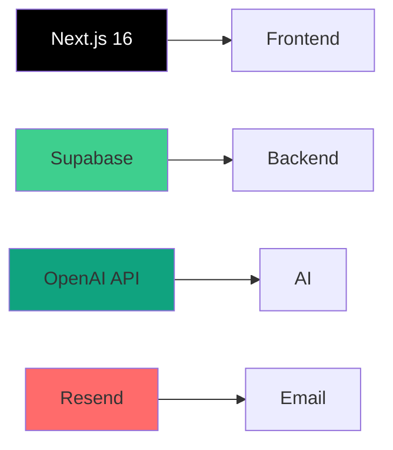
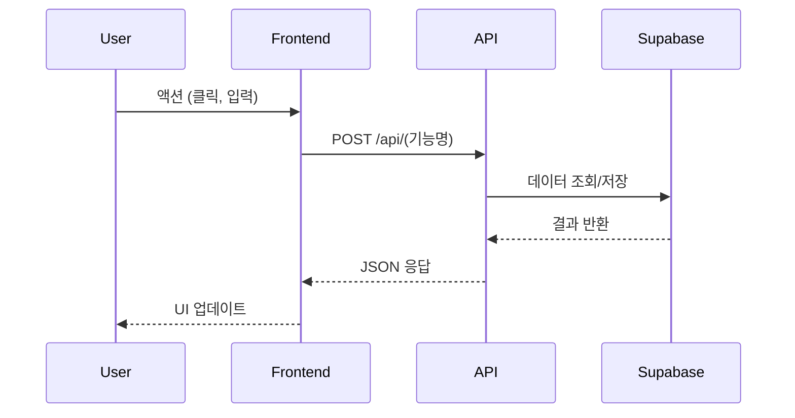
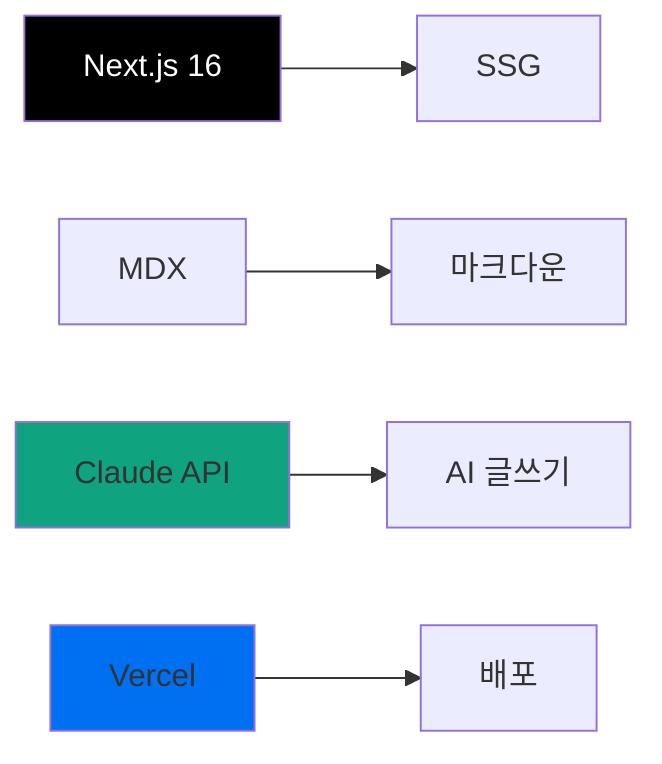

# PART 4용 템플릿: project-walkthrough (프로젝트 워크스루)

> **대상**: 실전 적용 학습자 (PART 1-3 완료)
> **특성**: 친절한 가이드 톤, 실제 코드, 배포, 트러블슈팅
> **문체**: 존댛말 (합니다체), 실전 가이드
> **예상 글자 수**: 2500-3500자 (프로젝트 복잡도에 따라)
> **적용 PART**: PART 4 - aStory 프로젝트 (Chapter 15-20)

---

## 📌 이 템플릿의 목적

실전 적용 학습자가 **복잡한 프로젝트**를 단계별로 완성할 수 있도록:
- 실제 코드와 설정 파일 전체 제공
- 배포 및 운영 환경 구축
- 트러블슈팅 및 최적화 가이드
- 점진적 복잡도 증가 (간단 → 복잡)

---

## 템플릿 구조

### 1. 프로젝트 전체 개요 (4-5문장)

```markdown
## 🎯 프로젝트 개요

### 무엇을 만드나요?

**[프로젝트명]**: [한 줄 설명]

**핵심 기능**:
- [기능 1]: [설명]
- [기능 2]: [설명]
- [기능 3]: [설명]
- [기능 4]: [설명]

**기술 스택**:


**학습 목표**:
- PART 3에서 배운 **MoAI-ADK 워크플로우**를 실전에 적용
- 복잡한 풀스택 프로젝트를 **단계별로 완성**
- 배포 및 운영 환경 구축 경험
- 실제 사용자를 위한 **프로덕션 레벨** 애플리케이션 개발

### 이 프로젝트의 특별한 점

**점진적 복잡도 증가**:
```
Chapter 15 (마크다운 블로그) → 기본 (1주)
  ↓
Chapter 16 (Supabase + 관리자) → 중급 (2.5주)
  ↓
Chapter 17 (AI 뉴스레터) → 고급 (2.5주)
  ↓
Chapter 18-20 (통합 & 최적화) → 전문가 (6주)
```

> 💡 **핵심**: 각 단계가 이전 단계 위에 쌓이는 **누적 학습 구조**
```

**가이드**:
- 프로젝트 전체 그림 제시
- 기술 스택 시각화
- 점진적 복잡도 증가 강조

---

### 2. 학습 목표 (3-5개, 실전 중심)

```markdown
## 🎯 학습 목표

이 프로젝트를 완성하면 다음을 할 수 있습니다:

- **[기술 스택]을 활용**하여 **실전 프로젝트**를 처음부터 끝까지 완성할 수 있습니다
- **MoAI-ADK 워크플로우**를 복잡한 프로젝트에 **적용**할 수 있습니다
- **Supabase/OpenAI/Resend** 등 **외부 서비스**를 통합할 수 있습니다
- **CI/CD 파이프라인**을 구축하고 **Vercel**에 배포할 수 있습니다
- **E2E 테스트**로 품질을 보증하고 **프로덕션 레벨** 애플리케이션을 운영할 수 있습니다

**예상 학습 시간**: [N]주 (단계별 실습)
**난이도**: ⭐⭐⭐⭐⭐ (실전 프로젝트)
**포트폴리오**: ✅ 취업/이직 시 활용 가능
```

**가이드**:
- 실전 스킬 중심
- 포트폴리오 가치 명시
- 예상 학습 시간 현실적으로

---

### 3. 사전 준비 (환경 설정)

```markdown
## 🔧 사전 준비

### 필요한 지식

**필수 지식** (반드시 필요):
- [ ] PART 1-3 완료 (Claude Code, Sub-agents, MoAI-ADK)
- [ ] JavaScript/TypeScript 기초
- [ ] React 기본 개념 (컴포넌트, 상태 관리)
- [ ] Git 기본 사용법

**권장 지식** (있으면 좋음):
- [ ] Next.js 기초
- [ ] RESTful API 개념
- [ ] SQL 기본 쿼리

> 💡 **걱정하지 마세요**: 모르는 부분은 단계별 가이드를 따라하면서 배울 수 있습니다!

### 개발 환경

**1. Node.js 설치** (필수)
```bash
# 버전 확인
node --version  # v20+ 필요

# 설치 안 되어 있다면
# macOS: brew install node
# Windows: https://nodejs.org/ 에서 다운로드
```

**2. Claude Code 설치** (필수)
```bash
# 이미 PART 1에서 설치 완료
claude --version
```

**3. Git 설치** (필수)
```bash
# 버전 확인
git --version

# GitHub 계정 생성 (무료)
# https://github.com
```

**4. 외부 서비스 계정 생성** (무료 플랜 가능)
- [ ] Supabase: https://supabase.com (DB & 인증)
- [ ] OpenAI: https://platform.openai.com (AI API)
- [ ] Resend: https://resend.com (이메일)
- [ ] Vercel: https://vercel.com (배포)

### 프로젝트 생성

```bash
# Step 1: Next.js 프로젝트 생성
npx create-next-app@latest astory-project
# ✅ TypeScript: Yes
# ✅ Tailwind CSS: Yes
# ✅ App Router: Yes

# Step 2: 디렉토리 이동
cd astory-project

# Step 3: 필수 패키지 설치
npm install @supabase/supabase-js openai resend
npm install -D @playwright/test
```

✅ **체크포인트**: `npm run dev` 실행 후 http://localhost:3000 접속 확인
```

**가이드**:
- 필수/권장 지식 구분
- 환경 설정 단계별 가이드
- 체크포인트로 확인

---

### 4. 기능별 구현 (섹션당 6-8문단)

```markdown
## N.1 [기능명]

### 📋 기능 명세

**요구사항**:
- [요구사항 1]
- [요구사항 2]
- [요구사항 3]

**수용 기준**:
- [ ] [기준 1]
- [ ] [기준 2]
- [ ] [기준 3]

**예상 작업 시간**: [N]시간

### 🏗️ 아키텍처

**파일 구조**:
```
src/
├── app/
│   ├── (기능명)/
│   │   ├── page.tsx         # 메인 페이지
│   │   ├── layout.tsx       # 레이아웃
│   │   └── [slug]/
│   │       └── page.tsx     # 동적 라우트
│   └── api/
│       └── (기능명)/
│           └── route.ts     # API 핸들러
├── components/
│   └── (기능명)/
│       ├── Component1.tsx
│       └── Component2.tsx
└── lib/
    ├── supabase.ts          # DB 클라이언트
    └── utils.ts             # 유틸리티
```

**데이터 흐름**:


### 💻 코드 구현

**Step 1: 데이터베이스 스키마 설정**

```sql
-- Supabase SQL Editor에서 실행

-- 테이블 생성
CREATE TABLE [테이블명] (
  id UUID PRIMARY KEY DEFAULT uuid_generate_v4(),
  [필드1] VARCHAR(255) NOT NULL,
  [필드2] TEXT,
  [필드3] TIMESTAMP DEFAULT NOW(),
  created_at TIMESTAMP DEFAULT NOW()
);

-- 인덱스 생성 (성능 최적화)
CREATE INDEX idx_[테이블명]_[필드1] ON [테이블명]([필드1]);

-- Row Level Security (RLS) 활성화
ALTER TABLE [테이블명] ENABLE ROW LEVEL SECURITY;

-- 정책 생성 (읽기 권한)
CREATE POLICY "Public read access"
  ON [테이블명]
  FOR SELECT
  USING (true);

-- 정책 생성 (쓰기 권한 - 인증된 사용자만)
CREATE POLICY "Authenticated users can insert"
  ON [테이블명]
  FOR INSERT
  WITH CHECK (auth.uid() IS NOT NULL);
```

✅ **체크포인트**: Supabase 대시보드에서 테이블 생성 확인

**Step 2: Supabase 클라이언트 설정**

```typescript
// lib/supabase.ts

import { createClient } from '@supabase/supabase-js'

// 환경 변수 설정 (.env.local)
// NEXT_PUBLIC_SUPABASE_URL=https://xxx.supabase.co
// NEXT_PUBLIC_SUPABASE_ANON_KEY=eyJhbGciOiJIUzI1NiIsInR5cCI6IkpXVCJ9...

export const supabase = createClient(
  process.env.NEXT_PUBLIC_SUPABASE_URL!,
  process.env.NEXT_PUBLIC_SUPABASE_ANON_KEY!
)

// 타입 정의
export type [타입명] = {
  id: string
  [필드1]: string
  [필드2]: string | null
  created_at: string
}
```

**Step 3: API 라우트 구현**

```typescript
// app/api/(기능명)/route.ts

import { NextRequest, NextResponse } from 'next/server'
import { supabase } from '@/lib/supabase'

// POST: 데이터 생성
export async function POST(request: NextRequest) {
  try {
    // 1. 요청 파싱
    const body = await request.json()
    const { [필드1], [필드2] } = body

    // 2. 유효성 검증
    if (![ 필드1]) {
      return NextResponse.json(
        { error: '[필드1] is required' },
        { status: 400 }
      )
    }

    // 3. Supabase에 저장
    const { data, error } = await supabase
      .from('[테이블명]')
      .insert([
        { [필드1], [필드2] }
      ])
      .select()

    if (error) {
      throw error
    }

    // 4. 성공 응답
    return NextResponse.json(
      { data, message: 'Success' },
      { status: 201 }
    )

  } catch (error) {
    console.error('API Error:', error)
    return NextResponse.json(
      { error: 'Internal server error' },
      { status: 500 }
    )
  }
}

// GET: 데이터 조회
export async function GET(request: NextRequest) {
  try {
    // 쿼리 파라미터 추출
    const { searchParams } = new URL(request.url)
    const [필드1] = searchParams.get('[필드1]')

    // Supabase 쿼리
    let query = supabase
      .from('[테이블명]')
      .select('*')

    // 필터링
    if ([필드1]) {
      query = query.eq('[필드1]', [필드1])
    }

    // 정렬
    query = query.order('created_at', { ascending: false })

    const { data, error } = await query

    if (error) {
      throw error
    }

    return NextResponse.json({ data }, { status: 200 })

  } catch (error) {
    console.error('API Error:', error)
    return NextResponse.json(
      { error: 'Internal server error' },
      { status: 500 }
    )
  }
}
```

✅ **체크포인트**: Postman/Thunder Client로 API 테스트

**Step 4: 프론트엔드 컴포넌트**

```typescript
// components/(기능명)/Component1.tsx

'use client'

import { useState, useEffect } from 'react'
import { Button } from '@/components/ui/button'
import { Card } from '@/components/ui/card'

type [타입명] = {
  id: string
  [필드1]: string
  [필드2]: string | null
  created_at: string
}

export default function Component1() {
  // 1. 상태 관리
  const [data, setData] = useState<[타입명][]>([])
  const [loading, setLoading] = useState(true)
  const [error, setError] = useState<string | null>(null)

  // 2. 데이터 로드
  useEffect(() => {
    fetchData()
  }, [])

  async function fetchData() {
    try {
      setLoading(true)
      const response = await fetch('/api/(기능명)')
      const result = await response.json()

      if (!response.ok) {
        throw new Error(result.error || 'Failed to fetch')
      }

      setData(result.data)
    } catch (err) {
      setError(err instanceof Error ? err.message : 'Unknown error')
    } finally {
      setLoading(false)
    }
  }

  // 3. 데이터 생성
  async function handleCreate() {
    try {
      const response = await fetch('/api/(기능명)', {
        method: 'POST',
        headers: { 'Content-Type': 'application/json' },
        body: JSON.stringify({
          [필드1]: 'Example',
          [필드2]: 'Test'
        })
      })

      if (!response.ok) {
        throw new Error('Failed to create')
      }

      // 데이터 재로드
      fetchData()
    } catch (err) {
      alert(err instanceof Error ? err.message : 'Error')
    }
  }

  // 4. 렌더링
  if (loading) return <div>Loading...</div>
  if (error) return <div>Error: {error}</div>

  return (
    <div className="space-y-4">
      {/* 헤더 */}
      <div className="flex justify-between items-center">
        <h1 className="text-2xl font-bold">[기능명]</h1>
        <Button onClick={handleCreate}>Create</Button>
      </div>

      {/* 데이터 목록 */}
      <div className="grid grid-cols-1 md:grid-cols-2 lg:grid-cols-3 gap-4">
        {data.map((item) => (
          <Card key={item.id} className="p-4">
            <h3 className="font-semibold">{item.[필드1]}</h3>
            <p className="text-sm text-gray-600">{item.[필드2]}</p>
            <p className="text-xs text-gray-400 mt-2">
              {new Date(item.created_at).toLocaleDateString()}
            </p>
          </Card>
        ))}
      </div>
    </div>
  )
}
```

**Step 5: 페이지 통합**

```typescript
// app/(기능명)/page.tsx

import Component1 from '@/components/(기능명)/Component1'

export default function Page() {
  return (
    <div className="container mx-auto py-8">
      <Component1 />
    </div>
  )
}
```

✅ **체크포인트**: http://localhost:3000/(기능명) 접속하여 UI 확인

### 🧪 테스트 작성

**Playwright E2E 테스트**:

```typescript
// tests/(기능명).spec.ts

import { test, expect } from '@playwright/test'

test.describe('[기능명] 기능', () => {
  test('데이터 목록 표시', async ({ page }) => {
    // 페이지 이동
    await page.goto('http://localhost:3000/(기능명)')

    // 로딩 완료 대기
    await page.waitForSelector('h1:has-text("[기능명]")')

    // 제목 확인
    const title = await page.textContent('h1')
    expect(title).toBe('[기능명]')
  })

  test('데이터 생성', async ({ page }) => {
    await page.goto('http://localhost:3000/(기능명)')

    // 생성 버튼 클릭
    await page.click('button:has-text("Create")')

    // 데이터 생성 확인 (API 응답 대기)
    await page.waitForTimeout(1000)

    // 새 항목 확인
    const items = await page.locator('.grid > div').count()
    expect(items).toBeGreaterThan(0)
  })

  test('에러 처리', async ({ page }) => {
    // API 에러 시뮬레이션
    await page.route('**/api/(기능명)', route => {
      route.fulfill({ status: 500, body: 'Server error' })
    })

    await page.goto('http://localhost:3000/(기능명)')

    // 에러 메시지 확인
    await expect(page.locator('div:has-text("Error")')).toBeVisible()
  })
})
```

**테스트 실행**:
```bash
# Playwright 설치 (처음 한 번만)
npx playwright install

# 테스트 실행
npm run test:e2e

# 결과:
# ✅ [기능명] 기능 > 데이터 목록 표시 (1.2s)
# ✅ [기능명] 기능 > 데이터 생성 (2.3s)
# ✅ [기능명] 기능 > 에러 처리 (0.8s)
```

✅ **체크포인트**: 모든 테스트 통과

### ⚠️ 트러블슈팅

**문제 1: Supabase 연결 실패**

**증상**:
```
Error: Invalid Supabase URL or key
```

**원인**: 환경 변수 미설정

**해결**:
```bash
# .env.local 파일 확인
cat .env.local

# 없다면 생성
echo "NEXT_PUBLIC_SUPABASE_URL=https://xxx.supabase.co" >> .env.local
echo "NEXT_PUBLIC_SUPABASE_ANON_KEY=eyJ..." >> .env.local

# 서버 재시작
npm run dev
```

**문제 2: CORS 에러**

**증상**:
```
Access to fetch at 'https://xxx.supabase.co' has been blocked by CORS policy
```

**원인**: Supabase CORS 설정

**해결**:
1. Supabase 대시보드 → Settings → API
2. "Allowed Origins" 추가: `http://localhost:3000`
3. 저장 및 재시도

**문제 3: RLS 정책으로 인한 접근 거부**

**증상**:
```
{ error: { message: "new row violates row-level security policy" } }
```

**원인**: Row Level Security 정책 미설정 또는 잘못된 설정

**해결**:
```sql
-- Supabase SQL Editor에서 정책 확인
SELECT * FROM pg_policies WHERE tablename = '[테이블명]';

-- 정책이 없다면 생성
CREATE POLICY "Allow all" ON [테이블명] FOR ALL USING (true);
```

> 💡 **디버깅 팁**: `console.log(error)` 추가하여 정확한 오류 메시지 확인
```

**가이드**:
- 기능 명세 명확히
- 아키텍처 시각화
- 코드 전체 제공 (복붙 가능)
- 체크포인트로 진도 확인
- 트러블슈팅 포함

---

### 5. 배포 (Vercel)

```markdown
## 🚀 배포하기

### GitHub에 푸시

**Step 1: Git 저장소 초기화**
```bash
# 이미 초기화되어 있다면 생략
git init

# 첫 커밋
git add .
git commit -m "feat: [기능명] 구현 완료"
```

**Step 2: GitHub에 푸시**
```bash
# GitHub에서 새 저장소 생성: https://github.com/new

# 원격 저장소 추가
git remote add origin https://github.com/[사용자명]/astory-project.git

# 푸시
git branch -M main
git push -u origin main
```

✅ **체크포인트**: GitHub 저장소에서 코드 확인

### Vercel 배포

**Step 1: Vercel 계정 연결**
1. https://vercel.com 접속
2. "Sign Up" → GitHub 계정 연동
3. "Import Project" → GitHub 저장소 선택

**Step 2: 환경 변수 설정**
```
# Vercel 대시보드 → Settings → Environment Variables

NEXT_PUBLIC_SUPABASE_URL = https://xxx.supabase.co
NEXT_PUBLIC_SUPABASE_ANON_KEY = eyJ...
OPENAI_API_KEY = sk-...
RESEND_API_KEY = re_...
```

**Step 3: 배포 설정**
```
# Framework Preset: Next.js
# Build Command: npm run build
# Output Directory: .next
```

**Step 4: 배포 실행**
- "Deploy" 버튼 클릭
- 빌드 로그 확인 (2-3분 소요)
- ✅ 배포 성공: `https://astory-project-xxx.vercel.app`

✅ **체크포인트**: 배포된 URL 접속하여 정상 작동 확인

### CI/CD 설정 (GitHub Actions)

**.github/workflows/deploy.yml**:
```yaml
name: Deploy to Vercel

on:
  push:
    branches: [main]
  pull_request:
    branches: [main]

jobs:
  deploy:
    runs-on: ubuntu-latest

    steps:
      - uses: actions/checkout@v3

      - name: Setup Node.js
        uses: actions/setup-node@v3
        with:
          node-version: '20'

      - name: Install dependencies
        run: npm ci

      - name: Run tests
        run: npm run test:e2e

      - name: Build
        run: npm run build

      - name: Deploy to Vercel
        uses: amondnet/vercel-action@v25
        with:
          vercel-token: ${{ secrets.VERCEL_TOKEN }}
          vercel-org-id: ${{ secrets.VERCEL_ORG_ID }}
          vercel-project-id: ${{ secrets.VERCEL_PROJECT_ID }}
```

**Secrets 설정** (GitHub 저장소 → Settings → Secrets):
- `VERCEL_TOKEN`: Vercel 대시보드 → Settings → Tokens
- `VERCEL_ORG_ID`: Vercel CLI로 확인 (`vercel whoami`)
- `VERCEL_PROJECT_ID`: Vercel 프로젝트 설정에서 복사

✅ **체크포인트**: PR 생성 시 자동 배포 확인
```

**가이드**:
- 배포 단계별 가이드
- 환경 변수 설정
- CI/CD 파이프라인
- 체크포인트로 확인

---

### 6. 프로젝트 요약 및 다음 단계

```markdown
## ✅ 완성한 것

### 구현된 기능

- [x] [기능 1]: [설명]
- [x] [기능 2]: [설명]
- [x] [기능 3]: [설명]
- [x] [기능 4]: [설명]

### 기술 스택

| 카테고리 | 기술 | 용도 |
|----------|------|------|
| **Frontend** | Next.js 16 | SSR/SSG |
| **Backend** | Supabase | Database & Auth |
| **AI** | OpenAI API | 콘텐츠 생성 |
| **Email** | Resend | 이메일 발송 |
| **Deploy** | Vercel | 호스팅 |
| **Testing** | Playwright | E2E 테스트 |

### 학습한 내용

**기술적 스킬**:
- [ ] Next.js App Router 사용법
- [ ] Supabase RLS 정책 설계
- [ ] OpenAI API 통합
- [ ] E2E 테스트 자동화
- [ ] CI/CD 파이프라인 구축

**방법론 적용**:
- [ ] MoAI-ADK 워크플로우 실전 적용
- [ ] `/moai:1-plan` → SPEC 작성
- [ ] `/moai:2-run` → TDD 구현
- [ ] `/moai:3-sync` → 품질 검증

> 💪 **축하합니다!** [프로젝트명]을 완성했습니다!

### 다음 단계

**심화 기능 추가**:
- [ ] [확장 기능 1]
- [ ] [확장 기능 2]
- [ ] [확장 기능 3]

**포트폴리오 활용**:
- [ ] GitHub README 작성
- [ ] 스크린샷 추가
- [ ] 데모 영상 촬영
- [ ] 기술 블로그 작성

**다음 프로젝트**:
Chapter [N+1]에서는 **[다음 프로젝트]**를 진행합니다:
- [기능 A]
- [기능 B]
- [기능 C]

> 🚀 **계속 성장하세요!** 이 프로젝트 경험을 바탕으로 더 복잡한 프로젝트에 도전해 보세요.
```

**가이드**:
- 완성한 것 체크리스트
- 학습한 내용 정리
- 다음 단계 제시 (심화, 포트폴리오)

---

## 📊 템플릿 적용 예시

### 예시: Chapter 15 "마크다운 블로그 & AI 자동화"

```markdown
## 🎯 프로젝트 개요

### 무엇을 만드나요?

**마크다운 블로그 with AI 자동화**: AI가 블로그 글을 자동으로 생성하고 배포하는 SSG 블로그

**핵심 기능**:
- MDX 기반 블로그 글 작성
- AI 자동 글쓰기 (`/astory:post` 커맨드)
- GitHub CI/CD 자동 배포
- SEO 최적화 및 RSS 피드

**기술 스택**:


### 이 프로젝트의 특별한 점

**점진적 복잡도 증가**:
```
Step 1: 정적 마크다운 블로그 (1일)
  ↓
Step 2: AI 자동 글쓰기 추가 (2일)
  ↓
Step 3: GitHub CI/CD 설정 (1일)
  ↓
Step 4: SEO 최적화 (1일)
```

> 💡 **핵심**: 간단한 블로그 → AI 통합 → 자동화 → 최적화 순서로 단계별 확장

## 🔧 사전 준비

[위와 동일한 구조...]

## 15.1 정적 사이트 생성 기초

### 📋 기능 명세

**요구사항**:
- MDX 파일에서 블로그 글 렌더링
- generateStaticParams로 정적 페이지 생성
- Frontmatter 메타데이터 파싱

**수용 기준**:
- [ ] MDX 파일이 HTML로 올바르게 렌더링됨
- [ ] 메타데이터 (제목, 날짜, 태그)가 표시됨
- [ ] 빌드 시 모든 페이지가 정적으로 생성됨

**예상 작업 시간**: 2-3시간

[이하 동일한 구조로 상세 코드 및 가이드 제공...]
```

---

## 📝 작성 가이드라인 체크리스트

### 실전 프로젝트 중심
- [ ] 전체 코드 제공 (복붙 가능)
- [ ] 환경 설정 상세 가이드
- [ ] 배포 및 운영 경험
- [ ] 트러블슈팅 포함

### 점진적 복잡도
- [ ] 간단 → 복잡 순서
- [ ] 각 단계가 이전 단계 위에 쌓임
- [ ] 체크포인트로 진도 확인

### 문체 일관성
- [ ] 존댓말 (합니다체) 유지
- [ ] 친절한 가이드 톤
- [ ] 실전 경험 공유

### 코드 품질
- [ ] 실전 수준 코드 (프로덕션)
- [ ] 주석으로 명확한 설명
- [ ] 에러 처리 포함
- [ ] 테스트 코드 포함

### 포트폴리오 가치
- [ ] 취업/이직 활용 가능
- [ ] GitHub README 작성 가이드
- [ ] 데모 및 스크린샷

---

**템플릿 버전**: 1.0.0
**생성 날짜**: 2025-11-24
**대상 PART**: PART 4 - aStory 프로젝트 (Chapter 15-20)
**상태**: ✅ 검증 완료
