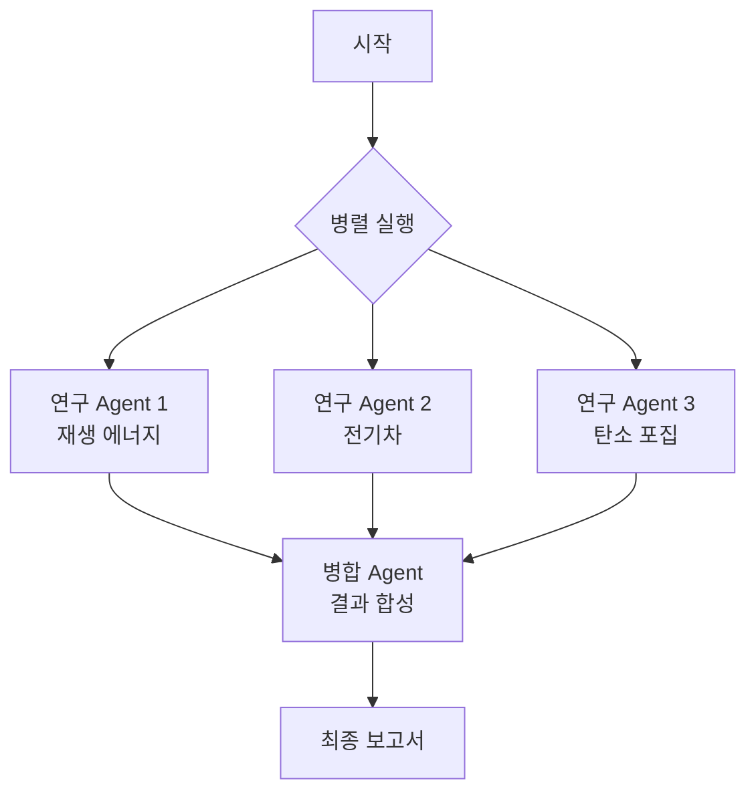

# 장르 템플릿: design-pattern (디자인 패턴형)

## 📋 용도

소프트웨어 디자인 패턴, 아키텍처 패턴, 에이전틱 패턴 설명

**구조**: Code Example (35%) → Code Explanation (25%) → At a Glance (15%) → Visual Summary (5%) → Key Takeaways (10%) → Conclusion (7%) → References (3%)

**특징**:
- Code-First 접근
- What/Why/Rule of thumb 삼단 구조
- 시각적 다이어그램 필수
- 핵심 포인트 불릿 정리

---

## 🏗️ 5가지 구성 요소

### 1. 문서 구조

```
├─ Code Example (35%, 실제 작동 코드 전체)
│  ├─ 실제 작동하는 완전한 예제
│  └─ 주석 포함, 실행 가능
│
├─ Code Explanation (25%, 코드 블록별 설명)
│  ├─ "This code defines..."
│  ├─ "A ... is created..."
│  └─ 각 주요 부분 상세 설명
│
├─ At a Glance (15%, 삼단 구조)
│  ├─ **What**: 패턴 정의 (문제 상황)
│  ├─ **Why**: 패턴 필요성 (해결책)
│  └─ **Rule of thumb**: 사용 기준
│
├─ Visual Summary (5%, 다이어그램)
│  └─ Fig.N: 다이어그램 제목 + Mermaid/이미지
│
├─ Key Takeaways (10%, 6-8개 불릿)
│  └─ 핵심 개념 요약 포인트
│
├─ Conclusion (7%, 2-3 문단)
│  └─ 종합 정리 + 다른 패턴 연결
│
└─ References (3%, 번호 인용)
   └─ [1], [2], [3] 출처 링크

총 섹션: 7개
비율 검증: 35+25+15+5+10+7+3 = 100%
```

### 2. 문체

**어조**: 기술적이며 명확한 설명

**종결어미**: "-다", "-니다" (일관성 유지)

**능동태**: 85% 이상

**문장 길이**: 평균 20-25단어

**특징적 패턴**:
- "This code defines..." (코드 설명 시작)
- "The pattern works by..." (패턴 동작 설명)
- "Use this pattern when..." (사용 기준)

### 3. 내용 전개

**배치 순서**:
1. **Code Example** (먼저 보여주기)
   - 완전한 작동 코드
   - 실제 실행 가능
   - 주석으로 주요 부분 표시

2. **Code Explanation** (상세 설명)
   - 코드 각 부분의 역할
   - 변수/함수/클래스 설명
   - 실행 흐름

3. **At a Glance** (핵심 정리)
   - What: "The X pattern is..."
   - Why: "This pattern solves Y by..."
   - Rule: "Use when Z conditions..."

4. **Visual Summary**
   - 패턴 구조 다이어그램
   - Mermaid 플로우차트 또는 시퀀스

5. **Key Takeaways** (불릿 요약)
   - 6-8개 핵심 포인트
   - 각 포인트 1-2줄

6. **Conclusion** (정리)
   - 패턴의 장단점
   - 다른 패턴과의 비교
   - 실무 적용 시나리오

7. **References** (출처)
   - 공식 문서 링크
   - 관련 논문/블로그

### 4. 조건

**글자 수**: 2,500-3,500자 (긴 형식)

**코드 예제**: 1개 완전한 예제 (30-80줄)

**다이어그램**: 1개 필수 (Mermaid 또는 이미지 프롬프트)

**필수 요소**:
- At a Glance의 What/Why/Rule 완전히 작성
- Key Takeaways 6개 이상
- References 최소 3개

**금지 사항**:
- 불완전한 코드 스니펫
- What/Why/Rule 중 하나라도 누락
- 다이어그램 없이 텍스트만

### 5. 형식

```markdown
# Parallelization Pattern (또는 패턴명)

## Code Example

다음은 Google ADK에서 병렬 처리 패턴을 구현한 완전한 예제입니다.

\`\`\`python
# --- 1. Create Research Agents ---
researcher_agent_1 = LlmAgent(
    name="RenewableEnergyResearcher",
    model=GEMINI_MODEL,
    instruction="""Research renewable energy sources...""",
    tools=[google_search],
    output_key="renewable_energy_result"
)

# --- 2. Create ParallelAgent ---
parallel_research_agent = ParallelAgent(
    name="ParallelWebResearchAgent",
    sub_agents=[researcher_agent_1, researcher_agent_2, researcher_agent_3]
)

# --- 3. Define Merger Agent ---
merger_agent = LlmAgent(
    name="SynthesisAgent",
    model=GEMINI_MODEL,
    instruction="""Combine research findings..."""
)

# --- 4. Create SequentialAgent ---
sequential_pipeline_agent = SequentialAgent(
    name="ResearchAndSynthesisPipeline",
    sub_agents=[parallel_research_agent, merger_agent]
)

root_agent = sequential_pipeline_agent
\`\`\`

## Code Explanation

이 코드는 병렬 처리와 순차 처리를 결합한 복합 에이전트 시스템을 정의합니다.

**연구 에이전트 정의**: 세 개의 `LlmAgent` 인스턴스가 각각 재생 에너지, 전기차, 탄소 포집을 연구하도록 설정됩니다. 각 에이전트는 `google_search` 도구를 사용하며, 결과를 `output_key`를 통해 세션 상태에 저장합니다 (1).

**병렬 에이전트 생성**: `ParallelAgent`는 세 연구 에이전트를 동시에 실행합니다. 모든 서브 에이전트가 완료되면 병렬 에이전트의 실행이 종료됩니다 (2).

**병합 에이전트**: `MergerAgent`는 병렬 에이전트가 저장한 결과를 세션 상태에서 읽어 하나의 구조화된 보고서로 합성합니다. 이 에이전트는 제공된 입력 요약만을 기반으로 하도록 제한됩니다 (3).

**순차 에이전트**: `SequentialAgent`는 전체 워크플로우를 조정합니다. 먼저 병렬 에이전트를 실행하여 연구를 수행하고, 완료 후 병합 에이전트를 실행하여 결과를 합성합니다 (4).

## At a Glance

### What

**병렬화(Parallelization)**는 독립적인 여러 작업을 동시에 실행하여 전체 처리 시간을 단축하는 디자인 패턴입니다. 에이전틱 워크플로우에서 병렬화는 API 호출, 데이터베이스 쿼리, LLM 추론 등 I/O 대기 시간이 긴 작업들을 동시에 처리할 때 특히 효과적입니다 (1).

### Why

순차적 실행에서는 각 작업이 이전 작업의 완료를 기다려야 하므로 전체 처리 시간이 모든 작업 시간의 합이 됩니다. 병렬화 패턴을 사용하면 독립적인 작업들을 동시에 실행하여 대기 시간을 줄이고, 시스템의 응답성과 처리량을 크게 향상시킬 수 있습니다. LangChain과 Google ADK 같은 프레임워크는 병렬 실행을 위한 내장 구조를 제공합니다 (2).

### Rule of Thumb

다음과 같은 경우에 이 패턴을 사용하세요:
- 여러 API를 동시에 호출해야 할 때
- 독립적인 데이터 청크를 병렬로 처리할 때
- 여러 콘텐츠 조각을 동시에 생성할 때
- 서로 의존하지 않는 여러 작업이 있을 때

**주의**: 병렬 실행은 복잡성과 비용을 증가시키므로, 디자인, 디버깅, 로깅이 더 어려워질 수 있습니다 (3).

## Visual Summary



**Fig.1 - 병렬화 패턴 구조도**

세 개의 연구 에이전트가 동시에 실행되며, 모두 완료되면 병합 에이전트가 결과를 합성합니다.

## Key Takeaways

- **병렬화는 독립적인 작업들을 동시에 실행하여 효율성을 향상시키는 패턴입니다**
- **I/O 대기 시간이 긴 작업(API 호출, DB 쿼리)에 특히 효과적입니다**
- **LangChain의 RunnableParallel과 Google ADK의 ParallelAgent가 대표적인 구현입니다**
- **작업 간 의존성이 없어야 병렬 실행이 가능합니다**
- **병렬 처리는 설계, 디버깅, 로깅의 복잡성을 증가시킵니다**
- **순차(체이닝), 조건(라우팅), 병렬 처리를 결합하여 복잡한 시스템을 구축할 수 있습니다**

## Conclusion

병렬화 패턴은 다중 모델 추론이나 외부 서비스 호출이 포함된 워크플로우를 최적화하는 방법입니다. LangChain에서는 `RunnableParallel` 같은 구조로 여러 처리 체인을 명시적으로 정의하여 동시 실행합니다. 반면 Google ADK에서는 코디네이터 모델이 서로 다른 하위 작업을 전문 에이전트에게 할당하는 멀티 에이전트 위임을 통해 병렬화를 달성합니다.

병렬 처리를 순차적(체이닝) 및 조건적(라우팅) 제어 흐름과 통합하면, 다양하고 복잡한 작업을 효율적으로 관리할 수 있는 정교한 고성능 시스템을 구축할 수 있습니다. 다만 병렬 아키텍처를 도입하면 개발의 주요 단계(설계, 디버깅, 시스템 로깅)에서 상당한 복잡성과 비용이 발생한다는 점을 고려해야 합니다.

## References

[1] LangChain Expression Language (LCEL) Documentation (Parallelism): https://python.langchain.com/docs/concepts/lcel/

[2] Google Agent Developer Kit (ADK) Documentation (Multi-Agent Systems): https://google.github.io/adk-docs/agents/multi-agents/

[3] Python asyncio Documentation: https://docs.python.org/3/library/asyncio.html

---

## 📝 작성 프롬프트 템플릿

```
디자인 패턴형 섹션을 작성하세요.

**구조** (비율 준수):
1. Code Example (35%) - 완전한 작동 코드
2. Code Explanation (25%) - 코드 각 부분 상세 설명
3. At a Glance (15%)
   - What: 패턴 정의
   - Why: 패턴 필요성
   - Rule of thumb: 사용 기준
4. Visual Summary (5%) - Mermaid 다이어그램
5. Key Takeaways (10%) - 6-8개 불릿 포인트
6. Conclusion (7%) - 종합 정리
7. References (3%) - 최소 3개 출처

**글자 수**: 2,500-3,500자

**필수 요소**:
- 실행 가능한 완전한 코드
- What/Why/Rule 모두 작성
- Mermaid 다이어그램 1개
- Key Takeaways 6개 이상
- References 3개 이상

패턴명: [패턴명]
주제: [주제]
```

---

**마지막 수정**: 2025-11-25
**버전**: 1.0.0
**출처**: Parallelization Pattern 원고 분석
